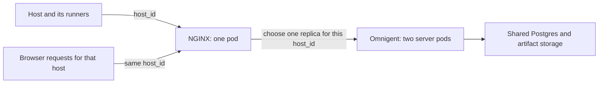

# Multiple Omnigent replicas with NGINX

This example runs two Omnigent server pods behind one NGINX ingress controller.
It shows how to route a host and its runners to the same server and reconnect
their tunnels when Kubernetes replaces the server pods. It uses
[kind](https://kind.sigs.k8s.io/), which runs a local Kubernetes cluster in
Docker. Postgres and an artifact volume are shared by both server pods.

Two server pods let us test a deployment that normally serves requests from
more than one replica. One server pod would also support a rolling update
with a temporary replacement, but would not test steady-state replication.
Only one NGINX pod is needed for this example.

## Why requests need a host ID

An Omnigent **host** is a machine that runs agents. Each agent session runs in
a **runner** process on that host. The host and its runners keep outbound
WebSocket connections to the server. These connections, or tunnels, let the
server send work back to the machine, such as reading a file or attaching to
a terminal.

A tunnel belongs to the server process that accepted it. Sharing Postgres
gives both server replicas access to saved sessions, but it does not give
them access to each other's open connections. If a browser asks replica B to
read a file through a runner connected to replica A, B cannot serve that
request through its own tunnels.

The browser, host, and runners therefore need to agree on a server replica.
A browser cookie or client IP cannot do that: the host and its runners are
separate clients and may connect from a different network. Instead, they all
send the same `host_id` for requests concerning that host. NGINX uses
consistent hashing to choose a server from that ID. Here, **host sharding**
means dividing live host connections among server replicas; the database and
artifact storage remain shared.



## Enable routing in Omnigent

Use an Omnigent version containing the OSS routing options on both the server
and external host. The example builds the server from the main branch of the
Omnigent GitHub repository.

- Start the host with `OMNIGENT_HOST_SLICE_KEY_ENABLED=1`. It passes this setting
  to its runners. The Python client includes the host ID in HTTP requests and
  tunnel connections.
- Build the browser with `VITE_OMNIGENT_HOST_ROUTING=true`. This tells the browser
  to include the host ID in requests so NGINX can route them to the right server.
- The browser keeps the host ID on terminal reconnects. Dropping the ID could
  send the next connection to a different replica.

HTTP clients use the existing `X-Databricks-Omnigent-Slice-Key` header. Browser
WebSockets use `?omnigent_slice_key=...` because the browser WebSocket API
cannot set request headers. Both carry the host ID. These names reuse the
existing Omnigent routing protocol; replica selection runs in NGINX.

The OSS options are off by default. The server's tunnel handling and the
host and runner reconnect loops work as they do today.

## What happens during a rollout

Starting a replacement pod before stopping the old pod keeps server capacity
available. It does not transfer open tunnels. Adding the new pod can change
which server NGINX chooses for a host, while that host's existing WebSocket
still connects to the old server.

[server.yaml](server.yaml) sets `maxSurge: 1` and `maxUnavailable: 0`.
It waits ten seconds after a replacement becomes ready before removing an old
pod, giving connections time to settle between endpoint changes.
[ingress.yaml](ingress.yaml) handles the connection change:

1. Kubernetes starts a replacement and marks it ready. The ready pod addresses
   are the endpoints NGINX can send requests to.
2. The NGINX controller reloads its configuration when those endpoints change.
   New connections use the updated list and hash each host ID onto a server.
3. `worker-shutdown-timeout: "2s"` makes the old NGINX workers close their
   remaining connections after two seconds.
4. The host, runners, and browser reconnect through NGINX. Their shared host
   ID sends them to the same replica again.

Removing an old pod causes another endpoint update, so a rollout can cause
several reconnects. Each reload closes all remaining connections in the old
NGINX workers, including those for hosts whose destination did not change.
The two-second setting is a worker drain deadline, not an outage limit.
Client retry delays and successive reloads can make recovery take longer.

The example also sets `nginx.org/max-fails: "0"` and
`proxy_next_upstream off`. This leaves pod membership to Kubernetes readiness
and prevents individual failed requests from choosing a different server
while their host's tunnel remains elsewhere.

Use **F5 NGINX Ingress Controller OSS 5.2.1** (`nginx/nginx-ingress`), as pinned
in the manifest. The community `ingress-nginx` controller updates endpoints
differently; this example depends on F5's reload behavior.

## Run the example

Install Git, Docker, kind, kubectl, and uv. The automated check uses Docker host
networking, so it requires Linux or Docker Desktop with host networking
enabled. Clone the main branch of the Omnigent repository, then run:

```bash
git clone --branch main https://github.com/omnigent-ai/omnigent.git
cd omnigent
uv sync --frozen
deploy/kubernetes/multi_replica/run.sh up
deploy/kubernetes/multi_replica/run.sh verify
```

Open **http://localhost:18081**. The startup script creates a dedicated kind
cluster, builds and loads the server image, runs database migrations, and
starts the pods. It keeps a separate kubeconfig under
`/tmp/omnigent-nginx-prototype`. Kind maps the local port directly to NGINX's
NodePort Service; no port-forward process is needed.

The verification starts a temporary host outside Kubernetes and uses it to
launch a real runner and shell. A local mock model holds an agent turn open
while the test replaces both server pods. No model credentials are needed.
The test checks that:

- Host file browsing and runner file requests recover.
- The shell keeps the same process ID and environment variable after reconnecting.
- The active agent turn finishes, and its response is recovered through the
  live event stream or saved history.
- The host can launch another session and runner after the rollout.
- A follow-up turn on the original session arrives through the live stream.

Omnigent's server-sent event stream sends new events only. The test subscribes
again and reads saved history after reconnecting, as the browser does, to
recover events sent during a disconnect.

The script prints `PASS` and writes `report.json` and logs beneath
`/tmp/omnigent-nginx-prototype/verification`. It removes the test client and
mock model on exit and leaves the cluster running for inspection. To inspect
the pods or trigger another rollout:

```bash
deploy/kubernetes/multi_replica/run.sh kubectl get pods -o wide
deploy/kubernetes/multi_replica/run.sh rollout
```

To connect your own host from this checkout:

```bash
OMNIGENT_HOST_SLICE_KEY_ENABLED=1 uv run --no-sync omnigent host \
  --server http://localhost:18081 --non-interactive
```

To remove the example cluster and its database and artifact volumes:

```bash
deploy/kubernetes/multi_replica/run.sh down
```

Optional settings are `PROTOTYPE_STATE_DIR`, `PROTOTYPE_PORT`, `KIND_BIN`,
`PROTOTYPE_NODE_IMAGE`, `PROTOTYPE_BUILD_NETWORK`, and the Dockerfile's package
mirror settings, `PYPI_INDEX_URL` and `NPM_CONFIG_REGISTRY`. Set the same state
directory and port for every command; the port mapping is created with the
cluster. `verify --mock-port 18092` changes the mock model's port, and
`verify --output /tmp/another-run` writes a separate set of test results.

## Deployment limits

This is a local experiment with authentication disabled and disposable
database credentials. The artifact volume is `ReadWriteOnce`: both server
pods can share it because they run on the same kind node. A deployment across
multiple nodes needs shared artifact storage, such as S3 or a `ReadWriteMany`
volume, along with authentication, TLS, and shared authentication secrets.
NGINX and Postgres each have one pod in this example.

The controller watches resources in the example's namespace, including
Secrets; F5's controller requires its Secret informer even without TLS. Keep
this disposable namespace separate from workloads with real credentials.

The test covers external hosts and a controlled server rollout. Browser
routing has Vitest coverage, and a Playwright test checks standalone terminal
recovery after repeated connection and routing errors. The full browser flow
through Kubernetes, managed-host startup, scheduled and background jobs,
multiple ingress controllers, and abrupt node loss need separate validation
before using this as a production deployment.
