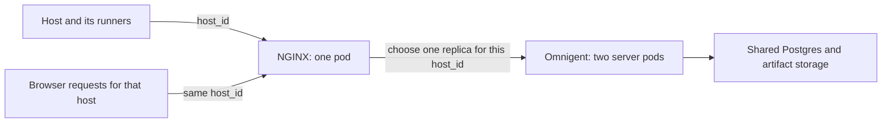

# Multiple Omnigent replicas with NGINX

This example runs two Omnigent server pods behind one NGINX ingress controller
and checks whether external hosts and runners recover when Kubernetes replaces
the server pods. It uses [kind](https://kind.sigs.k8s.io/), which runs a local
Kubernetes cluster in Docker. Postgres and an artifact volume are shared by
both server pods.

Two server pods let us test a deployment that normally serves requests from
more than one replica. One server pod would also support a rolling update
with a temporary replacement, but would not test steady-state replication.
Only one NGINX pod is needed for this example.

## Why requests need a host ID

An Omnigent **host** is a machine that runs agents. Each agent session runs in
a **runner** process on that host. The host and its runners keep outbound
WebSocket connections to the server. These connections, or tunnels, let the
server send work back to the machine, such as reading a file or attaching to
a terminal.

A tunnel belongs to the server process that accepted it. Sharing Postgres
gives both server replicas access to saved sessions, but it does not give
them access to each other's open connections. If a browser asks replica B to
read a file through a runner connected to replica A, B cannot serve that
request through its own tunnels.

The browser, host, and runners therefore need to agree on a server replica.
A browser cookie or client IP cannot do that: the host and its runners are
separate clients and may connect from a different network. Instead, they all
send the same `host_id` for requests concerning that host. NGINX uses
consistent hashing to choose a server from that ID. Here, **host sharding**
means dividing live host connections among server replicas; the database and
artifact storage remain shared.



## Enable routing in Omnigent

Use an Omnigent version containing the OSS routing options on both the server
and external host. The example builds the server from this checkout.

- Start the host with `OMNIGENT_HOST_SLICE_KEY_ENABLED=1`. It passes this setting
  to its runners. The Python client includes the host ID in HTTP requests and
  tunnel connections.
- Build the browser with `VITE_OMNIGENT_HOST_ROUTING=true`. The Dockerfile accepts
  this as a build argument, and `run.sh up` supplies it. Setting it only in a
  running server pod does not change an already built browser bundle.
- During a temporary routing error, the OSS browser keeps the host ID when it
  retries. It retries `400 wrong_replica` every 500 ms for up to 15 seconds.
  Dropping the ID could send the next request to a different replica.
  It also refreshes the session's host once, so an open tab can recover after
  a host switch or a failed initial lookup. Explicit caller-supplied keys stay
  unchanged.

HTTP clients use the existing `X-Databricks-Omnigent-Slice-Key` header. Browser
WebSockets use `?omnigent_slice_key=...` because the browser WebSocket API
cannot set request headers. Both carry the host ID. These names reuse the
existing Omnigent routing protocol; replica selection runs in NGINX.
Dictation can run on any replica without a host tunnel; its existing routing
is unchanged by this example.

The OSS options are off by default. The server's tunnel handling and the
host and runner reconnect loops work as they do today.

## What happens during a rollout

Starting a replacement pod before stopping the old pod keeps server capacity
available. It does not transfer open tunnels. Adding the new pod can change
which server NGINX chooses for a host, while that host's existing WebSocket
still connects to the old server.

[server.yaml](server.yaml) sets `maxSurge: 1` and `maxUnavailable: 0`.
It also waits ten seconds after a replacement becomes ready before removing
an old pod. This gives reconnected tunnels time to settle between membership
changes; repeatedly closing very short connections increases client backoff.
[ingress.yaml](ingress.yaml) handles the connection change:

1. Kubernetes starts a replacement and marks it ready. The ready pod addresses
   are the endpoints NGINX can send requests to.
2. The NGINX controller reloads its configuration when those endpoints change.
   New connections use the updated list and hash each host ID onto a server.
3. `worker-shutdown-timeout: "2s"` makes the old NGINX workers close their
   remaining connections after two seconds.
4. The host, runners, and browser reconnect through NGINX. Their shared host
   ID sends them to the same replica again.

Removing an old pod causes another endpoint update, so a rollout can cause
several reconnects. Each reload closes all remaining connections in the old
NGINX workers, including those for hosts whose destination did not change.
The two-second setting is a worker drain deadline, not an outage limit.
Client retry delays and successive reloads can make recovery take longer.

The example also sets `nginx.org/max-fails: "0"` and
`proxy_next_upstream off`. This leaves pod membership to Kubernetes readiness
and prevents individual failed requests from choosing a different server
while their host's tunnel remains elsewhere.

Omnigent also needs to handle messages sent during this gap:

- A `wrong_replica` response means that replica could not deliver the request.
  The browser waits and retries the same request with the same host ID.
  It starts retries for up to 15 seconds. A request already in progress keeps
  the caller's normal timeout or cancellation behavior; this is not an overall
  HTTP deadline.
- A lost HTTP response leaves delivery uncertain. A `503 runner_unavailable`
  can also mean that a prompt was saved just before its runner tunnel closed.
  The browser waits up to 15 seconds for the message's receipt on the
  reconnected event stream. It does not resend the message just because the
  connection closed. A confirmed delivery clears the pending send; a refusal
  or an expired wait still shows an error and preserves the draft. When the
  reconnect scan recovers a missed prompt, the runner emits its receipt on
  the session stream. It also confirms prompts it accepted before losing
  the tunnel. A browser that reconnects later gets those confirmations when
  its stream opens. These receipts identify the prompt; they do not replay
  transcript messages or clear another pending send.
- An SDK runner can finish a turn while its server connection is down. Its
  reconnect scan remembers which persisted message IDs it already accepted,
  queues missed messages, and keeps its local conversation history.
  Otherwise a reply waiting to be saved can make an already completed turn
  look unfinished and cause it to run again.
  A missed message recovered after newer input has arrived runs after that
  newer input; this does not guarantee the original send order across a
  disconnect. Internal history entries, such as the marker written by Stop,
  do not start new turns. The server marks newly mirrored transcript messages
  as history-only so they cannot be mistaken for executable input.
- The runner also sends its final SDK session status again after reconnecting.
  This clears a stale "Working…" state if the old server lost the completion.
  An actual failed turn keeps its error.
- When a new server misses the start of a reply, the browser still attaches
  the saved message ID to matching streamed text. Reading saved history on
  the next reconnect then keeps one copy of the reply.
- A terminal retries temporary routing misses with its host key. If a hidden
  terminal exhausts its retry budget, opening Terminal view starts a fresh
  attempt. Deliberately closed terminals stay closed.

Use **F5 NGINX Ingress Controller OSS 5.2.1** (`nginx/nginx-ingress`), as pinned
in the manifest. The community `ingress-nginx` controller updates endpoints
differently; this example depends on F5's reload behavior.

## Run the example

Install Docker, kind, kubectl, and uv. The automated check uses Docker host
networking, so it requires Linux or Docker Desktop with host networking
enabled. From the repository root:

```bash
uv sync --frozen
deploy/kubernetes/prototype/run.sh up
deploy/kubernetes/prototype/run.sh verify
```

Open **http://localhost:18081**. The startup script creates a dedicated kind
cluster, builds and loads the server image, runs database migrations, and
starts the pods. It keeps a separate kubeconfig under
`/tmp/omnigent-nginx-prototype`. Kind maps the local port directly to NGINX's
NodePort Service; no port-forward process is needed.

The verification starts a temporary host outside Kubernetes and uses it to
launch a real runner and shell. A local mock model holds an agent turn open
while the test replaces both server pods. No model credentials are needed.
The test checks that:

- Host file browsing and runner file requests recover.
- The shell keeps the same process ID and environment variable after reconnecting.
- The active agent turn finishes, and its response is recovered through the
  live event stream or saved history.
- The host can launch another session and runner after the rollout.
- A follow-up turn on the original session arrives through the live stream.

Omnigent's server-sent event stream sends new events only. The test subscribes
again and reads saved history after reconnecting, as the browser does, to
recover events sent during a disconnect.

The script prints `PASS` and writes `report.json` and logs beneath
`/tmp/omnigent-nginx-prototype/verification`. It removes the test client and
mock model on exit and leaves the cluster running for inspection. To inspect
the pods or trigger another rollout:

```bash
deploy/kubernetes/prototype/run.sh kubectl get pods -o wide
deploy/kubernetes/prototype/run.sh rollout
```

To connect your own host from this checkout:

```bash
OMNIGENT_HOST_SLICE_KEY_ENABLED=1 uv run --no-sync omnigent host \
  --server http://localhost:18081 --non-interactive
```

To remove the example cluster and its database and artifact volumes:

```bash
deploy/kubernetes/prototype/run.sh down
```

Optional settings are `PROTOTYPE_STATE_DIR`, `PROTOTYPE_PORT`, `KIND_BIN`,
`PROTOTYPE_NODE_IMAGE`, `PROTOTYPE_BUILD_NETWORK`, and the Dockerfile's package
mirror settings, `PYPI_INDEX_URL` and `NPM_CONFIG_REGISTRY`. Set the same state
directory and port for every command; the port mapping is created with the
cluster. `verify --mock-port 18092` changes the mock model's port, and
`verify --output /tmp/another-run` writes a separate set of test results.

## Record six browsers during a three-pod rollout

After starting the example, build the test host from the same server image
and increase the deployment to three replicas:

```bash
uv sync --frozen --group test
uv run --no-sync playwright install chromium
docker build -t omnigent-prototype-client:local \
  -f deploy/kubernetes/prototype/Client.Dockerfile deploy/kubernetes/prototype
deploy/kubernetes/prototype/run.sh kubectl scale deployment/omnigent --replicas=3
deploy/kubernetes/prototype/run.sh kubectl rollout status deployment/omnigent
uv run --no-sync python deploy/kubernetes/prototype/verify_browser.py \
  --kubeconfig "${PROTOTYPE_STATE_DIR:-/tmp/omnigent-nginx-prototype}/kubeconfig" \
  --url "http://localhost:${PROTOTYPE_PORT:-18081}" \
  --replicas 3 --hosts 6 --output /tmp/omnigent-browser-rollout
```

Use a new output directory for each run. The script starts six external hosts,
with two initially routed to each pod, and opens a separate Chromium browser
context for every host. It types and sends ordinary chat messages continuously
while Kubernetes replaces all three pods, waits for the old pods to disappear,
then sends two follow-up turns on each host. Only model replies are mocked.

Each `host-N` directory contains `browser.webm`, a Playwright trace, screenshots,
request logs, model requests, and the saved conversation. `summary.json` reports
the result. A pass requires every expected prompt and reply to be saved and
rendered exactly once, one model request per turn, and an idle session at the
end. The script checks for extra replies, visible errors, duplicate text, and
failed browser actions. Expected stream disconnects and successfully retried
HTTP errors remain in the logs.

Play the six videos and check that each numbered prompt gets one matching reply
and that the composer stays usable. The script removes its temporary hosts and
mock model processes, and leaves the three server pods running.

## Reproduce individual failures

The automated regressions isolate each failure found in the rollout recordings.
They start two real servers sharing a temporary SQLite database and artifact
directory, a host, its SDK runner, and Chromium. A small proxy holds or closes
real connections at the point needed to reproduce a failure. It forwards the
server's actual responses; only the external model is scripted.

Each case runs through both the web client's send API and the ordinary browser
composer. The latter types and clicks Send. Neither test replaces the app's
send function, recovery code, or event handling.

| Case | Failure reproduced |
| --- | --- |
| `wrong_replica` | The new replica rejects a send before the host's tunnels arrive. |
| `lost_ack` | The server accepts the message, but the browser loses the entire HTTP response. |
| `lost_forward` | The server saves a message, then loses the runner tunnel and returns `503 runner_unavailable`. |
| `completed_turn` | The runner finishes locally while reconnect recovery reads history ending in the already-accepted prompt. |
| `lost_idle` | The reply is saved, but the final idle event is lost, leaving the next message queued. |
| `missing_header` | The new server misses the start of a reply; later history reconciliation renders its text twice. |
| `stale_host` | An open tab retains the old host after another client moves the session through the host-launch API. |
| `terminal_reveal` | A hidden terminal uses up its reconnect attempts before the user opens Terminal view. |
| `stopped_turn` | After Stop and a completed later turn, reconnect recovery mistakes the interruption marker for a new prompt. |
| `mirrored_history` | A transcript copied from another integration starts unsolicited model work when the runner reconnects. |
| `lost_runner_ack` | The runner accepts the prompt, but its response to the server is lost before the browser receives an acceptance receipt. |

The terminal test advances the browser clock through the retry delays.

Install tmux and the test dependencies, then run from the repository root:

```bash
uv sync --frozen --extra all --group test
pnpm install --frozen-lockfile --filter web
uv run --no-sync playwright install chromium
OMNIGENT_E2E_REPLICA_HANDOFF=1 uv run --no-sync pytest \
  tests/e2e/test_replica_handoff_e2e.py \
  tests/e2e_ui/chat/test_replica_handoff.py \
  --ui-skip-build --video=on --screenshot=on --tracing=on \
  --output=/tmp/omnigent-handoff-browser -v
```

Use `-k lost_forward`, for example, to run one case in both suites. The
`Replica handoff regressions` CI workflow runs the complete set and uploads
videos, screenshots, traces, saved messages, model requests, and transport logs.
These tests check individual recovery paths; the three-pod, six-host command
above checks NGINX's actual endpoint reloads and Kubernetes rollout behavior.

On 2026-10-09, all 22 tests passed on this branch. For ten cases, the same
test and support files, copied without changes onto main at
`9567b2bfc6c3f182e8ae43165c73bf0d64be9076`, produced 20 assertion failures and
no setup errors. Main showed the send errors, extra model turns, stuck queued
message, duplicate reply, stale host error, and terminal reconnect failure
described above. The newer cases also reproduced execution of mirrored history
and a send error after the runner had already accepted the prompt. Main's application code was unchanged for that comparison.
The two Stop tests instead exposed a regression in the earlier PR commit
`038a1934e`: both started an unsolicited model turn there and passed after the
fix. The test files were unchanged between those runs too.

## Results and limits

The initial two-pod, one-host command-line check on 2026-10-09 passed with
kind 0.31.0 and Kubernetes 1.32.2. Both server pods were replaced, the shell
kept its process ID, the active turn completed, and the host launched another
runner. Sampling
file requests every 250 ms, the longest observed failure interval was
**4.94 seconds for host requests** and **4.89 seconds for runner requests**.
Requests to both were succeeding consistently at the end. These timings
describe that run; they do not guarantee a maximum interruption.

With the recovery changes described above and `minReadySeconds: 10`, six
three-pod, six-host browser runs passed on the same day. They completed
**165, 173, 172, 169, 170, and 167 turns**, respectively. The last run includes
the lost-acknowledgement and mirrored-history fixes. Every prompt and reply was
saved and rendered once, each turn made one model request, no browser showed
an error, and all six sessions finished idle. Each run started with two hosts
per pod, replaced all three pods, and completed two additional turns per host
after the old pods were gone. The latest rollout took **53.55 seconds**, measured
through deletion of the last old pod. Its longest turn, including the model
response, took **3.96 seconds**. These observations do not guarantee availability.

This is a local experiment with authentication disabled and disposable
database credentials. The artifact volume is `ReadWriteOnce`: both server
pods can share it because they run on the same kind node. A deployment across
multiple nodes needs shared artifact storage, such as S3 or a `ReadWriteMany`
volume, along with authentication, TLS, and shared authentication secrets.
NGINX and Postgres each have one pod in this example.

The browser runs cover desktop Chromium and the OpenAI SDK harness with
scripted model replies. Native harnesses, mobile browsers, managed-host
startup, scheduled and background jobs, multiple ingress controllers, and
abrupt node loss need separate validation before using this as a production
deployment. Transient HTTP failures and stream reconnects still occur during
rollout; the passing runs recovered without showing browser errors.
