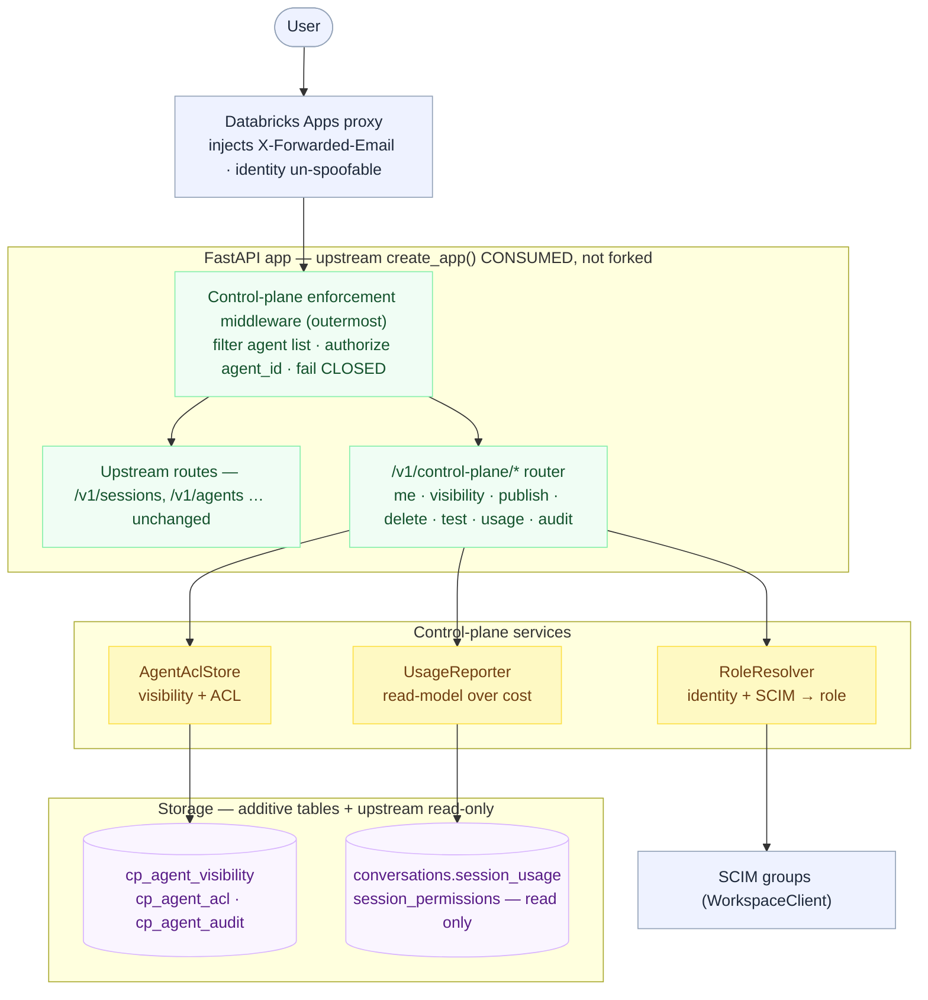

# Design: GTM Control Plane — governed multi-user agent runtime

- Scope: `deploy/databricks/` (backend control plane + deploy) and `ap-web/` (Admin UI) — **zero edits to `omnigent/` core**

## 1. Summary

Adds a self-managed **governance layer in front of** the upstream Omnigent server so a
single deployment can be shared by an org with three roles (admin / contributor /
consumer), per-agent visibility, delegated publishing, a single request-layer
enforcement point, and org-wide usage/cost attribution. It consumes upstream by
composition — one HTTP middleware + one `/v1/control-plane/*` router + three additive
tables — and never forks core. Identity and roles derive from Databricks workspace
**SCIM groups**; the request layer is the only place that can stop a user from launching
an agent they aren't authorized for (UC grants alone cannot).

Delivered as five required features plus follow-on custom-agent lifecycle work
(create-smoke-test, owner delete, immediate reuse), all with API + UI affordance + tests,
deployed live and validated by a black-box AI judge (6/6). A second review round closed
four governance hardening findings (template-mutation guard, publish-widening guard,
usage filter/redact, delete reference-check); one runner-auth finding needs a core change
and is escalated (see §6).

## 2. High-level architecture

```
                         Databricks Apps proxy
                  (injects X-Forwarded-Email; strips
                   client-supplied identity headers —
                        identity is un-spoofable)
                                  │
                                  ▼
   ┌───────────────────────────────────────────────────────────────┐
   │  FastAPI app  (upstream create_app(), CONSUMED — not forked)    │
   │                                                                 │
   │   ┌─────────────────────────────────────────────────────────┐  │
   │   │  Control-plane enforcement middleware  (OUTERMOST)        │  │ ◀── single
   │   │   • GET /v1/agents        → filter list by can_view       │  │     request-layer
   │   │   • POST /v1/sessions      ┐                              │  │     enforcement
   │   │   • POST .../{id}/fork     ├ authorize agent_id (can_view)│  │     point
   │   │   • POST .../{id}/switch   ┘  on template launch          │  │     (fails CLOSED)
   │   │   • PUT  .../{id}/agent     → block template mutation      │  │
   │   │   • multipart POST /v1/sessions → consumer-upload policy   │  │
   │   └─────────────────────────────────────────────────────────┘  │
   │                                  │ pass-through                  │
   │                                  ▼                               │
   │   upstream routes (/v1/sessions, /v1/agents, …)  ── unchanged    │
   │                                                                 │
   │   ┌─────────────────────────────────────────────────────────┐  │
   │   │  /v1/control-plane/* router (management + reporting API)  │  │
   │   │   me · agents · visibility · publish · delete · test ·    │  │
   │   │   usage · audit                                           │  │
   │   └─────────────────────────────────────────────────────────┘  │
   │            │                 │                  │               │
   │   RoleResolver       AgentAclStore        UsageReporter         │
   │  (identity+SCIM→role) (visibility+ACL)  (read-model over cost)  │
   └───────────┼─────────────────┼──────────────────┼───────────────┘
               │                 │                  │
        SCIM groups        cp_agent_visibility   conversations.session_usage
     (WorkspaceClient)     cp_agent_acl          session_permissions (owner)
                           cp_agent_audit        (existing upstream tables — read only)
```

High-level view (light theme):



Key seams:
- **Identity** — upstream resolves the email (`X-Forwarded-Email`); the control plane
  fetches SCIM **group** membership via the app service principal's `WorkspaceClient`
  (TTL-cached) and maps groups → role via env policy.
- **Enforcement** — one `@app.middleware("http")`, registered after `create_app`, is the
  outermost layer. List-filtering and launch-authz share the **same** `can_view`
  predicate the management API uses, so they can never diverge. Every governed error
  path **fails closed** (503 / empty list).
- **Storage** — three additive tables on their own `ControlPlaneBase`
  (`metadata.create_all` on boot); the upstream Alembic chain is untouched. Shapes mirror
  the existing `(user_id, resource_id, level)` permission triple.

## 3. Roles & capabilities

| Role | Source | can_publish | manage_visibility | view_usage | manage_all |
|---|---|---|---|---|---|
| admin | `omnigent-admins` group, `OMNIGENT_CP_ADMIN_USERS`, or native `is_admin` | ✓ | ✓ (any agent) | ✓ | ✓ |
| contributor | `gtm-contributors` group | ✓ | ✓ (own agents) | ✓ | — |
| consumer | default (use-only) | — | — | — | — |

Policy is env-driven (`databricks.yml` app `config.env`): `OMNIGENT_CP_ADMIN_GROUPS`
(dedicated `omnigent-admins`, decoupled from workspace `admins`),
`OMNIGENT_CP_CONTRIBUTOR_GROUPS`, `OMNIGENT_CP_ADMIN_USERS` (bootstrap),
`OMNIGENT_CP_CONSUMER_UPLOAD`, `OMNIGENT_WS_ALLOWED_ORIGINS`.

Consumer posture (decided): consumers MAY create their own **private** (session-scoped)
custom agents (`OMNIGENT_CP_CONSUMER_UPLOAD=allow`, the deployed default); org-wide
**publish** stays contributor+. Set `deny` for a strict use-only deployment.

## 4. Features added

| # | Feature | API | UI affordance |
|---|---|---|---|
| 1 | Three-tier role model (SCIM-derived) | `GET /me` | Role view + capability-gated sections |
| 2 | Per-agent visibility (org / restricted to users+groups) | `PATCH /agents/{id}/visibility` | Visibility manager + audience picker |
| 3 | Delegated, governed registration (publish) | `GET /publishable`, `POST /agents/publish` | Publish dialog (contributor+) |
| 4 | Single request-layer enforcement point | (middleware — no route) | cross-cutting; list/launch gated |
| 5 | Org-wide per-agent usage / cost | `GET /usage[?agent_id=]`, `GET /audit` | Usage dashboard + audit log |
| 6 | **Delete own custom agent** | `DELETE /agents/{id}` | Admin: Delete button; picker: per-row Remove for custom agents (deletes the owning session — safe; never hard-deletes the agent row) |
| 7 | **Test connection / smoke test** | `POST /agents/{id}/test`, `POST /agents/validate-bundle` (dry-run, no persist) | Admin Test button; composer Create dialog Test button → ✓/✗ before launch |
| 8 | **Immediate reuse** | — | a just-created custom agent is invalidated into the picker so it's usable right away |

### Function inventory (control-plane backend, `deploy/databricks/src/control_plane/`, ~2.6k LoC)
- `config.py` — `ControlPlaneConfig.from_env`, `role_for`, `capabilities_for_role`.
- `identity.py` — `resolve_groups` (SCIM, TTL cache, `GroupFetchError` for transient vs
  genuine-empty), `set_group_overrides`/`set_group_fetcher` (test hooks).
- `roles.py` — `RoleResolver.resolve` → `ResolvedPrincipal` (the single role-resolution point).
- `models.py` — `cp_agent_visibility`, `cp_agent_acl`, `cp_agent_audit`;
  `create_control_plane_tables`.
- `acl_store.py` — `AgentAclStore`: `set_owner`, `set_visibility`, `get_visibility[_map]`,
  `delete_agent`, and the `can_view` / `can_manage` predicates (single source of truth).
- `audit_store.py` — `AuditStore.record` (best-effort) / `list_recent`.
- `usage.py` — `UsageReporter.report` with fork/switch **lineage roll-up** by
  `bundle_location` prefix (`_template_id_for`).
- `routes.py` — the endpoints above incl. `POST /agents/validate-bundle` (dry-run smoke
  test) and the publish/delete guards.
- `enforcement.py` — `install_enforcement_middleware`: launch-authz (`/sessions`, `/fork`,
  `/switch-agent`), **template-mutation guard** (`PUT .../agent`), list-filter,
  consumer-upload policy; fail-closed throughout.
- `wiring.py` — `attach_control_plane` (one call: tables + stores + middleware + router).

### Deploy / config / UI
- `deploy.py` — `_ensure_app_sp_workspace_admin` (idempotent SCIM group-read grant),
  `--target` required.
- `control_plane_judge.py` — black-box AI judge (local hermetic + remote modes).
- `ap-web/src/lib/controlPlaneApi.ts` — typed client for every endpoint.
- `ap-web/src/pages/AdminPage.tsx` — single Admin page (role, visibility, publish, usage,
  audit, delete, test); `App.tsx` lazy `/admin` route; `settingsNav.tsx` gated nav entry.

## 5. Data model (additive — no migration to the upstream chain)

| Table | Key columns · type | Constraint |
|---|---|---|
| `cp_agent_visibility` | `agent_id String(64)` PK · `owner_id String(128)` · `visibility String(16)` · `created_at/updated_at Integer` | `visibility IN ('org','restricted')` |
| `cp_agent_acl` | `principal String(160)` PK · `agent_id String(64)` PK · `level Integer` | `level IN (1,4)` — mirrors `session_permissions` |
| `cp_agent_audit` | `id` PK auto · `ts Integer` · `actor String(128)` · `action String(64)` · `agent_id String(64)` · `detail Text` | indexed on `ts` |

No new column types; shapes match upstream conventions (`String(64)` agent ids,
`String(128)` user ids, `Integer` epochs).

## 6. Security posture

- **Fail closed** — a launch whose ACL/identity lookup errors → 503; a list-filter error →
  empty list. Never fail-open on a governed path.
- **Identity un-spoofable** — the Apps proxy strips client-supplied `X-Forwarded-Email`;
  verified live (multiple injected-header vectors rejected).
- **Least-privilege note** — the app SP is granted workspace-admin to read SCIM groups
  (no narrower Databricks role exists); documented trade-off.

### Second-review hardening (all fixed in the deploy layer, no core edit)
- **Template mutation** — `PUT /v1/sessions/{id}/agent` is now guarded: a session bound to
  a *template* may only be mutated by the template owner/admin; session-scoped agents pass
  through to upstream's `LEVEL_EDIT` check.
- **Publish widening** — publish rejects a non-session-scoped (template) source, so a
  restricted template can't be republished under a new visibility.
- **Usage leakage** — `GET /usage` filters rows by `can_view` and redacts `by_user` for
  non-owners (admins see all); totals are over surfaced rows only.
- **Delete cascade** — `DELETE /agents/{id}` refuses (409) when a conversation references
  the template (would cascade-delete session history); unreferenced templates delete cleanly.

### Escalated to the core team (needs `omnigent/` core change — held to zero-core-edit)
- **Runner-only auth** — `POST /v1/sessions/{id}/events` (`external_*` runner events,
  `LEVEL_EDIT`) and the native harness permission/elicitation hooks (`LEVEL_READ`) are
  authorized by user/session ACLs. They cannot be safely gated in the request layer because
  runners authenticate with the *launching user's own bearer token* — indistinguishable
  from the user at the middleware. A correct fix needs a runner-credential boundary in core.

## 7. Validation

- Tests: **87** control-plane backend + **57** upstream regression (no core regressions) +
  **~3217** frontend, all green; type-check clean.
- AI judge: **6/6** features (hermetic local, full multi-user denial matrix) and **6/6**
  live API-surface checks on the deployed app.
- Multiple adversarial review passes — each finding fixed in the deploy layer was
  independently re-verified (correct, not bypassable, no new defect) before redeploy.
