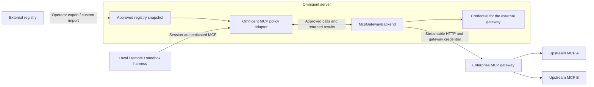

# MCP registry and gateway API

This is the implemented prototype contract for client authors and design partners.
It is not yet a stable plugin SDK. See the [architecture](MCP_REGISTRY_GATEWAY.md)
for component ownership, identity and request diagrams, and the
[walkthrough](../examples/mcp-registry/README.md) for administrator configuration.

The **registry** describes approved services. The **gateway** executes selected
tools with server-held credentials and existing session policies. Both run in
the Omnigent server. Local machines, remote hosts and sandboxes use the same API.

## Authentication and boundaries

All paths below include `/v1`; prepend any deployment base path. Browser requests
use the existing Omnigent login session. Runners use their existing server
authentication and session binding. An upstream provider token is not an
Omnigent API credential.

Catalog/account operations use the authenticated user. Session operations apply
the existing session permissions. Gateway calls use the authenticated caller
for service entitlements and credential ownership. Policy identity is separate:
direct calls use that caller; a verified runner uses the server-recorded turn actor.
A managed runner normally authenticates as the session owner, so an editor's turn
can use the owner's connected account subject to the editor's tool policies.
Generic grants are keyed by workspace, credential user and service.

Registry declarations in session bundles contain a service ID, never its upstream
URL or credential. Direct HTTP/stdio declarations retain their existing behavior.
An administrator approves destinations and tool allowlists. The catalog API
does not allow users to register arbitrary destinations.

## Catalog and account connections

| Method and path | Request | Success response |
| --- | --- | --- |
| `GET /v1/mcp-registry/services` | `limit` (default 50, max 100), `after` (previous cursor) | `200 {"data": [service, ...], "next_cursor": "tracker"}`; null cursor on the last page; only visible services, `Cache-Control: no-store`. |
| `PUT /v1/mcp-registry/services/{id}/connection` | `{"token": "personal-bearer-token"}` | `200 {"connected": true}`; `auth: bearer` only. |
| `DELETE /v1/mcp-registry/services/{id}/connection` | None | `200 {"disconnected": true}`; deletes generic OAuth/bearer grant and pending authorization. |
| `POST /v1/mcp-registry/services/{id}/test` | None | `200 {"tools": ["read_ticket"]}`; performs upstream discovery. |

Catalog order is ascending service ID. Pass `next_cursor` as `after` until null;
credential-status reads occur only for that page. Invalid limits return 422.
Settings and the launch picker follow the cursors to show the complete catalog.

Example catalog entry:

```json
{
  "id": "tracker",
  "title": "Work tracker",
  "description": "Read work tickets",
  "auth": "oauth",
  "connected": true,
  "tools": ["read_ticket"],
  "connect_provider": "mcp-tracker"
}
```

`auth` is `none`, `bearer`, `oauth`, `github` or `databricks`. `connected` means a
connection record exists (or auth is unnecessary), not that all tool calls will
succeed. The test endpoint lists tools; it does not prove invocation permissions.
No URLs, access tokens or refresh tokens are returned. Bearer tokens must be
nonempty, at most 16,000 characters and contain no whitespace.

Generic OAuth uses the shared connection routes:

| Method and path | Behavior |
| --- | --- |
| `GET /v1/connections/mcp-{id}/connect?return_to=/settings/mcp` | Redirect to configured authorization server with signed state and PKCE. Include a deployment base path in `return_to` if present. |
| `GET /v1/connections/mcp-{id}/callback?code=...&state=...` | Validate the current user and pending flow, exchange the code, save encrypted tokens and redirect with `mcp-{id}=connected` or `error`. |
| `GET /v1/connections/mcp-{id}/status` | `{"enabled": true, "connected": true, "connected_at": 1780000000}`; timestamp is null when disconnected. |
| `POST /v1/connections/mcp-{id}/disconnect` | Shared router compatibility endpoint, returns `{"disconnected": bool}`. |

Provider timeouts, malformed token JSON and invalid expiry values produce the
`mcp-{id}=error` redirect without logging provider response bodies or tokens.
The pending flow is consumed; start a new connection attempt to retry.

These routes exist only for configured generic OAuth entries. Prefer the registry
`DELETE .../connection` endpoint for disconnect: it also clears pending OAuth
authorization. Neither endpoint revokes the provider's grant. An already-authorized
call may finish, and an OAuth callback already exchanging its code can still save
a connection afterward. For `github`/`databricks`, manage the shared connection through
its existing provider routes/UI; MCP Settings links there.

Unknown/disallowed service lookups return 404. Unsupported connection operations
return 400; the test endpoint returns 400 for missing/invalid connection state and
502 for upstream failures. Schema validation normally returns 422. REST errors
use either FastAPI `{"detail": ...}` or the existing application
`{"error": {"code": ..., "message": ...}}` envelope.

## Select services for a session

Add `mcp_registry_services` to the existing `POST /v1/sessions` JSON request:

```json
{
  "agent_id": "your-agent-id",
  "host_id": "your-connected-local-host-id",
  "workspace": "/work/repo",
  "mcp_registry_services": ["tracker"]
}
```

For a managed sandbox, use the existing `host_type: "managed"` launch fields
instead of a local `host_id`/`workspace`. Selection is independent of host type.
Multipart uploads accept the same list inside JSON `metadata` alongside `bundle`.
JSON creation returns `201 SessionResponse`; multipart returns
`201 {"session_id": ..., "agent_id": ..., "agent_name": ...}`.

The list defaults to empty, has a maximum of 40 entries and adds to authored
tools. Unknown/disallowed IDs fail with 403 before persistence. Invalid IDs fail
validation (422 for JSON, 400 for multipart); custom-server name collisions return
409. A selected shared agent gets a session-scoped copy. Selection does not grant
OAuth access or change the agent template. Existing narrower tool restrictions
remain in force. Operator-template environment fields are resolved at launch
using the existing bundle resolver, including nested agents, before storing the
session copy. The source template stays unchanged. Uploaded bundles remain literal
and never expand against the server environment.

Existing sessions use the shared MCP declaration API:

| Method and path | Behavior |
| --- | --- |
| `GET /v1/sessions/{session}/agent/mcp-servers` | `200 {"object": "list", "data": [...]}`; requires session read access. |
| `POST /v1/sessions/{session}/agent/mcp-servers` | Attach `{"name": "tracker", "transport": "registry"}`; returns a summary. |
| `PUT /v1/sessions/{session}/agent/mcp-servers/{name}` | Replace a declaration using the same request shape; returns a summary. |
| `DELETE /v1/sessions/{session}/agent/mcp-servers/{name}` | Remove selection; returns 204 with no body. The account stays connected. |

Mutations require a session-scoped agent, session edit access and agent
ownership/admin rights. Shared/built-in agents return 400 through these mutation
endpoints. Registry attachments also check service access. Optional `description`
is supported; nonempty URL/header/command/argument overrides are rejected for
registry entries. Unknown fields (including `auth`) are ignored by the REST
request model, so clients must not depend on rejection of unsupported fields.
Per-session tool restrictions are authored in the agent bundle, not edited by
this API. Existing running sessions need a runner reload to see changed tools.

KMS-backed connections must fit within 4096 bytes after JSON serialization and
UTF-8 encoding, including both access and refresh tokens. Oversized credentials
are rejected before encryption with an operator-facing message; use the existing
Vault Transit backend for larger grants. OAuth connection failures return to the
UI as sign-in errors, with the storage-limit diagnosis in the server log.

## Gateway requests and policy context

`POST /v1/mcp/{service_id}` is the per-service JSON-RPC endpoint. Use
`Content-Type: application/json`, normal Omnigent authentication, and the required
`X-Omnigent-Session-Id` header. This header supplies policy context, not authority:
the adapter validates session edit access, an active session, the selected service,
service entitlements and tool allowlists for the authenticated caller. Both this
endpoint and the legacy session MCP route use that caller's upstream account.
For policy attribution, a runner additionally presents its existing
`X-Omnigent-Runner-Tunnel-Token`, bound to the session's runner ID or trusted by
the operator's tunnel-token allowlist. Only this proof selects the server-recorded
turn actor; a caller-supplied actor field or unbound token cannot change identity.
It does not switch credential owners. Pending approvals bind both policy actor
and credential user.

This retains the existing sequential-turn attribution model. The turn label is
written when an event is forwarded; queued messages from different editors can
overtake attribution. Exact per-turn identity needs a turn-scoped protocol and is
not implemented. Per-editor upstream credential delegation is also not implemented.

The URL and execution backend are independent of sessions. The **Omnigent policy
adapter still requires a session**; calls without one return 422. This prototype
does not expose a sessionless execution path with weaker policy enforcement.
Delegated runner credentials can access `/v1/mcp`; this does not grant access to
catalog/account-management endpoints.

| Method | Parameters | Result |
| --- | --- | --- |
| `initialize` | `{}` | Protocol `2024-11-05`, tools capability and service-specific server info. |
| `notifications/initialized` | None | HTTP 202. |
| `tools/list` | `{}` | `{"tools": [...]}`; upstream names, filtered by registry and session allowlists. |
| `tools/call` | `{"name": "read_ticket", "arguments": {"ticket_id": "TEST-123"}}` | MCP text content and `isError`. |

Example request, with authentication supplied by the existing client:

```http
POST /v1/mcp/tracker
Content-Type: application/json
X-Omnigent-Session-Id: <session-id>

{"jsonrpc":"2.0","id":2,"method":"tools/call","params":{"name":"read_ticket","arguments":{"ticket_id":"TEST-123"}}}
```

```json
{"jsonrpc":"2.0","id":2,"result":{"content":[{"type":"text","text":"Ticket TEST-123: ready"}],"isError":false}}
```

`ProxyMcpManager` reads the selected registry references from the session's loaded
agent spec, discovers each service, and exposes `service__tool` to the harness.
It removes that namespace for the per-service wire request. Native Claude still
adds its relay prefix: `mcp__omnigent__service__tool`. Separate native service names
could use this same gateway; naming is independent of credential ownership.

`McpPolicyAdapter` wraps the backend with the existing `TOOL_CALL` and `TOOL_RESULT`
policy handler. Request policies can allow, deny, transform arguments or ask for
approval. Approval uses the existing `requestState` / `inputResponses` round trip;
the reviewed arguments and call identity stay on the server. Result policies can
allow, transform or suppress output. A result-phase ASK withholds the output;
interactive result review is not implemented. Adding it requires a server-held
pending result and an approval continuation that releases or discards that result
without executing the upstream tool again. Pending results need bounded retention,
identity binding and cancellation cleanup. An in-memory implementation can expire
reviews on restart; restart recovery and multiple workers require protected shared
storage. See the [result-review design](MCP_REGISTRY_GATEWAY.md#adding-interactive-result-review)
for the continuation flow and required tests. Result filtering cannot undo a side
effect already performed upstream.

The existing `/v1/sessions/{session}/mcp` route remains for built-in tools, custom
HTTP/stdio declarations and older runners. Its registry compatibility path uses
the same execution backend and policy handler. New runners use the general route
for registry tools and request only non-registry tools from the legacy route.
No downstream deployment must migrate its existing custom MCP route to opt out.

Unknown/unselected/disallowed services produce HTTP 403/404, and authentication
or missing context produces HTTP 401/422. Invalid RPC arguments return `-32602`.
Policy denials and upstream failures normally return HTTP 200 with a JSON-RPC
`error` (`-32000`). Disconnected services surface discovery failures to the runner.
Tool calls are not retried after transport failures: completion may be unknown.
Approval continuation happens before execution and is distinct from replaying a
failed upstream call. See the architecture doc for credential-safe diagnostics.

## Bring your own registry or gateway

| Integration | Supported today | Work still needed |
| --- | --- | --- |
| External Streamable HTTP MCP gateway | Configure its URL as an approved `McpService` with a supported auth mode and tool allowlist. | Agree which token the gateway accepts and which downstream services it owns. |
| External registry | Operator exports approved entries to registry YAML, or embedding code constructs `McpRegistryConfig` at startup. | Automated import, ID mapping, synchronization and revocation are not built in. File changes require restart. |
| Existing hosted catalog and gateway | Keep the deployment's existing UI, selection metadata and routing. OSS registry support is opt-in. | Validate downstream patch/build compatibility. Existing connection labels are not automatically OSS IDs. |
| Proprietary gateway | Inject `McpGatewayBackend`; the Omnigent policy adapter stays in front. | Implement and test the partner-specific client and identity contract. |
| Delegated enterprise identity | Existing provider resolvers remain available. | Audience-specific/on-behalf-of token exchange is not implemented. |



The external gateway URL represents a normal approved upstream to Omnigent. That gateway
owns its downstream routing and credentials. Session context terminates at the
Omnigent adapter; the external gateway does not have to understand Omnigent
sessions. Omnigent still applies its session policies. A login token is not forwarded automatically, and `resource` configuration
does not implement an on-behalf-of exchange.

### Existing Python integration points

| Interface / class | Role and status |
| --- | --- |
| [`McpService`, `OAuthConfig`, `McpRegistryConfig`](../omnigent/server/mcp_registry.py) | Validated configuration models, suitable for constructing an approved snapshot. |
| [`McpRegistry(config, store)`](../omnigent/server/mcp_registry.py) | Concrete approved catalog and credential resolver, injected with `create_app(mcp_registry=...)`. No live catalog provider protocol yet. |
| [`McpGatewayBackend`, `RegistryMcpBackend`](../omnigent/server/mcp_gateway.py) | Importable execution protocol and default HTTP backend; inject with `create_app(mcp_gateway_backend=...)`. |
| [`McpPolicyAdapter`](../omnigent/server/mcp_policy_adapter.py) | Resolves trusted session context and applies existing policies around either backend. |
| [`ConnectionHooks`, `create_connection_router`](../omnigent/server/routes/connections_base.py) | Existing provider protocol and shared OAuth route factory. `McpOAuthHooks` implements the MCP flow. |
| [`AuthProvider`](../omnigent/server/auth.py) | Existing identity abstraction; inject with `create_app(auth_provider=...)`. |
| [`CredentialStore`](../omnigent/stores/credential_store/sqlalchemy_store.py) | Existing encrypted grant persistence. The resolver owns refresh/exchange, the store owns persistence. |

### Execution extension point

The following protocol is implemented, with MCP SDK result types:

```python
class McpGatewayBackend(Protocol):
    async def list_tools(self, service: McpService, user_id: str) -> list[Tool]: ...

    async def call_tool(
        self, service: McpService, user_id: str, tool: str, arguments: dict[str, Any]
    ) -> CallToolResult: ...
```

Supply an instance with `create_app(..., mcp_registry=catalog,
mcp_gateway_backend=partner_backend)`. A backend receives a server-approved
service, trusted user ID and policy-transformed arguments; it receives no
`Conversation`, session headers or browser credential. Workspace context remains
the existing request-scoped workspace. Backend code owns its upstream authentication
and should raise credential-safe `ConnectionError` or `McpUpstreamError` failures;
unexpected failures are sanitized by the adapter. Cancellation should propagate,
and implementations must not silently replay non-idempotent calls.

The default backend resolves credentials and refresh through `McpRegistry`.
A standard external HTTP MCP gateway needs only registry configuration; a
proprietary client can implement this protocol. The catalog and Settings connection
flows remain registry-owned: backend injection alone does not replace account UI
or add a live external registry. This is a prototype extension point for partner
feedback, not a versioned stable SDK.

For a future live registry, the proposed boundary remains a **catalog provider**
(`list_services`, `get_service` for a trusted user/workspace). That interface is
not implemented. Session authorization and policy checks stay in Omnigent.

Useful feedback: who owns service IDs and entitlements, how revocations propagate,
which issuer/audience/scopes the gateway accepts, whether calls need end-user
delegation, and whether the external gateway speaks standard Streamable HTTP.
Those answers determine whether configuration is sufficient or a small adapter
is justified.
