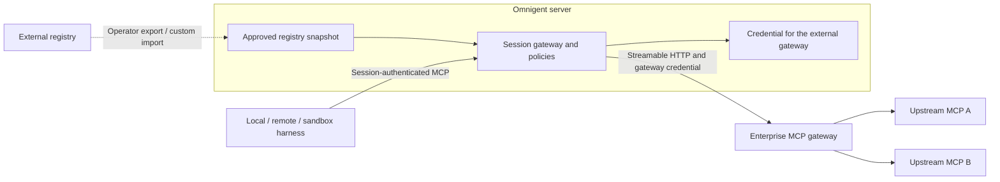

# MCP registry and gateway API

This is the implemented prototype contract for client authors and design partners.
It is not yet a stable plugin SDK. See the [architecture](MCP_REGISTRY_GATEWAY.md)
for component ownership, identity and request diagrams, and the
[walkthrough](../examples/mcp-registry/README.md) for administrator configuration.

The **registry** describes approved services. The **gateway** executes selected
tools with server-held credentials and existing session policies. Both run in
the Omnigent server. Local machines, remote hosts and sandboxes use the same API.

## Authentication and boundaries

All paths below include `/v1`; prepend any deployment base path. Browser requests
use the existing Omnigent login session. Runners use their existing server
authentication and session binding. An upstream provider token is not an
Omnigent API credential.

Catalog/account operations use the authenticated user. Session operations apply
the existing session permissions. Gateway calls resolve the server-recorded turn
actor, falling back to the authenticated caller; the request cannot choose an
arbitrary `user_id`. Generic grants are keyed by workspace, user and service.

Registry declarations in session bundles contain a service ID, never its upstream
URL or credential. Direct HTTP/stdio declarations retain their existing behavior.
An administrator approves destinations and tool allowlists. The catalog API
does not allow users to register arbitrary destinations.

## Catalog and account connections

| Method and path | Request | Success response |
| --- | --- | --- |
| `GET /v1/mcp-registry/services` | None | `200 {"data": [service, ...]}`; only visible services, `Cache-Control: no-store`. |
| `PUT /v1/mcp-registry/services/{id}/connection` | `{"token": "personal-bearer-token"}` | `200 {"connected": true}`; `auth: bearer` only. |
| `DELETE /v1/mcp-registry/services/{id}/connection` | None | `200 {"disconnected": true}`; deletes generic OAuth/bearer grant and pending authorization. |
| `POST /v1/mcp-registry/services/{id}/test` | None | `200 {"tools": ["read_ticket"]}`; performs upstream discovery. |

Example catalog entry:

```json
{
  "id": "tracker",
  "title": "Work tracker",
  "description": "Read work tickets",
  "auth": "oauth",
  "connected": true,
  "tools": ["read_ticket"],
  "connect_provider": "mcp-tracker"
}
```

`auth` is `none`, `bearer`, `oauth`, `github` or `databricks`. `connected` means a
connection record exists (or auth is unnecessary), not that all tool calls will
succeed. The test endpoint lists tools; it does not prove invocation permissions.
No URLs, access tokens or refresh tokens are returned. Bearer tokens must be
nonempty, at most 16,000 characters and contain no whitespace.

Generic OAuth uses the shared connection routes:

| Method and path | Behavior |
| --- | --- |
| `GET /v1/connections/mcp-{id}/connect?return_to=/settings/mcp` | Redirect to configured authorization server with signed state and PKCE. Include a deployment base path in `return_to` if present. |
| `GET /v1/connections/mcp-{id}/callback?code=...&state=...` | Validate the current user and pending flow, exchange the code, save encrypted tokens and redirect with `mcp-{id}=connected` or `error`. |
| `GET /v1/connections/mcp-{id}/status` | `{"enabled": true, "connected": true, "connected_at": 1780000000}`; timestamp is null when disconnected. |
| `POST /v1/connections/mcp-{id}/disconnect` | Shared router compatibility endpoint, returns `{"disconnected": bool}`. |

These routes exist only for configured generic OAuth entries. Prefer the registry
`DELETE .../connection` endpoint for disconnect: it also clears pending OAuth
authorization. Neither endpoint revokes the provider's grant. An already-authorized
call may finish, and an OAuth callback already exchanging its code can still save
a connection afterward. For `github`/`databricks`, manage the shared connection through
its existing provider routes/UI; MCP Settings links there.

Unknown/disallowed service lookups return 404. Unsupported connection operations
return 400; the test endpoint returns 400 for missing/invalid connection state and
502 for upstream failures. Schema validation normally returns 422. REST errors
use either FastAPI `{"detail": ...}` or the existing application
`{"error": {"code": ..., "message": ...}}` envelope.

## Select services for a session

Add `mcp_registry_services` to the existing `POST /v1/sessions` JSON request:

```json
{
  "agent_id": "your-agent-id",
  "host_id": "your-connected-local-host-id",
  "workspace": "/work/repo",
  "mcp_registry_services": ["tracker"]
}
```

For a managed sandbox, use the existing `host_type: "managed"` launch fields
instead of a local `host_id`/`workspace`. Selection is independent of host type.
Multipart uploads accept the same list inside JSON `metadata` alongside `bundle`.
JSON creation returns `201 SessionResponse`; multipart returns
`201 {"session_id": ..., "agent_id": ..., "agent_name": ...}`.

The list defaults to empty, has a maximum of 40 entries and adds to authored
tools. Unknown/disallowed IDs fail with 403 before persistence. Invalid IDs fail
validation (422 for JSON, 400 for multipart); custom-server name collisions return
409. A selected shared agent gets a session-scoped copy. Selection does not grant
OAuth access or change the agent template. Existing narrower tool restrictions
remain in force.

Existing sessions use the shared MCP declaration API:

| Method and path | Behavior |
| --- | --- |
| `GET /v1/sessions/{session}/agent/mcp-servers` | `200 {"object": "list", "data": [...]}`; requires session read access. |
| `POST /v1/sessions/{session}/agent/mcp-servers` | Attach `{"name": "tracker", "transport": "registry"}`; returns a summary. |
| `PUT /v1/sessions/{session}/agent/mcp-servers/{name}` | Replace a declaration using the same request shape; returns a summary. |
| `DELETE /v1/sessions/{session}/agent/mcp-servers/{name}` | Remove selection; returns 204 with no body. The account stays connected. |

Mutations require a session-scoped agent, session edit access and agent
ownership/admin rights. Shared/built-in agents return 400 through these mutation
endpoints. Registry attachments also check service access. Optional `description`
is supported; nonempty URL/header/command/argument overrides are rejected for
registry entries. Unknown fields (including `auth`) are ignored by the REST
request model, so clients must not depend on rejection of unsupported fields.
Per-session tool restrictions are authored in the agent bundle, not edited by
this API. Existing running sessions need a runner reload to see changed tools.

## Gateway requests

`POST /v1/sessions/{session}/mcp` accepts JSON-RPC with
`Content-Type: application/json`. It requires session edit access and uses
existing tool-call/approval/result policies. `ProxyMcpManager` is the runner
client; native harnesses expose the schemas through their existing MCP relay.

This session-scoped route is hidden from OpenAPI. It supports the tool subset
below; it is not a standalone gateway login/discovery service for arbitrary MCP
clients.

| Method | Parameters | Result |
| --- | --- | --- |
| `initialize` | `{}` | Protocol `2024-11-05`, tools capability and `omnigent-mcp-proxy` server info. |
| `tools/list` | `{}` | `{"tools": [...]}` with upstream schemas and names `service__tool`. |
| `tools/call` | `{"name": "tracker__read_ticket", "arguments": {"ticket_id": "TEST-123"}}` | `{"content": [{"type": "text", "text": "..."}], "isError": false}`. |

Example invocation and response:

```json
{"jsonrpc":"2.0","id":2,"method":"tools/call","params":{"name":"tracker__read_ticket","arguments":{"ticket_id":"TEST-123"}}}
```

```json
{"jsonrpc":"2.0","id":2,"result":{"content":[{"type":"text","text":"Ticket TEST-123: ready"}],"isError":false}}
```

Registry and session tool allowlists both apply. Disconnected/unavailable services
are omitted from discovery. An RPC failure normally returns HTTP 200 with
`{"jsonrpc":"2.0","id":2,"error":{"code":-32000,"message":"..."}}`.
Authentication and content-type failures remain HTTP errors. Tool-policy approval
can return the existing approval-required result; use the runner client to handle
that flow. Call failures are not automatically retried. See the architecture doc
for credential-safe diagnostics and refresh behavior.

## Bring your own registry or gateway

| Integration | Supported today | Work still needed |
| --- | --- | --- |
| External Streamable HTTP MCP gateway | Configure its URL as an approved `McpService` with a supported auth mode and tool allowlist. | Agree which token the gateway accepts and which downstream services it owns. |
| External registry | Operator exports approved entries to registry YAML, or embedding code constructs `McpRegistryConfig` at startup. | Automated import, ID mapping, synchronization and revocation are not built in. File changes require restart. |
| Existing hosted catalog and gateway | Keep the deployment's existing UI, selection metadata and routing. OSS registry support is opt-in. | Validate downstream patch/build compatibility. Existing connection labels are not automatically OSS IDs. |
| Proprietary gateway or delegated identity | Existing deployment identity/connection code can supply an adapter. | No generic execution-backend protocol or token-exchange adapter is shipped here. |



The gateway URL represents a normal approved upstream to Omnigent. That gateway
owns its downstream routing and credentials. Omnigent still applies its session
policies. A login token is not forwarded automatically, and `resource` configuration
does not implement an on-behalf-of exchange.

### Existing Python integration points

| Interface / class | Role and status |
| --- | --- |
| [`McpService`, `OAuthConfig`, `McpRegistryConfig`](../omnigent/server/mcp_registry.py) | Validated configuration models, suitable for constructing an approved snapshot. |
| [`McpRegistry(config, store)`](../omnigent/server/mcp_registry.py) | Concrete catalog, credential and upstream executor. `create_app(mcp_registry=...)` injects it. It is not a registry/gateway provider protocol. |
| [`ConnectionHooks`, `create_connection_router`](../omnigent/server/routes/connections_base.py) | Existing provider protocol and shared OAuth route factory. `McpOAuthHooks` implements the MCP flow. |
| [`AuthProvider`](../omnigent/server/auth.py) | Existing identity abstraction; inject with `create_app(auth_provider=...)`. |
| [`CredentialStore`](../omnigent/stores/credential_store/sqlalchemy_store.py) | Existing encrypted grant persistence. The resolver owns refresh/exchange, the store owns persistence. |

If a partner needs a live external catalog or proprietary executor, the proposed
next split is a **catalog provider** (`list_services`, `get_service` for a trusted
user/workspace) and a **tool executor** (`list_tools`, `call_tool` for an approved
service and trusted actor). These are discussion boundaries, not importable base
classes yet. Keep session authorization and policy checks in the existing server
layer, regardless of the chosen backend. Avoid freezing an SDK around the current
combined implementation before learning the partner's requirements.

Useful feedback: who owns service IDs and entitlements, how revocations propagate,
which issuer/audience/scopes the gateway accepts, whether calls need end-user
delegation, and whether the external gateway speaks standard Streamable HTTP.
Those answers determine whether configuration is sufficient or a small adapter
is justified.
