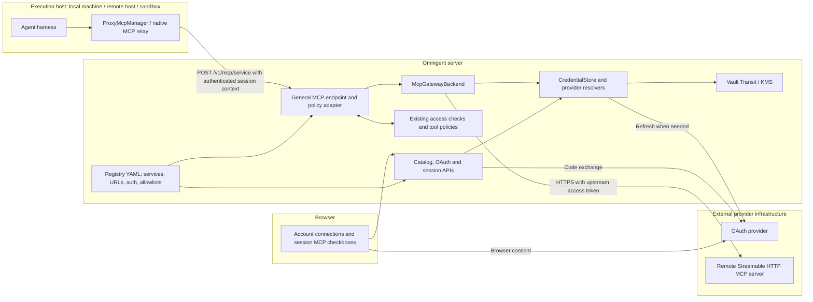
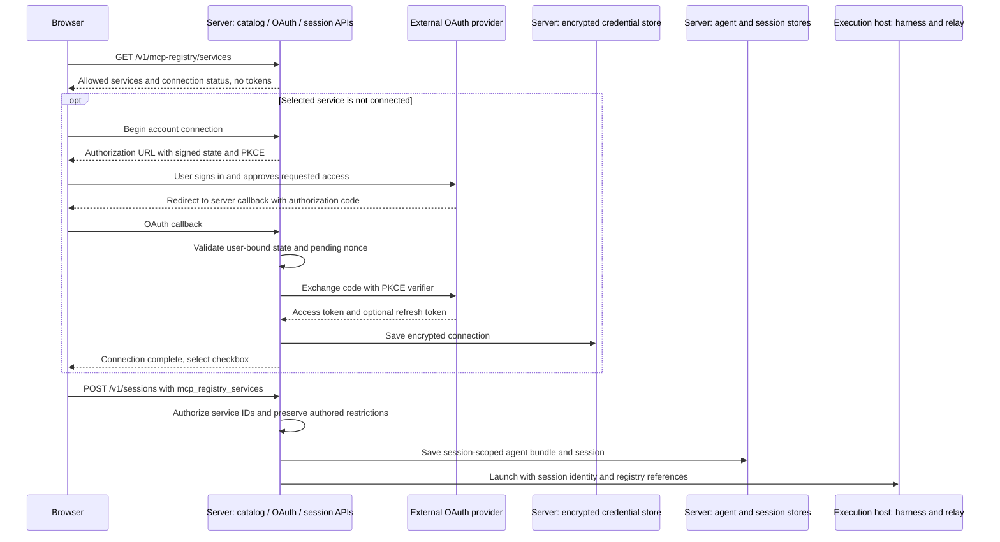
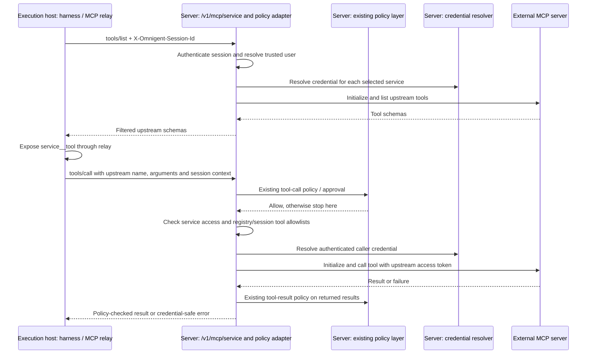
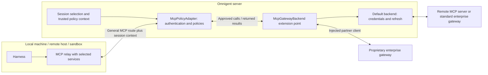
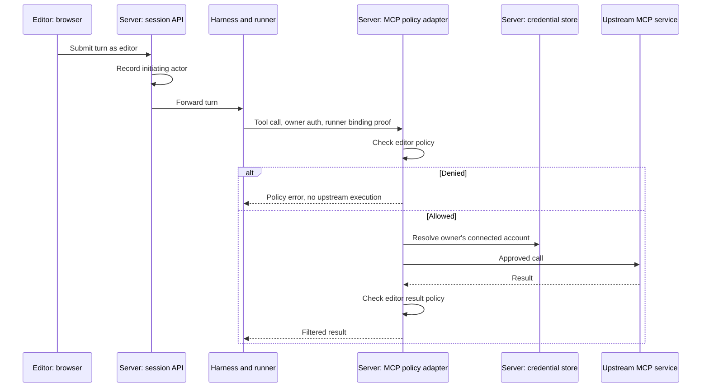
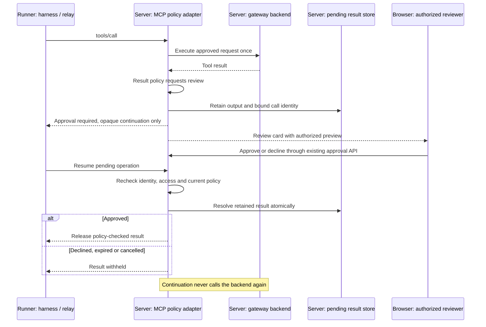
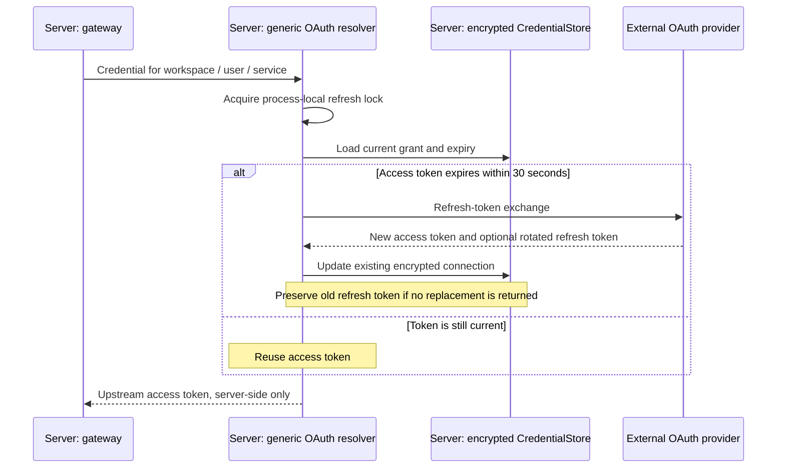
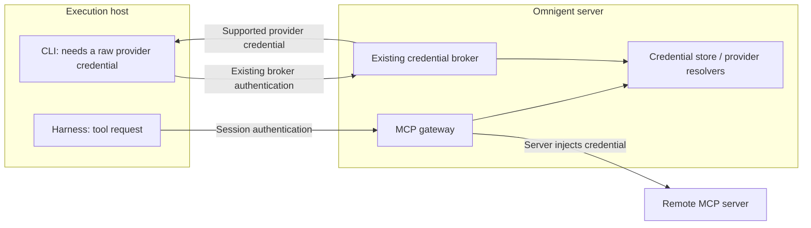
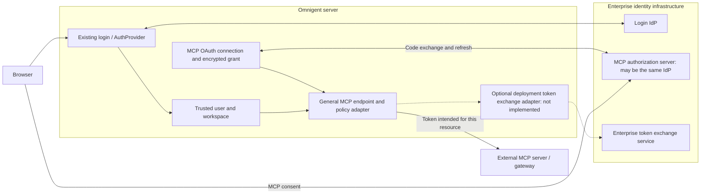

# Managed MCP registry and gateway

Users connect an account once, then select its MCP tools for individual sessions.
The Omnigent server holds the upstream credentials and executes the remote calls.
The same selection works on a connected local machine, remote host or sandbox.
Replacing the execution host does not require reconnecting the account.

This describes the implemented prototype. Follow the
[Docker/Colima walkthrough](../examples/mcp-registry/README.md) to run it.
The [API and integration contract](MCP_REGISTRY_API.md) describes the HTTP surface,
existing Python hooks, and options for bringing an external registry or gateway.

## Components and ownership

The registry and gateway are modules in the existing Omnigent server, not new
services to deploy. The registry defines **what may be connected**. The **policy adapter** decides whether this actor may make this call using trusted
session context. The **gateway backend** resolves credentials and calls the approved
upstream. The backend may be replaced without moving Omnigent policies to the runner.

- **Administrator:** configures approved destinations, auth and nonempty tool
  allowlists in `OMNIGENT_MCP_REGISTRY`. Optional user allowlists limit visibility
  and use. Config changes require a server restart.
- **User:** connects an account through **Settings → MCP** or the launch picker, then
  selects services per session. Selection and account connection are independent.
- **Runner:** receives service references and tool schemas. A registry entry
  starts no local upstream MCP subprocess. The native relay lives beside the harness;
  the remote MCP server lives at the administrator-configured URL.
- **Server:** stores generic grants encrypted, scoped by workspace/user/service.
  Sessions contain references, not upstream credentials or caller-chosen URLs.

Existing direct HTTP and stdio MCP configurations keep their current behavior.
The runner must be connected to the Omnigent server; offline execution cannot use
this gateway. Neither catalog access nor gateway execution requires a sandbox
provider. Selecting an MCP service does not provision a sandbox.

## Connect, select and launch

Launch waits while OAuth is pending. Existing accounts are reused. Bearer-token
services must be connected in Settings first. JSON and multipart creation accept
the selected IDs; a shared agent template is not modified. Operator-template
environment fields are resolved into the session copy at launch; uploads stay
unexpanded. Catalog responses use cursor pages of at most 100 services, with
credential lookups limited to the current page. Unchecking removes
the session selection without disconnecting the account. Changes to an existing
session require its runner to reload, as the UI indicates.

## Discover and call a tool

Each operation opens a fresh upstream connection. Native harnesses discover tools
through `ProxyMcpManager` and advertise them on their existing persistent relay.
The runner reads registry references from the session spec and routes each service
to its own gateway URL. Existing custom MCPs and runtime tools retain their session
proxy route; older runners remain compatible.
They do not need their own OAuth implementation.

**Discovery is not a tool-permission check.** An upstream may advertise a tool but
reject its invocation. For example, GitHub can allow `get_me` while rejecting
repository search because the OAuth grant lacks repository scopes. The Settings
test only lists tools; acceptance testing must also invoke the intended tools.

HTTP failures, including those wrapped in MCP task-group exceptions, produce
credential-safe diagnoses: 401 authentication, 403 access denied, 429 rate limit,
other HTTP errors, timeout, transport failure, or an unexpected failure. Logs
record service/tool and failure category/status; gateway call logs also identify
the session. They do not include exception text, request headers, response bodies
or tokens. Tool calls are not automatically retried: a failed response does not
prove that a write did not execute.

## Policy adapter and external gateways

`POST /v1/mcp/{service_id}` has a session-independent URL. Its Omnigent adapter
requires `X-Omnigent-Session-Id` and authenticates the caller before checking edit
access, session selection, and the authenticated caller's service/tool allowlists.
The same caller owns the upstream credential, including on the legacy route.
A managed runner authenticates as the session owner, so editor-triggered turns
use that owner's connected account. The runner's binding token lets the policy
adapter evaluate the server-recorded initiating user instead. Direct requests
without runner proof use the caller for both purposes; body actor fields are ignored.
The header is a context reference, not a credential. Sessionless calls are not
supported by this adapter. No separate policy service needs to be deployed.

For an editor's turn in an owner-authenticated runner:

The existing label records sequential turn attribution, not an immutable turn
identity. Queued messages from different editors can overtake that label; exact
per-turn binding and per-editor credential delegation remain future work.

The adapter reuses the existing policy handler. Before execution, request policies
can deny, transform arguments, or require approval. Approval retains the reviewed
arguments and session/tool/policy-actor/credential-user identity server-side. After execution, response
policies can transform or suppress output. Result-phase ASK withholds output;
interactive result review is not implemented. Suppression does not undo an upstream
side effect. These policies cover traffic through Omnigent's gateway; independently
configured local MCPs are outside this path.

`McpGatewayBackend` exposes `list_tools` and `call_tool` with an approved service and
trusted user. It does not receive the session object. Standard external gateways
work through the default HTTP backend; proprietary gateways can supply an injected
implementation. Both are wrapped by the same policy adapter, including response
filtering. An external gateway owns its downstream credentials; Omnigent stores
only the credential needed to call that gateway. See the API doc for exact types.

## Adding interactive result review

Result review is a supported architectural direction, but is not implemented in
this prototype. Request approval pauses **before execution**. Result approval
pauses **after execution**, before the harness or model receives the output.
Reusing the current request continuation unchanged would execute the tool again.
A result continuation must instead release or discard the retained output.

The smallest implementation can reuse the existing approval events, card and
runner wait/resume loop. It needs a result-phase continuation, an authorized
preview that is not written into model-visible history, and a bounded server-side
pending record containing the session, actor, service/tool, call ID, output and
expiry. Resolve it atomically so duplicate approvals or retries cannot execute
the upstream call or release another call's result. Recheck authorization and any
new policy denial before release; apply deferred policy writes only on approval.

For this single-worker prototype, an in-memory store with expiry and cancellation
cleanup is sufficient if restart explicitly expires pending reviews. Protected
shared persistence is needed for restart recovery and multiple workers. Credential
storage and token refresh do not need to change: they own grants, not tool outputs.
Tests must cover approval, decline, expiry, cancellation, changed access/policy,
duplicate continuation and both SDK/native runners, with upstream execution counted
exactly once. Suppressing a result cannot undo a write that already happened;
approval of a side effect belongs in the request phase.

## Credential lifecycle and refresh

Refresh locks remain alive while a holder or waiter needs them, then are released
from the registry. Invalid provider responses return credential-safe errors;
callbacks redirect to sign-in error so the user can start a new flow.

The credential store supplies persistence and encryption; the resolver owns the
provider's refresh protocol. Generic OAuth supports explicit endpoints, PKCE,
scopes and an optional resource. `auth: github` and `auth: databricks` instead
delegate to the existing provider credential resolvers and their refresh logic.
Reuse is valid only for an upstream trusted to receive that provider token with
the appropriate audience and permissions; it performs no new token exchange.

Disconnect deletes the local grant and pending authorization, not the provider's
grant. Resolution fails while no grant exists; an already-authorized call may
finish. A refresh cannot recreate a connection deleted while it was in progress.
An OAuth callback already exchanging its code can still save a connection after
disconnect; cancellation of that in-flight exchange remains a prototype limit.

KMS-backed connections must fit within 4096 bytes after JSON serialization and
UTF-8 encoding, including both access and refresh tokens. Oversized credentials
are rejected before encryption with an operator-facing message; use the existing
Vault Transit backend for larger grants. OAuth connection failures return to the
UI as sign-in errors, with the storage-limit diagnosis in the server log.

## Gateway versus credential broker

Generic `mcp:<service-id>` grants are not registered as credential-vending
providers. Existing GitHub/Databricks broker behavior is unchanged. This prototype
does not add a separate permission for “use via gateway” versus “retrieve the raw
token” for those existing providers, nor a dedicated gateway-only session token.

## Integration boundaries and prototype limits

The feature is opt-in. The UI checks the advertised `mcp` connection capability.
Hosted deployments can keep their catalog, account UI, selection metadata and
remote gateway. Their existing connection names must not become OSS registry IDs.
No store interface is replaced. Downstream patch application/build compatibility
still needs validation; architectural separation alone does not prove it.

Sandbox provisioning remains the sandbox provider's responsibility.

### Where enterprise identity fits

An enterprise IdP is relevant, but there are three separate decisions:

| Concern | Existing support | When more integration is needed |
| --- | --- | --- |
| Who is using Omnigent? | Existing OIDC login, trusted-header authentication or injected `AuthProvider`. | Map enterprise identity to a stable Omnigent user and workspace. |
| Can that user access the MCP service? | Per-service OAuth with explicit endpoints, scopes and optional resource, plus stored grants and refresh. | Register the OAuth client and obtain enterprise consent for that resource. The authorization server may be the same IdP used for login. |
| Does a gateway require delegated enterprise identity? | Existing GitHub/Databricks resolvers can be reused where their tokens are accepted. | An audience-specific or on-behalf-of exchange needs a server-side deployment adapter. It is not implemented by this prototype. |

Logging in does not itself grant MCP access. Do not forward a login ID token to an
MCP server or assume the login access token has the required audience. Group-based
entitlements, deprovisioning and token exchange need an explicit deployment contract.
There is no need for a second Omnigent login system. Before adding an adapter, ask
which issuer, audience, scopes and user delegation the external gateway requires.

### Current limits

- One server worker; refresh locks do not coordinate replicas.
- Streamable HTTP tools only. No OAuth discovery/dynamic registration, legacy
  SSE transport, resource/prompt proxying or upstream interactive elicitation.
- No upstream connection pooling or discovery cache. Unavailable/disconnected
  services are omitted from discovery.
- Non-text result blocks become text/JSON, not native media streams.
- No automatic retry or refresh-and-replay after a provider 401 or lost response.
- Request approval is supported; result-review ASK withholds output without an
  interactive result-review flow. The policy adapter requires session context.
- User allowlists are not organization/group entitlement management. The gateway
  does not enforce sandbox network egress or replace sandbox isolation.

## Code and verification

Start with [registry and OAuth resolution](../omnigent/server/mcp_registry.py),
[gateway backend](../omnigent/server/mcp_gateway.py),
[policy adapter](../omnigent/server/mcp_policy_adapter.py),
[session selection](../omnigent/server/routes/session_mcp_servers.py) and
[launch picker](../web/src/shell/McpRegistryLaunchPicker.tsx).

The walkthrough lists runnable tests and manual checks. Verify discovery **and**
an allowed call, OAuth reuse across execution hosts, expiry refresh, a denied call,
and disconnect. Browser tests cover local-host and sandbox selection on desktop
and mobile. Backend integration covers local-host selection and calls through
`ProxyMcpManager`. Real GitHub OAuth and a native Claude sandbox have also been
exercised; that does not validate every provider or harness.
