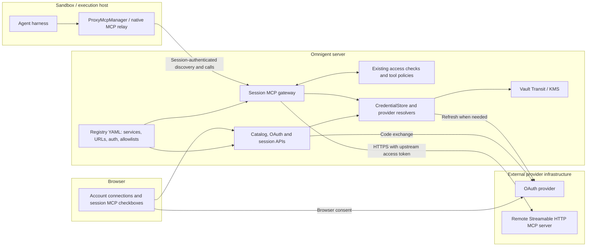
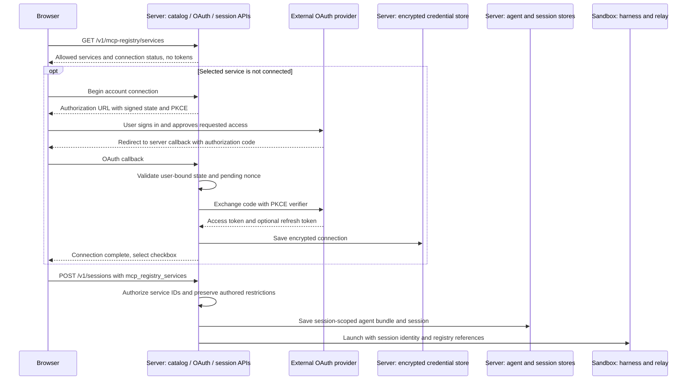
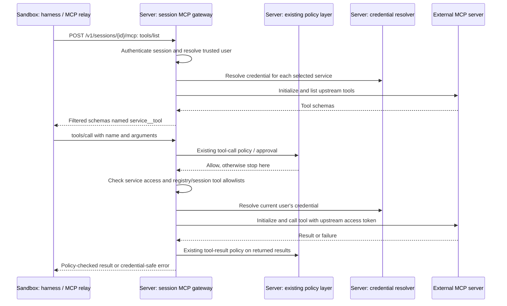
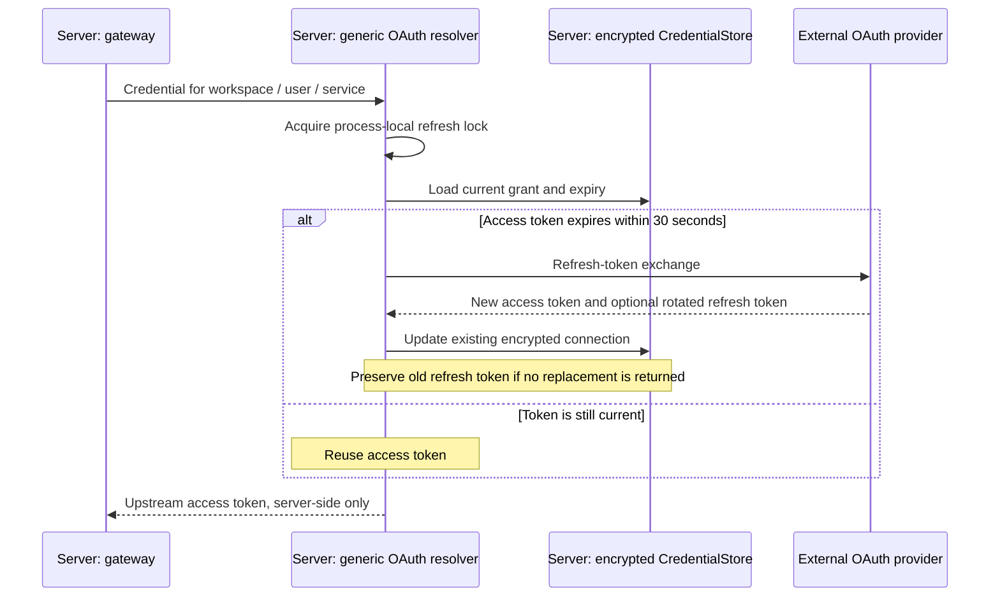
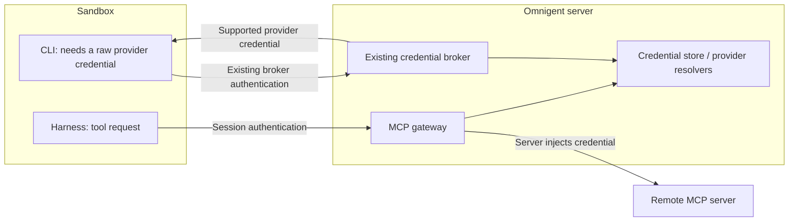

# Managed MCP registry and gateway

Users connect an account once, then select its MCP tools for individual sessions.
The Omnigent server holds the upstream credentials and executes the remote calls.
Replacing a sandbox does not require reconnecting the account.

This describes the implemented prototype. Follow the
[Docker/Colima walkthrough](../examples/mcp-registry/README.md) to run it.

## Components and ownership

The registry and gateway are modules in the existing Omnigent server, not new
services to deploy. The registry defines **what may be connected**. The gateway
decides **whether this actor may make this call**, resolves the credential, and
calls the approved upstream.

- **Administrator:** configures approved destinations, auth and nonempty tool
  allowlists in `OMNIGENT_MCP_REGISTRY`. Optional user allowlists limit visibility
  and use. Config changes require a server restart.
- **User:** connects an account through Settings or the launch picker, then
  selects services per session. Selection and account connection are independent.
- **Sandbox:** receives service references and tool schemas. A registry entry
  starts no local upstream MCP subprocess. The native relay lives in the sandbox;
  the remote MCP server lives at the administrator-configured URL.
- **Server:** stores generic grants encrypted, scoped by workspace/user/service.
  Sessions contain references, not upstream credentials or caller-chosen URLs.

Existing direct HTTP and stdio MCP configurations keep their current behavior.

## Connect, select and launch

Launch waits while OAuth is pending. Existing accounts are reused. Bearer-token
services must be connected in Settings first. JSON and multipart creation accept
the selected IDs; a shared agent template is not modified. Unchecking removes
the session selection without disconnecting the account. Changes to an existing
session require its runner to reload, as the UI indicates.

## Discover and call a tool

Each operation opens a fresh upstream connection. Native harnesses discover tools
through `ProxyMcpManager` and advertise them on their existing persistent relay.
They do not need their own OAuth implementation.

**Discovery is not a tool-permission check.** An upstream may advertise a tool but
reject its invocation. For example, GitHub can allow `get_me` while rejecting
repository search because the OAuth grant lacks repository scopes. The Settings
test only lists tools; acceptance testing must also invoke the intended tools.

HTTP failures, including those wrapped in MCP task-group exceptions, produce
credential-safe diagnoses: 401 authentication, 403 access denied, 429 rate limit,
other HTTP errors, timeout, transport failure, or an unexpected failure. Logs
record service/tool and failure category/status; gateway call logs also identify
the session. They do not include exception text, request headers, response bodies
or tokens. Tool calls are not automatically retried: a failed response does not
prove that a write did not execute.

## Credential lifecycle and refresh

The credential store supplies persistence and encryption; the resolver owns the
provider's refresh protocol. Generic OAuth supports explicit endpoints, PKCE,
scopes and an optional resource. `auth: github` and `auth: databricks` instead
delegate to the existing provider credential resolvers and their refresh logic.
Reuse is valid only for an upstream trusted to receive that provider token with
the appropriate audience and permissions; it performs no new token exchange.

Disconnect deletes the local grant and pending authorization, not the provider's
grant. Future resolution fails; an already-authorized call may finish. A refresh
cannot recreate a connection deleted while that refresh was in progress.

## Gateway versus credential broker

Generic `mcp:<service-id>` grants are not registered as credential-vending
providers. Existing GitHub/Databricks broker behavior is unchanged. This prototype
does not add a separate permission for “use via gateway” versus “retrieve the raw
token” for those existing providers, nor a dedicated gateway-only session token.

## Integration boundaries and prototype limits

The feature is opt-in. The UI checks the advertised `mcp` connection capability.
Hosted deployments can keep their catalog, account UI, selection metadata and
remote gateway. Their existing connection names must not become OSS registry IDs.
No store interface is replaced. Downstream patch application/build compatibility
still needs validation; architectural separation alone does not prove it.

An internal identity or on-behalf-of exchange should reuse the deployment's
server-side identity resolver. That adapter is not implemented by this prototype;
standard OAuth configuration is not a substitute for an audience-specific exchange.
Sandbox provisioning remains the sandbox provider's responsibility.

Current limits:

- One server worker; refresh locks do not coordinate replicas.
- Streamable HTTP tools only. No OAuth discovery/dynamic registration, legacy
  SSE transport, resource/prompt proxying or upstream interactive elicitation.
- No upstream connection pooling or discovery cache. Unavailable/disconnected
  services are omitted from discovery.
- Non-text result blocks become text/JSON, not native media streams.
- No automatic retry or refresh-and-replay after a provider 401.
- User allowlists are not organization/group entitlement management. The gateway
  does not enforce sandbox network egress or replace sandbox isolation.

## Code and verification

Start with [registry and OAuth resolution](../omnigent/server/mcp_registry.py),
[gateway execution](../omnigent/server/registry_gateway.py),
[session selection](../omnigent/server/routes/session_mcp_servers.py) and
[launch picker](../web/src/shell/McpRegistryLaunchPicker.tsx).

The walkthrough lists runnable tests and manual checks. Verify discovery **and**
an allowed call, OAuth reuse in a fresh sandbox, expiry refresh, a denied call,
and disconnect. The prototype has been exercised with real GitHub OAuth and a
native Claude sandbox; that does not validate every provider or harness.
