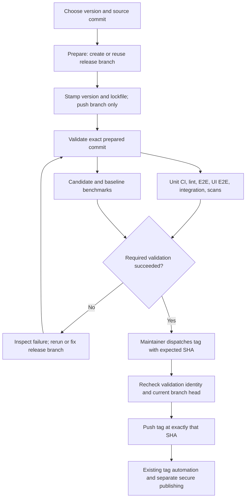

# Prepare a release branch before validating and tagging

Status: draft proposal. Implementation and rollout are deferred until after the
0.14.0 release cycle. This document does not change any workflow or release
instructions currently in use.

## Problem

`release.yml` currently resolves a source commit, reads its attached CI checks,
runs benchmarks, and then stamps the version and pushes a branch and tag in one
`cut` job. The CI assertion runs before branch creation because preparation and
tagging are coupled. A pending scheduled test on main can prevent maintainers
from freezing the release branch, even though creating that branch would not
publish a release.

The assertion also checks the commit before version stamping and lockfile
updates. Branch CI runs after that new commit is pushed, alongside the tag.
Separating these operations would allow validation of the commit that will
actually be tagged, while development continues on main.

The existing design is described in [RELEASE-AUTOMATION.md](RELEASE-AUTOMATION.md).
This proposal replaces its combined branch/stamp/tag operation only after a
separate implementation is reviewed and adopted.

## Proposed maintainer flow

Prepare the branch immediately, let release validation finish, then explicitly
tag the validated commit. Secure publishing remains a separate operation.

A fix or version change produces a new SHA and requires fresh validation.
Preparing rc2 or the final version follows the same process on the existing
release branch. Passing CI for rc1 cannot authorize tagging the newly stamped
final-version commit.

| Stage | Inputs | Writes | Completion condition |
| --- | --- | --- | --- |
| Prepare | Version, source ref for a new branch, expected head for an existing branch, dry run | Version-stamped release branch; first-cut main version bump PR | Prepared SHA and validation link are recorded; no tag |
| Validate | Prepared SHA and version | Check results and benchmark artifacts | Every required validation succeeds; benchmark regression approved when applicable |
| Tag | Version, expected SHA, validation run ID, dry run | Release tag only | Branch and validation still identify the expected SHA; tag pushed |
| Publish | Tag | Existing downstream artifacts | Existing secure publishing and finalization rules |

Workflow names below are proposed interfaces, not commands available today.

### Prepare: `prepare-release.yml`

Retain the existing admin/maintainer authorization gate and default
`dry_run=true`. Validate the version, source, branch family, and tag state before
writes. CI on main is not a prerequisite for preparing a branch.

For a new release cycle, resolve the selected source once to a commit SHA.
Stamp all lockstep versions and normalize the lockfile in that checkout, then
push the resulting commit to `release/vX.Y.0` without a tag. For an existing
branch, require an expected head SHA and stamp from that commit, never from the
current main branch. Refuse an unexpected branch movement or non-fast-forward
update; do not force-push.

Use the existing GitHub App token for the push so branch workflows can run.
Start release validation for the resulting SHA and show its URL in the prepare
summary. Validation failure leaves the prepared branch available for repair.
If validation dispatch fails after the push, retry validation on that same SHA.
Do not create another version commit just to retrigger checks.

On the first preparation of a release cycle, open the next-development-version
PR on main. Make this resumable and idempotent: a prepare retry must find the
existing bump PR or create a missing one, including when a previous attempt
pushed the release branch but failed before dispatching the bump workflow.
Main's version may advance while the release candidate is being repaired.

Preparation executes maintainer-selected source before it has passed release
CI. Keep test/build jobs read-only, disable persisted checkout credentials,
and isolate the write-token step from source execution. Retain maintainer-only
dispatch; this proposal does not expose privileged preparation to arbitrary PR
events or forks.

### Validate: `release-validate.yml`

Use a dedicated coordinator with a trusted workflow definition and an explicit
candidate SHA. Reuse the existing test implementations, adding reusable
workflow interfaces where necessary. Pass the candidate SHA to every checkout
and keep write credentials out of test jobs. Record both the coordinator's
workflow revision and the candidate SHA: they need not be the same commit.

The validation manifest identifies version, candidate SHA, workflow revision,
required jobs, run ID/attempt, and benchmark baseline SHA. Select and record the
baseline once. Validation must run against the version-stamped commit, not a
branch name that may move while jobs queue.

The initial required suite should include:

- Unit-test matrix and lint/version-lockstep checks.
- E2E, E2E UI, and integration matrices, including the full scheduled UI suite.
- Applicable dependency/security scans with their existing enforcement policy.
- Candidate benchmarks and comparison with the previous stable release when
  available; retain the existing approval requirement for regressions.

Implementation must enumerate the required jobs and permitted conditional
skips in one reviewed release policy. It must not copy PR-only checks such as
DCO, or inherit path filters that silently omit release tests. A first release
without a baseline can skip comparison, but still requires candidate benchmarks.
Missing required jobs, unexpected skips, cancellation, API errors, and expired
or unavailable validation evidence cannot count as success.

At the time of this proposal, `ci.yml` and `lint.yml` already have release-branch
push triggers. `e2e.yml`, `e2e-ui.yml`, and `integration.yml` have PR, schedule,
and manual triggers, but no release-branch push trigger. Branch creation alone
therefore does not provide sufficient release validation. The coordinator must
explicitly invoke those suites. Avoid running the same suite twice by deciding
which branch-push jobs the coordinator replaces during implementation.

The coordinator's result replaces scanning every check attached to the source
commit. PR administration and unrelated scheduled runs are not inputs. This is
not a waiver for an E2E failure: release E2E validation must itself succeed.

Retries retain completed successful jobs from the same candidate and validation
run, as supported by GitHub reruns. The tag gate verifies the current run attempt
and the complete required job set. A newer failed or pending attempt supersedes
an earlier green attempt. A new candidate SHA invalidates all previous results.
Do not select a convenient historical green run by check name.

### Tag: `release.yml`

After migration, this workflow performs authorization and tagging only. Require
`version`, `expected_sha`, and `validation_run_id`; retain `dry_run=true` as the
default. Do not accept main as an implicit release source or stamp versions in
this stage.

Before pushing the tag, verify:

1. The release branch head equals `expected_sha`, and its lockstep version is
   exactly the requested version.
2. The validation run belongs to this repository and the trusted release
   validation workflow, tested this SHA/version, and satisfies the current
   release policy. Its latest attempt is complete and successful, including
   any required benchmark approval. Bind manifest data to that run's identity;
   do not trust a caller-supplied artifact or a generic success check alone.
3. The tag is absent, or already points to the same validated commit. A matching
   existing tag is an idempotent no-op; a conflicting tag is an error.

Serialize prepare and tag operations for the release line and recheck the
branch immediately before tagging. Construct the tag from `expected_sha`, never
by resolving a mutable branch again. A branch update after the final check
must not change the commit tagged. Direct branch writes must also respect
protection rules; workflow concurrency alone does not lock out human pushes.

Every mutation job must explicitly require successful authorization and
validation. A custom job condition such as `!cancelled()` must not permit a
mutation after a required dependency failed or was unexpectedly skipped.

Push the tag with the GitHub App token so existing downstream automation fires.
Keep secure-repo publishing, RC validation, release notes, and stable release
finalization separate, with their current approval boundaries.

## Dry runs and failure recovery

| Operation | Dry-run behavior | Recovery after failure |
| --- | --- | --- |
| Prepare | Resolve inputs and report planned branch/version changes; no writes or validation dispatch | Retry against the recorded source/expected branch SHA |
| Validate | No plan-only substitute: it runs the actual checks and benchmarks, without tagging or publishing | Rerun failed validation, or fix the branch and validate the new SHA |
| Tag | Perform the same identity/readiness checks and print the exact tag target; push nothing | Resume after validation; conflicting tags require maintainer investigation |

A preparation preview cannot prove that version stamping or dependency
resolution will succeed. A tag preview checks existing validation evidence; it
does not run tests. The UI and summaries should name these stages explicitly
instead of describing either preview as a rehearsal of publishing.

## Rollout and acceptance criteria

Keep the current `release.yml` and the 0.14.0 runbook unchanged throughout that
release cycle. Implement and rehearse this proposal afterward. Review the
required validation policy and migrate the release skill/runbook together with
the workflow change. Retire the combined stamping/tagging path at migration so
it cannot bypass the new validation contract; existing release branches remain
usable through prepare, validate, and tag.

Before adopting the new flow, demonstrate these cases in automated tests and
an isolated rehearsal repository:

- Main CI is pending or failing: prepare succeeds, creates no tag, and starts
  validation on the prepared SHA.
- Stamping changes the lockfile: validation and the eventual tag use that new
  commit, not its parent.
- A required shard fails, is missing, or is cancelled: tagging is refused.
  Failed authorization or validation cannot fall through to a mutation job.
- A failed validation rerun succeeds: tagging can proceed for the same SHA;
  a pending/newly failed attempt cannot reuse stale success.
- An unrelated PR or scheduled workflow fails: the release validation result
  is unaffected; an equivalent failure in release validation still blocks.
- The branch advances during validation or tagging: refuse a stale expected
  head where detected, and never tag unvalidated new code.
- A foreign run, wrong workflow, mismatched manifest, missing evidence, or API
  failure cannot authorize a tag.
- Prepare is retried after partial success: no duplicate version commit or
  main bump PR; validation can be resumed.
- Existing release branches support rc2, final, and patch versions. A final
  version stamp requires new validation. Existing conflicting tags never move.
- No previous stable release: candidate benchmarks remain mandatory. A detected
  regression requires approval for the specific candidate and baseline.
- Prepare/tag dry runs create no branches, commits, tags, bump PRs, or publishes.
- Tag push still starts the expected downstream automation; secure publishing
  remains separately authorized.

Review should settle the exact required suite, evidence retention and freshness
rules, and branch protections before implementation. Those are adoption
requirements, not changes to the current release's checks.
