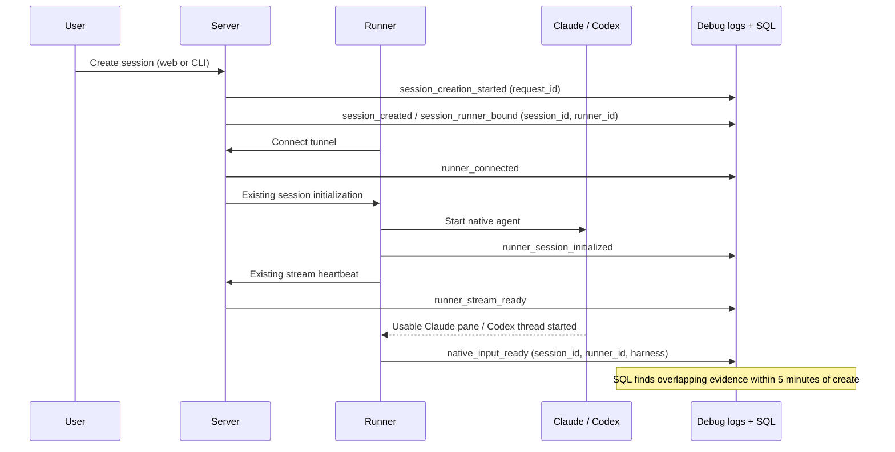

# Session creation debug events

The optional debug sink records lifecycle events using the existing `event_name`,
`session_id`, and `attributes` columns. No additional telemetry backend or table
schema is required. Ordinary logs inherit IDs from the active lifecycle scope;
explicit callsite IDs take precedence. The sink remains best effort.

## Correlation

- `attributes.request_id` is the server-generated HTTP request ID returned in
  `X-Request-Id`. It links a create request to its persisted session, including
  requests rejected before a session exists. It is not an end-to-end attempt ID.
- `session_id` links the session across requests and processes.
- `attributes.runner_id` identifies a runner generation. The runner reads its
  existing `OMNIGENT_RUNNER_ID`; the server and host bind known IDs around launch,
  initialization, connection callbacks, and relay tasks. No per-log store lookup.
- `attributes.host_request_id` is the host protocol's launch correlation ID. It
  is deliberately separate from the HTTP request ID.
- Runner session initialization and session-scoped HTTP requests override the
  primary-session fallback, so child-session work retains the child's ID.
  Host-wide logs outside a launch scope do not inherit a session or runner.

Context is copied into asyncio tasks and `asyncio.to_thread` workers. Threads
created by other mechanisms must bind their own context or pass explicit IDs.
The HTTP request ID does not automatically cross the runner tunnel. Join the
server and runner by session and runner IDs, never by request ID alone.

## Events

| Event | Producer | Meaning |
| --- | --- | --- |
| `session_creation_started` | Server | A request entered the create-session route, before validation. |
| `session_created` | Server | Persistence succeeded; links the create request to a session and any existing runner. |
| `session_creation_accepted` | Server | The create HTTP request succeeded. This is not runner readiness. |
| `session_creation_failed` | Server | The create request failed, including 4xx, cancellation, and errors after persistence. |
| `session_runner_bound` | Server | A runner binding was persisted. `operation` is `create`, `launch`, `replace`, or `bind`; none alone defines a new creation. |
| `session_runner_unbound` | Server | The runner binding was cleared; ends its SQL correlation interval. |
| `sandbox_launch_stage` / `sandbox_launch_failed` | Server | Managed provisioning progress; failures preserve the last known stage. Sandbox `ready` only means provisioning/connection finished. |
| `runner_launch_started` / `runner_spawned` | Host | Launch received / subprocess spawned. Neither proves connectivity. |
| `runner_launch_failed` | Server or host | Host refusal, spawn error, or launch acknowledgement failure. Recovery can still succeed. |
| `runner_died` | Host | Unexpected process exit, including before tunnel connection. |
| `runner_connected` | Server or runner | Runner tunnel connection observed. Also emitted on reconnect. |
| `runner_reconnect_callback_failed` | Runner | The reconnect callback failed; not a successful connection milestone. |
| `runner_connect_failed` | Server | Managed runner connection deadline expired. |
| `runner_session_init_started` / `runner_session_initialized` / `runner_session_init_failed` | Server or runner | Initialization request, successful response, or exception/non-success response. Cached server initialization does not emit another outcome. |
| `runner_stream_ready` | Server | The relay received its first heartbeat. Includes both session and runner IDs. |
| `terminal_started` / `terminal_start_failed` | Runner | Native terminal adapter completed / failed. A started terminal does not prove an interactive input prompt. |
| `native_input_starting` | Runner | A native terminal adapter is about to run; invalidates earlier input readiness for this session/runner. |
| `native_input_ready` | Runner | Claude's live pane shows usable chat input, or Codex's app-server thread is available and its bridge state is published. Includes `harness`. |
| `native_input_stopped` | Runner | Codex's thread forwarder is ending and its app-server is being torn down. |
| `terminal_exit_observed` / `terminal_close_requested` | Runner | Existing terminal lifecycle boundaries; native terminal exits/closes invalidate input readiness. Ignore superseded terminal exits. |
| `runner_disconnected` | Server | Current tunnel went away; invalidates initialization and relay evidence for that connection. |
| `runner_stream_connected` / `runner_stream_closed` | Server | Relay opened / ended; SQL uses these to bound the first-heartbeat readiness interval. |

Runner initialization outcomes also include the resolved `harness`.
Request completion includes `creation_kind=top_level|child|unknown`, `host_type`,
and HTTP status. Malformed requests that cannot be classified retain `unknown`.
Lifecycle failures include `stage` and, when available, `error_code`. Query event
types and outcomes rather than equating every ERROR with a failed creation.

## One creation-success metric

Count server-received **top-level create requests that become usable within five
minutes**, divided by eligible create requests. Use these rules:

1. Start with distinct `session_creation_started` request IDs, scoped to the
   deployment/workspace and instrumentation rollout. Left-join completion and
   `session_created` using that request ID. Do not start from successful spawns.
2. Exclude known child creations. Include unclassified/rejected requests in the
   conservative denominator; their missing session ID must not discard them.
3. Follow each request's session ID to its recorded runner bindings. Match
   milestones on **both session and runner ID**, within the create's five-minute
   window and the lifetime of that binding. Do not join all logs sharing either
   ID. A runner can host several sessions, and a session can replace its runner.
4. Require overlapping `runner_connected`, `runner_session_initialized`,
   `runner_stream_ready`, and `native_input_ready` evidence for the same binding.
   SQL derives tunnel and native lifecycle intervals from the events. Init and
   relay evidence must belong to the current connection; native input readiness
   can survive a reconnect until the terminal restarts or stops. Do not require
   every intermediate log or substitute `terminal_started`, HTTP 201, or a
   provisioning `ready` stage.
5. Reduce to one result per create request. Recovery within the deadline can
   succeed despite earlier diagnostic failures. Reconnects/resumes add no create
   request and cannot inflate the denominator. A new HTTP create request is a
   new observation; this contract does not invent client retry deduplication.
6. Evaluate only cohorts older than five minutes plus an ingestion allowance.
   Without readiness by the deadline, classify failure and show the recorded
   failure stage, or `readiness_timeout` when no explicit cause was observed.
   Late readiness does not rewrite the deadline result.

The portable Databricks query is in `session_creation_success.sql`. It keeps
requests without a session in the denominator, follows binding lifetimes, and
suppresses the percentage when an unsuccessful request has an explicit
measurement gap. It does not silently drop unsupported harnesses or mix the
old spawn-based denominator into the new series.

Pre-request CLI failures remain outside the server-received denominator.
Missing logs can resemble startup timeouts; validate delivery and version
coverage before interpreting this best-effort debug metric as reliability.

## Readiness implementation and coverage

There is no readiness endpoint, server observer, extra polling loop, or new
attempt ID. These are ordinary `logger.info` events delivered through the
existing optional debug sink. The server does not aggregate a ready event;
SQL combines the evidence using the existing session and runner IDs.



Readiness and initialization can arrive in either order. Claude's existing
terminal watcher checks the pane snapshot it already captured after checking
pane liveness. It logs once when the existing usable-input detector matches;
it does not run an extra tmux command, type into the terminal, accept dialogs,
or wait for a first user message. Ownership transfer installs a watcher for
the new session. Raw watcher threads pass the session ID explicitly; the sink
reads the process's runner ID from `OMNIGENT_RUNNER_ID`.

Codex's existing `thread/started` listener logs after publishing the discovered
thread's bridge state. A known-thread launch logs after successful thread
preload/resume and terminal registration. A native `/clear` thread switch emits
readiness with the replacement session ID after transferring its terminal and
bridge state. There is no extra JSON-RPC probe and
no wait for the first turn or transcript subscription. Codex can accept turns
while MCP startup finishes. This means its chat input path is available; it
does not prove that the terminal/browser has rendered a frame.

| Path | Coverage |
| --- | --- |
| Runner-owned Claude native, web and current CLI | Existing live-pane usable-input detector. |
| Runner-owned Codex native, web and current CLI | Existing native thread discovery or successful resume. |
| Other native providers and SDK/non-native harnesses | Outside this query's readiness coverage. Successful initialization with another harness is an explicit measurement gap. |
| Older runners or legacy CLI-owned native processes | No guaranteed readiness event; do not include these deployments in the new series. |

Unsupported harnesses remain visible as `unmeasurable_creations`; the query
returns NULL for the headline rate if any unsuccessful request in the cohort
has that gap. There is still only one creation percentage. Supporting another
harness later requires defining its positive input-ready signal first.

The query measures **became usable at least once before the deadline**, not
continued availability after that point. It ignores earlier diagnostic errors
if startup recovers in time. It retains connection history from `rollout_at`
because a shared runner may connect before the cohort starts; do not truncate
that history to the cohort window without carrying forward its state.

This is a best-effort log-derived metric. Lost events, clock skew between server
and runner, and overlapping lifecycle callbacks can make inferred intervals
inaccurate. Keep clocks synchronized and validate ingestion before cutover;
this is not a transactional availability guarantee. Roll out server and runner
changes together. Claude detection also depends on the deployed CLI's prompt
format. Neither signal guarantees a later model request will succeed.

## Verification

Run the focused suites:

```sh
uv run --no-sync pytest -q tests/test_debug_logging.py \
  tests/server/test_creation_logging.py tests/server/test_runner_session_init.py \
  tests/host/test_connect.py tests/runner/test_app_sessions_native_workflow_init.py \
  tests/server/routes/test_sessions_runner_relay.py \
  tests/test_session_creation_success_query.py tests/runner/test_resource_registry.py \
  tests/runner/test_app_sessions_native_terminals_runtime.py
```

With the debug sink configured, create a web session and a CLI session. Follow
`session_creation_started` → `session_created` → `session_runner_bound` using
request ID, then follow launch/init/relay events using session and runner IDs.
A rejected create must retain a start and failure event even without a session.
Try a host with an unconfigured harness: the refusal must include the same
session and runner IDs as its binding. Resume an existing session: there must
be no new creation-start event. Check a child session's logs carry its own
session ID while sharing the parent's runner ID.

Create fresh Claude and Codex sessions from both the web and CLI without
sending a message. Filter the debug table by their `session_id` and
`attributes['runner_id']`: expect `runner_session_initialized`,
`runner_stream_ready`, and `native_input_ready` (`harness=claude-native` or
`codex-native`). A sign-in/trust prompt or failed Codex thread discovery must
not produce native readiness. Reconnect the tunnel: init and relay should
refresh without another create request or a required native-ready re-emission.
Restart the native terminal: expect `native_input_starting` before its next
`native_input_ready`.

Run `session_creation_success.sql` with a deployment-scoped log table,
`workspace_id`, `rollout_at`, `cohort_start`, `cohort_end`, and `as_of`. Wait at
least seven minutes from the create (five-minute deadline plus example ingestion
grace). Expect one creation per HTTP request; a failed startup without recovery
by five minutes is unsuccessful. For request-level inspection, replace the final
SELECT as described in the SQL comments. The production dashboard has not been
updated by this PR. SQLite fixtures test the actual query joins with dialect
adaptations; validate the query in Databricks before dashboard cutover.

## Migration from message-based dashboards

The host spawn log is now emitted by `_handle_launch_impl`. Before rolling out,
update legacy launch queries to accept `event_name = 'runner_spawned'` as well
as the old `_handle_launch` message predicate. Prefer `attributes['runner_id']`
for the join, with message extraction only for older rows. This preserves the
old spawn-based series during the transition; it does not change its denominator
into server-received creates. Start the new creation series at the deployment
cutover after readiness and delivery coverage have been verified.
