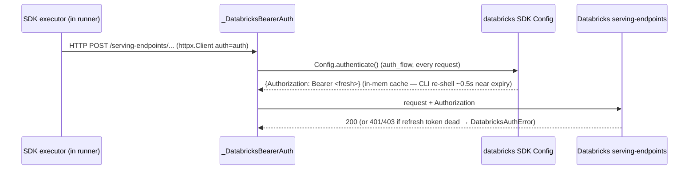
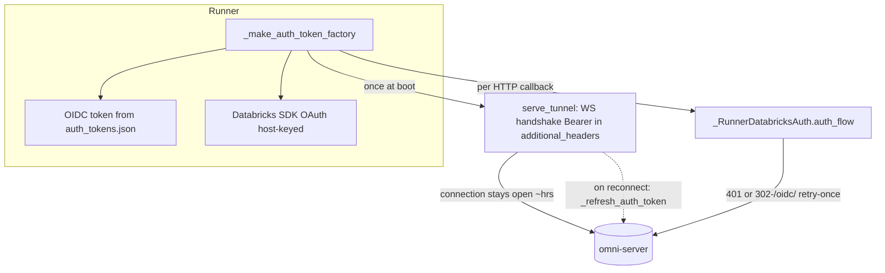
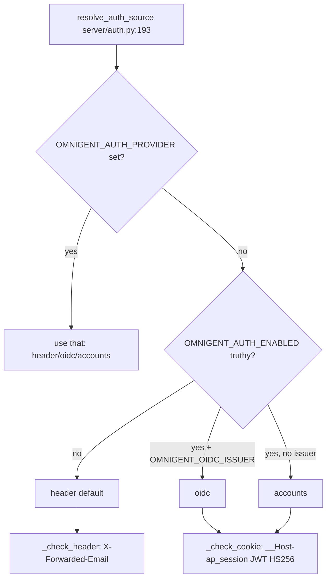
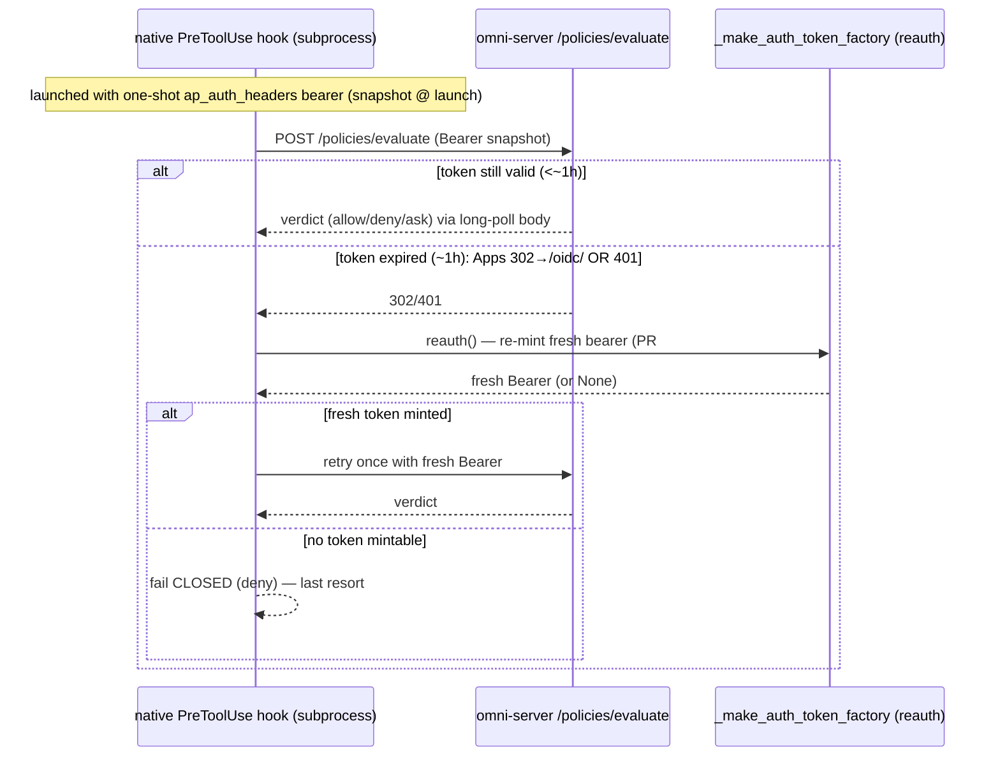

# Architecture — Auth, Credentials & Onboarding

> SME scope: the **three credential relationships** (LLM creds, Runner↔Server, Client↔Server),
> their refresh paths, first-run setup/onboarding, and the native policy-hook token snapshot.
> Source-of-truth = code (`file:line` anchors verified on branch `traces`, HEAD `60d11673`).
> Creds are mostly NOT visible as trace spans (they're HTTP header injection / SDK shell-outs),
> so this doc is code-grounded; trace evidence is limited to what's observable (§ Trace evidence).

---

## Overview

Omnigent has **three independent credential relationships**, each with its **own refresh path**:

1. **LLM creds** — how a harness authenticates to the model provider (Databricks AI gateway,
   Anthropic/OpenAI API key, Claude/Codex subscription, OpenAI-compatible base_url, Ollama).
2. **Runner ↔ Server** — how a runner subprocess authenticates its callbacks/tunnel to the
   Omnigent server (stored OIDC token OR Databricks OAuth).
3. **Client ↔ Server** — how a browser/TUI/CLI authenticates to the server
   (header / accounts / oidc; cookie `__Host-ap_session`; `omnigent login`).

A **fourth**, hook-specific path piggybacks on #2: the **native policy/permission hook** posts to
`/policies/evaluate` with a token snapshot — historically the source of the "fail-closed after ~1h"
bug, **fixed by PR #1439** (verified merged, commit `e9561916`).

```
                       ┌──────────────┐  (3) header / cookie / Bearer
        browser/TUI ──▶│  omni-server │◀──────────────────────────── omnigent login → auth_tokens.json
                       └──────┬───────┘
                  (2) WS tunnel handshake Bearer (once at open) + httpx callbacks (per-request refresh)
                              │
                       ┌──────▼───────┐
                       │  omni-runner │── (4) native policy hook → /policies/evaluate (snapshot+reauth)
                       └──────┬───────┘
                  (1) LLM creds: per-request httpx auth_flow (SDK) | shell auth_command @ interval (codex)
                              │
                       ┌──────▼───────────────────────┐
                       │  model provider (DBX gateway, │
                       │  Anthropic/OpenAI, Ollama)    │
                       └───────────────────────────────┘
```

---

## Key files (file:line)

### First-run setup / onboarding
- `omnigent/onboarding/wizard.py` — `run_wizard_and_launch()` **:1384** (3-step setup: server URL →
  LLM auth `_prompt_global_auth()` **:498** → default agent path); writes `~/.omnigent/config.yaml`
  via `_save_global_config()` **:1476**. `_list_databricks_profiles()` **:465** reads `~/.databrickscfg`.
- `omnigent/onboarding/ambient.py` — `detect_providers()` **:619** (ambient CLI/key detection, priority-ordered).
- `omnigent/onboarding/setup.py` — `_alias_profile(source, target)` **:190**; `_alias_source_for()` **:160**
  (Databricks same-host profile aliasing to reuse OAuth cache); config path `~/.databrickscfg`
  (or `DATABRICKS_CONFIG_FILE`) **:179**.
- `omnigent/onboarding/provider_config.py` — `_config_path()` **:473** (`OMNIGENT_CONFIG_HOME` or
  `~/.omnigent/config.yaml`); provider TYPES `_parse_provider()` **:748**; `default_provider_for_harness()` **:1126**.
- `omnigent/onboarding/providers/__init__.py` — MLflow catalog TTL `_CATALOG_TTL_SECONDS = 3600` **:102**;
  `_catalog_cache` **:103** (cachetools TTLCache, maxsize 64); `_fetch_provider_catalog()` **:134**.

### (1) LLM creds + refresh
- `omnigent/inner/databricks_executor.py` — `_DatabricksBearerAuth(httpx.Auth)` **:289**;
  `auth_flow()` **:367** (per-request); `current_token()` **:349**; `_authenticate_headers()` **:325**
  (calls SDK `Config.authenticate()`); `_resolve_databricks_auth()` **:384** (profile/host → auth+host);
  static PAT fallback **:472-481**; SDK-Databricks client wired `http_client=httpx.Client(auth=auth)` **:620**;
  static OpenAI api-key path **:608-610** (no refresh).
- `omnigent/inner/codex_executor.py` — `_GATEWAY_AUTH_REFRESH_MS = 900_000` **:60** (15 min);
  `_databricks_codex_auth_command()` **:730** (shell `databricks auth token --profile/--host [--force-refresh]`);
  `_databricks_codex_config_overrides()` **:763** (TOML `auth={command=sh,...,refresh_interval_ms=...}` **:794**).

### (2) Runner ↔ Server + refresh
- `omnigent/runner/_entry.py` — `_make_auth_token_factory()` **:271** (OIDC token first → Databricks SDK);
  `_RunnerDatabricksAuth(httpx.Auth)` **:162**, `auth_flow()` **:192** (per-request + retry on 401/302);
  `_is_login_redirect_or_unauthorized()` **:241**; tunnel run `_run_tunnel_from_env()` **:881** (token at **:891**).
- `omnigent/runner/transports/ws_tunnel/serve.py` — `serve_tunnel()` **:230** (reconnect loop `while True` **:283**,
  `_refresh_auth_token()` **:284**/**:375**); `_serve_tunnel_once()` **:494**, handshake headers **:539-540**,
  `websockets.connect(additional_headers=headers)` **:543-545**; 401 retry `_handle_refreshable_auth_failure()` **:407**.
- `omnigent/cli_auth.py` — `load_token()` **:166** (expiry check **:183**); `store_token()` **:84**;
  `store_databricks_auth()` **:109** (pointer record, no bearer); `load_databricks_workspace_host()` **:191**;
  `load_databricks_org_id()` **:207**; `databricks_request_headers()` **:229**; header
  `DATABRICKS_ORG_ID_HEADER = "X-Databricks-Org-Id"` **:226**; token file `auth_tokens.json` **:29**.

### (3) Client ↔ Server
- `omnigent/server/auth.py` — `resolve_auth_source()` **:193** (env → header/oidc/accounts);
  `UnifiedAuthProvider` **:250**; `get_user_id()` **:333**; `_check_cookie()` **:351** (JWT HS256, TTL cache, Bearer fallback);
  `_check_header()` **:415** (X-Forwarded-Email, strip-prefix, local fallback); `create_auth_provider()` **:461**;
  `login_url` property **:312**.
- `omnigent/cli.py` — `login()` **:12146** (probe `/v1/me` → accounts/oidc/databricks/header branches);
  `_databricks_login()` **:11924**; `_accounts_login()` **:12303**; OIDC ticket poll **:12262-12297**;
  `_CLI_LOGIN_TIMEOUT_SECONDS = 300` **:12300**.

### (4) Native policy-hook token (the bug + fix)
- `omnigent/native_policy_hook.py` (shared by codex-native + others) — `policy_hook_wrapper_script()` **:103**
  (one-shot token bake into `_AUTH_HEADERS_ENV`); `policy_hook_reauth()` **:133** (re-mint via
  `_make_auth_token_factory`); `_is_login_redirect_or_unauthorized()` **:171**; `post_evaluate_with_retry(..., reauth=)` **:440**,
  re-mint-and-retry-once branch **:500-522**; `fail_closed_hook_output()` **:383**.
- `omnigent/claude_native_hook.py` — imports `_is_login_redirect_or_unauthorized`, `fail_closed_hook_output` **:32-34**;
  `ap_auth_headers` snapshot reads **:261,307,645,717,836**; reauth+retry in `_post_*` **:545-580**.
- `omnigent/runner/app.py` — OpenCode policy plugin snapshot `OMNIGENT_POLICY_AUTH` **:1141-1149** (still one-shot →
  "degrades to fail-open" comment **:1142**); many `_make_auth_token_factory()` + `_RunnerDatabricksAuth` call sites
  for relays (**:2207,2398,2626,2764,3135,4290,5383**, etc. — all per-call fresh).

---

## Data flow

### (1) LLM creds — Databricks SDK harness (claude-sdk path)


### (1) LLM creds — Codex gateway (codex / codex-native)
Codex does NOT use httpx auth_flow. The Codex App Server is configured with a provider whose
`auth = {command="sh", args=["-c", <databricks auth token ...>], refresh_interval_ms=900000}`
(`codex_executor.py:763-798`). Codex itself re-runs the shell command on its **interval** (default
15 min, `_GATEWAY_AUTH_REFRESH_MS`) and on 401, minting a fresh bearer. When the workspace OAuth
refresh token is dead, `databricks auth token` returns empty → gateway returns **401/403** (this is
the current live state of the codex Databricks gateway token — expired/403).

### (2) Runner ↔ Server — two channels

- **HTTP callbacks** (agent-bundle GET, response lookups, file APIs, idle notify): `_RunnerDatabricksAuth.auth_flow`
  mints fresh per request and retries once on 401 **or** Apps `302→/oidc/` (`_entry.py:226-238`). ✅ survives ~1h OAuth.
- **WS tunnel**: Bearer is set **once** in the handshake `additional_headers` (`serve.py:540-545`). Inside the open
  socket, frames flow with **no per-message re-auth**. The token is only refreshed when the connection drops and the
  outer `while True` reconnect loop re-runs `_refresh_auth_token` (`serve.py:284`) + the 401-retry path (`serve.py:407`).

### (3) Client ↔ Server — provider selection

- **header** (default): reads `X-Forwarded-Email` (overridable `OMNIGENT_AUTH_HEADER`, e.g.
  `Cf-Access-Authenticated-User-Email`); optional `OMNIGENT_AUTH_HEADER_STRIP_PREFIX` (Google IAP). Missing header →
  401 (fail closed) **unless** `OMNIGENT_LOCAL_SINGLE_USER=1` → reserved `"local"` user.
- **accounts**: built-in user/pass → `/auth/login` → `__Host-ap_session` cookie (HS256). SPA login at `/login`.
- **oidc**: auth-code+PKCE against operator IdP → same cookie. Server-side `/auth/login` redirect.
- Cookie validated every request (`_check_cookie`), with a TTL credential cache keyed by HMAC digest of the token
  (`auth.py:387-411`); CLI clients send the JWT as `Authorization: Bearer` (fallback at `auth.py:380-383`).

### (4) Native policy-hook token — chat vs policy path (PR #1439)


---

## Channels & message/event types

| Relationship | Channel | Credential carried | Refresh trigger |
|---|---|---|---|
| LLM (SDK Databricks) | httpx → `/serving-endpoints` | `Authorization: Bearer` via `auth_flow` | every request (SDK in-mem cache) |
| LLM (codex gateway) | Codex App Server provider `auth.command` | bearer printed by `databricks auth token` | codex `refresh_interval_ms` (15 min) + 401 |
| LLM (api-key/subscription) | OpenAI-compatible / vendor CLI | static `api_key` / CLI-managed OAuth | none (vendor CLI self-manages subscription) |
| Runner↔Server (HTTP) | httpx callbacks over WS tunnel | `Authorization: Bearer` + `X-Databricks-Org-Id` | per request + retry on 401/302 |
| Runner↔Server (WS) | `websockets.connect` handshake | Bearer in `additional_headers` + `X-Databricks-Org-Id` + `Origin` sentinel | **once at open**; re-mint on reconnect only |
| Client↔Server (browser) | cookie `__Host-ap_session` | HS256 JWT (`sub` claim) | re-login on expiry (no bg refresh) |
| Client↔Server (CLI) | `Authorization: Bearer <jwt>` | same JWT from `auth_tokens.json` | re-login on expiry (no bg refresh) |
| Native policy hook | HTTP POST `/policies/evaluate` | `ap_auth_headers` snapshot bearer | re-mint on 401/302 (PR #1439), then fail-closed |

**Stored files:**
- `~/.omnigent/config.yaml` — `server`, `auth` block (`{type, profile/api_key/...}`), `providers`, `default_agent`.
- `~/.omnigent/auth_tokens.json` (`0o600`) — per-server entries: session token `{token, user_id, expires_at}`
  OR Databricks pointer `{auth_type:"databricks", workspace_host, org_id?, user_id?}`.
- `~/.databrickscfg` — Databricks CLI profiles (OAuth token cache is host-keyed → profile aliasing reuses it).
- `~/.claude/.credentials.json`, `~/.codex/auth.json`, `~/.codex/config.toml` — vendor subscription/config (ambient detection).
- `policy_hook.json` / wrapper script / `OMNIGENT_POLICY_AUTH` — one-shot hook token snapshot.

---

## Trace evidence

Credentials are HTTP-header injection and SDK shell-outs — they do **not** surface as dedicated spans.
What is observable in the Jaeger corpus:
- The `omni-runner` service emits spans for agent turns/tool calls (telemetry init `_entry.py:902`,
  `telemetry.init("omni-runner")`), which implies the runner's WS tunnel + httpx callbacks (auth-bearing) succeeded —
  i.e. (2) authenticated. A failed runner↔server auth would manifest as the runner never registering / no spans.
- `policy:` spans (OpenInference kind) appearing for a tool call (e.g. corpus
  `conv_63542a5f...` echo-via-`sys_os_shell` with MCP + policy spans) indicate the policy path reached the server with a
  valid token — i.e. (4) succeeded for SDK/runner. A native fail-closed event would NOT produce a successful policy-eval
  span; it surfaces as the hook's stderr "fail-closed" + a denied tool call.
- No spans are emitted for `Config.authenticate()`, `databricks auth token`, JWT decode, or cookie validation.
  (chat.db `PRAGMA`/`SELECT`/`connect` spans are noise per the rig notes — filter them.)

> Net: auth correctness is inferred from the *presence* of downstream spans (runner spans, policy spans,
> llm_call spans), not from auth spans themselves.

---

## Per-harness differences

| Aspect | claude-sdk | claude-native | codex | codex-native | Polly / custom |
|---|---|---|---|---|---|
| LLM cred mechanism | httpx `auth_flow` per request (DBX) OR api-key/subscription | vendor CLI manages (subscription) OR DBX via env | shell `auth_command` @ 15-min interval (gateway) | shell `auth_command` @ interval | inherits chosen harness (usually claude-sdk row) |
| LLM cred refresh | per-request (SDK) ✅ | vendor-managed | interval + 401 | interval + 401 | per chosen harness |
| Subscription-auth harness | yes (`_SUBSCRIPTION_AUTH_HARNESSES` omnigent.py:124) — won't inherit parent DBX profile | yes | yes | (not in that set) | per chosen harness |
| own-config propagation | n/a | `use_claude_config` → user `~/.claude` creds/MCP/hooks | inherits `~/.codex/config.toml` | inherits `~/.codex/config.toml` (live config shows DBX provider `/codex/v1`) | per chosen harness |
| policy-hook token | runner `_RunnerDatabricksAuth` (fresh per call) — no snapshot bug | one-shot snapshot + reauth (PR #1439, `claude_native_hook.py`) | runner relay (fresh per call) | one-shot snapshot + reauth (PR #1439, `native_policy_hook.py` via `codex_native_hook`) | per chosen harness |

**Polly / custom agents** have no credential path of their own. They run on a chosen harness (typically claude-sdk)
and inherit its LLM-cred + refresh behavior exactly. The agent spec's `executor.auth`
(`ApiKeyAuth` / `DatabricksAuth` / `ProviderAuth`, `spec/types.py:562-597`) selects the credential; runner↔server and
client↔server are unchanged.

---

## Failure branches & gaps

- ⚠️ **WS tunnel Bearer is injected once at open, no per-message refresh** (`serve.py:540-545`). The session survives the
  ~1h OAuth lifetime as long as the socket stays open (the connection itself isn't re-authenticated per frame).
  Refresh happens only on reconnect (`serve.py:284`) or on a 401 that drops the socket (`serve.py:407`). [§6 open: "survives token expiry?"]
  — In practice the long-lived WS connection is authenticated at handshake and the server doesn't re-check the bearer on
  every inbound frame, so an in-flight expiry doesn't break a live tunnel; the risk is at reconnect if creds went bad.
- ✅ **Native policy-hook fail-closed-after-1h bug — FIXED (PR #1439, merged `e9561916`).** Both `claude_native_hook.py`
  and `native_policy_hook.py` (codex-native) now re-mint via `_make_auth_token_factory` on 401 **or** Apps `302→/oidc/`
  and retry once before falling back to fail-closed. Fail-closed remains the **last resort** when no token can be minted
  (preserves the #163/#579 guarantee). The runner-side snapshot in `runner/app.py:1141-1149` (OpenCode plugin) is a
  **separate** path that still uses a one-shot token and "degrades to fail-open" — out of the claude/codex scope.
- ⚠️ **Static credentials never refresh**: api-key providers (`OPENAI_API_KEY` etc., `databricks_executor.py:608-610`),
  static Databricks PATs (`databricks_executor.py:472-481`), and the credential proxy's injected secrets
  (`inner/credential_proxy.py` — L7 MITM swap, no refresh). Expiry = hard failure.
- ⚠️ **Client tokens have no background refresh** (`cli_auth.py:166-188`): `load_token` returns None once `expires_at`
  passes → user must `omnigent login` again. Browser cookie likewise expires → 401 → login redirect.
- ⚠️ **Codex Databricks gateway token currently EXPIRED (403)** — a concrete live example of LLM-cred expiry. The shell
  `databricks auth token` can't refresh a dead workspace OAuth grant, so the gateway 403s. This is why codex/codex-native
  cannot be live-traced in this rig. (The local `~/.codex/config.toml` is pinned to a Databricks `/codex/v1` provider with
  a shell auth command; `~/.codex/auth.json` carries no OpenAI subscription — so the only path is the expired DBX gateway.)
- ⚠️ **Managed sandboxes broken under OIDC/accounts auth** (§6 🔴, issues #357/#1305/#1297): runner tunnel 403; host never
  boots. Auth-mode-specific failure, not a refresh bug.
- **Databricks SDK profile resolution**: explicit `profile` is fail-loud if unauthenticated (`databricks_executor.py:457-487`);
  a profile from `DATABRICKS_CONFIG_PROFILE` env falls back to the ambient chain with a warning (`:436-451`).

---

## Open questions

1. **WS tunnel mid-life expiry**: does the server re-validate the runner's handshake bearer on long-lived tunnels, or
   only at handshake? Code shows handshake-only; needs a runtime check (let a tunnel cross the 1h OAuth boundary without
   reconnecting and confirm frames still flow). [§6]
2. **OpenCode policy plugin snapshot** (`runner/app.py:1141-1149`) still degrades to **fail-open** after ~1h — did PR #1439
   only cover claude-native + codex-native, leaving OpenCode (out of scope) on the old behavior? (Comment at `:1142-1143`
   says "a refreshable token file is the follow-up.")
3. **Subscription vendor-CLI token expiry**: claude-native via `use_claude_config` relies on `~/.claude/.credentials.json` —
   what happens mid-turn when that subscription token lapses? (Vendor-managed; not in Omnigent's refresh paths.)
4. **Cookie TTL cache staleness**: `_check_cookie` caches the decoded user for the token's remaining lifetime
   (`auth.py:405-411`) — a revoked-but-unexpired JWT stays valid until `exp`. Acceptable? (No revocation list.)
