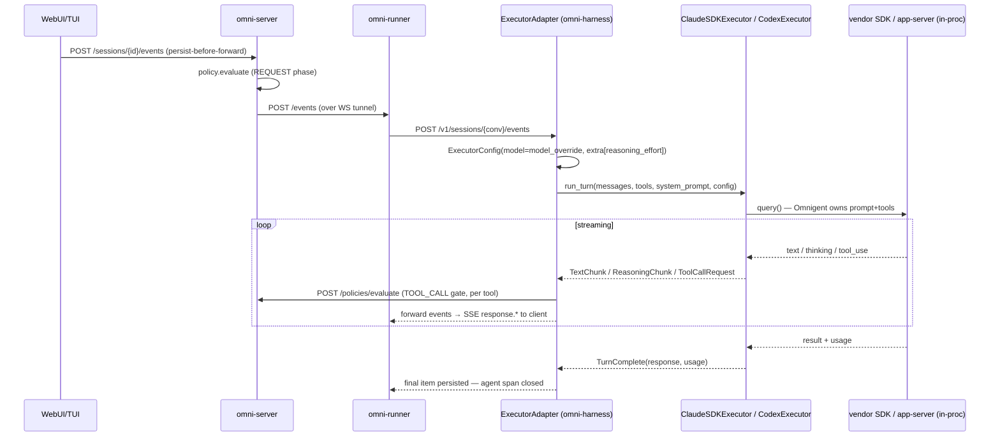
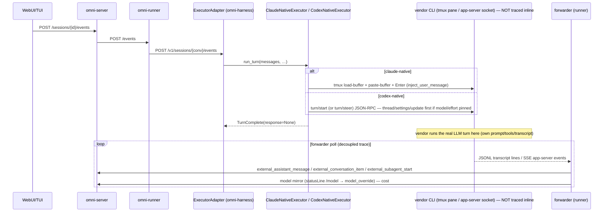
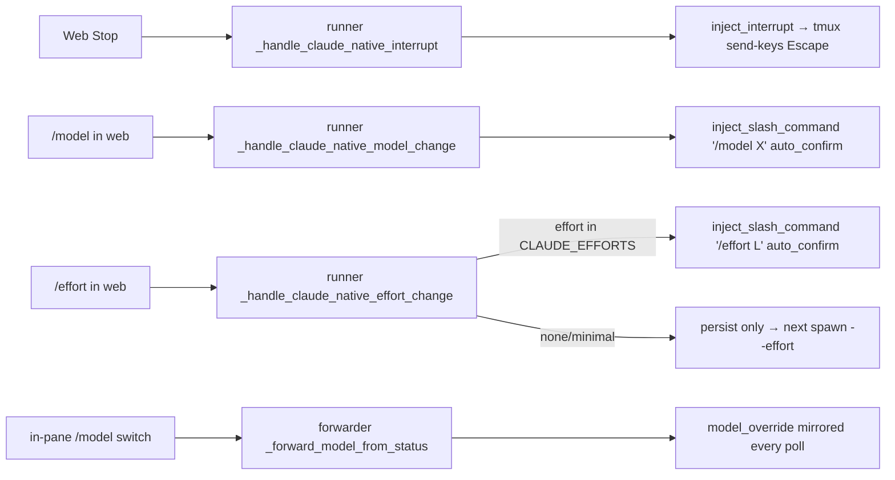

# Harness / Inner Layer — Architecture (claude-sdk · claude-native · codex · codex-native · polly)

> Scope: `omnigent/inner/` + the native harness modules. In scope ONLY: **claude-sdk,
> claude-native, codex, codex-native, and polly** (a custom agent that runs its brain on
> claude-sdk and delegates to claude-native + codex-native workers). Every mechanism is
> anchored to `file:line` in the merged `traces` worktree. Trace evidence is from the
> saved corpus (claude-sdk `conv_b4f2faed…`, native `conv_d0ddd6b3…`). **codex / codex-native
> have no live trace — creds expired (403); covered from code + structural analogy.**

---

## 1. Overview

An **Executor** is the seam that translates Omnigent's abstract turn model
(`Message` in / `ExecutorEvent` stream out) into a concrete LLM backend or agent harness.
There are two families, and the split explains almost every behavioral difference:

- **SDK harnesses (in-process agent loop).** Omnigent owns the prompt, the tool set, and
  the turn loop. The executor runs the vendor SDK *inside the harness subprocess*, streams
  text/reasoning/tool events back, and Omnigent owns 100% of the transcript. In scope:
  **claude-sdk** (`ClaudeSDKExecutor`), **codex** (`CodexExecutor`). Polly's brain runs here.
- **Native harnesses (resident vendor CLI mirrored back).** A real vendor CLI/TUI runs
  in a **tmux pane** (claude-native) or behind a **JSON-RPC app-server socket** (codex-native).
  The *vendor* owns the system prompt + tool set + transcript; Omnigent only **injects the
  latest user message** and **mirrors** the vendor's transcript back as durable items via a
  forwarder. In scope: **claude-native** (`ClaudeNativeExecutor`), **codex-native**
  (`CodexNativeExecutor`).

The base class is `omnigent/inner/executor.py:518` (`Executor`). Capability methods all
**default OFF** except `supports_tool_calling()` (`executor.py:544` → `True`):
`supports_streaming` (`:541` → False), `handles_tools_internally` (`:547` → False),
`max_context_tokens` (`:557` → None), `interrupt_session` (`:569` → False),
`enqueue_session_message` (`:573` → False), `supports_live_message_queue` (`:577` → False),
`supports_tool_boundary_interrupt` (`:581` → False), `supports_stepwise_internal_turns`
(`:585` → False). Each harness overrides only what it actually supports — so reading the
matrix means reading the *overrides*, not the base.

---

## 2. Key files (file:line)

**Base contract**
- `omnigent/inner/executor.py:70` — `ExecutorConfig` (`model`, `temperature`, `max_tokens`,
  `extra` — `extra["reasoning_effort"]` / `extra["model_override"]` ride here).
- `omnigent/inner/executor.py:96-261` — `ExecutorEvent` hierarchy: `TextChunk` (:101),
  `ReasoningChunk` (:113), `ToolCallRequest` (:133), `TurnComplete` (:149),
  `ToolCallComplete` (:185), `CompactionComplete` (:213), `TurnCancelled` (:236),
  `ExecutorError` (:244).
- `omnigent/inner/executor.py:518-596` — `Executor` ABC + capability defaults.
- `omnigent/inner/tracing.py:104` — `TracingContext`; emits `agent:<name>` (AGENT, :130),
  `llm_call` (LLM, :223), `tool:<name>` (TOOL, :270), `policy:<name>` (GUARDRAIL, :319).
  Stamps `session.id` on every span (the cross-trace grouping key).

**SDK executors**
- `omnigent/inner/claude_sdk_executor.py` — `ClaudeSDKExecutor`. Caps: streaming `:1605`,
  tool-calling `:1608`, `handles_tools_internally` `:1611`, `supports_live_message_queue`
  `:1614`, `supports_tool_boundary_interrupt` `:1617`, `max_context_tokens` `:1620` (None).
  `interrupt_session` `:1477` (SDK `client.interrupt()`), `enqueue_session_message` `:1509`
  (`client.query`). Model: per-turn `:1910` (`cfg.model or self._model_override or
  _DATABRICKS_CLAUDE_DEFAULT_MODEL`), mid-session swap `set_model()` `:1422`. Effort `:2011`
  (`extra["reasoning_effort"]` → SDK `effort`). Reasoning emitted `:2225/:2266/:2318`.
  Compaction `:2540` (emits `CompactionComplete` with `compacted_messages`).
- `omnigent/inner/codex_executor.py` — `CodexExecutor`. Caps: streaming `:2231`, tool-calling
  `:2234`, `handles_tools_internally` `:2237`, `supports_live_message_queue` `:2240`.
  `interrupt_session` `:2243` (`turn/interrupt`), `enqueue_session_message` `:2276`.
  Model: per-turn `:2334` (`cfg.model or self._model_override or _OPENAI_CODEX_DEFAULT_MODEL`
  / `_DATABRICKS_CODEX_DEFAULT_MODEL`). **Model is part of the session signature `:2346`** →
  a model change closes the app-session and starts a fresh thread. Effort `:2353`, applied via
  `thread/settings/update` `:1464`, reset `self._applied_effort=None` on fresh thread `:1450`.
  Approval **hardcoded `"approvalPolicy": "never"` `:1427`** (no executor elicitation).
  Subagents = private per-conversation `CODEX_HOME` `:1186/:1202/:1230`. Reasoning `:1663`.

**Native executors**
- `omnigent/inner/claude_native_executor.py:32` — `ClaudeNativeExecutor`. Overrides ONLY
  `supports_streaming`→False `:64` and `supports_live_message_queue`→True `:68`.
  `run_turn` `:99` injects latest user text via `inject_user_message` (tmux) `:143` then yields
  `TurnComplete(response=None)`. `enqueue_session_message` `:72`. **No `interrupt_session`,
  no model/effort** — `config` is `del`'d (`:123`). Interrupt + model/effort are wired
  *elsewhere* (bridge + runner routes + forwarder).
- `omnigent/inner/codex_native_executor.py:37` — `CodexNativeExecutor`. `supports_streaming`
  →False `:60`, `supports_live_message_queue`→True `:64`. **Has `interrupt_session` `:116`**
  (`turn/interrupt` RPC). **Has model+effort** via `thread/settings/update` before `turn/start`
  (`_model_effort_overrides` `:266`, applied `:237`). `run_turn` `:145` does
  `turn/steer` (active turn) vs `turn/start` (idle), persists `active_turn_id`.
- `omnigent/native_server_harness.py:45` — `NativeServerHarness` (shared base for
  *opencode-native*, out of scope; codex-native uses its own executor). `handles_tools_internally`
  →True `:89`, interrupt via `transport.abort` `:153`.

**Native bridges / forwarders / routing**
- `omnigent/claude_native_bridge.py` — `inject_user_message` (tmux load-buffer/paste-buffer
  `:2465-2503`), **`inject_interrupt` `:2530` (sends `Escape` via tmux send-keys `:2556`)**,
  `kill_session` `:2559` (hard stop), `inject_slash_command` `:2597` (types `/effort`/`/model`,
  `auto_confirm` for TUI dialog).
- `omnigent/claude_native_forwarder.py` — polls Claude's JSONL transcript; mirrors items,
  cost, subagents. `_forward_model_from_status` `:948` mirrors the live statusLine `/model`
  switch → `model_override` every poll; effort sync `:2981`; subagent glob
  `agent-*.meta.json` `:217` → `_post_external_subagent_start` `:1115` → `external_subagent_start`
  event `:1150`.
- `omnigent/codex_native_forwarder.py` — subscribes to the app-server; subagent detection
  `_thread_started_is_subagent` `:6079` (`source.subAgent.thread_spawn` `:4310`) →
  `external_codex_subagent_start` `:130/:4304`.
- `omnigent/runner/app.py` — control routes: `_handle_claude_native_interrupt` `:~10465`
  → `inject_interrupt` `:10518`; `_handle_claude_native_effort_change` `:~11470` (`/effort`,
  only if in `CLAUDE_EFFORTS` `:11521`); `_handle_claude_native_model_change` `:11558` (`/model`);
  `_handle_codex_native_interrupt` `:10596` (`turn/interrupt`);
  `_handle_codex_native_settings_update` `:10664` (`thread/settings/update`).

**Wiring / metadata**
- `omnigent/runtime/harnesses/__init__.py:37/41/43/46` — harness→module map
  (claude-sdk→`claude_sdk_harness`, claude-native→`claude_native_harness`,
  codex→`codex_harness`, codex-native→`codex_native_harness`).
- `omnigent/runtime/harnesses/_executor_adapter.py:284` — `ExecutorConfig(model=
  request.model_override, …)`; installs stable `_tool_executor` `:300`, `_elicitation_handler`
  `:307`, `_policy_evaluator` `:314` on the SDK executor; run loop `:394`; interrupt routing
  `:407` (between-events) + `:498` (`_handle_interrupt_event` → `executor.interrupt_session`).
- `omnigent/inner/claude_sdk_harness.py:274` — builds `ClaudeSDKExecutor` from `HARNESS_*` env
  (model, gateway, permission-mode, os_env, retry, skills, bundle).
- `omnigent/harness_aliases.py:9` (`claude`→`claude-sdk`), `:53` (`NATIVE_HARNESSES`),
  `:119` (`native_terminal_name`).
- `omnigent/native_coding_agents.py:47/57` — `claude-native-ui` / `codex-native-ui` metadata
  (wrapper labels, terminal names, subagent wrapper labels).
- `omnigent/reasoning_effort.py:13/15` — `CLAUDE_EFFORTS={low,medium,high,xhigh,max}`,
  `CODEX_EFFORTS={none,minimal,low,medium,high,xhigh}`.

---

## 3. Data flow

### 3.1 SDK harness turn (claude-sdk / codex) — in-process loop



The LLM work happens **inside** `omni-harness POST /events` (the long span). Tools the model
calls go back out as MCP round-trips; each is gated by a `POST /policies/evaluate` (TOOL_CALL
phase). Reasoning is streamed live as `ReasoningChunk` and **recomputed** next turn (not
persisted — claude-sdk excludes thinking blocks from `compacted_messages`).

### 3.2 Native harness turn (claude-native / codex-native) — inject + mirror



The harness `POST /events` span is just the **injection + wait** (in the native corpus it
ran 9594 ms while the vendor thought). The vendor's actual turn is a **separate async boundary
not stitched into the trace** — correlated only by `session.id` (OBSERVABILITY §12). Tool
policy gating is the **separate PreToolUse HTTP hook**, not an in-turn `policies/evaluate`.

### 3.3 Native interrupt / model / effort (claude-native) — out-of-band control



claude-native control is **not** done through the executor (it returns immediately). The web
Stop and the `/model` `/effort` pickers reach **runner routes** that drive the **bridge**
(Escape / slash-command keystrokes into tmux). The forwarder mirrors an *in-pane* switch back.
codex-native instead routes those to **JSON-RPC** (`turn/interrupt`, `thread/settings/update`).

---

## 4. Channels & message/event types

| Boundary | claude-sdk / codex (SDK) | claude-native | codex-native |
|---|---|---|---|
| Turn delivery | in-proc SDK `query()` | tmux `load-buffer`+`paste-buffer`+`Enter` | JSON-RPC `turn/start` / `turn/steer` |
| Mid-turn steer | SDK `client.query()` (`enqueue`) | tmux `inject_user_message` | RPC `turn/steer` (expectedTurnId) |
| Interrupt | SDK `client.interrupt()` (executor) | tmux `Escape` (bridge, via runner route) | RPC `turn/interrupt` (executor + runner route) |
| Model change | `cfg.model` per turn → `set_model()` | `/model` slash-inject + statusLine mirror | RPC `thread/settings/update` |
| Effort change | `extra[reasoning_effort]` → SDK `effort` | `/effort` slash-inject (CLAUDE_EFFORTS only) | RPC `thread/settings/update` (effort) |
| Output | streamed `ExecutorEvent`s → SSE `response.*` | forwarder → `external_*` events | forwarder → `external_*` events |
| Transcript owner | Omnigent (100%) | Claude Code `~/.claude/projects/**.jsonl` (mirrored) | Codex rollout `$CODEX_HOME/sessions/**.jsonl` (mirrored) |
| Tool/policy gate | in-turn `POST /policies/evaluate` (TOOL_CALL) | PreToolUse + PermissionRequest HTTP hook (long-poll) | `codex-elicitation-request` hook (long-poll) |
| Subagents | `mcp__omnigent__sys_session_*` (MCP bridge) | `subagents/agent-*.meta.json` → `external_subagent_start` | `source.subAgent.thread_spawn` → `external_codex_subagent_start` |

Common executor events: `TextChunk`, `ReasoningChunk{event_type∈{reasoning_started,
reasoning_text,reasoning_summary}}`, `ToolCallRequest`, `ToolCallComplete`, `TurnComplete{response,
usage,continue_turn}`, `CompactionComplete{compacted_messages}`, `TurnCancelled`, `ExecutorError`.
Native forwarder events (server-bound): `external_assistant_message`, `external_conversation_item`,
`external_subagent_start` / `external_codex_subagent_start`, `external_model_change`, model/cost
mirrors.

---

## 5. Trace evidence (concrete spans seen)

**SDK turn** — trace `ecee1765…` (`conv_b4f2faed…`, claude-sdk), services
{omni-server, omni-runner, omni-harness}:

```
omni-server  POST /v1/sessions/{session_id}/events  (26ms)
  omni-server  policy.evaluate                       (REQUEST phase, server)
  omni-server  POST → omni-runner POST /v1/sessions/{conv}/events
      omni-runner GET → omni-server GET /items, GET /sessions/{id}   (history pull)
      omni-runner POST → omni-harness POST /v1/sessions/{conv}/events  (2418ms = the LLM turn)
      omni-runner POST → omni-server POST /v1/sessions/{id}/policies/evaluate  (×N TOOL_CALL gates)
        omni-server  policy.evaluate
      omni-runner POST → omni-harness POST /events  (tool result fed back, loop)
```
The agent/LLM/tool/`policy:` OpenInference spans (`agent:claude-sdk`, `llm_call`, `tool:*`)
appear as **response-id-seeded single-span roots** (`f7659fd7…`, `5bc4eb32…`) — decoupled per
OBSERVABILITY §5.2, grouped by `session.id`. The defining SDK signature is the **repeated
in-turn `policies/evaluate` + the multi-second harness `POST /events`** carrying the loop.

**Native turn** — trace `007a5174…` (`conv_d0ddd6b3…`, actually **codex-native** — its agent
span is `agent:codex`, `agent.name=codex`, `llm.model_name=codex`), same services:

```
omni-server  POST /v1/sessions/{session_id}/events  (21ms)
  omni-server  policy.evaluate                       (REQUEST phase only — ONE)
  omni-server  POST → omni-runner POST /events
      omni-runner GET → omni-server GET /items, /sessions/{id}
      omni-runner POST → omni-harness POST /events  (9594ms = inject + WAIT for the pane/RPC)
  omni-server  POST /events http send (×3)
```
Across the **entire** native conv: exactly **1 `policy.evaluate`** and **1 `agent:codex`** span,
**zero `tool:` / `llm_call` / per-tool `policies/evaluate`**. The contrast is the proof of the
taxonomy: the SDK loop is *inside* the traced harness turn; the native vendor turn is *outside*
the trace (its own decoupled boundary, only `session.id`-correlated). The harness `POST /events`
is pure injection latency, not the model thinking.

> Note: the BRIEF labelled `conv_d0ddd6b3…` "claude-native," but its agent span is `agent:codex`
> — it is a **codex-native** session. The structural SDK-vs-native contrast is identical either
> way, and no live codex trace could be regenerated (creds 403).

---

## 6. Per-harness differences (summary; full matrix in cuj-answers/harness-behavior.md)

- **claude-sdk** — full in-process Claude Agent SDK. Streams text+reasoning, runs its own
  tool loop, all caps ✅. Mid-session model via `set_model()`; effort {low..max}. Bug #1128
  lives here (`:1910` Opus-4.8 fallback when model is None on Databricks-profile gateway).
- **codex** — in-process Codex app-server. Streams, own loop, interrupt+queue ✅. **No
  executor elicitation** (`approvalPolicy:"never"`). **Mid-session model resets the thread**
  (model in the session signature); effort resets at session. Subagents = `CODEX_HOME` isolation.
- **claude-native** — resident Claude Code in tmux. Executor only injects + yields
  `TurnComplete(None)`. Interrupt = bridge `Escape`; model/effort = slash-inject + statusLine
  mirror; subagents = transcript `subagents/` glob → `external_subagent_start`. Strongest
  own-config propagation: `use_claude_config` passes through `~/.claude/**`.
- **codex-native** — resident Codex behind a JSON-RPC app-server. Executor has real
  interrupt (`turn/interrupt`), model+effort (`thread/settings/update`). Subagents =
  `source.subAgent.thread_spawn` → `external_codex_subagent_start`. Inherits `~/.codex/config.toml`
  + `auth.json` (CODEX_HOME source resolver); omni `--model` overrides.
- **polly** — a custom agent (`examples/polly/config.yaml`), `executor.config.harness:
  claude-sdk`, no model pinned → catalog default `claude-opus-4-8`. `spawn: true` +
  `tools.agents` give it `sys_session_create`. Writes no code; delegates to **claude_code
  (claude-native)**, **codex (codex-native)**, **pi (out of scope)**. Brain inherits the
  claude-sdk row exactly; it is the concrete example tying all in-scope harnesses together.

---

## 7. Failure branches & gaps

- **Bug #1128 (CONFIRMED, claude-sdk)** — `claude_sdk_executor.py:1910-1912` falls back to
  `_DATABRICKS_CLAUDE_DEFAULT_MODEL = "databricks-claude-opus-4-8"` (databricks_config.py:85)
  when `cfg.model` is None on the Databricks-profile gateway → bills Opus when Sonnet was
  intended. Frontend PRs #1570/#1563 do NOT fix it; real fix #1146.
- **Native interrupt is NOT a gap** — claude-sdk/codex via `executor.interrupt_session()`;
  claude-native via bridge `inject_interrupt` (Escape, runner route); codex-native via
  `turn/interrupt`. The first analysis pass mis-marked claude-native ❌ by conflating "the
  executor method exists" with "the web Stop works." Corrected: ✅ for all four.
- **Native model override may not affect the *running* turn** — claude-native `/model` only
  takes after the in-flight generation; codex-native `thread/settings/update` applies to the
  next turn; codex (SDK) model change *closes the thread*. SDK `set_model()` is also next-turn.
- **codex (SDK) elicitation** — base ❌ at the executor (`approvalPolicy:"never"`). codex-native
  elicitation is ✅ (forwarder hook). Don't conflate the two codex rows.
- **claude-native `/effort` partial** — `none`/`minimal` are *not* in `CLAUDE_EFFORTS`, so the
  runner skips the slash-inject and only persists them (`runner/app.py:11521`) → no live effect.
- **Native turn is invisible to inline tracing** — vendor work is a decoupled async boundary;
  only `session.id` ties it to the request trace. Tool gating happens via the PreToolUse HTTP
  hook (separate trace), so a native conv shows no in-turn `tool:`/`policies/evaluate` spans.
- **CompactionComplete divergence** — claude-sdk DOES export `compacted_messages` (from the
  SDK's `get_session_messages()`, `:2540`), contradicting the base docstring that says
  claude-sdk "cannot export its compacted state." codex (SDK) does **not** emit
  `CompactionComplete` at all. Native compaction is the vendor's, mirrored as a status event.

---

## 8. Open questions

- Does claude-native's statusLine `/model` mirror ever disagree with the persisted
  `model_override` after a *web* `/model` change races an *in-pane* one? (Two writers,
  best-effort each poll.)
- codex (SDK) "subagents" via `CODEX_HOME` isolation — do child Codex sessions actually
  surface as Omnigent child sessions, or only avoid polluting the user's history? (codex-*native*
  clearly mirrors children via `external_codex_subagent_start`; the SDK path looks like
  isolation-only.)
- Confirm whether codex-native effort, like codex-SDK, resets across a vendor `/clear`
  (thread rotation) vs persists in `thread/settings/update`.
