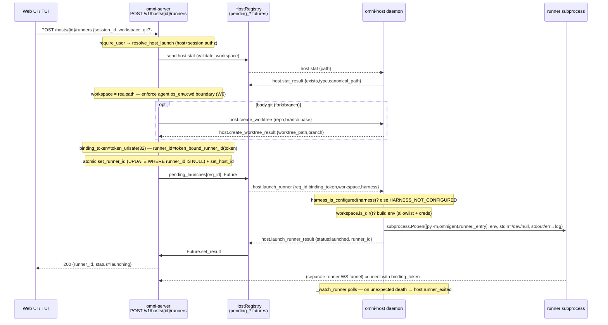

# Host Daemon (`omnigent host`) — Architecture

> Scope: the host daemon control plane. Ground truth = code; line numbers verified
> against the `traces` worktree on 2026-06-30. Trace evidence from local Jaeger
> (`omni-host` + `omni-server`, the `<no-session>` control-plane traces).

## 1. Overview — what the host daemon IS

`omnigent host` is a **long-lived foreground daemon that registers one physical machine
("host") with an Omnigent server** and lets the server do two things on that machine:

1. **Spawn / stop runner subprocesses** (`omnigent.runner._entry`) — one runner per
   session, with the session's workspace as cwd.
2. **Browse + mutate the host filesystem** (stat / list_dir / create_dir /
   create_worktree / remove_worktree) so the Web UI workspace picker and the
   managed-sandbox/worktree session-create flows can validate and prepare a workspace
   *before any runner exists*.

Key property: the **host tunnel carries only JSON control frames — never HTTP traffic**
(`frames.py:5-11`, `host_registry.py:9-11`). Runners that the host spawns open *their
own* separate WS tunnels back to the server for HTTP request/response. The host daemon
is purely a control + filesystem agent for the machine.

The daemon is the **single trust boundary for the host owner's machine**: it runs as the
user, holds the user's personal secrets, and deliberately strips almost all of them
before spawning a runner (allowlist, §7). It owns `~` expansion (only the host knows its
own `$HOME`; the server never expands tildes — `frames.py:208-213`).

### Direction of the tunnel
The **host dials out** to the server over WebSocket (`connect.py:1378` client connect to
`wss://<server>/v1/hosts/{host_id}/tunnel`). This is outbound-only so a laptop behind NAT
needs no inbound ports. Once open, the **server drives** by pushing request frames; the
host answers with result frames.

## 2. Key files (file:line)

| File | Role |
|---|---|
| `omnigent/host/frames.py` | Frame schema: `HostFrameKind` enum (`:37-55`), 16 frame dataclasses, `encode_host_frame`/`decode_host_frame`, and `_encode_payload` (`:500-521`) which injects `traceparent` + records payload on every encode. |
| `omnigent/host/connect.py` | The daemon: `HostProcess` (`:537`), reconnect loop `run` (`:1269`), `_connect_and_serve` (`:1367`), `_serve_frames` hello+recv loop (`:1462`), `_handle_raw_message` (consumer span, `:1513`), `_dispatch_host_frame` (`:1556`), per-frame handlers, spawn-env builder `_build_runner_env` (`:410`), allowlist `_RUNNER_ENV_ALLOWLIST` (`:203`), `HARNESS_CREDENTIAL_ENV_VARS` (`:352`), entry `run_host_process` (`:1585`). |
| `omnigent/host/identity.py` | `HostIdentity`, `load_or_create_host_identity` (config.yaml `host:` section), `HOST_TOKEN_ENV_VAR="OMNIGENT_HOST_TOKEN"` (`:27`), `MANAGED_HOST_TOKEN_HEADER="X-Omnigent-Host-Token"` (`:36`). |
| `omnigent/host/git_worktree.py` | `create_worktree` / `remove_worktree` / `validate_branch_name` (run in a thread off the event loop). |
| `omnigent/server/routes/host_tunnel.py` | Server WS endpoint `/hosts/{host_id}/tunnel` (`:120`): pre-accept auth, hello validation, register, `_sender_loop`/`_receive_loop`/`_ping_loop`. |
| `omnigent/server/host_registry.py` | `HostRegistry` (in-memory, per-replica), `HostConnection` with the `pending_*` future maps (`:197-217`), `RunnerExitReports` TTL store (`:55`). |
| `omnigent/server/routes/hosts.py` | REST producers: `POST /hosts/{id}/runners` (`launch_runner`, `:405`), `GET /hosts/{id}/filesystem[/{path}]` (`:668,:706`), `POST /hosts/{id}/directories` (`:836`). |
| `omnigent/server/routes/_workspace_validation.py` | `validate_workspace` → sends `host.stat` (`:101`), realpath canonicalization + agent `os_env.cwd` boundary check. |
| `omnigent/server/routes/_host_worktree.py` | `create_worktree_on_host` / `remove_worktree_on_host` proxies. |
| `omnigent/server/routes/sessions.py` | `POST /v1/sessions` host-launch path (`:6060,:6089`), stop-runner (`:7945`), fork/resume re-launch (`:13893`). |
| `omnigent/runtime/telemetry.py` | `inject_trace_context` (`:689`), `extract_trace_context` (`:713`), `consume_frame_span` (`:734`), `record_message_payload` (`:176`), `init("omni-host")` (`:1072`). |
| `omnigent/cli.py` | `omnigent host` group (`:6645`) → `run_host_process`. |

## 3. Lifecycle (HELLO reconciliation)

`run_host_process` (`connect.py:1585`) → `telemetry.init("omni-host")` →
`load_or_create_host_identity` → `HostProcess.run()` reconnect loop.

Per connection (`_connect_and_serve`, `:1367` → `_serve_frames`, `:1462`):

1. Dial `wss://server/v1/hosts/{host_id}/tunnel` with auth headers (§8).
2. On a clean upgrade set `_ever_connected=True`, reset `_login_redirect_streak`.
3. Send **`host.hello`** (`:1475-1486`):
   - `version="0.1.0"`, `frame_protocol_version=1`
   - `name` (from config.yaml)
   - **`runners`** = `_alive_runner_ids()` — IDs of runner subprocesses still alive
     on this host. **This is the reconciliation key**: the server diffs it against
     sessions in the DB to detect runners that died while the tunnel was down
     (`frames.py:70-73`).
   - **`configured_harnesses`** = `configured_harness_map()` computed off the event
     loop (probes PATH via `shutil.which` + reads config.yaml). Per-harness readiness,
     e.g. `{"claude-sdk": True, "codex": False}`. Recomputed on **every (re)connect**;
     `None` means "unknown" (older host) and must NOT be read as "nothing configured"
     (`frames.py:74-80`).
4. **Flush queued runner-exit reports** that raced a disconnect (`_unreported_exits`,
   `:1491-1493`) — so a runner that crashed while the tunnel was down is still reported
   to the server after reconnect.
5. Print the `✓ Connected as ...` banner.
6. Enter `recv()` loop (60s timeout heartbeat-only).

Server side (`host_tunnel.py:120-332`): authenticate **before** `accept()` →
`accept()` → receive `host.hello` → validate `frame_protocol_version` (strict-major,
`SUPPORTED_FRAME_PROTOCOL_MAJOR=1`; mismatch closes 4002) → `host_store.upsert_on_connect`
(DB `hosts` table, cross-replica, carrying `configured_harnesses`) → `host_registry.register`
(in-memory) → start sender/ping/receive tasks → fire `on_host_connect` reconcile callback
(30s timeout). On disconnect: `deregister` + `host_store.set_offline` + `on_host_disconnect`.

**Reconnect policy** (`run`, `:1269-1345`): exponential backoff (0.5s base → 10s cap, 0.5
jitter). Explicit recycle codes (`1012`/`service restart`/`1001`/`going away`) and — on a
**remote** server only — abrupt `no close frame`/`502` (Databricks Apps ingress recycling a
live WS) → prompt 0.5s reconnect so no `launch_runner` frame is dropped. On **loopback**
an abrupt drop is real (re-registration flap) → normal backoff. `HostConnectError` (fatal
auth/authorization/version) is re-raised, not retried → process exits non-zero.

**Liveness** (`host_tunnel.py:_ping_loop`, `:552`): server pings every 30s; each tick also
writes `host_store.heartbeat` so the DB last-seen stays fresh (freshness gate keeps the
host in the online set even if `set_offline` never ran on a hard crash). 3 missed
intervals (~90s) → close 4003 "ping timeout". The host answers server `PingFrame`s with
`PongFrame`s inline (`connect.py:1536-1537`).

## 4. The host↔server channel — JSON control frames (NOT HTTP)

One WS socket, **two multiplexed frame families**: host frames (`host.*`, decoded by
`decode_host_frame`) and runner-tunnel keepalive frames (`ping`/`pong`, decoded by
`decode_frame`). The receiver tries host-decode first, falls back to runner-decode
(`connect.py:1527-1538`, `host_tunnel.py:399-431`). Wire format is **JSON text frames**.

### Frame catalogue (every kind, pairing, direction)

| Kind (`HostFrameKind`) | Direction | Pairs with | Purpose |
|---|---|---|---|
| `host.hello` | **host→server** | (none) | First frame; version, name, live `runners`, `configured_harnesses`. Reconciliation. |
| `host.launch_runner` | **server→host** | `host.launch_runner_result` | Spawn a runner (binding_token, workspace, harness). |
| `host.launch_runner_result` | host→server | `host.launch_runner` | `status` launched/failed, `runner_id`, `error`, `error_code`. |
| `host.stop_runner` | **server→host** | `host.stop_runner_result` | Terminate a runner by id. |
| `host.stop_runner_result` | host→server | `host.stop_runner` | `status` stopped/failed. |
| `host.runner_exited` | **host→server** | (one-way, no result) | A spawned runner died unexpectedly; carries exit code + log tail. |
| `host.stat` | **server→host** | `host.stat_result` | Stat a path (workspace / cwd-boundary validation). |
| `host.stat_result` | host→server | `host.stat` | `exists`, `type`, `canonical_path` (realpath), `error`. |
| `host.list_dir` | **server→host** | `host.list_dir_result` | Paginated directory listing (file browser). |
| `host.list_dir_result` | host→server | `host.list_dir` | `entries[]`, `has_more`, `error`. |
| `host.create_worktree` | **server→host** | `host.create_worktree_result` | git worktree for a new branch. |
| `host.create_worktree_result` | host→server | `host.create_worktree` | `worktree_path`, `branch`, `error`. |
| `host.remove_worktree` | **server→host** | `host.remove_worktree_result` | Remove a worktree (opt-in cleanup). |
| `host.remove_worktree_result` | host→server | `host.remove_worktree` | `status`, `error`. |
| `host.create_dir` | **server→host** | `host.create_dir_result` | mkdir -p for the picker. |
| `host.create_dir_result` | host→server | `host.create_dir` | `path`, `error`. |
| `ping`/`pong` | both | — | Keepalive (runner-tunnel frame encoding, reused). |

**Direction summary**: every request originates **server→host** (server drives) EXCEPT
`host.hello` and `host.runner_exited`, which the host pushes unsolicited. Results always
flow host→server.

### Request/result correlation
Every request carries a `request_id` (`secrets.token_hex(8)` on the server). The server
registers an `asyncio.Future` in the matching `HostConnection.pending_*` map keyed by
`request_id` (e.g. `pending_launches`, `pending_stats`, `pending_list_dirs`,
`pending_create_worktrees`, `pending_remove_worktrees`, `pending_create_dirs`,
`pending_stops`). The `_receive_loop` (`host_tunnel.py:433-543`) matches the result back
by `request_id` and `future.set_result(...)`. The producer awaits with a per-op timeout
(launch `_LAUNCH_RESULT_TIMEOUT_S`, stat `_STAT_TIMEOUT_S`, worktree `_WORKTREE_TIMEOUT_S`)
and pops the pending entry in a `finally` on every path. `host.runner_exited` is the lone
unpaired report → `RunnerExitReports.record` + `on_runner_exited` callback.

### Why partitioned from the runner tunnel
`frames.py:13-17`: the runner tunnel has a *closed* `FrameKind` enum + exhaustive
`decode_frame` match; adding host kinds there would force runner decoders to handle frames
they never see. Hence a separate module and a separate `HostFrameKind` enum.

## 5. Data flow — runner launch (the main CUJ)



The server-side `launch_runner` route (`hosts.py:405-666`) ordering is load-bearing:
authz → workspace validation (`host.stat`) → optional worktree (`host.create_worktree`) →
**atomic bind** (`set_runner_id` CAS closes the TOCTOU; second concurrent launch gets
`False` → 400) → `set_host_id` (persists canonical workspace + host_id + git_branch) →
resolve harness → send `host.launch_runner` → await result (rollback unbinds + removes
worktree on timeout/failure).

Host-side `_handle_launch` (`connect.py:744-861`):
1. `harness_is_configured(frame.harness)` — if a harness is named and not configured,
   refuse with `error_code=HARNESS_NOT_CONFIGURED_ERROR_CODE` (`harness_not_configured`).
   `harness=None` (older server / no resolvable harness) **skips the check (fail open)**.
2. `Path(workspace).expanduser().is_dir()` — else `failed`.
3. `runner_id = token_bound_runner_id(binding_token)`.
4. `_build_runner_env(os.environ, ...)` (§7).
5. `Popen([sys.executable, "-m", "omnigent.runner._entry"], env=env,
   stdin=DEVNULL, stdout/stderr→ a `runner-*.log` mkstemp file under
   `~/.omnigent/logs/host-runner/`)`. `/dev/null` stdin avoids the
   "Bad file descriptor" startup death on a backgrounded daemon (`:809-816`).
6. If `proc.poll()` already returned → ship the log tail in the failed result.
7. Track in `self._runners`, start `_watch_runner` task, return `launched`.

`_watch_runner` (`:898-926`) polls every 0.5s; an exit while the runner is still tracked
(a `host.stop_runner` pops it *before* terminating) is "unexpected" → compose
`_runner_exit_error` (exit code + host log path + up to 15 tail lines) and send
`host.runner_exited`. If the tunnel is down, park in `_unreported_exits` and flush after
the next hello. This is the **only** failure signal for a runner that crashed *before*
connecting its own tunnel (so the runner-tunnel `on_runner_disconnect` never fires) —
server `on_runner_exited` marks the session failed + pushes the cause to the open view.

## 6. FS operations over the tunnel

All five FS ops follow the same proxy pattern: REST route → owner authz → look up live
`HostConnection` (409 if offline) → register a `pending_*` future → `encode_host_frame`
(injects traceparent) → `host_registry.send_text` → `await` with timeout → map the host
result to an HTTP status.

- **`host.stat`** — `_workspace_validation.py:_stat_path_on_host` (`:101`). Host
  `_handle_stat` (`connect.py:952`) expands `~`, `os.stat` (follows symlinks),
  `os.path.realpath` → `canonical_path`. ENOENT+EACCES collapse to `exists:false`;
  only unexpected I/O → `status:failed`. The realpath is stored on the session row so a
  symlink can't smuggle a workspace out of the agent's `os_env.cwd` boundary
  (`frames.py:239-243`). Used by `POST /v1/sessions` and `POST /hosts/{id}/runners`
  workspace validation.
- **`host.list_dir`** — `GET /hosts/{id}/filesystem[/{path}]` (`hosts.py:668,706`),
  owner-scoped, **exposes the whole host FS to the host owner** (not session-scoped).
  Host `_handle_list_dir` (`connect.py:1025`) `os.scandir`, classifies by target type,
  skips per-entry I/O errors, sorts by name, paginates in-memory via `_paginate_list_dir`
  (`:464`) with path cursors (`after`/`before`, limit capped at 1000). Backs the Web UI
  directory picker before a runner exists.
- **`host.create_dir`** — `POST /hosts/{id}/directories` (`hosts.py:836`). Host
  `_handle_create_dir` (`connect.py:1122`) `os.makedirs(exist_ok=False)`; expected errors
  (already-exists, permission, parent-is-file) return `status:ok` + descriptive `error`
  so the route maps to 409, not 500. Web UI "new folder" in the picker.
- **`host.create_worktree` / `host.remove_worktree`** — `_host_worktree.py`. Host runs
  blocking git in `asyncio.to_thread` (`connect.py:1194,1233`) so the tunnel keeps
  answering pings. Used by managed-sandbox / git-worktree session creation and the
  fork-resume picker. Worktree creation in `launch_runner` happens **before** the atomic
  bind so a lost CAS or failed launch can roll it back (no orphan worktree/branch).

## 7. Host→runner spawn-env propagation (the allowlist)

`_build_runner_env` (`connect.py:410-461`) builds the runner subprocess env. **Default-deny
allowlist** (`_RUNNER_ENV_ALLOWLIST`, `:203-328`) — NOT `{**os.environ}` — because the host
runs as the user and holds the user's personal secrets; a runner has no business with them
(spec self-containment: agent creds/config come from the agent spec, `:194-202`).

Inherited only:
- **Process essentials**: PATH, PYTHONPATH, HOME, USER, LOGNAME, SHELL, TMPDIR, TZ, TERM*,
  LANG; **TLS trust stores** (SSL_CERT_FILE/DIR, REQUESTS_CA_BUNDLE, CURL_CA_BUNDLE,
  NODE_EXTRA_CA_CERTS) so outbound HTTPS works.
- **Non-secret selectors that the whole CLI→daemon→server→runner chain must agree on**:
  `OMNIGENT_CONFIG_HOME`, `OMNIGENT_DATA_DIR`, `OMNIGENT_AUTH_PROVIDER`,
  `OMNIGENT_AUTH_ENABLED`/`OMNIGENT_ACCOUNTS_ENABLED`, `OMNIGENT_DISABLE_KEYRING`,
  `DATABRICKS_CONFIG_PROFILE`, `DATABRICKS_CONFIG_FILE`, `KUBECONFIG`, `IS_SANDBOX`,
  Claude/Bedrock non-secret flags (`CLAUDE_CODE_USE_BEDROCK`, `CLAUDE_CODE_SKIP_BEDROCK_AUTH`,
  `OMNIGENT_CLAUDE_SDK_NO_SANDBOX`, `OMNIGENT_CLAUDE_LAUNCHER`),
  `AP_CONTEXT_WINDOW_OVERRIDE`, and **`OMNIGENT_TELEMETRY_ENABLED`** (must propagate or
  the runner/harness export nothing).
  `OMNIGENT_DATABASE_URI` is **deliberately excluded** (may embed a DB password — daemon-only).
- **By prefix** (`_RUNNER_ENV_ALLOWLIST_PREFIXES`, `:332`): `LC_*`, `MLFLOW_*`, **`OTEL_*`,
  `OMNIGENT_OTEL_*`** (so OTel/capture-content/FastAPI knobs reach runner+harness).
- **Harness credentials** (`HARNESS_CREDENTIAL_ENV_VARS`, `:352-367`) — the *deliberate
  exception*: ANTHROPIC_*, CLAUDE_CODE_OAUTH_TOKEN, AWS_BEARER_TOKEN_BEDROCK,
  CODEX_ACCESS_TOKEN, OPENAI_*, GEMINI_API_KEY, GIT_TOKEN, GIT_USERNAME. These are exactly
  the creds the host owner provisioned *so* their runners can auth — forwarding is intent,
  not leak. Absent vars simply aren't set.
- **Operator escape hatch**: `OMNIGENT_RUNNER_ENV_PASSTHROUGH` (`:374`) — comma-separated
  extra var names to forward (custom gateway vars, exotic SDK knobs).

Then layered on: `RUNNER_SERVER_URL`, `RUNNER_ID_ENV_VAR`, `RUNNER_TUNNEL_BINDING_TOKEN_ENV_VAR`,
`RUNNER_WORKSPACE_ENV_VAR`, `RUNNER_PARENT_PID_ENV_VAR` (`:456-460`).

**TRACEPARENT**: rides the `OTEL_*`/`OMNIGENT_OTEL_*` prefix indirectly via config, but the
*active trace context* is NOT pushed into the spawn env. Per OBSERVABILITY §6.4 + the code:
the spawn is a **one-way env handoff**, and a `TRACEPARENT` env var would only be added
"only if a span is active at spawn time" — in practice `_build_runner_env` does **not** add
`TRACEPARENT`, so **the runner roots its own trace** (launch is a daemon control action, not
part of the user request). This is the intentional trace boundary: the host's
`host.launch_runner` consumer span nests under the server request, but the runner that gets
spawned starts a fresh trace stitched only by `session.id`.

## 8. Host↔server auth

`_build_connect_headers` (`connect.py:1409-1460`), checked **before** `accept()` on the
server (`host_tunnel.py:134-204`):

1. **Origin guard**: always sends `Origin: OMNIGENT_INTERNAL_WS_ORIGIN` so the server's
   CSWSH origin guard allows the non-browser handshake.
2. **Workspace routing headers**: `databricks_request_headers(server_url)` (names the
   Databricks workspace so the tunnel routes to the workspace, not the account).
3. **Managed-sandbox host**: if `OMNIGENT_HOST_TOKEN` is set, send it on
   `X-Omnigent-Host-Token` and **skip user auth entirely** (a sandbox has no user creds).
   Server resolves it via `host_store.resolve_launch_token`; it is scoped to one
   `host_id` — presenting it for any other path fails closed (4004).
4. **Otherwise mint a Databricks bearer** via `_make_auth_token_factory(server_url=...)`
   (runner `_entry.py:271`): checks the stored `omnigent login` OIDC token
   (`~/.omnigent/auth_tokens.json`) first, then ambient Databricks credentials. Refreshed
   **every reconnect** so long-lived hosts survive token expiry. Failure to mint is
   swallowed — the upgrade proceeds unauthenticated and the server/proxy decides.

Server-side authentication (`host_tunnel.py`):
- Managed token → must resolve and match `host_id` (else close 4004).
- Else `auth_provider.get_user_id(ws)` → if `None` (auth on but unauthenticated) close 4004
  (never falls back to `RESERVED_USER_LOCAL`, which is admin-equivalent under multi-user).
- Else (no auth provider) → `RESERVED_USER_LOCAL` (explicit single-user/local).
- **Cross-owner takeover refused before accept()** (`:177-202`): if the `host_id` is already
  owned by a different user, refuse with HTTP 409 via the WebSocket Denial Response
  extension. Skipped only for the single-user loopback server (`allow_host_id_reown`,
  resolved from `OMNIGENT_LOCAL_SINGLE_USER`). This preserves the W2 host-hijack boundary.

Client classification of fatal upgrade failures (`_fatal_upgrade_error`, `:635`;
`_classify_http_status`, `:698`): 401 (bad creds), 403 (unauthorized / server predates
host API), 409 (machine owned by another account) → `HostConnectError` (fatal, exit 1).
408/429 and non-4xx (5xx bounce) → retry. Login-page redirects (`InvalidURI`) are fatal
only on a host that never connected, after 3 consecutive (`_LOGIN_REDIRECT_FATAL_ATTEMPTS`).

## 9. Trace evidence (concrete spans I observed)

Local Jaeger, `<no-session>` control-plane traces on `omni-host` + `omni-server`
(e.g. trace `aee57ff3da91a69081625d1804126850`, 38 spans). `trace_tools.py tree`:

```
omni-server POST /v1/hosts/{host_id}/runners  (23ms)   ← ROOT (FastAPI auto-instrument)
  omni-server POST /v1/hosts/{host_id}/runners http receive
  omni-server SELECT/UPDATE .../chat.db (DB spans — noise)
  omni-host   host.stat            (0ms)   ← CONSUMER span, nested under the server request
  omni-host   host.launch_runner   (8ms)   ← CONSUMER span, nested under the server request
  omni-server POST /v1/hosts/{host_id}/runners http send
```

Jaeger `omni-host` operations = exactly `["host.stat", "host.launch_runner"]` (the FS-browser
ops list_dir/create_dir/worktree share the identical code path via `consume_frame_span` but
weren't exercised in this corpus).

**How the cross-service edge is built**:
- **Send side**: `_encode_payload` (`frames.py:500-521`) calls
  `telemetry.record_message_payload` then `telemetry.inject_trace_context(payload)` on
  *every* frame encode. So when the server (inside its `POST /v1/hosts/{id}/runners`
  request span) calls `encode_host_frame(HostLaunchRunnerFrame(...))`, the JSON envelope
  gets a `traceparent` field carrying the server's span context.
- **Receive side**: the host's `_handle_raw_message` (`connect.py:1543-1554`) re-parses the
  raw JSON as `carrier`, takes `kind` from it, and opens
  `telemetry.consume_frame_span(kind, carrier)` → `extract_trace_context` →
  `start_as_current_span(name=kind, context=parent, kind=CONSUMER)`. The span NAME is the
  frame's `kind` string — hence the real span names `host.launch_runner` / `host.stat`.
- The result frame the host sends back is encoded *inside* that consumer span, so its
  `traceparent` points back into the same trace (round-trip stays linked).
- OBSERVABILITY §6.3 notes a live `host.stat` frame span carries its full redacted body as
  `omnigent.message.payload` (capture-content gated, capped 4096).

Doc-vs-code line drift (OBSERVABILITY §6.4 cites stale lines): `_serve_frames` is actually
`connect.py:1462` (doc says 1432), `_receive_loop` is `host_tunnel.py:369` (doc says 312),
and the consumer span is opened in `_handle_raw_message` at `connect.py:1553` (doc says "in
_receive_loop"). Mechanism is exactly as documented. (per doc — line numbers drifted)

## 10. Failure branches & gaps

- **Harness not configured** → host refuses with `error_code="harness_not_configured"`;
  server maps to `ErrorCode.HARNESS_NOT_CONFIGURED` (HTTP 412 via `OmnigentError`),
  `_rollback_failed_launch` unbinds session + removes any worktree.
- **Workspace missing** → host `failed` "workspace path does not exist" → 502.
- **Runner dies before connecting** → `host.runner_exited` (code + log tail) →
  `runner_exit_reports.record` + `on_runner_exited` marks session failed; the
  `GET /runners/{id}/status` endpoint (`runner_tunnel.py:244`) returns the cause via
  `get_visible` (owner-scoped). Without this the client polls to a 60s timeout.
- **Launch timeout** (`host.launch_runner_result` never arrives) → 504 + rollback.
- **Host offline** at FS/launch time → 409 from the route (registry `get` returns None).
- **Connection replaced mid-flight** (`send_text` raises `ConnectionError` when a newer
  tunnel poisoned the queue) → 409.
- **Version skew** → 4002 close; `configured_harnesses=None` and `harness=None` both
  fail open by design.
- **Gap / trust surface**: `host.list_dir` exposes the **entire host filesystem** to the
  authenticated host owner (not session-scoped — `hosts.py:721-724`, by design per
  SESSION_WORKSPACE_SELECTION.md). The boundary is owner authz, not path scoping.
- **Gap**: `host.runner_exited` and exit reports are **in-memory per-replica** (TTL 600s);
  on a multi-replica server the report and the status poll must land on the same replica
  holding the host tunnel.
- **Gap**: `HostRegistry.send_text` is coroutine-safe but NOT thread-safe; relies on every
  caller running on the uvicorn event loop (`host_registry.py:303-312`).

## 11. Open questions

- Does any code path ever set `TRACEPARENT` in the spawn env (the "only if a span is
  active" branch in OBSERVABILITY §6.4)? In the current `_build_runner_env` it does not —
  so runner traces are always root + stitched by `session.id`. Confirm this is intended
  vs. an unfinished phase-2 item.
- `frame_protocol_version` is strict-major=1 with no negotiation; a v2 host can never talk
  to a v1 server. Is there a planned upgrade dance, or is lockstep deploy assumed?
- Per-harness `configured_harnesses` is advisory (recomputed each connect) but the
  authoritative gate is the launch-time `harness_is_configured` check on the host. The
  server still stores `configured_harnesses` in the DB — what consumes the stored copy
  (UI hints?) vs. the live hello copy?
