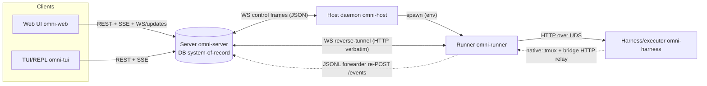

# Omnigent — Overall Architecture (master doc / backbone)

**Status:** backbone authored from directly-verified evidence (process survey, live
traces, `sys_session_get_info`, code reads of telemetry/frames, CUJ-ANALYSIS). Per-component
depth lives in the sibling docs under `architecture/` (server, runner, host, harness-inner,
runtime-executor, policies, web, tui-repl, auth-credentials, tools-omnibox, telemetry-tracing)
and is reconciled into this doc during synthesis.

## 1. What Omnigent is
A distributed, multi-process system for running coding/knowledge **agents** across
pluggable **harnesses** (Claude, Codex, etc.), driven from multiple **clients** (web UI,
TUI/REPL), with the **server** as the durable system-of-record. It is "heavily
vibe-coded" (per OBSERVABILITY.md) — the goal of this analysis is a precise, shared
mental map grounded in code + live traces.

## 2. Components (process inventory)
| Component | Process / location | Role |
|---|---|---|
| **Server** | FastAPI app (`omnigent/server/`); one per deployment | System-of-record: conversation store (DB), session lifecycle, auth, policy enforcement, SSE/WS fan-out to clients, the runner & host reverse-tunnels. |
| **Host daemon** | `omnigent host` (`omnigent/host/`); one per machine | Registers a machine to the server; lets the server browse that machine's filesystem and **launch runners** on it. Talks JSON **control frames** over a WS tunnel. |
| **Runner** | `omnigent.runner._entry`; **one per session** | Hosts the agent turn loop for a session on a host machine; connects back to the server over a WS **reverse-tunnel** (server makes HTTP calls "into" the runner through it). Dispatches tools, pools custom MCPs, runs the runner-side policy fast-path. |
| **Harness / executor** | `omnigent/inner/*_executor.py` (+ native vendor CLI) | The actual model loop. **SDK harnesses** run in-process (Omnigent owns prompt/tools/transcript). **Native harnesses** drive a resident vendor CLI in a tmux pane and mirror its transcript back. |
| **Clients** | Web UI (`web/src/`), TUI/REPL (`omnigent/repl/`) | Send messages, render streaming + durable transcript, drive controls (interrupt/approve/fork/switch). |
| **Telemetry** | OTel in every process → Jaeger/OTLP | Cross-process tracing; see `telemetry-tracing.md`. |

There is **no separate policy-server process** — policy is in-process in the server
(`policies/engine.py` → `policy.evaluate` span) plus a runner fast-path and a native HTTP
hook (`/policies/evaluate`). "Policy Server" in the team doc = these paths.

## 3. Deployment topology (general + the observed dev setup)
**General:** clients → **server** (state) ; server ⇄ **host daemons** (per machine) ;
server ⇄ **runners** (per session, launched by a host) ; runner ⇄ **harness**.

**Observed on this machine (the dev box for this analysis):** the server runs **remotely on
a remote dev box**, reached at `localhost:6767` via an SSH tunnel;
the **host daemon and per-session runners run locally** on the Mac; harnesses (e.g. the
`claude` CLI) run locally in tmux; an **Omnigent.app** (Electron) is the desktop client.
The conversation that produced this analysis is itself a live **claude-native** session
(`conv_4f0c75a6…`, runner `runner_token_31e58e…`) — i.e. the analysis runs *inside* one of
the harnesses under study. (For clean, complete, readable traces a dedicated local rig was
stood up — see `telemetry-tracing.md §9`.)

## 4. Inter-component channels (answers "what channel between components")
| Edge | Transport / channel | Carries | Trace propagation |
|---|---|---|---|
| Client → Server | HTTPS **REST** + **SSE** (`GET /sessions/{id}/stream`) | commands (POST /events, fork, switch, resolve elicitation), snapshot reads, streamed response events | FastAPI extract + HTTPX/browser inject (W3C headers) |
| Client → Server | **WebSocket** `/v1/sessions/updates` (+ health) | sidebar watch-set snapshot + change/remove deltas + heartbeat | manual `traceparent` in JSON envelope |
| Server ⇄ Runner | **WS reverse-tunnel** that forwards HTTP **verbatim** (server calls "into" runner) | forwarded user events; runner→server callbacks (/events, /items, /policies/evaluate, /mcp) | HTTP headers tunneled verbatim; cached client wrapped by `instrument_httpx_client` |
| Server ⇄ Host | **WS control frames** (JSON, *not* HTTP) | `host.launch_runner`/`stop_runner`/`runner_exited`/`stat`/`list_dir`/`create_worktree`/… | manual `traceparent` field on frame (`consume_frame_span`) |
| Host → Runner | one-way **spawn env** at process launch | binding_token, workspace, harness, (TRACEPARENT if a span is active) | env propagation |
| Runner → Harness | **HTTP over Unix domain socket** | turn drive + tool results | tunneled HTTP headers / `get_traceparent_env()` |
| Harness → Server | **JSONL forwarder** re-POSTs `/events` (decoupled from any request) | mirrored assistant/tool/transcript items | own trace, stitched by `session.id` |
| Native harness ↔ Runner | **bridge HTTP relay** (Bearer) + **tmux** send-keys / log-poll | in-turn tool calls; interrupt (Escape); transcript mirror | separate async boundary, correlated by `session.id` |
| Server ⇄ DB | SQLAlchemy (sqlite/psycopg) | durable conversation store | `SQLAlchemyInstrumentor` (sink) |

## 5. End-to-end request lifecycle (send a message) — verified against traces
Root span observed: `omni-server POST /v1/sessions/{session_id}/events`, propagating
server → runner → harness (with runner→server callbacks for policy + history).

1. Client `POST /v1/sessions/{id}/events`. Server **persists the user item first**
   (persist-before-forward invariant), then forwards to the runner over the reverse-tunnel,
   then publishes `session.input.consumed` (carries the item id for client dedup). *(verify in `server.md`)*
2. Runner receives the forwarded event → builds config (model/harness/auth) → runs the
   **executor turn loop** (`runtime/workflow.py`): prompt build → executor → consume
   `ExecutorEvent`s (TextChunk/ReasoningChunk/ToolCallRequest/…/TurnComplete). *(see `runtime-executor.md`)*
3. Tool calls: runner policy **fast-path** (ALLOW/DENY) → MCP dispatch; ASK escalates to the
   server elicitation flow; the in-process `policy.evaluate` span + the `/policies/evaluate`
   hook both appear. *(see `policies.md`)*
4. Output: streamed back as SSE `response.output_text.delta` etc.; the **JSONL forwarder**
   re-POSTs durable items into `/events` (its own trace). Final items persisted to the
   conversation store; the client **dedupes by `itemId`** to merge streaming vs durable. *(see `web.md`)*

> **One user action ⇒ many traces.** The forwarder, host control plane, and server startup
> root their own traces; `session.id` (= conv id) is the cross-trace stitch. See
> `telemetry-tracing.md §5`.

## 6. Harness taxonomy (in scope: claude, codex, polly)
- **SDK harnesses** (claude-sdk, codex): in-process loop, Omnigent owns prompt + tools +
  100%-Omnigent transcript; client sees the Omnigent UI. Base `inner/executor.py`.
- **Native harnesses** (claude-native, codex-native): drive a resident vendor CLI/TUI in a
  tmux pane; the *vendor* owns prompt + tools; transcript lives in the vendor store +
  mirrored back. Base `native_server_harness.py`; bridge + forwarder.
- **Polly** = a registered **custom agent** (a coding orchestrator) that runs on a harness
  (typically claude-sdk) and delegates to sub-agents; inherits its harness's row. (Also
  `debby`, and any user-authored agent.) Custom agents: ArtifactStore tarball → Agent DB row
  → AgentCache. *(see `harness-inner.md` + `runtime-executor.md`)*

Per-harness capability matrix (interrupt/queue/subagents/reasoning/elicitation/mid-session
model) is verified cell-by-cell in `harness-inner.md` (correcting `CUJ-ANALYSIS.md §4`).

## 7. Cross-cutting invariants (re-checked at each CUJ node)
Transcript consistency (streaming↔durable; local↔server; post compaction/fork/resume) ·
credential validity for the 3 cred relationships (each its own refresh path) · dedup
(server/runner/client) · working-state truth (one computation, all clients agree?) · caching
freshness · policy reach (every tool path, every connection state). Detailed per the
component + cuj-answers docs.

## 8. Where to read next
- Per component: `architecture/{server,runner,host,harness-inner,runtime-executor,policies,web,tui-repl,auth-credentials,tools-omnibox,telemetry-tracing}.md`
- CUJ answers by domain: `cuj-answers/*.md`
- The pasteable consolidated CUJ answers (for the team doc): `cuj-answers/_FOR-PASTE.md` (assembled in synthesis).

## 9. Verified corrections, cross-cutting gaps & live-trace findings
**Code corrections found during the deep pass (vs `CUJ-ANALYSIS.md` / `OBSERVABILITY.md`):**
- `CUJ-ANALYSIS.md` §2.A/§2.E `file:line` anchors have **drifted by thousands of lines** in
  the ~912 KB `sessions.py` (e.g. `post_event` is `:18150` not `:17610`; `stream_session`
  `:19190` not `:18762`) — re-derived in `server.md`.
- **TRACEPARENT is NOT injected into the runner spawn env** (contra OBSERVABILITY §6.4) → each
  runner roots its **own** trace, stitched only by `session.id` (`host.md`). This is *the*
  reason one user action fans out into ~21 traces.
- **`telemetry.init("omni-tui")` is never called** → the TUI emits **no spans today** even
  though `OBSERVABILITY.md` claims an `omni-tui → server → runner → harness` trace; the
  mechanism is wired (HTTPX instrumented) but uninitialized — one-line fix (`tui-repl.md`).
- **PR #1439 IS merged** (commit `e9561916`) → the native policy-hook "fail-closed after ~1h"
  bug is **fixed** for claude-native + codex-native (self-heal re-mint on 401/302); the residual
  one-shot-token path is the **OpenCode** plugin (out of scope) (`auth-credentials.md`).
- **#1128 confirmed** at `claude_sdk_executor.py:1910` (Opus billed when model is None on the
  Databricks gateway).
- **Native sub-agent completions never reach the orchestrator** — gate `runner/app.py:12607`
  `elif not _is_native_harness(...)` excludes every native harness (#848 cluster) (`runner.md`).
- **§4 matrix sharpenings:** codex-native subagents = ✅ (real mirror; the † footnote was stale
  for codex-native — it applies to codex-SDK only); codex-SDK elicitation = ❌ confirmed
  (`approvalPolicy:"never"`); codex-SDK mid-session model change = thread teardown (`harness-inner.md`).

**Live-trace findings** (full detail: `cuj-answers/_LIVE-TRACE-FINDINGS.md`):
- **One action → ~21 traces**, stitched only by `session.id` (decoupled forwarder/host/startup).
- **Fork** = synchronous server **DB deep-copy** (~25 `INSERT`), no runner; **switch-agent**
  clones the agent but **retains the runner**; **interrupt** = **`error.type=cancelled`** on the
  `agent:` span; **`/compact`** on a model-less session = **#1192** `invalid_input`.
- **A session is inert until a runner is bound** — REST create without `host_id` → no runner →
  `runner_unavailable`; `host_id` at create is the host→runner launch trigger (the "stuck
  working" gap lives here).
- **Sub-agent spawn** = `tool:sys_session_send` → child **full sessions** (own `session.id`) →
  `tool:sys_read_inbox` drain → `GET /child_sessions`; no single trace spans the tree.
- **codex** is blocked locally by a **`DATABRICKS_BEARER`/PATH propagation gap** in the runner
  spawn env (host reports `codex: needs-auth`) — covered from code + matrix.

