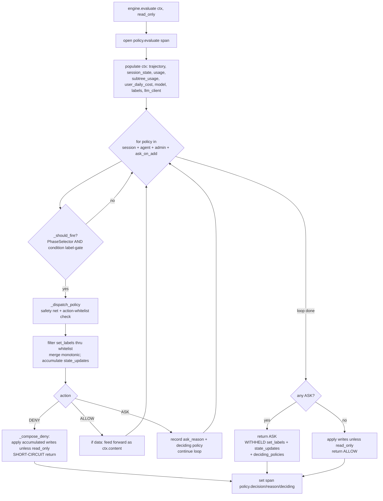
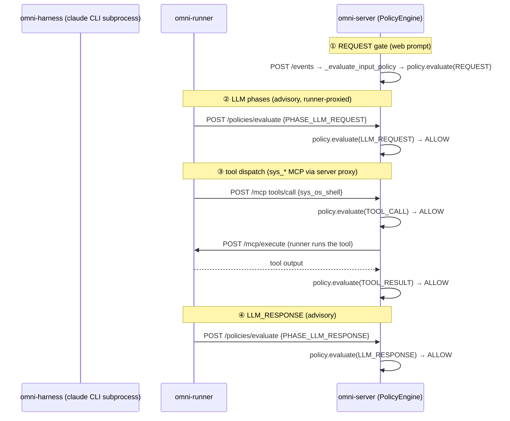
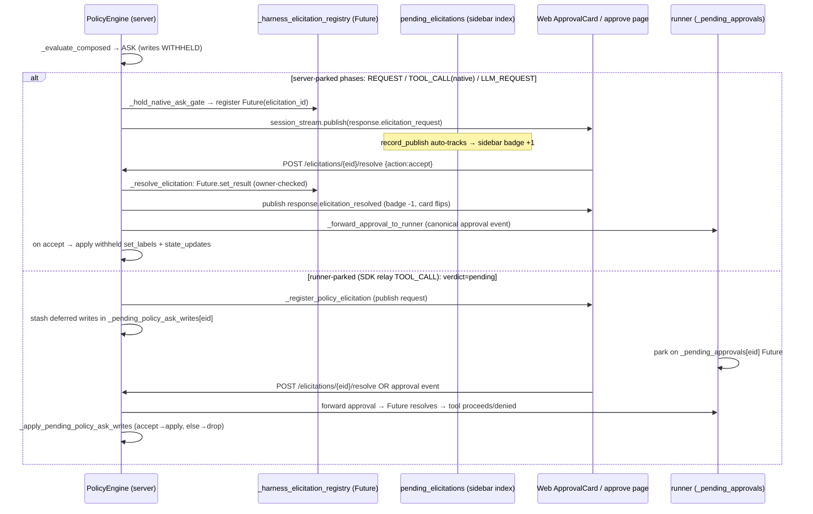

# Omnigent Policies / Approvals / Elicitations — Architecture

> Scope: `omnigent/policies/` (pure evaluators + registry + builtins),
> `omnigent/runtime/policies/` (engine + composition + ASK helper + builder),
> server policy routes, the runner fast-path gate, native policy hook,
> pending-elicitation tracking. Code is ground truth; all claims carry
> `file:line` and are cross-checked against trace
> `conv_63542a5f92e24956812e19b104eac0e9` / trace
> `cfb59197f6f92755270a4d785d3ee3e1`.

---

## 1. Overview

The policy system is a **declarative guardrail layer** that intercepts five
*phases* of a turn (REQUEST, TOOL_CALL, TOOL_RESULT, LLM_REQUEST, LLM_RESPONSE)
and returns one of three verdicts: **ALLOW / ASK / DENY**. There are **two
distinct package halves** (this split is the single most important structural
fact):

| Package | Role | Key types |
|---|---|---|
| `omnigent/policies/` | **Pure evaluators** — stateless, no DB, no conversation knowledge. The `Policy` ABC + `FunctionPolicy` + `PromptPolicy`; the **registry** (allowlist of builtin handlers); `builtins/` (cost, safety, google, github, risk_score, routing, cel, prompt, working_dir). | `Policy` (`policies/base.py:32`), `EvaluationContext`/`PolicyResult`/`ElicitationRequest`/`PolicyLLMClient` (`policies/types.py`) |
| `omnigent/runtime/policies/` | **Runtime orchestration** — the per-workflow `PolicyEngine` that owns label/state/usage hot-caches + composition loop + write-through; the `build_policy_engine` factory; the `_enforce_policy` call-site wrapper; the `_await_elicitation` ASK helper. | `PolicyEngine` (`runtime/policies/engine.py:43`), `build_policy_engine` (`runtime/policies/builder.py:214`) |

The **single in-process choke point** is `PolicyEngine.evaluate()`
(`runtime/policies/engine.py:230`), which wraps `_evaluate_composed` in a
`policy.evaluate` OTel span tagged with phase/decision/reason. Every
enforcement site routes through it — verified in the trace: **5 distinct
`policy.evaluate` spans, one per phase, all on `omni-server`, all in-process.**

There are **two enforcement surfaces**, both calling the same engine:

1. **SERVER-level** — the engine runs *inside* omni-server. Reached three ways:
   - `POST /v1/sessions/{id}/events` → `_evaluate_input_policy` / `_evaluate_output_policy` (REQUEST/RESPONSE gates).
   - `POST /v1/sessions/{id}/mcp` → `_handle_mcp_tools_call` (TOOL_CALL + TOOL_RESULT for `sys_*`/spec MCP tools dispatched through the server MCP proxy).
   - `POST /v1/sessions/{id}/policies/evaluate` → `evaluate_policy` route (the generic "hook path": native PreToolUse/UserPromptSubmit hooks, runner LLM-phase proxying, connector-native SDK tools).
2. **RUNNER-level (fast-path)** — `RunnerToolPolicyGate` (`runner/policy.py:109`)
   runs *function-type* TOOL_CALL/TOOL_RESULT policies **locally on the runner**
   before MCP dispatch, for ALLOW/DENY only. **ASK escalates to the server**
   (`POST /policies/evaluate`) which owns the elicitation channel. This dual
   evaluation is by design (`runner/policy.py:20-34`).

---

## 2. Key files (file:line)

### Pure evaluators (`omnigent/policies/`)
- `base.py:32` — `Policy` ABC; `evaluate(ctx, context) -> PolicyResult`; `reset_turn()` no-op default (`:73`).
- `types.py:64` — `EvaluationContext` (phase, content, tool_name, trajectory, actor, session_state, usage, subtree_usage, user_daily_cost, model, harness, labels, llm_client).
- `types.py:203` — `PolicyResult` (action, reason, set_labels, deciding_policies, data, state_updates); `.deciding_policy` property (`:266`).
- `types.py:276` — `ElicitationRequest` (the internal ASK contract; mirrors MCP `elicitation/create` form shape).
- `types.py:61` — `FAIL_CLOSED_PHASES = ("PHASE_TOOL_CALL", "PHASE_REQUEST")` — the single source of truth for which phases fail closed.
- `types.py:331` — `PolicyLLMClient` (pre-bound server-LLM client for prompt/function policies).
- `registry.py` — `load_registry` (`:68`), `is_registered_handler` (`:156` — the RCE allowlist), `validate_factory_params` (`:208`).
- `builtins/__init__.py:37` — `BUILTIN_POLICY_MODULES` (the 10 modules scanned at startup).
- `builtins/cost.py` — `cost_budget` / `user_daily_cost_budget` / `subagent_cost_budget` (registry `:884/:920/:957`). The canonical ASK + `state_updates` (soft-checkpoint) policy.
- `builtins/safety.py` — `max_tool_calls_per_session`, `ask_on_os_tools`, `block_skills`, `enforce_sandbox`, `deny_pii_in_llm_request`, **`ask_on_add_policy`** (the hardcoded sys_add_policy gate).
- `builtins/prompt.py` — `prompt_policy` = the **LLM-classifier** (`PromptPolicy`); `risk_score.py`, `routing.py` (`deny_trivial_to_expensive_model`), `cel.py`, `google.py`, `github.py`, `working_dir.py`.

### Runtime orchestration (`omnigent/runtime/policies/`)
- `engine.py:43` — `PolicyEngine`; `evaluate` span wrapper (`:230`); `_evaluate_composed` (`:284` — the composition loop); `_compose_deny` (`:414`); `_should_fire` (selector + condition gate, `:457`); `apply_label_writes` (`:490`); `apply_state_updates` (`:521`, with reserved-key routing to root/user-daily); `record_usage` (`:631`); the `_inject_*` context populators (`:695`+).
- `engine.py:976` — `_dispatch_policy` (per-policy safety net); `_fail_closed` (`:1038` — classifier-only→ALLOW, ask-gate→ASK, else→DENY); `_condition_matches` (`:1237` — label gate).
- `builder.py:214` — `build_policy_engine`; **composition order** `:309` (`session + agent + admin`, then `_ASK_ON_ADD_POLICY_SPEC` appended `:315`); sub-agent root-policy inheritance `:301-307`; cost-approval root-seeding `:332-339`.
- `builder.py:64` — `_ASK_ON_ADD_POLICY_SPEC` (hardcoded, always-injected ASK before `sys_add_policy`).
- `enforcement.py:20` — `_enforce_policy(engine, ctx)` (thin call-site wrapper used by the in-process workflow path).
- `approval.py:80` — `_await_elicitation` (ASK round-trip: register → emit → park → parse verdict → apply writes on accept); `build_elicitation_request_event` (`:175`); `_parse_verdict` (`:290` — strict, only `action=="accept"` → True); `resolve_ask_timeout` (`:264`).

### Server routes
- `server/routes/session_policies.py` — per-session CRUD (`POST/GET/PATCH/DELETE /v1/sessions/{id}/policies`); registry-allowlist guard on create (`:181`) and patch (`:323`); LIST merges admin + session sources (`:236`).
- `server/routes/default_policies.py` — server-wide CRUD (`POST/GET/PATCH/DELETE /v1/policies`); `_require_admin` (`:70`); stored with `session_id IS NULL`.
- `server/routes/policy_registry.py` — `GET /v1/policy-registry` (browse builtins; filters `internal_only`, `:54`).
- `server/routes/sessions.py` — the big one:
  - `_evaluate_input_policy` (`:10801`, REQUEST, parks ASK server-side), `_evaluate_output_policy` (`:10971`, RESPONSE), `_evaluate_tool_call_policy` (`:10556`, the relay/non-native TOOL_CALL gate).
  - `evaluate_policy` route (`:15973`, the `/policies/evaluate` hook path; proto phase map `:15946`).
  - `_handle_mcp_tools_call` (`:13135`, the MCP-proxy TOOL_CALL+TOOL_RESULT path w/ MRTR retry).
  - `_hold_native_ask_gate` (`:4119`, server-side ASK park used by REQUEST gate + the hook path).
  - `_register_policy_elicitation` (`:10279`), `_publish_and_wait_for_harness_elicitation` (`:1397`), `_resolve_elicitation` (`:3921`), `_forward_approval_to_runner` (`:3880`), `claude_permission_request_hook` (`:15638`), `resolve_elicitation` route (`:18022`), `get_elicitation` route (`:18089`).
  - `_apply_pending_policy_ask_writes` (`:10372`) + `_pending_policy_ask_writes` map (relay ASK deferred writes).
- `server/_elicitation_registry.py` — in-process registries: `_harness_elicitation_registry` (id→Future), `_harness_elicitation_owners` (cross-user guard), `_harness_parked_elicitations`, `_harness_pre_resolved_elicitations` (tombstones for races).

### Runner + hooks
- `runner/policy.py:109` — `RunnerToolPolicyGate` (local fast-path, function-type tool policies only); `PolicyVerdict` (`:65`); `evaluate_tool_call` (`:159`), `evaluate_tool_result` (`:184`, ASK→DENY on result), `_evaluate_policies` (`:228`, DENY short-circuits / ASK records-but-continues); `format_deny_text` (`:314`).
- `runner/app.py:6248` — `_evaluate_policy_via_omnigent` (runner proxies a harness `policy_evaluation.requested` event → `POST /policies/evaluate`; phase-aware fail-open/closed via `FAIL_CLOSED_PHASES` `:6297`).
- `runner/app.py:18780+` — `_evaluate_tool_call_via_gate` (constructs `RunnerToolPolicyGate.from_spec`).
- `runner/pending_approvals.py` — runner-side `_pending_approvals` Future map for the SDK approval-event path.
- `native_policy_hook.py` — shared claude/codex hook translation: native hook shape (`PreToolUse`/`PostToolUse`/`UserPromptSubmit`) ↔ proto `EvaluationRequest`/`EvaluationResponse`; `post_evaluate_with_retry` (30s retry budget, `:37`); auth-header baking (`:78`/`:103`).
- `claude_native_hook.py` — claude-native entrypoint; PermissionRequest long-poll (`:528`), PreToolUse `AskUserQuestion` interception (`:668`).
- `runtime/pending_elicitations.py` — in-process sidebar index (`record_publish` `:81` auto-tracks every `response.elicitation_request` through `session_stream.publish`; `count_for`/`counts_for`/`snapshot_for`/`lookup`).

### Tools
- `tools/builtins/policy.py:18` — `SysAddPolicyTool` (`sys_add_policy` → runner → `POST /v1/sessions/{id}/policies`); `:94` — `SysPolicyRegistryTool` (`sys_policy_registry` → `GET /v1/policy-registry`). Registered in `tools/manager.py:185`.

---

## 3. Data flow

### 3.1 In-process composition (the engine — `_evaluate_composed`, engine.py:284)



Composition semantics (engine.py:358-412):
- **DENY short-circuits** immediately (first DENY wins), applies accumulated writes from prior ALLOWs then returns.
- **ASK accumulates** but the loop continues — a later DENY can still override an ASK.
- **ALLOW continues**; if a policy returned `data`, it is fed forward as `ctx.content` so policies **chain** (e.g. PII-redact then cost-gate the redacted payload).
- On final ASK: writes are **withheld** (carried in the result, applied only on approve — POLICIES.md §7.2 invariant).

### 3.2 The two enforcement surfaces (the trace tells the whole story)

From trace `cfb59197...` (claude-sdk, `echo TRACETEST123` via `sys_os_shell`), each `policy.evaluate` span's **parent** reveals the routing:

```
policy.evaluate REQUEST       parent = POST /v1/sessions/{id}/events        (server input gate)
policy.evaluate LLM_REQUEST   parent = POST /v1/sessions/{id}/policies/evaluate  (hook path, runner-proxied)
policy.evaluate LLM_RESPONSE  parent = POST /v1/sessions/{id}/policies/evaluate  (hook path, runner-proxied)
policy.evaluate TOOL_CALL     parent = POST /v1/sessions/{id}/mcp            (MCP-proxy dispatch)
policy.evaluate TOOL_RESULT   parent = POST /v1/sessions/{id}/mcp            (MCP-proxy dispatch)
```



### 3.3 The ASK / elicitation flow (end-to-end)



Strict verdict parsing: only `action == "accept"` → approved
(`approval.py:290` `_parse_verdict`; same in `_hold_native_ask_gate:4211`).
Everything else (decline / cancel / malformed / timeout / disconnect)
→ **DENY, no side effects** (POLICIES.md §7.2).

---

## 4. Channels & message/event types

| Channel | Direction | Payload / type |
|---|---|---|
| `POST /v1/sessions/{id}/policies/evaluate` | runner/native-hook → server | `EvaluationRequest`: `{event:{type:PHASE_*, data}, context?, _omnigent_elicitation_id?}` → `EvaluationResponse`: `{result:POLICY_ACTION_*, reason?, data?}` |
| `POST /v1/sessions/{id}/mcp` (`tools/call`) | runner → server | JSON-RPC; server gates TOOL_CALL→dispatch→TOOL_RESULT; ASK returns MCP `InputRequiredResult` (MRTR), retry carries `requestState`+`inputResponses` |
| `POST /v1/sessions/{id}/events` | web/native → server | `function_call` w/ `evaluate_policy:true` (TOOL_CALL relay gate); `message` (input/output gate); `approval` (verdict delivery) |
| SSE on session_stream | server → all clients | `response.elicitation_request` (the ASK card), `response.elicitation_resolved` (clear/flip), `response.output_text.delta` w/ `[Denied by policy: …]` sentinel |
| `POST /v1/sessions/{id}/elicitations/{eid}/resolve` | web → server | `ElicitationResult` `{action:accept|decline|cancel, content?}` |
| `GET /v1/sessions/{id}/elicitations/{eid}` | approve page → server | reads `pending_elicitations` index → `{status, message, phase, policy_name, content_preview}` |
| `POST /v1/sessions/{id}/hooks/permission-request` | claude-native hook → server | Claude PermissionRequest payload; **long-poll** → `hookSpecificOutput.decision.behavior: allow|deny`, empty 200 on timeout = "defer to TUI" |
| `approval` event (server→runner) | server → runner | `{type:"approval", data:{elicitation_id, action}}` resolves runner `_pending_approvals` Future |
| `POST /v1/sessions/{id}/policies` | runner (`sys_add_policy`) / UI → server | `CreateSessionPolicyRequest` `{name, type, handler, factory_params}` |

Proto phase maps (sessions.py:15946-15959):
`PHASE_TOOL_CALL/TOOL_RESULT/LLM_REQUEST/LLM_RESPONSE/REQUEST` ↔ `Phase.*`;
`PolicyAction.ALLOW/DENY/ASK` ↔ `POLICY_ACTION_ALLOW/DENY/ASK`.

---

## 5. Trace evidence (concrete)

Corpus: `conv_63542a5f92e24956812e19b104eac0e9` (claude-sdk tool-use; 14 traces).
Policy-bearing trace: **`cfb59197f6f92755270a4d785d3ee3e1`** (415 spans).

Histogram (from `trace_tools.py conv`):
- `omni-server policy.evaluate` ×5 (in-process choke point)
- `omni-server POST /v1/sessions/{id}/policies/evaluate` ×2 (the hook path)
- `omni-runner POST /v1/sessions/{id}/policies/evaluate http send` ×6 (runner→server proxy attempts)
- cross-service edge: `omni-runner → omni-server [POST /policies/evaluate] x2`
- cross-service edge: `omni-runner → omni-server [POST /mcp] x1`, `omni-server → omni-runner [POST /mcp/execute] x1`

Per-span attributes captured on `policy.evaluate` (all `policy.decision=ALLOW`,
`policy.read_only=False`, `session.id=conv_63542a5f…`):

| `policy.phase` | `policy.tool_name` | `policy.content` (excerpt) |
|---|---|---|
| `REQUEST` | `''` | `"Use your shell/bash tool to run exactly: echo TRACETEST123 …"` |
| `LLM_REQUEST` | `''` | `{messages_count:1, tools_count:20, system_prompt_preview:"You are Claude Code…", last_user_message:"… echo TRACETEST123 …"}` |
| `TOOL_CALL` | `sys_os_shell` | `{name:"sys_os_shell", arguments:{command:"echo TRACETEST123"}}` |
| `TOOL_RESULT` | `sys_os_shell` | `{result:"{stdout:TRACETEST123\n, exit_code:0, …}"}` |
| `LLM_RESPONSE` | `''` | `{text_preview:"…The output was: TRACETEST123…", usage:{…}, model:"claude-opus-4-8"}` |

This is the empirical proof of the phase set, the in-process choke point, and
the dual-path routing (REQUEST via `/events`; LLM phases via `/policies/evaluate`;
TOOL_* via `/mcp`). The trace shows **no ASK/DENY** (the default
`databricks_coding_agent` spec has no blocking policy on `echo`), so the ASK/DENY
branches below are code-grounded, not trace-observed.

---

## 6. Per-harness differences

| Harness | TOOL_CALL enforcement | REQUEST gate | ASK verdict delivery | Notes |
|---|---|---|---|---|
| **claude-sdk** | `mcp__omnigent__*` tools gated via server `/mcp` proxy dispatch (`_handle_mcp_tools_call`); connector-native (`mcp__github__*`) gated via SDK `can_use_tool` → `_evaluate_tool_call_policy` (`claude_sdk_executor.py:1680`) → `/policies/evaluate`. Runner fast-path `RunnerToolPolicyGate` for function-type tool policies. | server `_evaluate_input_policy` at `POST /events`. | runner `_pending_approvals` Future (relay `approval` event) OR SDK elicitation handler. | Double-eval guard: `mcp__omnigent__*` skipped in the SDK callback (`:1737`) because the dispatch path already gates them. **This is the trace-observed harness.** |
| **claude-native** | `PreToolUse` hook → `native_policy_hook` → `POST /policies/evaluate`. | `UserPromptSubmit` hook → `POST /policies/evaluate` (PHASE_REQUEST). Server-side `/events` input gate is *deduped* for native via `pending_inputs` (sessions.py:16065) to avoid double-prompt. | **`PermissionRequest` hook long-poll** (`/hooks/permission-request`, verdict in held HTTP body); for *policy* ASK the server holds the `/policies/evaluate` long-poll via `_hold_native_ask_gate` and collapses ASK→hard ALLOW/DENY so a permissive `permission_mode` can't auto-approve (sessions.py:16113-16177). | Required hooks: **PreToolUse + PermissionRequest + UserPromptSubmit**. PostToolUse is observational. |
| **codex / codex-native** | Same `native_policy_hook` translation (codex hook posts PHASE_TOOL_CALL). codex-native ASK via `codex-elicitation-request` hook (`codex_elicitation_id`, route `codex_elicitation_request_hook` sessions.py:16214). | codex-native `UserPromptSubmit`-equivalent → `/policies/evaluate`. codex (SDK) like claude-sdk. | codex-native: elicitation hook long-poll. codex (SDK): runner approval event. | **No live trace (codex creds expired / 403).** Covered by code + structural analogy to claude. Codex hook reads live `/model` from `config.toml` and stamps `event.context.model` (engine respects it, `engine.py:749`). |
| **polly / custom agents** | Run *on* a harness (typically claude-sdk) → inherit that harness's enforcement exactly. No policy-specific divergence. | inherited. | inherited. | Policies attached to a custom-agent spec's `guardrails:` block flow through `build_policy_engine` like any spec. |

---

## 7. Failure branches & gaps

- **Fail-CLOSED phases** = `("PHASE_TOOL_CALL", "PHASE_REQUEST")` (`types.py:61`, enforced at `runner/app.py:6297` and the native hooks `native_policy_hook.py:60-67`). A server outage / non-2xx / malformed 200 on these phases → **DENY**. TOOL_RESULT + LLM_REQUEST + LLM_RESPONSE **fail OPEN** (advisory / side-effect already incurred).
- **Per-policy fail-closed** (`_fail_closed`, engine.py:1038): a broken/raising policy → DENY by default; classifier-only (`action:[allow]`) → ALLOW (honor "never blocks" intent); ask-gate (`[ask]`/`[allow,ask]`) → ASK (park, never auto-allow).
- **ASK timeout / disconnect** → DENY, withheld writes discarded. Default `ask_timeout` = one day (`_CLAUDE_NATIVE_PERMISSION_HOOK_TIMEOUT_S = 86400`); per-policy override wins (`resolve_ask_timeout`).
- **Native policy-token expiry** (the §2.G bug, cross-cutting): the native PreToolUse hook bakes a one-shot Bearer token (`native_policy_hook.py:103`). If it expires, the `/policies/evaluate` POST 401s → hook fails closed → *every* native tool call is denied until re-mint. (Recent fix `e9561916` re-mints expired hook token on Apps OAuth bounce.)
- **RCE allowlist** (`is_registered_handler`, registry.py:156): a `type:python` policy handler MUST be in the registry (builtins + admin `policy_modules`). Enforced on `POST/PATCH /policies` and on agent-bundle upload. Trusted local `omnigent run` skips this (still supports custom handlers).
- **MRTR forge guard** (`_handle_mcp_tools_call:13239`): the retry path re-evaluates TOOL_CALL policy and verifies the `elicitation_id` is in the server-side `_pending_policy_ask_writes` map — a forged `requestState`/`inputResponses` can't bypass DENY.
- **read_only eval** (LEVEL_READ): policies run but no persistence and no ASK-park (the read-only caller would otherwise mint an elicitation = a mutation). Returns the raw verdict (sessions.py:16130, engine.py:403/446).
- **Gaps / in-memory caveats:** `_harness_elicitation_registry` + `pending_elicitations` are **in-process only** — a multi-replica omni-server deploy splits elicitation state per replica (documented limitation; needs a shared backplane). The `policy.evaluate` span captures content only when content-capture is on (redacted + capped).

---

## 8. Open questions

1. **codex-native end-to-end** unverified by trace (creds). The `codex_elicitation_request_hook` and the `event.context.model` from `config.toml` are code-grounded but no live span evidence.
2. **ASK / DENY span attributes** unobserved (the trace corpus only exercised ALLOW). A blocking policy would surface `policy.decision=ASK|DENY` + `policy.reason` + `policy.deciding_policies` on the span — confirmed in the span-writing code (engine.py:273-281) but not in the corpus.
3. **Multi-replica elicitation backplane** — both the registry and the sidebar index acknowledge they'd need a shared store; the wiring point is noted but not implemented in this tree.
4. **`condition:` label-gate + monotonic merge** under concurrent sub-agents — the engine seeds cost-approval from root and routes write-backs to root (`apply_state_updates` reserved-key routing), but cross-conversation label races (POLICIES.md Open Q #6) are mitigated by `INSERT … ON CONFLICT DO NOTHING` seeding, not fully serialized.
