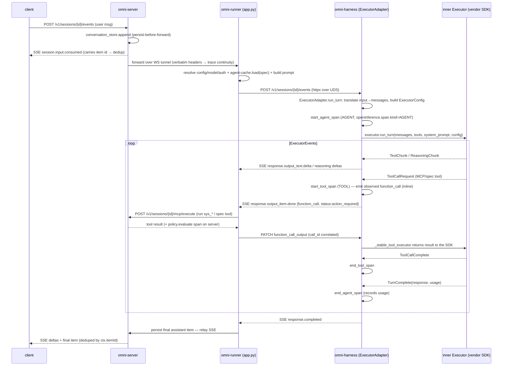

# Runtime — Executor turn loop & agent machinery

**Scope:** `omnigent/runtime/` (workflow.py, compaction.py, pending_inputs.py,
pending_elicitations.py, agent_cache.py, harnesses/_runner.py,
harnesses/_executor_adapter.py, harnesses/_scaffold.py) + `omnigent/inner/`
(executor.py event model, tools.py AgentTool/SelfAgentTool, tracing.py) +
`omnigent/tools/builtins/` (spawn.py, async_inbox.py).
Source-of-truth = code; every claim carries a `file:line` anchor. Trace
evidence from the local Jaeger rig.

---

## 1. Overview

An **Executor** is the per-vendor adapter that translates Omnigent's abstract
turn model (a list of `Message`s + `ToolSpec`s + a system prompt → a stream of
`ExecutorEvent`s) onto a concrete LLM/agent SDK (`inner/executor.py:518`,
`Executor.run_turn`). It is the *narrow waist* between the framework and any
backend: claude-sdk, codex, pi, openai-agents-sdk, antigravity, etc. each
subclass `Executor` and emit the same event vocabulary.

The **turn loop** is split across three processes, stitched by the OTel
`session.id` grouping key:

- **omni-server** — owns conversation history (source of truth); receives the
  client `POST /events`, persists, and forwards to the runner over a WS tunnel.
- **omni-runner** — `runner/app.py` orchestrates the turn: resolves
  config/agent/auth, forwards the request to the per-conversation **harness
  subprocess**, consumes the harness SSE event stream, dispatches
  `action_required` tools back through the omni MCP, persists items, and relays
  SSE up to the server. Hosts the agent cache.
- **omni-harness** — a per-conversation FastAPI subprocess
  (`harnesses/_runner.py`) hosting one `ExecutorAdapter` (`HarnessApp`) wrapping
  one inner `Executor`. This is where `executor.run_turn()` actually runs and
  the AGENT/TOOL trace spans originate.

```
client ──POST /v1/sessions/{id}/events──▶ omni-server ──(WS tunnel)──▶ omni-runner
                                                                          │
                                              POST /v1/sessions/{id}/events│ (httpx over UDS)
                                                                          ▼
                                                                     omni-harness
                                                                 ExecutorAdapter.run_turn
                                                                   └─ executor.run_turn() ──▶ vendor SDK
```

> **Naming note:** `runtime/workflow.py` is **not** the LLM loop. Despite its
> module docstring ("the core agent loop"), ~lines 145–2050 are
> per-harness **spawn-env builders** (provider/credential resolution → the
> `HARNESS_*` env a harness subprocess reads) and ~2143–2540 are
> **async-tool handles + compaction integration + history loading**. The line
> `# ── The agent loop ──` at `workflow.py:2543` precedes only helper
> functions; the actual event-consuming loop lives in `runner/app.py` (server-
> dispatched tools / persist / forward) and in
> `harnesses/_executor_adapter.py` (event translation inside the subprocess).
> The `_HEARTBEAT_INTERVAL_S` / steering-poll / `async_work_complete` constants
> the module *comments* (`workflow.py:94-118`, values stripped) actually live in
> the **scaffold** (`_scaffold.py:83`) and the **builtins** (`async_inbox.py`).

### 2.0 The runner-side orchestration (`runner/app.py`)

The runner is the middle process that turns a forwarded user message into a
driven harness turn (precise anchors from the runner-orchestration deep dive):

- **Entrypoint:** `runner/app.py:14598` `post_session_events(conversation_id,
  request, stream=…)` — dispatches by body discriminator (`message` → turn;
  `interrupt`/`tool_result`/`approval` forwarded verbatim, `:14666`). A turn
  launches `_run_turn_bg` (`:14903`); `stream=true` returns the SSE body via
  `_stream_message_to_harness` (`:13866`).
- **Forward to harness over UDS:** `process_manager.get_client(conv_id)`
  (`:14779`) → an `httpx.AsyncClient` bound to the Unix socket
  (`process_manager.py:390-401`, `AsyncHTTPTransport(uds=…)`, cosmetic base_url
  `http://harness.local`). The turn stream opens in `proxy_stream`
  (`app.py:14115`) via `client.stream("POST", "/v1/sessions/{conv_id}/events",
  …, timeout=None)` (`:14150`).
- **SSE consumption:** `proxy_stream` iterates `aiter_text()` (`:14199`), splits
  `\n\n` frames, JSON-parses each `data:` line, switches on `event["type"]`
  (captures `response.created`→`mark_in_flight`, builds in-memory history from
  deltas/tool calls/results), re-publishes each frame to the session stream
  (`_publish_event`) and yields raw bytes (`:14536-14552`).
- **Tool dispatch (action_required):** intercepted in `proxy_stream` at
  `:14352` (`is_action_required`); routed through a `ProxyMcpManager` which
  enforces TOOL_CALL/TOOL_RESULT policy **server-side first**, then the runner's
  `mcp_execute` (`POST /v1/sessions/{id}/mcp/execute`, `app.py:17829`) runs the
  tool. The result is **POSTed back** to the harness as a `tool_result` event
  (`tool_dispatch.py:4346`: `harness_client.post(".../events",
  json={"type":"tool_result","call_id":…,"output":…})`) — i.e. the harness's
  parked Future (`_scaffold.py:477`) resolves and it emits the paired
  `function_call_output`. (So at the harness ABC it's a parked Future; on the
  wire from the runner it's a **POST**, not an HTTP PATCH.)

---

## 2. Key files (file:line)

| File | Role |
|---|---|
| `inner/executor.py:70` | `ExecutorConfig` (model / temperature / max_tokens / `extra`) — per-turn config. |
| `inner/executor.py:96-261` | **Event hierarchy**: `ExecutorEvent` base → `TextChunk`, `ReasoningChunk`, `ToolCallRequest`, `TurnComplete`, `ToolCallComplete`, `CompactionComplete`, `TurnCancelled`, `ExecutorError`. The abstract vocabulary every vendor maps onto. |
| `inner/executor.py:518-596` | `Executor` ABC: `run_turn` + capability predicates (`supports_streaming`, `handles_tools_internally`, `interrupt_session`, `enqueue_session_message`, `supports_live_message_queue`, `max_context_tokens`, `close_session`). Base defaults are all ❌ except `supports_tool_calling`. |
| `inner/executor.py:292-338` | `iterate_blocking_stream` — bridges a *blocking* provider iterator (OpenAI/Anthropic sync streams) onto async via a worker thread + queue, so `run_turn` never blocks the event loop. |
| `inner/executor.py:357-390` | `split_transient_tail` — separates framework-injected transient messages (e.g. the unread-inbox notice, `metadata.framework=true`) from durable history so cursor-advancing executors don't skip them. |
| `harnesses/_runner.py:115-168` | `_load_harness_app` — `python -m …_runner --harness X --module M --socket S --conversation-id C [--parent-pid P]`: imports the harness module, calls `create_app()`, stashes `conversation_id`/`harness` on `app.state`, binds UDS (POSIX) / TCP-loopback (Windows). |
| `harnesses/_runner.py:220-274` | Parent-watchdog + `prctl(PR_SET_PDEATHSIG)` + hard-exit backstop — orphaned-runner reaping. |
| `harnesses/_runner.py:357-365` | `telemetry.init("omni-harness")` — why harness spans show `service.name=omni-harness`. |
| `harnesses/_scaffold.py:353-714` | `TurnContext` — the per-turn handle: `emit()` (SSE out), `dispatch_tool()` (action_required round-trip), `elicit()`, `next_injection()` (steering), `cancelled` event. |
| `harnesses/_scaffold.py:716+` | `HarnessApp` — base class: lifespan, SSE streaming of emitted events, `/v1/sessions/{id}/events` route, interrupt/PATCH/elicitation handlers. Subclass implements just `run_turn(request, ctx)`. |
| `harnesses/_executor_adapter.py:141` | `ExecutorAdapter(HarnessApp)` — **the universal adapter** the four SDK wraps share; only the inner `Executor` differs. |
| `harnesses/_executor_adapter.py:239-497` | `ExecutorAdapter.run_turn` — the event-translation loop (translate input → call `executor.run_turn()` → translate each `ExecutorEvent` → emit SSE; create AGENT/TOOL spans; cancellation; injection watcher). |
| `inner/tracing.py:104-317` | `TracingContext` — `start_agent_span` (AGENT) / `start_llm_span` (LLM) / `start_tool_span` (TOOL); OpenInference `openinference.span.kind` attrs. |
| `inner/tools.py:266-316` | `AgentTool` / `SelfAgentTool` (+ `HandoffTool`) dataclasses: `pass_history`, `pass_histories`, `max_sessions`, `os_env: inherit`. |
| `tools/builtins/spawn.py:56` | `SysSessionSendTool` — the LLM-facing subagent dispatch (`sys_session_send`). `sys_session_create/list/get_info/get_history/share`. |
| `tools/builtins/async_inbox.py` | `sys_call_async` / `sys_read_inbox` / `sys_cancel_async` / `sys_cancel_task`. |
| `runtime/compaction.py:544-720` | `compact()` — the 3-layer compactor (L1 clear tool results → L2 LLM summary → L3 truncate). |
| `runtime/agent_cache.py:16` | `AgentCache` — two-tier (in-mem spec + on-disk extract), no TTL. |
| `runtime/pending_inputs.py` | optimistic native web-message bubbles (FIFO drain). |
| `runtime/pending_elicitations.py` | sidebar index of outstanding elicitations. |

---

## 3. Data flow — one SDK turn (claude-sdk)



### The adapter's event-translation contract (`_executor_adapter.py:239-497`)

1. **Input translation** (`:258-285`): `request.input` → inner `Message` list;
   every message stamped with `session_id = self._session_key` (`:271`) so the
   inner executor caches its SDK client under the right key (the
   mid-turn-steering-lost bug otherwise). `request.reasoning.effort` →
   `extra["reasoning_effort"]`; `request.max_output_tokens` → `extra["max_tokens"]`;
   `request.model_override` → `ExecutorConfig.model` (`:284`).
2. **Stable bridges installed once** on the executor (`:300-315`): `_tool_executor`
   (server tool round-trip), `_elicitation_handler` (permission prompts),
   `_policy_evaluator` (LLM_REQUEST/RESPONSE phases). They read `_current_ctx`
   at call time (rebound per turn at `:316`) — required because the SDK
   closure-captures the bridge on turn 1.
3. **Per-event translation** (`:394-459`): each yielded `ExecutorEvent` →
   `_translate_event(event, ctx)` → typed SSE events. Span lifecycle:
   `ToolCallRequest`→`start_tool_span`, `ToolCallComplete`→`end_tool_span`,
   `TurnComplete`→`end_agent_span` (+ `record_llm_usage`),
   `TurnCancelled`/`ExecutorError`→close span with cancellation/error.
4. **`dispatch_tool` action_required round-trip** (`_scaffold.py:449-516`):
   for spec/MCP tools the inner SDK can't run itself, the adapter emits a
   `function_call` item with `status:"action_required"`, parks an
   `asyncio.Future` keyed by `call_id`, and the runner PATCHes a
   `function_call_output` carrying the same `call_id` to resolve it. The
   correlated id lets the client dedupe the inline-observed render against the
   action_required render (`_pending_mcp_call_ids` deque, `:223`).
5. **Cancellation** (`:400-408`, `:498-522`): `ctx.cancelled` set → call
   `executor.interrupt_session()`; the `_handle_interrupt_event` override
   *also* drops the inner SDK client synchronously so the next turn rebuilds
   fresh (otherwise a post-cancel stream-dump / off-by-one).
6. **Mid-turn steering** (`_watch_injections`, `:524-600`): polls
   `ctx.next_injection()` and forwards each to
   `executor.enqueue_session_message()`; echoes `injection.consumed` so the
   runner drops its buffered copy.

---

## 4. Channels & message/event types

| Boundary | Channel | Carries |
|---|---|---|
| runner → harness | httpx `POST /v1/sessions/{id}/events` over **UDS** (POSIX) / TCP-loopback (Win) | `CreateResponseRequest` (input, tools, instructions, model_override, reasoning, max_output_tokens) |
| harness → runner | SSE on that POST | `response.output_text.delta`, `response.reasoning_text.delta`/`.reasoning.started`/`.reasoning_summary`, `response.output_item.done` (function_call / function_call_output, status `action_required`→`completed`), `response.elicitation_request`/`_resolved`, `injection.consumed`, `response.compaction.in_progress`/`.completed`, `response.completed`/`.cancelled` |
| runner → server | WS tunnel (httpx) | `POST /v1/sessions/{id}/mcp/execute` (tool dispatch), `POST /policies/evaluate`, `external_*` (native), conversation-item persist |
| harness ABC events | `inner/executor.py` `ExecutorEvent` subtypes | the abstract vocabulary (TextChunk/ReasoningChunk/ToolCallRequest/ToolCallComplete/TurnComplete/CompactionComplete/TurnCancelled/ExecutorError) |

`ExecutorConfig.extra` is the catch-all for per-vendor kwargs:
`reasoning_effort`, `max_tokens`, `stepwise_internal_turns`, etc.

---

## 5. Trace evidence (concrete, from local Jaeger)

**The executor turn loop = an `agent:<harness>` AGENT span on `omni-harness`,
with tool calls nested under it.** From the saved corpus
(`conv_63542a5f92e24956812e19b104eac0e9`, trace `f98feda729…`) and a freshly
generated turn (`conv_3a411011…`, trace `f2e437fa9e…`):

```
omni-harness  agent:claude-sdk [AGENT]   (7855ms)
  omni-harness  tool:sys_os_shell [TOOL]  (208ms)
```

Span attributes (content capture on):
- `agent:claude-sdk` — `openinference.span.kind=AGENT`, `llm.model_name=claude-sdk`,
  `session.id=conv_…`, `input.value` = the user prompt, `output.value` = the
  final assistant text. (Created by `TracingContext.start_agent_span`,
  `inner/tracing.py:130`, wrapping `executor.run_turn()`.)
- `tool:sys_os_shell` — `openinference.span.kind=TOOL`, `tool.name=sys_os_shell`,
  `input.value={"command":"echo …"}`, `output.value={"stdout":…,"exit_code":0,…}`.
  (Created by `start_tool_span`, ended on `ToolCallComplete`.)

**Finding — no `llm_call [LLM]` span for the SDK adapter path.** The
`tracing.py` module docstring (`inner/tracing.py:26-33`) shows an *aspirational*
nesting `agent → llm_call → tool → sub-agent → policy:`, and `start_llm_span`
exists (`:223`). But **only the `ExecutorAdapter` creates spans**
(`start_agent_span`/`start_tool_span` are called *only* from
`_executor_adapter.py`; no `inner/*_executor.py` calls them). The adapter
wraps the whole `executor.run_turn()` in **one** AGENT span and the LLM
round-trip is subsumed inside it — there is no per-LLM-call boundary the SDK
surfaces. Verified live: **zero** spans with "llm" in the operation name in the
Jaeger store. So the real nesting for claude-sdk is **agent → tool**; `policy:`
guardrail spans appear instead as a separate **`policy.evaluate`** span on
`omni-server` (the in-process policy engine), and the sub-agent AGENT span (the
docstring's deeper level) only materializes when a child conversation runs its
own turn (a separate omni-harness AGENT-rooted trace).

**The plumbing trace** (one user action → many traces). The big trace rooted at
`POST /v1/sessions/{id}/events` (e.g. `b513edf00b…`, 415 spans) spans
`omni-server + omni-runner + omni-harness` and shows the cross-service edges:

```
omni-runner -> omni-harness  [POST /v1/sessions/{conversation_id}/events]   (the run-turn forward)
omni-server -> omni-runner   [POST /v1/sessions/{session_id}/mcp/execute]   (tool dispatch)
omni-runner -> omni-server   [POST /v1/sessions/{session_id}/mcp]           (tool result/relay)
omni-server -> omni-runner   [POST /v1/sessions]                            (session/runner bind)
omni-runner -> omni-server   [GET  /v1/sessions/{id}/agent/contents]        (agent-bundle fetch)
omni-server -> omni-runner   [POST /v1/sessions/{id}/policies/evaluate]     (policy hook)
```

(The harness spans inside this trace are all httpx-client spans — the
OpenInference AGENT/TOOL kinds live in the *separate* harness-rooted trace
above, because the adapter seeds its own response-id-derived root via
`trace_context_for_response`, `_executor_adapter.py:376`.) DB
`PRAGMA`/`SELECT`/`INSERT`/`connect` spans dominate the histogram — noise.

---

## 6. Per-harness differences

| Harness | Executor module | Notes (turn loop / events) |
|---|---|---|
| **claude-sdk** | `inner/claude_sdk_executor.py` | Uses `ExecutorAdapter`. MCP tools come back prefixed `mcp__omnigent__…` → `_strip_mcp_tool_prefix` (`_executor_adapter.py:112`). Compaction internal to the CLI → `CompactionComplete.compacted_messages=None`. `pass_history` serialized into context on first turn (`claude_sdk_executor.py:2600`). interrupt/queue/subagents/reasoning all ✅. |
| **codex** (SDK) | `inner/codex_executor.py` | Uses `ExecutorAdapter`. Subagents implicit via subprocess `CODEX_HOME` isolation (not a declared capability). SDK elicitation returns base ❌ at the executor boundary (forwarder *may* handle it). Reasoning `{none,minimal,low,med,high,xhigh}`. Mid-session model is per-turn (resets at session). |
| **polly / custom agents** | run on a chosen harness (typically claude-sdk) | **No row of their own** — inherit the host harness's behavior. A polly agent on claude-sdk reads exactly as claude-sdk. Custom-agent storage + subagent init in §9/§10 below. |
| claude-native / codex-native | native bridges (out of `runtime/` scope) | Do **not** use `ExecutorAdapter`; the vendor CLI owns the loop and the transcript is mirrored. Subagents via `external_subagent_start` (claude-native) / subprocess isolation (codex-native). Covered by the native-harness SME. |

> **codex/codex-native: no live trace (Databricks AI-gateway creds expired →
> 403).** Behavior above is from code + the CUJ-ANALYSIS §4 matrix + structural
> analogy to claude (codex also routes through `ExecutorAdapter`, so the
> agent→tool span shape is identical).

---

## 7. Compaction / transcript reconstruction (`runtime/compaction.py`)

Three layers, least- to most-lossy, applied by `compact()`
(`compaction.py:544`). Budget = `context_window * trigger_threshold (0.8) -
system_token_budget` (`:615`). Recent window default 5 LLM-response groups
(`:48`, protected by `_find_recent_boundary`, `:160`).

- **Layer 1 — surgical clear** (`:624-631`): replace `function_call_output`
  bodies outside the recent window with
  `"[Previous tool result cleared — re-call tool if needed]"`
  (`_clear_tool_results`, `:197`); replace image/file `data` with
  `"[binary content removed…use file_id to retrieve]"` (`_clear_binary_content`,
  preserves `file_id`); strip `output_text.annotations` (`_strip_output_annotations`).
  If L1 already fits and not `force`, return (`:630`).
- **Layer 2 — LLM summary** (`:633-692`): summarise everything before the
  boundary into a synthetic `[user request → assistant summary]` pair
  (`summarize_history`, `:347`). **Routed through the runner's
  `POST /v1/summarize` when a `runner_client` is available**
  (`_summarize_via_runner_uncached`, `:428`) so it uses the *runner's*
  credentials, not the server's. A 401/403 is flagged distinctly
  (`_is_summary_auth_error`, `:761`; issue #1121) rather than buried as a
  routine L3 fallback. Publishes `response.compaction.in_progress`/`.completed`
  SSE so the REPL/web show a spinner (`:642-687`).
- **Layer 3 — truncate** (`:696-720`): emergency drop of oldest messages,
  pair-aware (never orphan a function_call/function_call_output, `:322`).

**Triggering — two distinct paths (the common "runner auto-compacts on
overflow" belief is only half right):**
- **Proactive / threshold-based (the real auto-compaction)** — runs in the
  **in-process agent loop** (`_call_llm_maybe_compact`, `workflow.py:2057`),
  calling `compact(force=False)` when context crosses `trigger_threshold` (0.8):
  `compaction.py:612-631` returns early `if not force and l1_tokens <= budget`.
  The cached `_CompactionState.context_window` is learned from the first
  overflow (`:122`). (The OpenAI-Agents SDK harness delegates to the SDK's own
  `run_compaction`, `openai_agents_sdk_executor.py:1137`.)
- **Reactive on harness-reported overflow — does NOT auto-compact.** When the
  harness reports a context overflow, `proxy_stream` detects it
  (`_is_context_overflow_error`, `runner/app.py:6736`) and raises
  `_ContextWindowOverflow` (`:14243`), caught in `_run_turn_bg` at `:13804` —
  which **ends the turn with a descriptive error** (`_on_proxy_stream_end(…,
  error={"message":"Context window exceeded…"})`), it does **not** call
  `compact()`. The SDK executor re-raises the overflow precisely so the runner
  surfaces it (`openai_agents_sdk_executor.py:1673`). [⚠️ this is the
  resume-overflow gap surface — OMNI-143: a single oversized turn that the
  proactive threshold didn't catch surfaces as an error, not a recovery.]
- **Explicit `/compact`** — `workflow.py:compact_conversation_now` (`:2347`)
  runs `compact(force=True, fail_on_summary_error=True)` so a summary item is
  always persisted (invoked from `server/routes/sessions.py:10026`).

**Persistence + reconstruction:**
- `_maybe_persist_compaction_item` (`workflow.py:2473`) appends a
  `type=compaction` item (`CompactionData{summary,last_item_id,model,
  token_count}`), idempotent by `response_id==task_id` (crash-replay safe), and
  **refuses to persist a broken item** (empty summary / bogus `last_item_id`)
  that would poison the cursor.
- On the next turn / resume, `_load_initial_history` (`workflow.py:2276`) reads
  the **latest compaction item** and loads only items **after**
  `last_item_id` — bounding history to O(items since last compaction), not
  O(whole conversation). The compaction item is expanded back into the prompt
  via `compaction_to_history_items` (`compaction.py:463`), which prefers
  `compacted_messages` (native/OpenAI opaque compaction tokens) and falls back
  to the synthetic summary pair. A broken/invalid compaction item is ignored
  and the full conversation reloaded (`workflow.py:2315`).
- **Native external_compaction_status:** native harnesses post their own
  `external_compaction_status`; `CompactionComplete.compacted_messages` carries
  the post-compaction transcript the harness can replay (per
  `inner/executor.py:213-234`).

---

## 8. Resume — how much transcript loads into the runner

- **SDK harnesses (claude-sdk / codex / polly):** the runner loads conversation
  history via `_load_initial_history` (`workflow.py:2276`) — **the full
  conversation, or, when a compaction item exists, only the slice after the
  last `last_item_id`** plus the expanded summary pair. That history is
  translated to the prompt input and passed to `executor.run_turn(messages=…)`.
  The vendor SDK is re-driven from this reconstructed history each turn (the
  in-process SDK client is re-seeded; it does not persist its own store).
- **Native harnesses:** rebuild the **vendor's own external session from stored
  Omnigent items**, not via `_load_initial_history`. Resume keys on
  `external_session_id` from the session snapshot (Pi `app.py:728-774`, Codex
  `:841-887`, OpenCode `:973-998`); fork clones use
  `FORK_CARRY_HISTORY_LABEL_KEY` (`app.py:743,759,880,986`). Cold resume
  synthesizes the vendor's local session file from committed Omnigent items when
  it's missing (Pi `app.py:1715-1729`; OpenCode injects the transcript as a
  preamble, `:1205,1590`). So the vendor CLI reloads its own session and
  Omnigent re-injects only when the vendor store is gone. (Detail owned by the
  native SME; anchors here for completeness.)

---

## 9. Custom-agent storage & cache (`runtime/agent_cache.py`)

Three tiers (per CUJ-ANALYSIS §2.F, verified against `agent_cache.py`):

1. **ArtifactStore** — content-addressed `.tar.gz` bundle bytes (source of
   truth), keyed e.g. `ag_abc123/<contenthash>`.
2. **Agent DB row** — `id` / `name` / `bundle_location` / `version` /
   `session_id` (session-scoped agents have non-null `session_id`; template/
   operator agents null).
3. **AgentCache** — two tiers (`agent_cache.py:16`):
   - **Tier 1 (in-memory):** parsed `AgentSpec` keyed by `agent_id` (`_specs`).
   - **Tier 2 (disk):** extracted bundle dir at `<cache_dir>/<agent_id>/`.
   - **No TTL.** Population on miss: download bundle → temp file → `load_spec`
     (extract + parse + validate) → store both tiers (`load`, `:51-100`;
     `_extract_and_cache`, `:174`).
   - **Evict on delete:** `evict()` (`:161`) drops the in-mem spec and `rmtree`s
     the disk dir.
   - **Warm-swap on update:** `replace()` (`:102`) extracts the new bundle to a
     `<agent_id>_staging` dir, atomically reassigns `_specs[agent_id]`, then
     `rmtree`s old + renames staging into place. Concurrent readers see either
     the old or the new spec, never an empty cache. Version bumps on update.
   - **Security:** `expand_env=False` by default — `${VAR}` is expanded against
     the server env **only** for operator-authored template agents
     (`session_id is None`); never for tenant/session-scoped agents (would leak
     server secrets into a spec-controlled MCP/LLM connection) (`:66-80`).
   - **Version-skew tolerance:** loads with `prune_invalid_sub_agents=True`
     (`:94,146,204`) — an older server drops sub-agents it can't validate
     (WARNING) and the parent still dispatches.

---

## 10. A custom agent's own subagents

Two declaration forms, both translated into nested `AgentSpec`s in
`spec.sub_agents` at parse time (`spec/omnigent.py:1090-1120`):

- **`AgentTool`** (`inner/tools.py:266`) — references a registered agent **by
  name** OR an **inline** spec. `_agent_tool_to_sub_spec` (`spec/omnigent.py:
  1319`) synthesizes a child `AgentSpec`, inheriting parent profile / harness /
  os_env (`inherit` sentinel resolved at translation time) / terminals, and
  recurses into nested tools (sub-sub-agents). The parent's
  `ToolsConfig.agents` carries the tool name so the LLM sees it as a callable.
- **`SelfAgentTool`** (`inner/tools.py:298`, `tools.<name>: self` shorthand) —
  `_self_agent_tool_to_sub_spec` deep-copies the **parent's** `AgentDef` and
  re-runs translation: same model / prompt / tools / executor / os_env. The
  clone has all `SelfAgentTool` entries **removed** (`spec/omnigent.py:1310`) so
  recursion can't re-enter the self branch — the recursion guard. (`SelfAgentTool`
  is also pruned from the clone, so `self` is one-level — child cannot itself
  re-`self`.)

**`prune_invalid_sub_agents`** (`spec/__init__.py:314`): depth-first, validates
each sub-agent subtree; a failing child is removed from `sub_agents` and its
name removed from the parent's `tools.agents` (so the dangling reference doesn't
fail validation). Used on the **execution** load path (agent cache) so version
skew degrades gracefully; authoring/upload validation stays strict elsewhere.

> Note: `pass_history` / `pass_histories` / `max_sessions` are **lossy on the
> omnigent-compat translation path** (`spec/omnigent.py:1338-1341`) — they fall
> back to omnigent defaults. They are first-class on the inner `AgentDef` path
> (`inner/loader.py:450-519`).

---

## 11. Subagent spawning & inbox mechanics

### Spawning (LLM-driven, SDK harnesses)
- The LLM calls **`sys_session_send`** (`tools/builtins/spawn.py:56`): mode A —
  `(agent, title)` **creates** a child conversation and starts a turn; mode B —
  `session_id` posts to an **existing** direct child. Either way it provides
  `args.input`, which becomes the **child's first user message**
  (`spawn.py:281`). Optional `model` / `harness` / `cost_budget` apply only when
  the send *creates* the session.
- The child conversation's `parent_session_id` points at the **immediate
  parent** (not the root) (`_resolve_parent_conversation_id`, `spawn.py:407`);
  nested sub-agents form a tree. The child **inherits the caller's runner**
  (co-location). It runs **the same turn loop** (its own omni-harness
  ExecutorAdapter), producing its own AGENT-rooted trace.
- **Depth limit — GAP:** `_MAX_SUBAGENT_TREE_DEPTH = 3` (`repl/_repl.py:201`) is
  **display-only**. Its sole use is `_refresh_subagent_tree(max_depth=…)`
  (`_repl.py:6266-6296`), which caps how deep the REPL sidebar **renders** the
  child tree ("mirrors web's MAX_TREE_DEPTH"). There is **no spawn-time depth
  cap** anywhere — `SelfAgentTool` self-recursion is stopped by clone-pruning,
  but ordinary `AgentTool` chains can recurse unbounded. `AgentTool.max_sessions`
  (`inner/tools.py:295`) is an optional per-tool *concurrency* cap, not a depth
  cap.

### Info propagation parent↔child
- **`pass_history: true`** snapshots the parent's `"self"` history into the
  child as `"parent"` history; **`pass_histories: [names]`** snapshots named
  histories. Consumed by the executor on the child's first turn (serialized into
  context, e.g. `claude_sdk_executor.py:2600`, `cursor_executor.py:223`).
- **Tool args = child's first user message** (`spawn.py:281`).
- **Results truncated into an inbox signal:** when the child's turn completes,
  its output is **truncated** (per-payload cap; see `workflow.py:94-104`) and
  packaged into the `async_work_complete` signal delivered to the parent's
  inbox.
- **Siblings/cross-agent only via the parent** — a child can only address its
  own direct children or its parent (`sys_session_send` is "confined to your
  direct children", `spawn.py:73-74,245`).

### Inbox / async mechanics (`tools/builtins/async_inbox.py`)
- **`sys_call_async(tool, args)`** (`:129`) — dispatch a **local Python tool**
  as a background task; returns an `_AsyncToolHandle` JSON
  (`{task_id, tool_name, status:"in_progress", message}`,
  `workflow.py:2143`). `is_async()` always True → routes to `dispatch_async`.
  MCP/builtin/client tools are rejected (`unknown_tool`/`unsupported_tool`); a
  recursive `sys_call_async` target is rejected.
- **The blocking drain runs *in the harness subprocess*, not the runner.** The
  parent loop's heartbeat + steering-poll + auto-collect all live in the
  scaffold/builtins: `_HEARTBEAT_INTERVAL_S=15.0` (`_scaffold.py:83`;
  `_heartbeat_loop` emits `response.heartbeat`, `:1542`); steering via
  `TurnContext.next_injection(timeout=…)` (`_scaffold.py:551`); auto-collect
  `_drain_async_completions` "at the top of every loop iteration"
  (`async_inbox.py:253`). Completions arrive on the `async_work_complete` topic
  (`workflow.py:2160`).
- **Drain at the iteration boundary OR mid-turn:** auto-collect drains at the
  **top of every loop iteration** (push); the LLM can also pull mid-turn via
  **`sys_read_inbox`** (`:240`) which returns piled-up `[System: task …]` blocks
  inline as a `function_call_output`.
- **Consume-once:** both paths consume payloads off the topic — the next
  iteration's auto-collect won't re-deliver, so the LLM never sees a completion
  twice (`:264`).
- **Subagent-completion delivery (runner side) + the native gate.** When a
  (sub-agent) turn ends cleanly, `_on_proxy_stream_end` (`runner/app.py:12519`)
  delivers the child's terminal output to the **parent's inbox queue**
  (`_deliver_subagent_completion`, `:7248`, `inbox.put_nowait({…,"type":
  "sub_agent",…})`) and schedules a wake-POST to the parent's `/events`
  (`_mark_subagent_terminal_and_wake`→`_schedule_subagent_wake`, `:12957`). The
  success-delivery branch is gated at **`runner/app.py:12607`**:
  `elif not _is_native_harness(conv_id) and not has_buffered:`. ⚠️ **Bug:** the
  `not _is_native_harness(conv_id)` clause means **native** sub-agents skip the
  `status="completed"` delivery entirely (they only emit `waiting`/`idle` at
  `:12580-12594`) → a parent waiting on the drain never sees a native child's
  result (#848 cluster). `has_buffered` (`:12565`) defers delivery when a
  continuation turn is buffered, so the final synthesis is delivered exactly
  once.
- **`sys_cancel_task` / `sys_cancel_async` are NO-OPs — GAP:** the tasks table
  was removed; `SysCancelTaskTool.invoke` returns
  `{"error":"task_not_found", "hint":"The tasks table has been removed…"}`
  **for every input** (`async_inbox.py:97-126`). `sys_cancel_async` subclasses
  it with a `handle_id` alias → same no-op (`:334`). Cancellation of dispatched
  async/subagent work is effectively broken.

### Persist-before-forward & interrupt fencing (server-side)

These are **server** invariants (`server/routes/sessions.py`), upstream of the
runner — noted here because they bound what the turn loop can persist:
- **Persist-before-forward (I1):** the inbound user message is appended to the
  store (`conversation_store.append`, `sessions.py:8540`) **before** the runner
  POST; the persisted id is threaded as `persisted_item_id` (`:8618`) so the
  runner can dedup on cold-cache reload (`app.py:14848`). Assistant output is
  persisted by `_flush_relay_text` (`sessions.py:9270`) and only **after a
  confirmed persist** is `response.output_item.done` published with the
  store-assigned id.
- **Interrupt fence:** `_interrupt_fenced_sessions` (`sessions.py:931`) is set
  on interrupt/stop (`:18442`, `:18476`); while fenced, trailing `response.*`
  events are dropped (`:9464-9475`) — no forward, no persist — until the next
  turn's `running` status or a terminal response lifts it. Elicitation events
  are fence-exempt (`_FENCE_EXEMPT_EVENT_TYPES`, `:947`). The runner mirrors it
  with `_interrupted_sessions` + `_append_cancellation_items` (`app.py:12566`,
  `:10174`).

---

## 12. pending_inputs & pending_elicitations (transient recovery state)

- **`pending_inputs.py`** — in-process index of un-consumed **native** web-
  composer messages (claude-native / codex-native don't persist a web-typed
  message at POST time; the transcript forwarder is the single durable writer).
  `record()` before the runner forward (returns a `pending_id`),
  `snapshot_for()` replays into the `GET /sessions/{id}` cold-load snapshot,
  `resolve_oldest()` drains **FIFO** at the persist site (text-matching is
  unreliable because the transcript reformats text). `_TTL_S=600s` evicts ghosts
  from never-accepted messages. Kiro variant uses `resolve_matching_text`. The
  FIFO-desync edge case (interleaving a TUI-typed message) self-heals.
- **`pending_elicitations.py`** — in-process index of outstanding elicitation
  requests, populated automatically by the `session_stream.publish` chokepoint
  on `response.elicitation_request` and drained on `response.elicitation_resolved`
  (or by the approval-dispatch path). Stores the **full event payload** so
  `GET /sessions/{id}` can replay the ApprovalCard on cold load (SSE has no
  replay buffer). `count_for`/`counts_for` back the sidebar awaiting-badge;
  `lookup` backs the standalone approve deep-link; `project_for_peek` synthesizes
  a `pending_elicitation` item for `sys_session_get_history` (a parked
  elicitation never lands in the conversation store). In-memory only; dies with
  the process (so it can't diverge into phantom rows).

---

## 13. Failure branches & gaps

- **No spawn-time subagent depth cap** — `_MAX_SUBAGENT_TREE_DEPTH=3` is
  display-only (`repl/_repl.py:201`). Runaway recursion risk via `AgentTool`
  chains. [code-pass gap; CUJ-ANALYSIS §6]
- **`sys_cancel_task`/`sys_cancel_async` no-op** — tasks table removed; returns
  `task_not_found` for all inputs (`async_inbox.py:108`).
- **Native sub-agent completions never reach the orchestrator** — the gate
  `elif not _is_native_harness(conv_id) and not has_buffered:`
  (`runner/app.py:12607`) excludes every native harness from the
  `status="completed"` delivery branch; native turns only emit `waiting`/`idle`
  (`:12580-12594`), so the parent's drain never wakes. #848 cluster
  (cross-domain with native SME).
- **Reactive overflow ≠ compaction** — a harness-reported context overflow ends
  the turn with an error (`runner/app.py:13804`), it does **not** trigger
  `compact()`. Only the proactive threshold path (`_call_llm_maybe_compact`,
  `workflow.py:2057`) auto-compacts. OMNI-143 surface.
- **`pass_history`/`pass_histories`/`max_sessions` lossy on the omnigent-compat
  path** (`spec/omnigent.py:1338`) — silently default if the agent went through
  that translator.
- **No `llm_call` span** in the SDK adapter path → token-level/per-LLM-call
  latency is not separately observable; usage is recorded only on the AGENT span
  (`_executor_adapter.py:435`).
- **Compaction L2 auth failure** degrades to lossy L3 truncation; surfaced as a
  distinct ERROR log but the turn still proceeds (`compaction.py:844-865`).
- **Interrupt mid-await:** `interrupt_session` is skipped if the turn is blocked
  awaiting the first token / torn down via HTTP disconnect — mitigated by the
  `_handle_interrupt_event` override dropping the client synchronously
  (`_executor_adapter.py:498`), but a wedged executor still relies on the
  harness hard-exit backstop (`_runner.py:171`).

---

## 14. Open questions

- Does any in-scope executor ever call `start_llm_span` (would produce the
  `llm_call` span the docstring promises)? Code search says **no** for
  claude-sdk/codex; confirm for antigravity/cursor (out of scope) if the team
  wants the deeper nesting.
- Native-resume transcript rebuild details (`external_session_id`,
  `FORK_CARRY_HISTORY`) live outside `runtime/` — confirm with the native SME
  exactly how much the vendor CLI reloads vs. what Omnigent re-injects.
- Async-task **cancellation** has no backing store at all now — is the intended
  replacement the SDK-native KillBash / harness interrupt only, or is a tasks
  table coming back?
