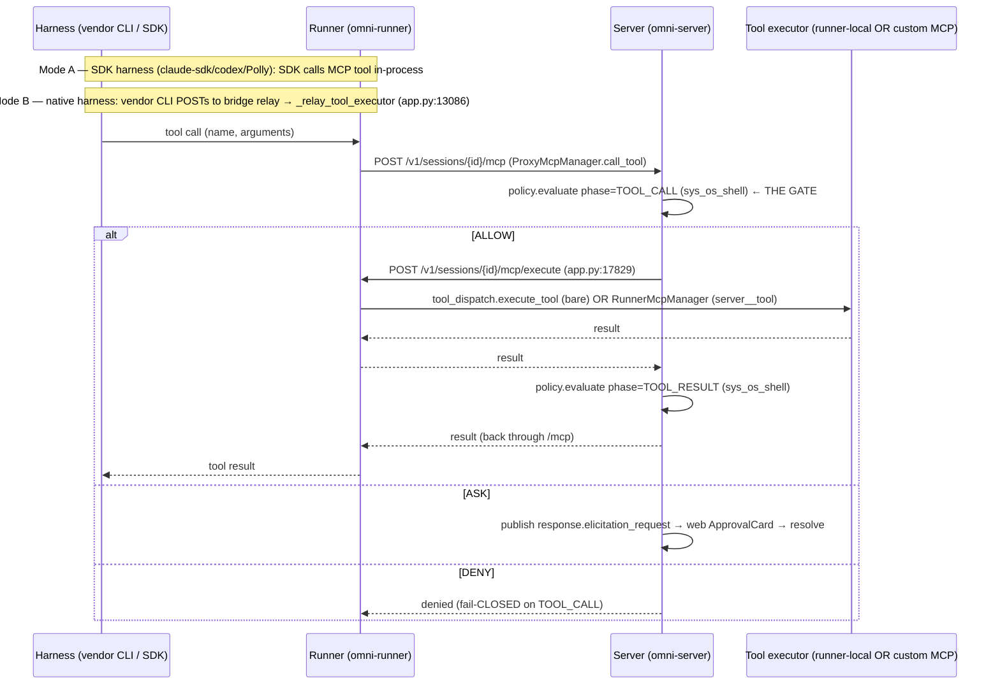
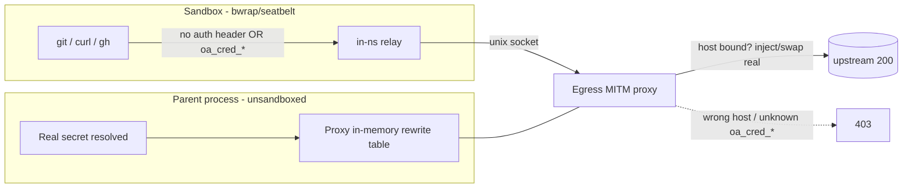

# Architecture — Tools / MCP / Sandbox (OmniBox) / Shells / Timers

SME scope: the **tool surface** (`sys_*` builtins + custom MCP), the **OS sandbox**
("OmniBox"), **shells/terminals**, **timers**, **async/inbox**. Code is ground
truth; every mechanism is `file:line`-anchored and (where possible) corroborated by
the live trace corpus.

---

## Overview

A turn's tool surface is assembled in two independent places:

1. **`ToolManager`** (`omnigent/tools/manager.py`) — registers the **builtin tools**
   the LLM sees (`sys_os_*`, `sys_terminal_*`, async/inbox, timers, sub-agents,
   agents, models, policy, comments, skills, web, upload/download). It does **not**
   register MCP tools.
2. **`RunnerMcpManager`** (`omnigent/runner/mcp_manager.py`) — owns the lifecycle of
   **user-declared MCP servers** (`tools.mcp` YAML), pools them (8-entry LRU), and
   exposes their tools namespaced as `{server}__{tool}`.

At dispatch time **both** kinds flow through one seam: the harness calls a tool →
runner `ProxyMcpManager` POSTs to the **server** `/v1/sessions/{id}/mcp` (policy gate)
→ server POSTs back to the **runner** `/v1/sessions/{id}/mcp/execute` (execution). The
runner runs builtin/local tools via `tool_dispatch.execute_tool` and namespaced MCP
tools via `RunnerMcpManager`. (Routing mechanics are owned by the RUNNER SME — see
cross-reference below; this doc owns the tool **definitions** + sandbox/shell mechanics.)

"OmniBox" is **not** a web component — it is the **OS-level sandbox** an
`OSEnvironment` runs inside: filesystem isolation + a default-deny L7 egress proxy +
secretless credential injection.

---

## Key files (file:line)

### Tool registration (`ToolManager`)
- `omnigent/tools/manager.py:105` — `ToolManager.__init__`; registration order.
- `:186` `_register_policy_tools` (always) · `:200` `_register_async_inbox_tools`
  (gated `async_enabled`, **default True**) · `:231` `_register_timer_tools`
  (gated `timers`, **default False**) · `:266` `_register_skill_tools` ·
  `:288` `_register_builtin_tools` · `:374` `_register_sub_agent_tools` ·
  `:471` `_register_agent_mgmt_tools` (always) · `:490` `_register_task_lifecycle_tools`
  (always `sys_cancel_task`) · `:511` `_register_comment_tools` (always) ·
  `:525` `_register_os_env_tools` (gated `os_env`) · `:563` `_register_terminal_tools`
  (gated `terminals`).

### Builtin tool definitions
- `omnigent/tools/builtins/os_env.py` — `sys_os_read/write/edit/shell`; all four wrap one
  shared `OSEnvironment` (`build_os_env_tools` `:378`); `_OSEnvBackedTool.invoke` bridges
  sync→async via `asyncio.run` (`:153`).
- `omnigent/tools/builtins/sys_terminal.py` — `sys_terminal_launch/send/read/list/close`;
  `_resolve_cwd` precedence `:752`; `_has_meaningful_cwd` `:48`.
- `omnigent/tools/builtins/async_inbox.py` — `sys_call_async` `:129`, `sys_read_inbox` `:240`,
  `sys_cancel_async` `:334`, `sys_cancel_task` `:37`.
- `omnigent/tools/builtins/timer.py` — `SysTimerSetTool` `:49`, `SysTimerCancelTool` `:226`;
  sessions-native `_schedule_timer` → `NotImplementedError` `:220`.
- `omnigent/tools/builtins/spawn.py` — `sys_session_create/send/close/list/get_history/get_info/share`.
- `omnigent/tools/builtins/agents.py` — `sys_agent_get/download/list`.
- `omnigent/tools/builtins/list_models.py` — `sys_list_models`, `sys_advise_models`.
- `omnigent/tools/builtins/policy.py` — `sys_add_policy`, `sys_policy_registry`.

### Custom MCP
- `omnigent/spec/types.py:~847` — `MCPServerConfig` (transport `http`(SSE)/`stdio`, `url`/`headers`
  vs `command`/`args`/`env`, per-tool `timeout`/`retry`); allowlist field on the tool entry.
- `omnigent/runner/mcp_manager.py` — `RunnerMcpManager`; `_POOL_SPEC_CAPACITY = 8` `:45`;
  `compute_spec_hash` `:74`; `_mcp_tool_schema` namespacing `:99`; `_ensure_entry` `:457` /
  `_touch` `:470` / `_evict_if_needed` `:476`; inline elicitation callback `:182`.
- `omnigent/runner/proxy_mcp_manager.py:42` — `ProxyMcpManager`; `call_tool` `:178` POSTs to
  server `/v1/sessions/{id}/mcp`.

### Routing seam (cross-ref: RUNNER SME owns this)
- `omnigent/runner/app.py:13086` — `_relay_tool_executor` (native harness in-turn relay → `ProxyMcpManager`).
- `omnigent/runner/app.py:17829` — `POST /v1/sessions/{id}/mcp/execute` handler (runner executor; dispatches
  both namespaced MCP and bare local tools).
- `omnigent/runner/tool_dispatch.py:10` — `_OS_ENV_TOOLS` (sys_os_*), terminal/inbox families.
- `omnigent/server/routes/sessions.py:1077` — `_evaluate_tool_call_policy` (the TOOL_CALL gate on `/mcp`).

### OmniBox (OS sandbox)
- `omnigent/inner/sandbox.py` — `SandboxPolicy` `:49`, `resolve_sandbox` `:371`,
  `_default_sandbox_for_platform` `:806`, `run_launcher` (spawn-time wrap + activate) `:598`.
- `omnigent/inner/bwrap_sandbox.py` — Linux `linux_bwrap` (namespaces + `--ro-bind-try` +
  tmpfs dotfile mask + seccomp).
- `omnigent/inner/seatbelt_sandbox.py` — macOS `darwin_seatbelt` (SBPL via `sandbox-exec -f`).
- `omnigent/inner/windows_jobobject_sandbox.py` — Windows `windows_jobobject` (process-tree containment only).
- `omnigent/inner/egress/` (package; the doc's "`inner/egress.py`") — `rules.py` (DSL + DNS-safe host),
  `proxy.py` (MITM + private-IP/metadata block + credential rewrite), `controller.py`, `relay.py`, `ca.py`.
- `omnigent/inner/credential_proxy.py` — `prepare_credential_proxy_runtime` `:103`,
  `CredentialRewriteRule` `:51`, `_resolve_secret` `:156`.
- `omnigent/inner/os_env.py` — `OSEnvironment` / `_HelperProcessClient`; `shell()` `:294`,
  helper subprocess spawn `:547`.

### Terminals (shells)
- `omnigent/terminals/registry.py` — `TerminalRegistry.launch` `:160` (per-conversation, race-safe).
- `omnigent/terminals/pane_reaper.py` — **idle** reaper for native panes (`_DEFAULT_IDLE_TIMEOUT_S = 30min`).
- `omnigent/inner/terminal.py` — `TerminalInstance`; `reap_orphaned_terminals` (startup) `:581`;
  tmux `remain-on-exit on` `:156`.

---

## The `sys_*` tool surface — groups + gating

| Group | Tools | Registered by | Gating |
|---|---|---|---|
| **File/shell** | `sys_os_read`, `sys_os_write`, `sys_os_edit`, `sys_os_shell` | `_register_os_env_tools` `manager.py:525` | spec has `os_env:` (or pre-resolved `OSEnvironment` from `SessionResourceRegistry`) |
| **Terminals** | `sys_terminal_launch/send/read/list/close` | `_register_terminal_tools` `:563` | spec has non-empty `terminals:` |
| **Async/inbox** | `sys_call_async`, `sys_read_inbox`, `sys_cancel_async` | `_register_async_inbox_tools` `:200` | `async_enabled` (**default True**; `async: false` is the kill-switch) |
| **Task lifecycle** | `sys_cancel_task` | `_register_task_lifecycle_tools` `:490` | **always** (any async handle's system message points at it) |
| **Timers** | `sys_timer_set`, `sys_timer_cancel` | `_register_timer_tools` `:231` | `timers` (**default False**) ⚠️ sessions-native firing path unimplemented |
| **Sub-agents (read)** | `sys_session_list`, `sys_session_get_history`, `sys_session_get_info` | `_register_sub_agent_tools` `:374` | **always** (any agent can read main/siblings) |
| **Sub-agents (write)** | `sys_session_send`, `sys_session_close`, `sys_list_models`, `sys_advise_models` | `:446` | `tools.agents` (declared sub-agents) **OR** `spawn: true` |
| **Sub-agents (create)** | `sys_session_create` | `:468` | `spawn: true` only |
| **Sub-agents (share)** | `sys_session_share` | `:441` | own `agent_session_sharing` flag (`none`/`non-public`/`public`) |
| **Agents** | `sys_agent_get`, `sys_agent_download`, `sys_agent_list` | `_register_agent_mgmt_tools` `:471` | **always** (auth-gated server-side) |
| **Models** | `sys_list_models` | (also with sub-agent dispatch grant) | with dispatch grant |
| **Policy** | `sys_add_policy`, `sys_policy_registry` | `_register_policy_tools` `:186` | **always** |
| **Comments** | `list_comments`, `update_comment` | `_register_comment_tools` `:511` | **always** (framework-owned; cannot be spec-declared) |
| **Skills/web/files** | `load_skill`, `read_skill_file`, `web_search`, `web_fetch`, `upload_file`, `download_file`, `list_files`, `search_conversations`, `export_agent` | `_register_skill_tools` / `_register_builtin_tools` | `load_skill` always; rest declared in `tools.builtins` |

Key gating nuances:
- **Authority vs advertisement**: the opt-ins control *advertisement*. Spawn writes are
  child-only and `sys_session_share` is owner-authority-bounded; both are enforced at the
  server/dispatch layer regardless (`manager.py:420`).
- **`sys_os_*` collision guard**: registration raises `ValueError` if a `sys_os_*` name is
  already taken (`:555`) — defensive against double-registration.

---

## Custom (user-defined) MCP servers

**Declaration** (`tools.mcp` in agent YAML, `MCPServerConfig` `spec/types.py:~847`):
- `transport: "http"` (default) → SSE client (`mcp.client.sse.sse_client`); fields `url`,
  `headers`.
- `transport: "stdio"` → local subprocess (`mcp.client.stdio.stdio_client`); fields `command`,
  `args`, `env`. The validator rejects HTTP fields on stdio and vice-versa.
- Per-server tool **allowlist** (bare names; checked in `_mcp_tool_schema` `:129`), plus
  `timeout`/`retry` (inherit `tools.timeout`/`tools.retry`).

**Pooling** (`RunnerMcpManager`):
- Lazy connect; entries keyed by **spec hash** (`compute_spec_hash` over `spec.mcp_servers` +
  stdio cwd `:74`).
- **8-entry LRU** (`_POOL_SPEC_CAPACITY = 8` `:45`); `_touch` moves most-recent to tail
  (`:470`); `_evict_if_needed` pops the head and closes its connections async (`:476`–`:497`).
- Tools namespaced **`{server}__{tool}`** (double-underscore) so two servers' identically-named
  tools never collide (`:139`).
- **Inline elicitation**: a custom MCP server can request approval mid-call via
  `elicitation/create`; the callback (`_build_elicitation_callback` `:182`) POSTs a
  `mcp_elicitation` event to the Omnigent server → web approval card → resolved → swapped back.
  When no server client is wired, elicitations are **declined** (`:218`).

> Cross-ref (RUNNER SME): pool lifecycle, prewarm, `tools/list`, and the actual outbound
> `tools/call` to each MCP server live in `runner/mcp_manager.py` and the `/mcp/execute` handler.
> This doc owns the *declaration shape*, *namespacing*, *allowlist*, and *LRU* facts.

---

## MCP routing — the two modes + the unified gate



- **In-turn relay (native harnesses)**: the vendor CLI (Claude Code, codex) POSTs its tool
  calls to a localhost bridge HTTP relay (Bearer-token auth); `_relay_tool_executor`
  (`app.py:13086`) hands them to `ProxyMcpManager` so the **same server-side policy gate**
  applies as for SDK harnesses.
- **Out-of-turn (workspace tools)**: the native bridge launches its **own** MCP stdio server
  via the `serve-mcp` subcommand (`claude_native_bridge.py:3095`/`_serve_mcp` `:3116`), wired
  into Claude Code's `settings.json` `mcpServers` (`:1020`). This server exposes **only**
  `sys_os_*` against the workspace cwd, **no sandbox** — it's how the vendor CLI reads/edits
  files *outside* an active Omnigent turn. (Note: `serve-mcp` is the *native bridge's* argparse
  subcommand, **not** a top-level `omnigent` CLI command — corrects CUJ-ANALYSIS §2.C wording.)
- **The single gate**: regardless of harness, the **server** owns TOOL_CALL/TOOL_RESULT policy
  (it's the only party that calls `_evaluate_tool_call_policy`); the **runner** owns execution
  ("all tools run on the correct machine with the correct cwd and environment",
  `app.py:17834`). Runner has a fast-path ALLOW/DENY before dispatch; ASK escalates to server
  (per CUJ-ANALYSIS §2.D — `runner/policy.py`).

---

## Shells — two paths + cwd resolution

There are **two distinct ways a shell reaches an agent**:

1. **`sys_os_shell`** — a one-shot command run inside the agent's **shared `OSEnvironment`**
   (`os_env.shell()` `os_env.py:294`). All four `sys_os_*` tools share one `OSEnvironment`
   instance (`build_os_env_tools` os_env.py:378) so **cwd + sandbox + env stay consistent across
   calls** within a turn. The command runs in the (possibly sandboxed) helper subprocess.
2. **`sys_terminal_*`** — **persistent, named tmux panes** (`TerminalRegistry`,
   `inner/terminal.py`). State survives across turns within a conversation (keyed
   `(conversation_id, terminal_name, session_key)`). Panes use tmux `remain-on-exit on`
   (`terminal.py:156`) so a dead pane (and its session/server) is kept for inspection rather
   than auto-vanishing.

### Working-directory resolution precedence (`_resolve_cwd`, `sys_terminal.py:752`)

First match wins:
1. **LLM `cwd_override`** (already vetted against the terminal spec's `allow_cwd_override`).
2. **`terminal.os_env.cwd`** — the terminal spec's own cwd (skipped if `None`/`""`/`"."`/`"./"`
   per `_has_meaningful_cwd` `:48`, or the legacy `"inherit"` string sentinel).
3. **`spec.os_env.cwd`** — the agent's primary os_env cwd (same meaningful-cwd test).
4. **`ctx.workspace`** — the per-task workspace Omnigent creates in `runtime/workflow.py`.
5. *(implicit 5th)* If all four miss, `_resolve_cwd` returns **`None`** and the caller falls
   back to the **host/runner cwd** (mirrors legacy behavior; docstring `:776`).

The trace confirms tier 4/5: the `sys_os_shell` result carried
`cwd=/Users/.../omnigent-worktrees/traces` (the runner workspace).

### Orphan + idle reaping (two separate reapers)
- **Orphan reaper** (`reap_orphaned_terminals` `terminal.py:581`): runs at **runner startup**.
  Each instance dir records its **owner pid** at creation; the sweep kills the tmux server of
  every instance whose owner pid is **gone** (`tmux -S <sock> kill-server`) and removes the dir.
  Dirs without an owner-pid marker are left alone (older/foreign). Fixes the leak where a
  SIGKILL'd runner orphans one tmux server per session.
- **Idle pane reaper** (`pane_reaper.py`, issue #1349): a background loop that reaps a **native
  harness pane** after a **30-minute** idle window (`_DEFAULT_IDLE_TIMEOUT_S`, env
  `OMNIGENT_NATIVE_PANE_IDLE_TIMEOUT_S`, `0` disables). "Busy" is a 3-signal check with a
  second re-check immediately before teardown to close the select→reap race; teardown is
  pane-scoped (only the one native pane, scoped via `NATIVE_PANE_TERMINAL_NAMES`).

---

## OmniBox — the OS sandbox (3 backend types × 3 isolation layers)

### Backend resolution (`inner/sandbox.py`)
`resolve_sandbox(spec, cwd)` `:371`: if `sandbox.type == "none"` → inert policy (and it errors
if `none` tries to restrict reads/writes/network `:379`). Otherwise the platform default
(`_default_sandbox_for_platform` `:806`) is chosen at **parse** time (not run time), then the
backend's `.resolve()` builds a `SandboxPolicy`:

| Platform default | `type_name` | Mechanism |
|---|---|---|
| Linux | `linux_bwrap` | bubblewrap: mount/PID/UTS/IPC namespaces (`--unshare-*`) + `--ro-bind-try` read roots + tmpfs dotfile mask + `--proc`/`--dev` + **hardened seccomp denylist** (k8s baseline + clone/ptrace/etc.) |
| macOS | `darwin_seatbelt` | `sandbox-exec -f <profile>` SBPL: `(deny default)` baseline + selective `(allow ...)`; **no namespaces, no seccomp** (capability-level only) |
| Windows | `windows_jobobject` | Job Object process-tree containment + resource limits; **no filesystem/network isolation** |
| any (explicit) | `none` | no sandbox (the only opt-out) |

`caller_process` / `fork` / `sandbox` are the three **`OSEnvironment` modes** (per CUJ-ANALYSIS
§2.C: `caller_process` = no isolation/in-process; `fork` = workspace copy; `sandbox` = one of the
backends above). Fail-loud: a host missing the chosen backend's binary errors at sandbox **build**
time (`bwrap_sandbox.resolve` raises with an install hint), not silently unsandboxed.

The launcher (`run_launcher` `:598`) does a **spawn-time wrap re-exec** for bwrap/seatbelt
(`_SPAWN_WRAP_BACKENDS` `:41`): it re-execs itself under `bwrap`/`sandbox-exec` (via an inline
`python -c` so the script file isn't needed inside the fresh tmpfs `/tmp` `:670`), guarded by the
`OMNIGENT_LAUNCHER_SPAWN_WRAPPED` marker to break the loop. It strips runner-auth secrets from
the env first (`:622`) and prunes to `spawn_env_allowlist` (`:632`) so host env can't leak in.

### Layer 1 — filesystem isolation
- **bwrap**: hermetic root; only granted paths bound `--ro-bind-try` (read) / `--bind-try`
  (write `write_files`); cwd bound at its real absolute path; **every dotfile/dotdir in cwd is
  tmpfs-masked** unless its basename is in `cwd_allow_hidden` (`.venv` whitelisted by default)
  — masking is *invisibility* (the masked path doesn't exist in the view). `--clearenv`/`--setenv`
  deliberately **avoided** (argv is world-readable via `/proc/<pid>/cmdline`); env pruning is done
  in-process instead.
- **seatbelt**: `$HOME` is hidden by the `(deny default)` baseline (no explicit subpath deny);
  masking is **access-deny, not invisibility** (a masked file `stat`s but reads `EPERM`); SBPL is
  **deny-wins** (`sandbox-exec` evaluates deny as last-match).

### Layer 2 — default-deny L7 egress proxy (`inner/egress/`)
- **Rule DSL** (`rules.py`): `METHODS host/path-glob`; default **deny** (`check_request` `:185`).
- **DNS-safe host allowlist** (`_DNS_SAFE_HOST_RE` `:49`, `is_dns_safe_host` `:52`): rejects any
  byte outside `[A-Za-z0-9.-]` — closes the NUL-truncation / percent-encoding / CRLF-injection
  parser-differential smuggling class (explicitly cites the Claude Code sandbox-runtime CVE fix).
- **Private-destination blocking** (`proxy.py`, default `block_private_destinations=True` `:201`):
  the proxy **resolves the host once** before connecting (`_resolve_and_validate` `:914`) and
  refuses any non-globally-routable IP — RFC1918, loopback, link-local, ULA, reserved, TEST-NET,
  **CGNAT/100.64**, multicast, and **cloud-metadata traps** (`169.254.169.254`,
  Azure WireServer `168.63.129.16` `_CLOUD_TRAP_NETWORKS` `:124`). Resolve-**once** defeats DNS
  rebinding (public on first lookup, private on the second). Toggle:
  `OSEnvSandboxSpec.egress_allow_private_destinations`.
- **MITM**: terminates TLS with a per-sandbox CA (`ca.py`); the in-namespace relay (`relay.py`)
  forwards over a Unix socket to the parent proxy (the only egress path, which is why
  credential injection is safe — a tool can't open a raw socket around it).

### Layer 3 — secretless credential injection (`inner/credential_proxy.py` + `egress/proxy.py`)
Two models (default = swap-on-access, nothing credential-shaped in the sandbox):
- **Swap-on-access (default)**: parent resolves the real secret
  (`prepare_credential_proxy_runtime` `:103`; sources `env`/`file`/`command` `_resolve_secret`
  `:156`) and hands the proxy a `CredentialRewriteRule` (`:51`). A tool fires its request with
  **no `Authorization`**; the proxy injects `Authorization: <scheme> <real>` for the bound host
  (`_rewrite_authorization` `:1084`, swap-on-access branch `:1145`).
- **Opt-in placeholder injection** (for clients like `gh` that gate on a local token): the parent
  mints a single-use `oa_cred_*` placeholder (`secrets.token_urlsafe(24)` `:141`) and injects
  **only the placeholder** into the configured env var. The client sends the placeholder; the
  proxy swaps it for the real secret (`:1129`).
- **Leak guard**: a placeholder presented for a host it isn't bound to → **HTTP 403** (`:1135`);
  an unknown `oa_cred_*`-shaped value → 403. A real, non-placeholder `Authorization` the client
  set itself is **forwarded untouched** and suppresses injection (no-clobber `:1125`).
- The real secret lives **only** in the parent + the proxy's in-memory table; it is **never** in
  `SandboxPolicy.to_jsonable` (so it can't reach logs/dumps — `sandbox.py:151` comment), never on
  argv, never written to disk in the sandbox.



> Known SECURITY gap (CUJ-ANALYSIS §gaps): `_resolve_secret` runs parent-side
> `subprocess.run(..., shell=True)` (`credential_proxy.py:190`) + arbitrary file reads on a
> "trusted-spec-only" assumption (issue #1542, no PR).

---

## Timers + Async/Inbox (tool definitions; runtime owned by RUNTIME SME)

- **Timers** (`timer.py`, gated `timers: true`, default False): `sys_timer_set` generates a
  `timer_id` and returns **synchronously** (`:179`); the firing later arrives as a
  `[System: timer X fired]` system message via the **same `async_work_complete` drain** as
  `sys_call_async` (with `kind="timer"` so it doesn't block end-of-turn auto-collect,
  `manager.py:170`). ⚠️ **On the sessions-native path the firing workflow is unimplemented** —
  `_schedule_timer` raises `NotImplementedError` (`timer.py:220`) and `sys_timer_cancel` returns
  a no-active-timer result.
- **Async/inbox** (`async_inbox.py`, gated `async_enabled`, default True): `sys_call_async`
  fire-and-forget dispatch; results drain via the `async_work_complete` inbox, pulled explicitly
  by `sys_read_inbox` (`:240`) or auto-collected at the top of each loop iteration
  (`_drain_async_completions`, RUNTIME-owned). `sys_cancel_async` is a thin alias over the
  always-registered `sys_cancel_task`.

---

## Trace evidence (corpus `conv_63542a5f92e24956812e19b104eac0e9`, `sys_os_shell` of `echo TRACETEST123`)

The `POST /events` trace **`cfb59197f6f9`** shows the exact MCP+policy chain (services in brackets):

```
omni-server [internal] policy.evaluate            phase=REQUEST     dec=ALLOW  ← POST /events
omni-server [internal] policy.evaluate            phase=LLM_REQUEST dec=ALLOW  ← /policies/evaluate
omni-server [server  ] POST /v1/sessions/{id}/mcp                             ← omni-runner:POST   (runner→server)
omni-server [internal] policy.evaluate            phase=TOOL_CALL   dec=ALLOW tool=sys_os_shell  ← /mcp   (THE GATE)
omni-runner [server  ] POST /v1/sessions/{id}/mcp/execute                     ← omni-server:POST  (server→runner exec)
omni-server [internal] policy.evaluate            phase=TOOL_RESULT dec=ALLOW tool=sys_os_shell  ← /mcp
omni-server [internal] policy.evaluate            phase=LLM_RESPONSE dec=ALLOW ← /policies/evaluate
```

Separately, trace **`f98feda729f6`** (the harness's OpenInference span tree):
```
omni-harness [internal] agent:claude-sdk
omni-harness [internal]   tool:sys_os_shell   (openinference.span.kind=TOOL, tool.name=sys_os_shell)  ← agent:claude-sdk
```

Other corroborating spans seen for this conv:
- `omni-runner GET /v1/sessions/{id}/resources/terminals` (traces `906c…`, `7c4b…`) — the runner
  probing the **terminal registry** for the session (confirms `sys_terminal_*` registry is live).
- `policy.evaluate` `policy.content` for TOOL_CALL =
  `{"name":"sys_os_shell","arguments":{"command":"echo TRACETEST123"}}` and TOOL_RESULT carried
  `cwd=/Users/.../traces` — confirming cwd-resolution tier 4/5 (runner workspace) and that the
  result flows back through the server's policy stage.

This is the gold case: the mechanism is confirmed by **both** code (`/mcp` gate +
`/mcp/execute` exec) **and** trace (the 4 policy phases + the server↔runner edges + the
OpenInference `tool:sys_os_shell` span).

---

## Per-harness differences

| Harness | Tool surface delivery | Workspace (out-of-turn) tools | Sandbox notes |
|---|---|---|---|
| **claude-sdk** | SDK calls MCP tools in-process; `tool:` span on omni-harness; all gating via `ToolManager(spec)` | n/a (SDK is the turn) | sandboxed `OSEnvironment` when spec sets `os_env`; macOS sandboxed claude-sdk **crashes** instead of degrading (issue #517 part-1 unfixed) |
| **claude-native** | vendor CLI → bridge relay → `_relay_tool_executor` → `ProxyMcpManager` (same gate); relay advertises only names `ToolManager(spec)` registered | `serve-mcp` MCP stdio in `settings.json`; **only `sys_os_*`**, workspace cwd, **no sandbox** (`claude_native_bridge.py:3116`) | in-turn tools still hit the server policy gate |
| **codex** (SDK) | structurally identical to claude-sdk (no live trace — creds expired 403) | n/a | same `OSEnvironment` machinery |
| **codex-native** | structurally analogous to claude-native (its own bridge relay; no live trace) | analogous serve-mcp workspace path | — |
| **polly** (custom agents) | runs on a host harness (typically claude-sdk) and **inherits its tool behavior**; `ToolManager` registers from the custom agent's spec (`os_env`/`terminals`/`tools.mcp` as declared) | inherits host harness | inherits host harness sandbox |

---

## Failure branches & gaps

- **Sandbox missing backend binary** → fail-loud at sandbox build (bwrap/seatbelt `.resolve()` raises).
- **macOS sandboxed claude-sdk** → **crashes** rather than degrading (issue #517 part-1, no PR;
  part-2 flag #541 landed). CUJ-ANALYSIS §gaps.
- **Egress**: any non-globally-routable resolution → `PermissionError`/403; DNS rebinding defeated by
  resolve-once; IPv6 literals + Unicode IDNs rejected by the DNS-safe-host allowlist (documented limit).
- **Credential proxy**: wrong-host placeholder / unknown `oa_cred_*` → **403**; misconfigured/empty
  source → `ValueError` at helper start. SECURITY: parent-side `shell=True` + file reads (#1542, no PR).
- **Timers on sessions-native** → `NotImplementedError` (firing path never re-implemented on the runner).
- **MCP pool**: 9th distinct spec evicts the LRU head and closes its connections async; a custom MCP
  inline elicitation with no server client wired → **declined**.
- **Terminal launch**: tmux not on PATH or pane exits before ready → `RuntimeError` (wrapped as JSON
  error envelope by the tool); concurrent same-key launch → second-arrival wins, loser closed.

---

## Open questions / cross-references
- **RUNNER SME** owns: `RunnerMcpManager` pool lifecycle/prewarm, the outbound `tools/call` to each
  MCP server, `runner/policy.py` fast-path, the `/mcp/execute` dispatch internals.
- **RUNTIME SME** owns: `async_work_complete` drain (`_drain_async_completions`), inbox queue
  mechanics, the timer **firing** task (where it would live once implemented).
- **POLICY SME** owns: `_evaluate_tool_call_policy`, elicitation registry, the fail-closed/fail-open
  phase set. (This doc only notes the 4 policy phases seen in the trace.)
- Confirm whether the `fork` `OSEnvironment` mode shares the same `_resolve_cwd`/egress wiring as
  `sandbox` (it reuses `OSEnvironment` but with a workspace copy — not separately traced here).
