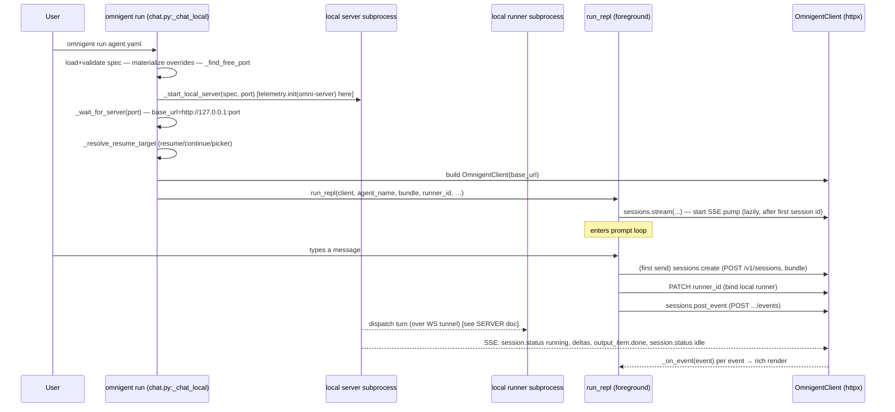
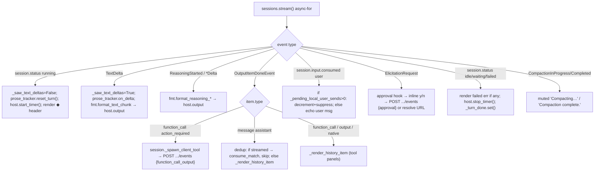

# TUI / REPL Client — Architecture

> Scope: the interactive terminal client (`omnigent/repl/`) + the client transport
> (`OmnigentClient`, the single `httpx.AsyncClient`), and how `omnigent run` (default
> mode) wires the REPL as an HTTP client to a spawned local server.
> **Source of truth = code.** Trace evidence is thin by design (corpus is headless;
> see §Trace evidence). Cross-references the SERVER doc for server internals.

---

## 1. Overview

The Omnigent TUI ("the REPL") is a `rich` / `prompt_toolkit` terminal front-end that is
a **pure HTTP/SSE client of an Omnigent server** — it has no in-process runner or harness.
It speaks the **same `/v1/sessions/*` REST + SSE surface the web UI uses**, but a *strict
subset* of it (no WebSocket `/sessions/updates`, no `/switch-agent`, no projects/sharing/
comments/policy-admin routes).

Two things to keep distinct:

- **`run_repl()`** (`omnigent/repl/_repl.py:2936`) — the interactive loop: rich streaming
  renderer, slash commands, `@`-file completer, approval prompts, resume/theme pickers,
  `--debug-events` tape.
- **`OmnigentClient`** (`sdks/python-client/omnigent_client/_client.py:21`) — the typed
  SDK that owns the single `httpx.AsyncClient` and exposes namespaces
  (`sessions`, `files`, `responses`). The REPL drives **everything** through
  `client.sessions.*`.

The glue between them is **`_SessionsChatReplAdapter`** (`_repl.py:1234`): a sessions-API
adapter that owns a persistent SSE pump and a push-based `_on_event` callback. It is
duck-compatible with the legacy `Session` surface (`send`, `cancel`, `model`,
`is_streaming`, `set_model_override`, `set_reasoning_effort`, …) so the REPL code is
transport-agnostic.

`omnigent run <agent>` (default, no URL) launches a **local server subprocess**, waits for
it to come up, then opens `run_repl()` pointed at `http://127.0.0.1:<port>`
(`omnigent/chat.py:_chat_local:2042`). So even "local" runs are client↔server over loopback
HTTP — the REPL is never in-process with the server.

---

## 2. Key files (file:line)

| File | What it owns |
|---|---|
| `omnigent/repl/_repl.py:2936` `run_repl()` | The interactive loop; rich rendering; slash dispatch; pickers wiring |
| `omnigent/repl/_repl.py:1234` `_SessionsChatReplAdapter` | Sessions-API adapter: SSE pump, `_on_event`, `send`, control methods |
| `omnigent/repl/_repl.py:2012` `_subscribe_session_stream` (pump body) | Persistent `GET /v1/sessions/{id}/stream` subscription + auto-reconnect |
| `omnigent/repl/_repl.py:3230` `_render_session_event` | Push-based renderer (the `_on_event` callback); dedup/reconciliation |
| `omnigent/repl/_repl.py:2787` `_TurnProseTracker` | Streamed-prose dedup (byte-equal multiset match) |
| `omnigent/repl/_repl.py:8254` `handle_slash_command`; `:4508` `COMMANDS`; `:4511` `@_cmd()` | Slash-command registry + dispatch |
| `omnigent/repl/_resume_picker.py:197` `pick_conversation` | Interactive resume picker (prompt_toolkit + line-buffered fallback) |
| `omnigent/repl/_event_tape.py:211` `EventTape` | `--debug-events` SSE event tape (ring buffer + Ctrl+E overlay) |
| `omnigent/repl/_theme_picker.py:288` `startup_theme_picker` | First-run dark/light theme picker |
| `omnigent/repl/_session_log.py`, `_tmux_pane.py` | `/logs` zip dump; native tmux attach helpers |
| `sdks/python-client/omnigent_client/_client.py:21` `OmnigentClient` | The single `httpx.AsyncClient` + namespaces |
| `sdks/python-client/omnigent_client/_sessions.py:307` `SessionsNamespace` | The full REST surface the TUI uses |
| `sdks/python-client/omnigent_client/_sessions.py:980` `stream()` / `:1018` `_stream_session_events` | SSE GET + parse |
| `sdks/python-client/omnigent_client/_sse.py:86` `parse_sse_stream` | SSE framing → typed events |
| `omnigent/chat.py:2042` `_chat_local` | `omnigent run` default-mode wiring (spawn server → REPL) |
| `omnigent/conversation_browser.py:61` `conversation_url` / `:94` `open_conversation_url` | "open in browser" link |
| `omnigent/runtime/telemetry.py:1072` `init` / `:392` `_instrument_httpx` | OTel init + httpx instrumentation (NB: no `omni-tui` caller) |

---

## 3. The single httpx client (`OmnigentClient`)

`OmnigentClient.__init__` (`_client.py:57-97`) creates **one** `httpx.AsyncClient`
(`self._http`) and hands it to all three namespaces. Notable:

- **One SSE-tuned timeout for everything** (`_client.py:74-93`): `connect=30s, read=600s,
  write=30s, pool=30s`. The 600s read timeout is deliberate — tool calls can hold the SSE
  stream open for minutes (the public `timeout=` ctor arg is accepted-but-ignored to keep
  back-compat).
- **Sentinel `Origin` header** = `OMNIGENT_INTERNAL_WS_ORIGIN` (`_client.py:86`) so the
  server's `require_trusted_origin` CSRF guard on multipart routes (session-create bundle
  upload, file upload) lets the SDK through (the SDK is a non-browser client and sends no
  Origin of its own). Caller headers win on conflict.
- **`auth: httpx.Auth | None`** (`_client.py:91`): when set, runs on **every** request →
  transparent OAuth/Databricks token refresh. For local `run`, auth is `None` (loopback);
  for remote/workspace targets it's a `_DatabricksTokenAuth` (`chat.py:687`) or static
  bearer headers (`chat.py:_server_headers:796`).

The REPL receives a pre-built `OmnigentClient` and passes it into `_SessionsChatReplAdapter`
(`_repl.py:3133-3149`).

---

## 4. The full TUI → server request surface

Enumerated from `SessionsNamespace` (`_sessions.py`) and the REPL call sites. **All over the
one `httpx.AsyncClient`; all under `/v1/`.** "consumed by REPL" = a method the REPL actually
calls.

| Method (SDK) | Wire call | Used by REPL for | file:line |
|---|---|---|---|
| `sessions.create` | `POST /v1/sessions` (multipart bundle) | first turn of a new session (lazy, on first `send`) | `_sessions.py:338` |
| `sessions.post_event` | `POST /v1/sessions/{id}/events` | send user message; **interrupt**; **compact**; **approval** verdict; client-tool output | `_sessions.py:814` |
| `sessions.get` | `GET /v1/sessions/{id}` | snapshot (metadata, status); turn-done backstop poll | `_sessions.py:793` |
| `sessions.stream` | `GET /v1/sessions/{id}/stream` (SSE) | the live event stream (one persistent subscription) | `_sessions.py:980` |
| `sessions.list` | `GET /v1/sessions` | resume picker, `/switch`, `/history` | `_sessions.py:394` |
| `sessions.list_items` | `GET /v1/sessions/{id}/items` | `/history`, `/context`, log dump | `_sessions.py:648` |
| `sessions.child_sessions[_tree]` | `GET /v1/sessions/{id}/child_sessions` | subagent ↓-selector tree | `_sessions.py:684,717` |
| `sessions.bind_runner` / `unbind_runner` | `PATCH /v1/sessions/{id}` `{runner_id}` | bind/recover the local runner (owner path only) | `_sessions.py:450,481` |
| `sessions.set_model_override` | `PATCH /v1/sessions/{id}` `{model_override}` | `/model` | `_sessions.py:535` |
| `sessions.set_reasoning_effort` | `PATCH /v1/sessions/{id}` `{reasoning_effort}` | `/effort` | `_sessions.py:504` |
| `sessions.compact` (→ post_event) | `POST .../events` `{type:compact}` | `/compact` | `_sessions.py:941` |
| `sessions.interrupt` (→ post_event) | `POST .../events` `{type:interrupt}` | `/cancel`, Ctrl+C | `_sessions.py:959` |
| `sessions.resolve_elicitation` | `POST /v1/sessions/{id}/elicitations/{eid}/resolve` | approval via dedicated URL (alt path) | `_sessions.py:845` |
| `sessions.fork` | `POST /v1/sessions/{src}/fork` | `/fork` | `_sessions.py:887` |
| `sessions.set_archived` / `set_external_session_id` | `PATCH /v1/sessions/{id}` | (available; archival/native-id) | `_sessions.py:580,613` |
| `files.for_session(id).upload` | `POST /v1/sessions/{id}/files` (multipart) | `@`-file / `--file` attachments | `_files.py` |
| `_fetch_agent_tools` | `GET /v1/sessions/{id}/agent` | client-tool validation; `/model` harness readout | `_client.py:303` |

Plus a handful of **raw `httpx.get`** probes in `chat.py` that bypass the SDK (carry no
`httpx.Auth`): `GET /v1/sessions/{id}` wrapper-label probe (`chat.py:1352`), `GET /v1/info`
accounts probe (`chat.py:1597`), runner-status poll (`chat.py:1989`).

**The single most important contrast with the web UI:** the TUI has **no
`WS /v1/sessions/updates`** and **no `WS /health/subscribe`**. There is no sidebar to keep
live, so the TUI never opens the watch-set websocket. The only live channel is the
**one SSE stream for the *currently displayed* session**. Sub-agent state in the ↓-selector
rides that same parent SSE stream as `session.created` / `session.child_session.updated`
events (`_repl.py:3425 _apply_child_session_event`), not a separate subscription.

Also web-only (no SDK method, mentioned only in a comment at `_sessions.py:129`):
**`POST /v1/sessions/{id}/switch-agent`**. The TUI's `/switch` does NOT switch agent in
place — it **re-points the SSE stream to a different existing session**
(`_repl.py:2695 switch_session`).

---

## 5. Data flow

### 5a. `omnigent run <agent>` → REPL (default local mode)

`_chat_local` (`chat.py:2042`) is the entry; it spawns the server (`_start_local_server`),
waits (`_wait_for_server`), resolves the resume target, bundles the agent, then calls
`_chat_with_server` → `run_repl`. The local **runner** is a separate subprocess the REPL
binds via `PATCH /v1/sessions/{id} {runner_id}` and keeps alive via a 1 Hz watchdog
(`_runner_recover_watch`, `_repl.py:1403`). On URL/remote targets (`omnigent run <url>` /
`omnigent attach`) there is no spawned server/runner — the REPL is a pure co-drive client
(`attach_only=True`, `_repl.py:1306`) that never PATCHes the runner binding.

### 5b. One turn: SSE pump + push-based render

`send()` (`_repl.py:2102`) just POSTs the message, sets `_is_streaming=True`, increments
`_pending_local_user_sends`, and awaits `_turn_done` (with a 1 Hz `sessions.get` snapshot
**backstop poll** at `_repl.py:2196-2209`, because httpx's ASGI transport doesn't flush
streaming chunks eagerly so the SSE pump may miss the terminal event). All rendering is in
the pump's `_on_event` — there is **no per-send drain loop**; the pump runs continuously and
also renders **autonomous/between-send turns**.

---

## 6. Channels & message/event types

**Outbound (REST):** see §4 table. Send body shape:
`{"type":"message","data":{"role":"user","content":[{"type":"input_text","text":…}]}}`
with optional `model_override` field (`_repl.py:2159-2164`). Control events:
`{"type":"interrupt","data":{}}`, `{"type":"compact","data":{}}`,
`{"type":"approval",…}` / function-call-output events.

**Inbound (one SSE stream, `GET /v1/sessions/{id}/stream`):** the server's typed
`ServerStreamEvent` union, parsed by `_sessions.py:_parse_sse_lines` → Pydantic. The REPL
consumes (translated to SDK-shape dataclasses by `_server_event_to_sdk_event`,
`_repl.py:1123`):

- Lifecycle: `response.created/queued/in_progress/completed/failed/incomplete/cancelled`
- `session.status` (`running` / `idle` / `waiting` / `failed`) — **the turn-state driver**
- `session.input.consumed` — user-echo + optimistic-bubble reconciliation
- `response.output_text.delta` (`TextDelta`)
- `response.reasoning.started` / `.text.delta` / `.summary.text.delta`
- `response.output_item.done` (`function_call`, `function_call_output`, `message`,
  native-tool items, `slash_command`)
- `response.output_file.done`
- `response.elicitation_request` / `elicitation_resolved`
- `response.compaction.in_progress` / `.completed`
- `response.client_task.cancel` (cancel a local client-tool task)
- `session.agent_changed`, `session.created`, `session.child_session.updated`
- `response.error`, `response.retry`

**SSE framing** (`_sse.py:86-127`, `_sessions.py:1051-1089`): `event: <type>\n` then
`data: <json>\n\n`; bare `data: [DONE]` terminates. Unknown event types / malformed
payloads are logged + skipped (forward-compatible). The framing is parsed identically on
both the SDK's typed-event path (`_sse.py`) and the raw envelope path (`_sessions.py`).

---

## 7. Streaming ↔ durable reconciliation (dedup) — **TUI differs from web**

The CUJ question: *does the TUI dedupe by `itemId` like the web?* **No.**

- **Web UI** (`web/src/lib/blockStream.ts`, per CUJ-ANALYSIS §2.E:258-260): persisted items
  are **deduped by `ctx.itemId`** so a stream-delivered item doesn't double-render.
- **TUI** dedupes by **byte-equal text matching with multiset semantics** via
  `_TurnProseTracker` (`_repl.py:2787-2883`), **not** by item id:
  - On each `TextDelta`: `_saw_text_deltas=True` + `prose_tracker.on_delta(delta)`
    (`_repl.py:3446-3447`).
  - At a content-block boundary (tool call, or the `message` item),
    `_flush_inflight_assistant_text()` commits the in-flight segment and records its joined
    text (`_repl.py:3171-3211`).
  - When a `message`/assistant `output_item.done` arrives, the renderer checks
    `_saw_text_deltas` and, if the deltas already committed (the relay persists each prose
    segment at the tool-call boundary and re-publishes it as `output_item.done` *after*
    `_saw_text_deltas` was reset), calls `prose_tracker.consume_match(item)` to match the
    item's joined `output_text` against a committed segment. A match ⇒ **suppress** (it's the
    persisted copy of prose the user already watched stream). A miss ⇒ **render** (genuinely
    non-streamed message) (`_repl.py:3586-3596`).
  - `_plan_output_item_render` (`_repl.py:2752`) centralizes the
    `flush_inflight_text` vs `render_item` decision given `saw_text_deltas`.

Why text-match not item-id: the streaming text deltas carry **no item id** (they're raw
`response.output_text.delta` with just a `delta` string), so the TUI has nothing to key on
until the durable `message` item lands — and by then the boundary has already flushed. The
multiset (consume-on-match) guards against a turn that legitimately emits two identical
segments (the second published item matches the second committed entry).

**User-message reconciliation:** the TUI's analogue of the web's optimistic-bubble-until-
`session.input.consumed` is the `_pending_local_user_sends` counter (`_repl.py:2171`,
`3384-3385`): a locally-typed message is echoed immediately by the input loop, so when its
`session.input.consumed` arrives on the stream it's **suppressed** (counter decremented).
A message that arrives with no pending local send (e.g. a co-drive message from the web UI
on the same session) **is** echoed. Same idea for skill `slash_command` items
(`_pending_local_skill_slash_commands`, `_repl.py:3571`).

**Tool-call dedup:** `_SessionsChatReplAdapter`/SessionsChat track
`completed_tool_call_ids` (`sdks/.../_sessions_chat.py:982`) so a tool-call-end hook fires
once even if the server echoes the output item; the REPL also keys live tool metadata by
`call_id` in `_live_call_id_to_tool_metadata` (`_repl.py:3629`).

---

## 8. "Working" state in the TUI

Driven entirely by **`session.status`** on the SSE stream (NOT by `response.created/completed`):

- `status == "running"` → `host.start_timer()` (`_repl.py:3290`) + render the `◆ <agent>`
  response-start header. The `TerminalHost` (`omnigent_ui_sdk`) shows a live spinner/elapsed
  timer while the timer runs.
- `status in ("idle","waiting","failed")` → `host.stop_timer()` (`_repl.py:3343`) and
  `_turn_done.set()` (unblocks `send()`); a `failed` status with no preceding
  `response.failed` (e.g. SETUP-phase failure) is rendered as an error line via
  `_render_failed_status_error` (`_repl.py:2886`) so the spinner never "just vanishes."
- The same `idle/waiting/failed` check is **duplicated in the pump itself**
  (`_repl.py:2043-2050`) so `_turn_done` fires even when `_on_event` is not wired (headless
  adapter use / tests).
- `is_streaming` property (`_repl.py:1465+`) is the client-side "a turn is in flight" flag,
  set in `send()` and read by slash commands to append "(current response unchanged)" when
  the user changes model/effort mid-turn.
- The **final elapsed time** ("12.3s") is rendered by the formatter's response-end block
  (`_repl.py:659-673`).

So the TUI computes working-state locally from the status events, whereas the web derives a
sidebar badge from `status` + `pending_elicitations_count` over the WS updates stream
(CUJ-ANALYSIS §2.E:261-262). Both bottom out on the same server `status`.

---

## 9. Slash commands → API mapping

Registry: `@_cmd()` decorator (`_repl.py:4511`) → `COMMANDS` dict (`:4508`); dispatch
`handle_slash_command(arg, session, client, host, fmt)` (`:8254-8293`). Input lines
starting with `/` (and no second `/`) route here (`_repl.py:3869-3871`).

| Command (aliases) | Handler | What it does | API call |
|---|---|---|---|
| `/help` (`/?`) | `_cmd_help` `:4525` | grouped help | — (local) |
| `/theme` | `_cmd_theme` `:4574` | light/dark | `host.set_theme` + `update_user_config` (local, `~/.omnigent/config.yaml`) |
| `/effort [level]` | `_cmd_effort` `:4654` | show/set reasoning effort | `session.set_reasoning_effort` → **PATCH /v1/sessions/{id}** `{reasoning_effort}` |
| `/model [name]` | `_cmd_model` `:4974` | show/set LLM override | `session.set_model_override` → **PATCH /v1/sessions/{id}** `{model_override}` (pre-session: cached, applied on first turn) |
| `/new` | `_cmd_new` `:5139` | new conversation, keep scrollback | re-point adapter (new session id) |
| `/clear` | `_cmd_clear` `:5159` | clear screen + new conv | re-point adapter |
| `/switch` | `_cmd_switch` `:5181` | pick a prior session, re-point | `sessions.list` + `switch_session` (re-points SSE) — **NOT** `/switch-agent` |
| `/fork` | `_cmd_fork` `:5402` | fork conversation | `sessions.fork` → **POST /v1/sessions/{src}/fork** |
| `/history` | `_cmd_history` `:5463` | show transcript | `sessions.list_items` → GET .../items |
| `/context` | `_cmd_context` `:5870` | context-window usage tree | `sessions.list_items` + local estimate |
| `/compact` | `_cmd_compact` `:5831` | compact context | `session.compact` → **POST .../events** `{type:compact}` |
| `/cancel` | `_cmd_cancel` `:5934` | interrupt in-flight turn | `session.cancel` → **POST .../events** `{type:interrupt}` |
| `/logs` | `_cmd_logs` `:6009` | zip session logs | `write_logs_zip` (local; pulls items via API) |
| `/report` | `_cmd_report` `:6074` | open GitHub issue | `webbrowser.open` (local) |
| `/quit` (`/exit`) | `_cmd_quit` `:6120` | exit REPL | `host.request_exit` (local) |
| `/<skill>` (dynamic) | `register_skill_commands` `:8104`, `_make_handler` `:8157` | run a custom skill | `session.send_skill_slash_command` → **POST .../events** `{type:slash_command}` |

**Resume is not a slash command** — it's a CLI flag (`--resume`/`-r` opens the picker,
`--continue` resumes latest, `--resume <id>` resumes a specific conv) handled before the loop
by pre-seeding `resume_conversation_id` into the adapter (`_repl.py:1283-1286`,
`chat.py:_resolve_resume_target`). The adapter then attaches to that session on first `send`.

`@`-file completion: `FileMentionCompleter` (`omnigent_ui_sdk.terminal._completer`,
imported `_repl.py:58`, wired via `merge_completers([_SlashCommandCompleter(),
FileMentionCompleter()])` at `_repl.py:3068`). Triggers on a `@` at position 0 or preceded
by whitespace (so `user@host.com` does NOT trigger); lists non-hidden files under the cwd
respecting `.gitignore` (`_completer.py:_at_mention_query`, `_list_files`). At submit time
`@path` tokens resolve to file attachments uploaded via `files.for_session(id).upload`.

---

## 10. Resume picker, event tape, `--debug-events`

### Resume picker (`_resume_picker.py`)
- Entry `pick_conversation(...)` (`:197`); SDK-backed list fetchers
  `pick_conversation_from_sdk` (`:878`, `client.sessions.list(limit=200, agent_id=…,
  order="desc")`), `…_by_wrapper_label_from_sdk` (`:909`, native-harness filter),
  `…_cross_agent_from_sdk` (`:949`); store-backed `pick_conversation_from_store` (`:974`,
  reads the local conversation store directly).
- **TTY path** = prompt_toolkit `Application` (`:447`, `FormattedTextControl`): ↑/↓ move,
  Enter select, n/p page (10/page, `_PAGE_SIZE`), q/Esc/Ctrl-D cancel; rows show
  **title · created_at · [workspace] · id · [runtime badge]** + a latest-message preview
  glyph (`:642-830`). **Non-TTY fallback** = line-buffered Rich render (`:281`, `:1023`).
- Returns the selected `conversation_id` string (or `None` on cancel). Used by
  `chat.py:_resolve_resume_target` after the server boots.

### Event tape — `--debug-events` (`_event_tape.py`)
- `EventTape` (`:211`) = `deque[TapeEntry]` ring buffer, `maxlen=_TAPE_CAPACITY=500`
  (`:33,235`). Lazily created only when `debug_events` (`_repl.py:3082-3085`); zero overhead
  otherwise.
- Each `TapeEntry` (`:115`) records the full **render pipeline journey** per event: `ts`,
  `delta_ms`, `raw_event_type`, `sdk_translation`, `formatter_result`, `stage_reached`
  (RAW→TRANSLATED→FORMATTED→RENDERED), `path` ("sessions"|"blockstream"), `raw_payload`
  (JSON snapshot), `formatted_items`. The renderer instruments every branch:
  `record_raw` → `update_translation` → `update_format` → `mark_rendered`
  (e.g. `_repl.py:3276,3280,3305,3309`).
- **Ctrl+E** opens the "SSE Event Tape" overlay (`_repl.py:4263`): a sidebar of events
  (type, `+Nms`, stage icon 🟢🟡🔴) + a detail panel (pipeline stages, raw JSON,
  counters `ev:/tx:/fmt:/out:`); gaps >1000ms flagged "⚠ GAP" (`_event_tape.py:37,445`).
  Toolbar shows live `PipelineCounters` (`:160,195`).
- When `--debug-events` is on, entries are also appended as **JSONL** to a debug log path
  (shown in Ctrl+O) (`_repl.py:3079-3081`, `_maybe_log_tape_entry`).

### Theme picker (`_theme_picker.py`)
- `startup_theme_picker()` (`:288`) — first-run dark/light chooser; OSC-11 background probe
  pre-selects (`:306`); raw termios ↑/↓/k/j loop; persists via
  `update_user_config(theme=...)` to `~/.omnigent/config.yaml` (`:312,324,379`).

---

## 11. Trace evidence (and the `omni-tui` gap)

The corpus (`scratchpad/corpus/*.json`) was generated by **headless `-p` runs**, which do
**not** exercise the interactive REPL — so there are **no `omni-tui` spans** to validate
against. Confirmed empirically: service names present across all three corpus files are
exactly **`omni-server` (52), `omni-runner` (23), `omni-harness` (8)** — no `omni-tui`,
`omni-host`, or `omni-web`.

How a TUI turn *would* carry trace context (code path):

- `OmnigentClient` builds a plain `httpx.AsyncClient` over standard transports
  (`_client.py:89`). The process-wide `HTTPXClientInstrumentor().instrument()`
  (`telemetry.py:392-409`) patches **all** standard-transport httpx clients to inject the
  W3C `traceparent` header + emit a client span. So **if telemetry were initialized in the
  REPL process**, every `client.sessions.*` call (and the SSE GET) would emit a client span
  and propagate context to the server (whose FastAPI instrumentation continues the trace) —
  yielding the `omni-tui → omni-server → omni-runner → omni-harness` single-trace shape the
  design doc describes.
- **But the code never calls `telemetry.init("omni-tui")`.** A repo-wide search shows the
  only `telemetry.init(...)` callers are `omni-server` (`cli.py:3079`, inside the *server*
  bootstrap), `omni-runner` (`runner/_entry.py:902`), `omni-host` (`host/connect.py:1608`),
  `omni-harness` (`runtime/harnesses/_runner.py:363`). The `omnigent run` / `run_repl`
  foreground process — the one that owns the TUI's httpx client — initializes **no**
  telemetry, so today the TUI client emits **no spans** (and even if `OTEL_*` env were set
  in that process, the service would default to `"omnigent"`, not `"omni-tui"`).
- **`omni-tui` exists only in the design doc** (`designs/OBSERVABILITY.md:269,370,374-375`,
  which claims a single TUI turn spans `omni-tui → omni-server → …`). **This is a
  doc-vs-code mismatch** — there is no code that produces `omni-tui` spans. (Contrast:
  `omni-web` *is* wired — `web/src/lib/telemetry.ts:40` defaults browser spans to
  `omni-web`.)

So: the *mechanism* (HTTPX instrumentation + `traceparent` over the loopback hop) is in
place and would Just Work, but the **client-process telemetry init for the TUI is missing**.
See §13 Open questions.

---

## 12. Per-harness differences (from the TUI's POV)

The TUI is harness-agnostic for the **SDK** harnesses (claude-sdk, codex, polly-on-claude-
sdk): `run_repl` drives the same sessions API regardless; the harness only changes what the
server/runner do and which events come back (e.g. native harnesses persist reasoning +
transcript; SDK harnesses recompute). `--harness` just seeds the `/model` readout's harness
label before the first turn binds (`_repl.py:1300-1305`).

**Native harnesses are NOT driven by the REPL.** A native session (claude-native, codex-
native, cursor/kimi/etc.) is driven by the vendor TUI in a runner-owned tmux pane, and a
forwarder mirrors that transcript into the conversation. Resuming a native conversation
through `omnigent run --resume` would double-record (one Omnigent turn per message *and* the
forwarder mirroring the same message), so `chat.py` **redirects** native resumes back to the
vendor wrapper command (`_redirect_native_resume_if_needed:1029`, e.g.
`_run_cursor_native_resume_redirect:1254`, `_run_kimi_native_resume_redirect:1294`). The
wrapper-label probe (`chat.py:_wrapper_label_for_conversation:1332`) reads
`labels.omnigent.wrapper` from a `GET /v1/sessions/{id}` snapshot to decide. So for native
harnesses the "TUI" the user sees is the *vendor's* TUI (attached via `_tmux_pane.py`), not
`run_repl`. (codex/codex-native: no live trace — creds expired.)

`/effort` valid values are family-aware in the handler
(`none/minimal/low/medium/high/xhigh/max`, `_repl.py:4626`) matching
`omnigent/reasoning_effort.py` per-family sets.

---

## 13. Failure branches & gaps

- **SSE auto-reconnect with backoff** (`_repl.py:2056-2100`): recoverable transport errors
  (peer-closed mid-chunk, read timeout) → one-line INFO + reconnect (0.5s→5s backoff);
  on reconnect it also re-recovers/re-binds the local runner. The server does **no replay**
  on reconnect (`_sessions.py:989`), so a terminal event landing in a reconnect gap is
  caught by the `sessions.get` backstop poll in `send()` — but a *between-send* autonomous
  turn's missed terminal event has no such backstop (only the next stream reconnect + status
  catch-up). 
- **ASGI no-eager-flush** → the 1 Hz snapshot poll in `send()` (`_repl.py:2196-2209`) is the
  load-bearing backstop for turn completion on the loopback transport.
- **Dedup is text-equality, not id-based** → two assistant segments that are byte-identical
  *and* one was non-streamed could in principle be mis-suppressed; the multiset consume-on-
  match mitigates the common case but is structurally weaker than the web's `itemId` dedup.
- **Native resume mis-route** → relies on a best-effort label probe; if the probe fails
  (flaky server) it falls back to the normal REPL path, which would double-record a native
  conversation (`chat.py:1357-1392` returns `None` on error → normal path).
- **`omni-tui` telemetry not wired** (see §11) → TUI turns are invisible in Jaeger today.

---

## 14. Open questions

1. **Is the missing `omni-tui` telemetry init intentional?** The mechanism is fully present
   (httpx instrumentation + W3C propagation); only the `telemetry.init("omni-tui")` call in
   the `run`/`run_repl` process is absent. Should `run_repl` (or `_chat_local`/`_chat_with_
   server`) call `telemetry.init("omni-tui")` so the design-doc trace shape materializes?
2. **Does the between-send (autonomous turn) path have a turn-done backstop** equivalent to
   `send()`'s 1 Hz poll, or does it depend entirely on SSE liveness?
3. **Should the TUI move to id-based dedup** to match the web (`ctx.itemId`), now that
   `output_item.done` carries item ids — or is the delta stream's lack of ids the blocker?
4. Confirm the exact `files` upload route shape (`_files.py`) — listed here as
   `POST /v1/sessions/{id}/files` from call sites; verify against the SERVER doc.
