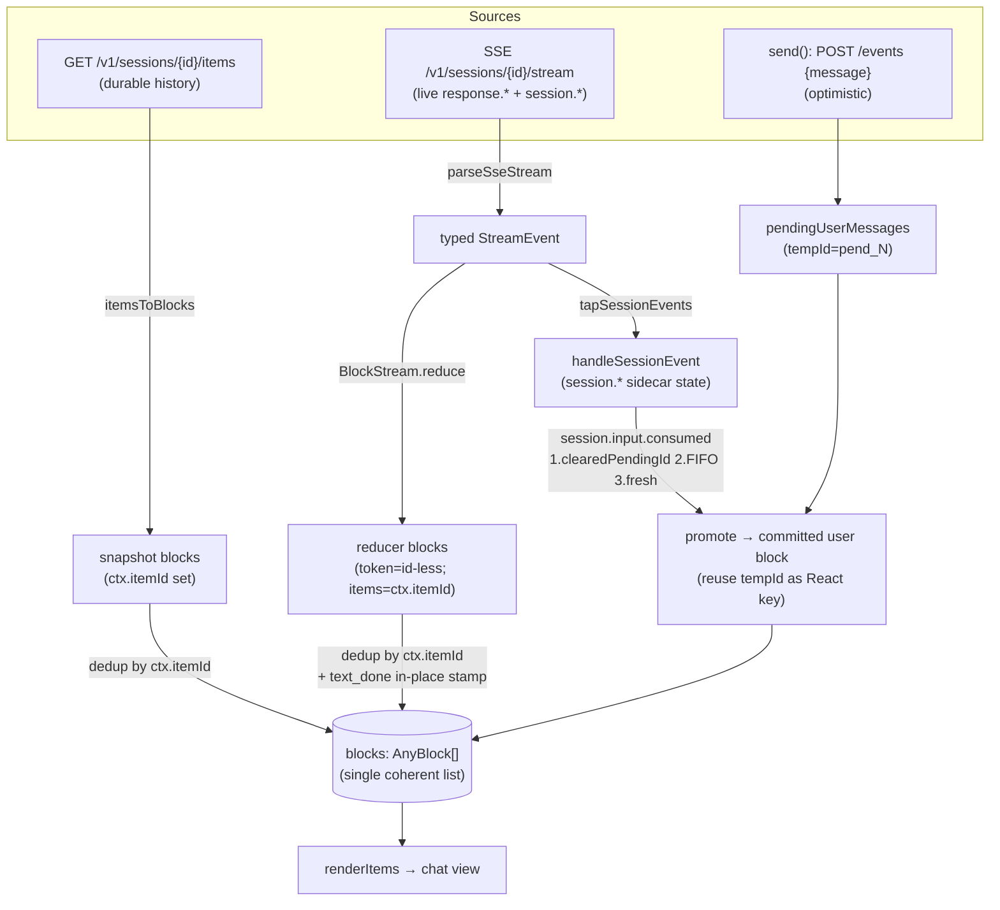

# Web UI Architecture (`web/src/`)

> Scope: the Omnigent React/TypeScript web client. **Code is ground truth.**
> Web telemetry is **opt-in** (`web/src/lib/telemetry.ts`, only active when
> `VITE_OTEL_EXPORTER_OTLP_ENDPOINT` is set), so there are **no live `omni-web`
> spans** in the running Jaeger / saved corpus (confirmed). This is a
> code-based analysis. Where the browser *does* trace, it injects a W3C
> `traceparent` on every fetch/XHR so the trace begins at the user's click and
> continues into `omni-server` (FastAPI-instrumented).

---

## 1. Overview

The web client is a single-page React app (TanStack Query for server cache,
Zustand for the active-chat streaming store). Two long-lived realtime channels
plus a family of REST calls make up its entire surface:

1. **`WS /v1/sessions/updates`** — the sidebar's live feed. The client sends a
   *watch-set* (the conversation ids it's displaying); the server replies with a
   snapshot then `changed`/`removed` deltas + heartbeats. Replaces the old 4 s
   `GET /v1/sessions` poll (`lib/sessionUpdatesSocket.ts`,
   `hooks/SessionUpdatesProvider.tsx`).
2. **`SSE GET /v1/sessions/{id}/stream`** — the open chat's live-tail. One
   stream per active conversation, owned by `store/chatStore.ts`. Carries both
   the **task-scoped** `response.*` vocabulary and the **session-scoped**
   `session.*` vocabulary. Holding it open also registers the user as a
   **presence viewer**.
3. **REST `/v1/...`** — everything else: create/list/patch/delete sessions,
   post events (messages / interrupt / approval / stop / compact /
   slash_command), fork, switch-agent, items pagination, projects, hosts /
   runners, agents, policies, comments, files, terminals list, users search,
   `/v1/info`, `/health`.

The central design problem the web client solves is **reconciling the ephemeral
streaming view with the durable persisted transcript into one coherent block
list** — `lib/blockStream.ts` (the streaming reducer) + `store/chatStore.ts`
(the merge), deduping by `ctx.itemId`. That merge is detailed in §4.

All network egress funnels through two seams so the app runs identically
standalone or embedded in a host (e.g. the Databricks monolith):
`authenticatedFetch` / `hostFetch` for HTTP and `resolveWebSocketUrl` for WS
(`lib/host.ts`, `lib/identity.ts`).

---

## 2. Key files (file:line)

| File | Role |
|---|---|
| `web/src/store/chatStore.ts` (4221 lines) | Zustand store for the active session: SSE pump, send/stop/approval, streaming↔durable merge, pending bubbles, reconnect. |
| `web/src/lib/blockStream.ts:921` `BlockStream` | The streaming **reducer** — hand-port of the Python `_stream.py`. Turns typed `StreamEvent`s into render `AnyBlock`s; dedup sets for tool calls/results; reasoning↔text closure. |
| `web/src/lib/sse.ts:102` `parseSseStream`, `:269` `parseEvent` | SSE byte-stream → typed `StreamEvent`. Hand-port of `_sse.py`. Detects `[DONE]` sentinel vs. transport drop. |
| `web/src/lib/sessionsApi.ts` | Typed client for `/v1/sessions/*` (create, fork, switch-agent, patch, events, items, stream, approve/resolve, stop, launchRunner). |
| `web/src/lib/sessionUpdatesSocket.ts:73` `SessionUpdatesSocket` | Singleton transport for `WS /v1/sessions/updates`: watch-set, reconnect backoff, heartbeat watchdog. |
| `web/src/hooks/SessionUpdatesProvider.tsx:131` | Wires WS frames into the TanStack `["conversations"]` / `["project-sessions"]` cache; derives + pushes the watch-set. |
| `web/src/hooks/useConversations.ts` | `GET /v1/sessions` infinite query (cursor pagination 20/page, `sort_by=updated_at&order=desc`, `search_query`), plus rename/archive/delete/move-project/stop mutations; projects hooks. |
| `web/src/hooks/useSessionState.ts:21` `getSessionState` | Derives the sidebar badge: `awaiting > running > none`. |
| `web/src/hooks/useSessionLiveness.ts:187` | Open-session liveness truth table (online / starting / runner_asleep / host_asleep / host_offline / local_stranded / unknown) from `runner_online`+`host_online`. |
| `web/src/hooks/useRunnerHealth.ts` / `RunnerHealthProvider.tsx` | `GET /health?session_ids=` poll (open session + fallback), folds `runner_online`/`host_online`. |
| `web/src/lib/host.ts:136/143` `hostFetch`/`resolveWebSocketUrl` | Embed seam: HTTP + WS URL resolution (standalone vs host-injected). |
| `web/src/lib/CapabilitiesContext.tsx` + `lib/capabilities.ts:96` `resolveServerInfo` | `GET /v1/info` probe; gates accounts/sandbox/smart-routing UI. |
| `web/src/components/blocks/TerminalView.tsx:417/440` | Terminal-attach **WS** URL builder (`/v1/sessions/{id}/resources/terminals/{tid}/attach?read_only=`). |
| `web/src/lib/telemetry.ts:33` `initBrowserTelemetry` | Opt-in browser OTel (WebTracerProvider + fetch/XHR instrumentation), only when `VITE_OTEL_EXPORTER_OTLP_ENDPOINT` set. |

---

## 3. Channels & message/event types

### 3.1 `WS /v1/sessions/updates` (sidebar live feed)

Client→server: a single JSON frame whenever the watch-set changes —
`{type:"watch", session_ids:[...]}` (`sessionUpdatesSocket.ts:242`). The id list
is NEVER trusted for authz; the server access-checks each id against the
connection's user (docstring `:13-17`).

Server→client frames (`sessionUpdatesSocket.ts:23-27`):
- `{type:"snapshot", items:[SessionListWireItem]}` — full state of the watch-set on connect / re-watch.
- `{type:"changed", items:[...]}` — field deltas (status, runner_online, host_online, pending_elicitations_count, title, comments fingerprint, …).
- `{type:"removed", ids:[...]}` — sessions left the watch-set / deleted.
- `{type:"heartbeat"}` — keepalive every ~30 s when idle.

Transport behavior:
- Reconnect backoff 250 ms→5 s, ±50% jitter (`nextReconnectDelay`, `:50`).
- **Heartbeat watchdog** `HEARTBEAT_WATCHDOG_MS = 70_000` (`:48`): if no frame
  of any kind (even unparseable) arrives in 70 s (>2× heartbeat), force a
  reconnect — guards a silently half-open socket. Any inbound message re-arms it
  (`:249`).
- While connected, `useConversations` suspends its HTTP poll for non-visible
  consumers; the visible sidebar keeps a low-rate reconcile
  (`CONNECTED_STREAM_REFETCH_INTERVAL_MS = 60_000`). While disconnected, all
  consumers fall back to `DISCONNECTED_STREAM_REFETCH_INTERVAL_MS = 45_000`
  (`useConversations.ts:41-42, 240-245`).

The provider applies frames into the cache in place
(`applyItemsToCache` → `mergeItemsIntoPages`), and only schedules a debounced
`invalidateQueries(["conversations"])` (250 ms) for structural changes it can't
reconstruct locally: a watched id missing from every page (a new session whose
sort position is unknown), membership-affecting filter changes, or `updated_at`
re-sort (`SessionUpdatesProvider.tsx:240-249`). Comment fingerprints
(`count:updated_at`) drive `invalidate(["comments", id])` so the CommentsPanel
refreshes on external mutations (`:206-217`).

### 3.2 `SSE GET /v1/sessions/{id}/stream` (open chat live-tail)

Opened by `openSessionStream` (`sessionsApi.ts:921`) with `Accept:
text/event-stream`, an `AbortSignal`, and `?idle=true` when the presence-idle
tracker says so (the stream URL is the **entire presence uplink**, so an idle
flip mid-view arrives as a reconnect carrying the new value).

Wire format parsed by `parseSseStream` (`sse.ts:102`): standard
`event: <type>\n data: <json>\n\n`, terminated by a bare `data: [DONE]`. Uses
`getReader()` (not `for await…of`) for iOS Safari < 17.4 compat. The parser
distinguishes a clean server close (`sawDone=true`) from a transport drop
(stream ended without `[DONE]`) — that decides whether `startStreamPump`
reconnects.

`parseEvent` (`sse.ts:269`) recognises two event families:

**Task-scoped `response.*`** → drive the chat bubble:
`response.created|queued|in_progress|completed|failed|incomplete|cancelled`,
`response.output_text.delta`, `response.reasoning.started`,
`response.reasoning_text.delta`, `response.reasoning_summary_text.delta`,
`response.output_item.done` (→ `function_call`, `function_call_output`,
`message`, `error`, `slash_command`, `routing_decision`, `terminal_command`,
native-tool items), `response.output_file.done`, `response.retry`,
`response.error`, `response.compaction.{in_progress,completed,failed}`,
`response.client_task.cancel`, `response.heartbeat` (no-op),
`response.elicitation_request`, `response.elicitation_resolved`,
`response.policy_denied`.

**Session-scoped `session.*`** → drive store sidecar state (not the reducer):
`session.status` (idle/launching/running/waiting/failed + `background_task_count`),
`session.usage` (context tokens/window, cost, per-model usage),
`session.model`, `session.reasoning_effort`, `session.collaboration_mode`,
`session.agent_changed`, `session.todos`, `session.terminal_pending`,
`session.sandbox_status`, **`session.input.consumed`** (the durable promotion
trigger — see §4), `session.interrupted`, `session.created` (sub-agent spawn),
`session.superseded` (e.g. Claude `/clear` → follow to new conv),
`session.resource.{created,deleted}` (terminals), `session.child_session.updated`,
`session.changed_files.invalidated`, `session.terminal.activity`,
`session.skills`, `session.model_options`, `session.presence` (full-state viewer
list).

The pump *taps* `session.*` for side effects (`tapSessionEvents` →
`handleSessionEvent`, `chatStore.ts:3412`) **before** feeding the reducer; the
reducer (`blockStream.ts`) is a pure block factory and intentionally ignores all
`session.*` events except by listing them as no-ops (`blockStream.ts:896-908`).

### 3.3 Terminal-attach WS

`ws(s)://…/v1/sessions/{id}/resources/terminals/{tid}/attach[?read_only=true]`
(`TerminalView.tsx:417,440`) — xterm.js ↔ runner tmux pane. Identity rides the
transport (browser can't set `X-Forwarded-Email` on a WS handshake; ingress/dev
proxy carries it). Read-only attach for viewers without write access.

### 3.4 REST `/v1/...` — see the request table in `cuj-answers/web-client.md`.

---

## 4. Streaming ↔ durable reconciliation (the core merge)

This is the headline question. The web client maintains **one flat `blocks:
AnyBlock[]`** that the renderer walks. It is filled from two sources that must
not double-render:

- **Durable (snapshot)** — `GET /v1/sessions/{id}/items` history (paged) →
  `itemsToBlocks(items)`. Each block carries `ctx.itemId` = the store-assigned
  conversation item id.
- **Streaming (SSE)** — live `response.*` events → `BlockStream.reduce` → blocks.
  Token/reasoning blocks are **id-less** while streaming; persisted items
  (`output_item.done` for `function_call`, `message`, etc.) carry `ctx.itemId`.

**The merge point is dedup by `ctx.itemId`.** Everywhere a snapshot and the live
pump can produce the same item, the client filters by item id so exactly one
copy survives (`chatStore.ts:15` design comment; enforced at
`:1455-1457` (send-path merge), `:1904-1907` (bind hydration),
`:2460-2463` (reconnect backfill), `:2961-2966` (commit-time recheck in the
pump's `flush`), `:3004-3008` (per-block stream→snapshot dedup in the pump)).

### 4.1 `pendingUserMessages` — held until `session.input.consumed`

A user message is optimistic: `send()` pushes a `PendingUserMessage`
(`tempId="pend_<n>"`) onto `pendingUserMessages` **before** the POST so the
bubble paints immediately and so a `session.input.consumed` that races ahead of
the POST response still finds an entry to promote (`chatStore.ts:791-821,
:127-144`). The renderer draws these *after* the `blocks`-derived bubbles, so
streaming output from a prior turn appends cleanly at the tail without positional
logic.

When `session.input.consumed` arrives (`handleSessionEvent` case at
`chatStore.ts:3724`), the pending bubble is **promoted into `blocks`** as a
committed user block carrying the server `item_id`. Three matchers, in precision
order:
1. **By id** — `clearedPendingId` (the server names the drained pending-input
   entry) → drop that exact bubble (`:3744-3770`).
2. **FIFO head** — for an optimistic bubble whose POST hasn't returned the id to
   adopt yet (consumed raced ahead), or a cross-client send. Per-session SSE
   ordering makes the head correct; **no text match** because native transcripts
   reformat text (`>` quotes, `[Attached:]` markers) (`:3772-3791`).
3. **No pending entry** — render the event payload fresh (a TUI-typed message or
   another client's send) (`:3793-3801`).

The promoted block reuses the optimistic bubble's `tempId` as its React
`stableKey` so the bubble **does not remount/flink** when it swaps from pending
to committed.

`is_meta` consumed events are ignored (`:3725`); `hasCommittedItem` guards
against double-promotion (`:3742`).

### 4.2 Persisted-vs-streamed text dedup (`text_done` stamping)

A streamed assistant message renders id-less from `output_text.delta` chunks. The
relay later publishes its persisted `output_item.done(message)` so the client
learns the store id — but by then a tool call / reasoning section often closed
the streamed text, so the reducer can't dedupe it. The pump **stamps the item id
onto the already-streamed `text_done` in place** (matching by
`responseId`+`fullText`, FIFO) rather than appending a second copy
(`chatStore.ts:3027-3069`). This keeps one copy in its streamed position AND lets
reconnect reconciliation (item-id-keyed) see the persisted item as already
rendered.

### 4.3 Native-terminal live-preview reconciliation

claude-native/codex-native stream provisional previews keyed
`live:<messageId>` (`LIVE_ITEM_PREFIX`) inserted at the position the first chunk
arrived (`applyLiveDelta`, `chatStore.ts:2802`). When the authoritative
`text_done` for the oldest in-flight message lands, the preview is **replaced in
place** so committed text keeps its streamed position above any later
tool/elicitation card (`:3071-3097`). The message id is retired so a trailing
late chunk can't re-create the preview.

### 4.4 The reducer's own dedup (within one response)

`blockStream.ts` carries per-response dedup sets, cleared on each
`response_created`/`response.in_progress`:
- `seenCallIds` — under the **claude-sdk MCP path**, a tool call surfaces as TWO
  `ToolCall` events sharing a `tool_use_id`-threaded callId (inline observed +
  post-stream action_required); keep the first call line, drop the second
  (`:511-531, :495-510`).
- `seenResultCallIds` — keyed `${responseId}:${callId}`; every action_required
  tool's result fires TWICE (inline from `_dispatch_action_required` + the
  `response.completed` flush) — render once (`:559-604`).

---

## 5. SSE pump lifecycle, reconnect & "close page and return"

`startStreamPump` (`chatStore.ts:2542`) is a reconnect loop owned by `switchTo`
(via `bindStream`). Properties:

- **Server-durable sessions.** The session keeps running on the server while the
  page is closed — nothing about closing the tab stops the turn. On
  return/refresh the client re-binds: `switchTo(id)` → `bindStream` opens a fresh
  SSE stream FIRST, then fetches the snapshot (`getSessionSlim` +
  `fetchInitialHistoryWindow`) concurrently and merges deduping by item id
  (`:1825-1907`). This is the documented reconnect contract (stream-then-snapshot,
  dedupe by id).
- **History window.** Bind hydrates only the most recent window
  (`SESSION_HISTORY_PAGE_SIZE = 20`, extended back to include the previous user
  prompt — `fetchInitialHistoryWindow`, `sessionsApi.ts:833`). Scroll-up
  `loadMoreHistory` pages older. Keeps opening a long transcript cheap.
- **Benign drops reconnect instantly.** Databricks Apps ingress hard-caps a
  single HTTP/2 stream at ~5 min; a drop after a *healthy* connection leaves
  `failedOpens=0` and reconnects with no delay. Only consecutive *failed opens*
  back off (250 ms→5 s) (`:2559-2565`).
- **`reconcileOnReconnect`** (`:2394`) runs on every reconnect (not the first
  connect): drops ephemeral in-flight blocks, then pages the items backward until
  the fetched window overlaps the pre-gap transcript (or hits start) so a gap
  longer than one page is fully recovered; splices unseen committed items at the
  right position; recovers `sessionStatus`/`activeResponse` so a gap-completed
  turn doesn't strand the spinner; reconciles ApprovalCards against the
  snapshot's `pending_elicitations`. All writes are `historyGeneration`-guarded.
- **Give-up cases.** 401/403/404 on stream open → mark session failed, stop
  (`:2600-2605`). `[DONE]`/`server_closed` and `switched`/`aborted` end the loop
  without retry.

### 5.1 Host offline → ReconnectSessionDialog

Liveness is derived by `useSessionLiveness` (`hooks/useSessionLiveness.ts:187`)
from the `/health` poll's `runner_online` + `host_online` (plus the WS stream's
copies). Truth table → 7 variants. The two **unreachable** dead-ends open
`ReconnectSessionDialog` (`ChatPage.tsx:1095-1105, :952`):
- `host_offline` — host-bound, host tunnel down, host NOT resumable from web
  (laptop/external host). Owner sees the CLI reconnect command; any viewer can
  fork to continue.
- `local_stranded` — not host-bound and runner down; restart from the user's own
  machine; fork is the escape hatch.

Resumable managed hosts instead read `host_asleep` (composer stays open; the next
message wakes the sandbox via the server's `resume_managed_host`) or `starting`
while a turn is waking it — **no dialog**. A fresh session within
`STARTING_GRACE_S = 45` reads `starting` (passive "Connecting…") rather than
flashing a banner during cold boot.

---

## 6. Sidebar fetching (`useConversations` + WS watch-set)

`useConversations(searchQuery, includeArchived)` (`useConversations.ts:216`) is a
TanStack `useInfiniteQuery` over `GET /v1/sessions`:
- Params: `order=desc`, `sort_by=updated_at`, `limit=20`, optional
  `search_query=` (server-side filter; caller debounces), optional
  `include_archived=true` (`fetchConversationsPage`, `:178-204`).
- Cursor: next page param = `last_id` while `has_more` (`:238-239`).
- The query key includes `searchQuery` + `includeArchived` so toggling either
  refetches.

Live freshness comes from the WS watch-set, NOT polling (§3.1). `pushWatched`
(`SessionUpdatesProvider.tsx:159`) collects ids from all `["conversations"]` +
`["project-sessions"]` cache variants and **unions the open session** (so an
off-sidebar child/sub-agent still gets streamed liveness), then
`setWatched(ids)` (no-op when unchanged). Mutations patch the cache in place to
dodge the server's **async search-index reindex** race: rename/delete overlay or
splice rows rather than invalidating (an immediate refetch can serve stale/ghost
rows from the search midtier) (`useConversations.ts:291-445`).

Grouping precedence (per `CUJ-ANALYSIS §2.E`, verified by code paths):
**Archived > Pinned > Project > Recent**. Pins are localStorage
(`omnigent:pinned-conversation-ids`), backfilled via per-id
`GET /v1/sessions/{id}` for pins outside the loaded window
(`usePinnedConversationBackfill`, `:619`). Projects are **implicit** (exist iff
≥1 non-archived session), stored as the reserved label `omni_project`
(`PROJECT_LABEL_KEY`, `:658`), fetched via `GET /v1/sessions/projects`
(`useProjects`, `:661`), each folder lazily paged via `?project=`
(`useProjectSessions`, `:786`).

### 6.1 Sidebar badge / "working" derivation

`getSessionState` (`useSessionState.ts:21`) reads only the **row's**
`status` + `pending_elicitations_count` (both arrive via the WS updates frames):
priority **awaiting (count>0) > running > none**. `failed` is deliberately NOT a
sidebar state (the chat surface is where you read what failed), and liveness is
deliberately NOT a sidebar badge anymore (it moved to the open-session view via
`useSessionLiveness`).

The **chat surface's** "Working…" indicator is a richer, separate notion:
`store/chatStore.ts:sessionStatus` (`idle|launching|running|waiting|failed`)
driven by `session.status` SSE events (`handleSessionEvent` case `:3585`), where
`waiting` = the parent loop parked on the async-work drain. The store also
**patches the active session's sidebar row in cache** on each `session.status`
event so the sidebar dot flips in lockstep with the chat's indicator instead of
lagging a reconcile (`patchConversationStatusInCache`, `:3694`).

---

## 7. Per-harness differences (web client's view)

The web client is harness-agnostic by design, but branches on a few
session-snapshot fields:

- **`isNativeTerminalSession`** (claude-native / codex-native, derived from the
  `omnigent.wrapper` label on bind): web messages are **NOT persisted at POST
  time** — they round-trip through the vendor TUI and reconcile via the
  forwarder's `session.input.consumed`, which can arrive **after** a transient
  `idle`/`failed`. So the idle-clear of `pendingUserMessages` is skipped for them
  (`chatStore.ts:3653-3667`), and they replay queued sends from the snapshot's
  `pending_inputs` on rebind.
- **`nativeVendorOwnsModel`** (qwen/goose/cursor/pi/opencode): the model is
  chosen inside the vendor TUI; the composer hides the model/effort label. claude-
  /codex-native DO expose an Omnigent model picker and keep it.
- **claude-native specifics**: `setModel` also injects `/model` into the tmux
  pane (`sessionsApi.updateSession` non-silent); `session.todos` SSE drives the
  TodoPanel; `slash_command` round-trips through tmux and pops the FIFO pending
  bubble with no `session.input.consumed` (`handleSessionEvent` case `:3804`);
  Stop hard-kills the tmux pane (`stopSession`).
- **claude-sdk MCP double-event dedup** lives in the reducer (§4.4) — only the
  MCP path emits two ToolCall/ToolResult events per call.
- **codex / codex-native**: no live trace (creds expired per brief). The web
  client treats codex-native like any native-terminal session; codex-native edits
  surface `codexCommand`/`exec` elicitations and a Plan-mode toggle
  (`codexPlanMode`).
- **polly / custom agents**: run on a harness (typically claude-sdk) and inherit
  its web behavior; the web client only knows them as a bound `agent_id` /
  `agent_name` on the session.

---

## 8. Failure branches & gaps

- **No `[DONE]` (transport drop)** → reconnect (instant if previously healthy).
  **401/403/404 on stream** → fail session, stop pump (`:2600`). **Reader/parse
  error** (e.g. `ERR_HTTP2_PROTOCOL_ERROR`) → treated as a drop, reconnect
  (`:3151-3156`).
- **Policy-denied input**: POST returns `{denied:true}` with no
  `session.input.consumed`; the store settles local state from the POST response
  (rolls back the optimistic bubble) instead of waiting on the stream
  (`:898-918`). Surfaces as `response.policy_denied` / a `policy_denied` block too.
- **WS updates half-open socket**: heartbeat watchdog (70 s) forces reconnect;
  consumers fall back to the 45 s HTTP poll while disconnected.
- **Background-tab throttling**: a tab can miss `elicitation_resolved`; on
  `visibilitychange→visible` the store reconciles pending elicitations against a
  fresh snapshot (`bindStream` `:1800-1808`).
- **Search-index reindex race**: rename/delete patch cache in place (never
  refetch immediately) to avoid resurrecting/stale-naming rows
  (`useConversations.ts:291-445`).
- **Stuck-pending bubble** (historical bug class): `switchTo` stashes only
  *unsettled* own sends (`pend_` ids, `posted!==true`) per conversation; settled
  sends defer to the server's `pending_inputs` replay; a content-equal twin from
  the snapshot drops the stash copy (`:1179-1217, :1932-1960`).
- **Known UI gaps (per `CUJ-ANALYSIS §2.E`, unverified by me)**: CJK IME Enter
  submits prematurely (#433); non-git Changes panel empty (#725); browser empty
  after reconnect (#386); mobile HTML preview/download (#968/#969). Tagged
  *(per doc — unverified)*.

---

## 9. Open questions

- Exact server-side shape of `SessionListWireItem` in WS frames vs.
  `GET /v1/sessions` (the client assumes parity via `nullsToUndefined`) — would
  confirm against `server/routes/sessions.py` (server SME).
- Whether the WS updates endpoint pushes `runner_online`/`host_online` reliably
  enough that the `/health` poll is purely a safety net, or if there are
  scenarios where only the poll updates them (the code comments suggest the host
  control plane doesn't push runner-reaped state, so the poll is still load-
  bearing — `useRunnerHealth.ts:22-23`). Server SME to confirm.
- Live `omni-web` traces are absent (telemetry opt-in). To validate the
  click→server `traceparent` continuation one would set
  `VITE_OTEL_EXPORTER_OTLP_ENDPOINT` and re-run — out of scope here.
