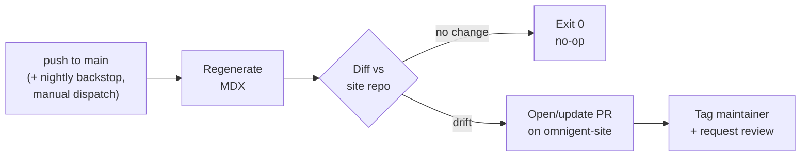

# Docs Auto-Generation & Sync to `omnigent-site`

## Goal

Keep the public docs site ([omnigent.ai/docs](https://omnigent.ai/docs), backed by [`omnigent-ai/omnigent-site`](https://github.com/omnigent-ai/omnigent-site)) in lockstep with `main` without anyone remembering to do it by hand. A job regenerates the machine-derived docs, opens a PR against the site repo when something drifted, and tags a maintainer to review — so a human still approves every change, but the diffing and PR plumbing is automated.

Today every doc page is **hand-authored prose** in the site repo. When a feature changes here — a new builtin policy, a renamed harness, a new API endpoint — nothing updates the site until someone remembers to. The result is reference docs that silently drift from shipped behavior and a recurring "did you update the site?" chore on PRs.

---

## Scope

**In scope** — the docs that are *derived from this repo* and can be regenerated deterministically:

> **Reality check (from inspecting both repos directly).**
>
> - The **source of truth is the feature code**, not the `docs/` folder. `docs/*.md` in this repo is internal/spec material (`AGENT_YAML_SPEC.md`, `POLICIES.md`, `OMNIGENT_BOT_SETUP.md`) — it is *not* the website's content source and is explicitly out of scope. The reference pages should be derived from the actual registries/catalogs in the `omnigent` package so they can never drift from shipped behavior.
> - The site is **already MDX** (migration complete on `main`, PRs #201–#209). All 23 content pages are `app/docs/**/page.mdx` — a short JS preamble (`import { pageMeta }` + `export const metadata = pageMeta(...)`) followed by a plain-markdown body (the only remaining `.js` is the editorial landing page `app/docs/page.js`). So the generator writes `.mdx` in that established shape, and generated + human-authored content share one diff-friendly, AI-writable format. There is still **no `openapi.json`-backed API-reference page and no SDK-reference page** — those would be new. See [Decision: generator emits MDX](#decision-generator-emits-mdx-site-migration-already-done).


| Feature source in `omnigent` (code)                                                                              | Page(s) in `omnigent-site`                                       | Live URL                                                                                                                                                                                                                     | Status                                                                                                                                                                                                                        |
| ---------------------------------------------------------------------------------------------------------------- | ---------------------------------------------------------------- | ---------------------------------------------------------------------------------------------------------------------------------------------------------------------------------------------------------------------------- | ----------------------------------------------------------------------------------------------------------------------------------------------------------------------------------------------------------------------------- |
| `openapi.json` ← `scripts/dump_openapi.py` (FastAPI app in `omnigent/server`)                                    | *(none — no API-reference section exists)*                        | *(none yet)*                                                                                                                                                                                                                 | **New page(s) to create**, e.g. `app/docs/reference/api/page.mdx`                                                                                                                                                             |
| Policy registry + builtins — `omnigent/policies/registry.py`, `schema.py`, `builtins/*.py`                       | `app/docs/policies/{overview,builtin,custom,os-sandbox}/page.mdx` | [overview](https://omnigent.ai/docs/policies/overview), [builtin](https://omnigent.ai/docs/policies/builtin), [custom](https://omnigent.ai/docs/policies/custom), [os-sandbox](https://omnigent.ai/docs/policies/os-sandbox) | Exists, hand-written; should be registry-derived                                                                                                                                                                              |
| Harness registry — `omnigent/runtime/harnesses/__init__.py` (`_HARNESS_MODULES`) + `omnigent/harness_aliases.py` | `app/docs/build/harnesses/page.mdx`                               | [build/harnesses](https://omnigent.ai/docs/build/harnesses)                                                                                                                                                                  | Exists, hand-written; should be code-derived — **needs a curated allowlist** (registry has ~12 keys incl. internal/alias spellings; page lists 3)                                                                             |
| Native coding agents — `omnigent/native_coding_agents.py` (`NATIVE_CODING_AGENTS` registry)                      | `app/docs/use/coding-agents/page.mdx`                             | [use/coding-agents](https://omnigent.ai/docs/use/coding-agents)                                                                                                                                                              | Exists, hand-written; should be registry-derived (same curated-allowlist caveat — registry has 4, page shows 2)                                                                                                               |
| Builtin example agents — `omnigent/resources/examples/{debby,polly}/` (agent specs)                              | `app/docs/use/builtin-agents/{,debby,polly}/page.mdx`             | [use/builtin-agents](https://omnigent.ai/docs/use/builtin-agents), [debby](https://omnigent.ai/docs/use/builtin-agents/debby), [polly](https://omnigent.ai/docs/use/builtin-agents/polly)                                    | Exists, hand-written; should be spec-derived                                                                                                                                                                                  |
| CLI — `omnigent/cli.py` `--help`                                                                                 | `app/docs/interact/terminal/page.mdx`                             | [interact/terminal](https://omnigent.ai/docs/interact/terminal)                                                                                                                                                              | Exists, hand-written; should be help-derived (the page uses the `omni` alias, not `omnigent` — generate help text under `omni` to avoid churn)                                                                                |


**Deliberately excluded** — checked every page under `app/docs/` (24 total); the following have no enumerable code/registry source and are editorial, so the job never touches them:

- `app/docs/page.js` (landing), `app/docs/use/custom-agents` (authoring how-to), `app/docs/build/prompts` (prompts are per-agent, not centrally enumerated)
- `app/docs/build/models` — `model_catalog.py` fetches models *live per provider over HTTP* (no static list to introspect in CI), and we don't want the page churning on every upstream model change, so it stays hand-authored
- `app/docs/build/tools` — mostly an editorial YAML-config guide (custom MCP servers, Python functions, sub-agents, inheritance). Its **"Bundled servers"** table (Google, GitHub, Slack, Jira, Confluence, Glean, PagerDuty) has **no code source in this repo** — these are hosted/managed connectors cataloged elsewhere (e.g. `PagerDuty` appears nowhere in `omnigent`). The only enumerable thing under `omnigent/tools/builtins/` (`BUILTIN_NAMES`) is the *local* builtin tools, which the page doesn't list. Excluded unless we add a new, separate "builtin tools reference" page sourced from `BUILTIN_NAMES`.
- `app/docs/interact/{desktop,mobile,web-ui}` (product UI guides), `app/docs/omnibox`
- `app/docs/collaborate`, `app/docs/collaborate/auth`
- `app/docs/deploy/{overview,database,cloud-sandbox-host}` (deployment guides). **No clean code source.** The `OMNIGENT_*` env vars these pages tabulate exist only as scattered module-level constants and `os.environ.get()` reads across `server/auth.py`, `server/oidc.py`, etc. — there is **no central `Settings`/`BaseSettings` registry** to introspect. Auto-generating would require brittle cross-file AST scraping and would surface deprecated aliases (e.g. `OMNIGENT_ACCOUNTS_ENABLED`) and internal-only vars the docs intentionally omit. The `sandbox:` block has partial typed schema in `spec/types.py` but no single `SandboxConfig` to render from. Stays hand-authored unless a central settings registry is introduced.

Also out of scope: `docs/*.md` in this repo (internal spec material, not site content).

---

## Pipeline



### How drift is detected — regenerate-and-diff, *not* per-commit

It's tempting to picture the job scanning merged commits and asking, per commit, "should this have changed a doc?" For the **derived reference docs** (everything in the Scope table — OpenAPI, policy registry, harness list, `--help`), that's the harder and more fragile way to do it, and it isn't necessary:

- The generator renders the **current state of `main`** (registries → tables) and **diffs against what's in the site**. The diff *is* the answer to "what changed since last sync" — no commit log, no per-commit classifier, no state to track.
- This is **deterministic, stateless, idempotent, and self-healing**: a commit that touched no registry yields an empty diff → automatic no-op; a commit that added one policy shows up as exactly that policy in the diff; and if the docs ever drift for *any* reason (a botched manual edit, a missed sync, a reverted change), the next run silently corrects it. A per-commit pipeline can't self-heal — it only ever reacts to the deltas it happens to parse correctly.
- So "for each commit, decide whether a doc is needed" is *implicitly and exactly* handled by "render the source of truth, then diff." It just falls out, with no commit-reasoning code.

**Where the commit-driven idea is genuinely the right tool** — and worth adding as a complementary second track — is the part the generators *can't* catch: **editorial pages going stale because behavior changed without any registry change.** That's a judgment call, not a deterministic render, and it's the AI-native half of the problem:

- A separate agent reviews the `omnigent` commits merged since the last sync (the diff, PR titles, changed files) and flags *"this likely makes `app/docs/<page>` stale"* — e.g. a harness changed its default flag, or an auth flow changed steps. It proposes a prose edit for a human to review; it never silently rewrites editorial content.
- This is the right place for per-commit reasoning precisely because there's no enumerable source to diff against — see [the excluded editorial pages](#scope).

So: **regenerate-and-diff for derived docs (deterministic), commit-review agent for editorial drift (judgment).** The two are independent and can ship in either order.

**Where it runs → `omnigent`.** The generators import `omnigent` Python directly (`load_registry()`, `scripts/dump_openapi.py`, `omni --help`, the harness/agent registries), so they need a Python env with `omnigent` installed and they belong next to the code they introspect (tested in `omnigent`'s existing Python CI, reusing `dump_openapi.py --check`). The job then pushes a cross-repo PR to `omnigent-site` via the App token (see [Authentication](#authentication)). Putting it in `omnigent-site` instead would mean standing up Python there *and* deciding which `omnigent` commit to build docs from — backwards, since the site would be reaching into `omnigent` to discover what changed. `omnigent-site` CI today is Bun install + **Prettier `fmt:check`** + internal-link gate (`lint:links`) + `next build` (`.github/workflows/ci.yml`); it has no commit-scanning step to extend, so this is net-new either way. Its role here is purely to *receive* the PR and validate it builds.

### Stage 1 — Regenerate (in `omnigent`)

A workflow in **this** repo, `.github/workflows/docs-sync.yml`, triggers on **`push: [main]`** (primary — docs PR opens within minutes of a merge), plus a **`schedule:` cron** daily backstop (catches anything a failed/missed run dropped) and **`workflow_dispatch`** for manual runs. Generating from `main` *after* merge — not on PR approval — means we never document behavior that hasn't shipped. Steps:

1. Check out `omnigent` at `main`.
2. Run the generators into a staging dir:
  - `python scripts/dump_openapi.py` to get the canonical spec, then render it to an `.mdx` page,
  - introspect the in-scope **registries** (policy registry, harness registry, native coding agents) through a curated allowlist and render their entries to the `.mdx` pages they back,
  - extract `omni --help` into the terminal page.
3. Produce `.mdx` files in the established site shape — `import { pageMeta }` + `export const metadata = pageMeta(...)` preamble, then the generated markdown body — each carrying a `{/* DO NOT EDIT — generated from omnigent@<sha> */}` MDX comment so hand-edits are caught. Because the site's Prettier gate **excludes `.mdx`** (reflowing embedded JSX changes meaning — see its `.prettierignore`), generated MDX won't trip `fmt:check`; still, match the existing pages' style for clean diffs.

Reuse of `dump_openapi.py` matters: it already produces the canonical OpenAPI 3.2 doc and supports `--check`, so the spec the site renders stays in sync with what CI validates here. The **policy registry** is the cleanest auto-gen source (`load_registry()` → typed entries, also served at `GET /v1/policy-registry`); the others need the curated allowlist noted in the Scope table.

### Stage 2 — Diff & PR (against `omnigent-site`)

4. Check out `omnigent-ai/omnigent-site`, write the staged pages to their `app/docs/**` paths.
5. `git diff --quiet` → if no change, **exit cleanly** (most merges touch no registry → no-op; we never open empty PRs).
6. On drift, commit to a stable branch name `auto/docs-sync` (force-updated each run so we keep a *single rolling PR*, not a per-merge pile-up), push, and open or update the PR.
7. PR body is generated: a per-source summary of what changed (e.g. "3 API endpoints added, 1 builtin policy added, harness list updated") linking back to the `omnigent` commits in the changelog range (see [watermark](#decision-on-merge--scheduled-backstop-with-cancel-in-progress)).

### Stage 3 — Maintainer review

8. Request review from a maintainer and add a `docs-sync` label. Pick the reviewer by round-robin over `.github/MAINTAINER` (the maintainer roster). Note: `auto-assign-reviewer.js` uses `.github/MAINTAINER` only to *determine maintainer status*; its actual reviewer pool is `.github/reviewers`. This job introduces round-robin-over-MAINTAINER as a new, explicit policy. Allow a `DOCS_OWNER` override for a docs point-person.
9. The maintainer reviews the rendered diff and merges. **Nothing auto-merges** — generated ≠ trusted-to-publish.

---

## Authentication

The job pushes to a *second* repo, so the default `GITHUB_TOKEN` (scoped to `omnigent`) is insufficient. Options, preferred first:

- **GitHub App installation token** scoped to both repos (`contents: write`, `pull_requests: write` on `omnigent-site`). Cleanest blast radius, no human PAT, auto-rotating. **Recommended.**
- A fine-grained PAT in `secrets.SITE_SYNC_TOKEN` as a fallback if standing up an App is too heavy initially.

Gate the whole workflow with `if: github.repository == 'omnigent-ai/omnigent'` so it stays inert in forks/mirrors — same guard `oss-scorecard.yml` uses.

---

## Key decisions

### Decision: PR, never direct push

Generated docs can be wrong — a renderer bug, a malformed OpenAPI entry, an unintended mass-rewrite. A human merge step is the cheap insurance. The automation removes the *toil* (regenerate, diff, draft PR), not the *judgment*.

### Decision: single rolling PR, not one-per-night

Force-updating `auto/docs-sync` means there's always exactly one open sync PR reflecting current drift. A maintainer reviews the cumulative diff whenever they get to it; an idle week doesn't create seven stale PRs to close.

### Decision: generator emits MDX (site migration already done)

The site's docs are **already MDX** — the JSX→MDX migration landed on `main` in PRs #201–#209 (every section: quickstart, use, build, interact, deploy, collaborate, policies, omnibox), and `mdx-components.js` + the `@next/mdx` config are in place. So there's no migration to do and no JSX/data-component indirection to design around: the generator writes `.mdx` directly, in the shape the existing pages use —

```mdx
import { pageMeta } from "@/lib/og";

export const metadata = pageMeta("Harnesses", "…", { eyebrow: "Build", path: "/docs/build/harnesses" });

{/* DO NOT EDIT — generated from omnigent@<sha> */}

# Harnesses
…markdown body (headings, tables, fenced code)…
```

Generated and human-authored docs now share one format, so a reviewer reads a normal markdown diff. Two consequences worth noting: (1) the `pageMeta(...)` preamble is structured input the generator must emit verbatim per page (title, `eyebrow`, `path`); (2) the site's Prettier gate **excludes `.mdx`** (its `.prettierignore` — reflowing embedded JSX would change meaning), so generated MDX won't be reformatted out from under us, but it also won't be auto-fixed — we match the house style ourselves.

### Decision: on-merge + scheduled backstop, with cancel-in-progress

**Trigger.** Primary is `on: push: [main]` so a docs PR opens within minutes of a feature merge; a daily `schedule:` cron is the safety net for any run that failed or was cancelled, and `workflow_dispatch` covers manual reruns. This beats nightly-only: the regen-and-diff model is stateless and correct under *any* trigger, the single rolling PR collapses bursts so frequent firing can't pile up PRs, and most merges touch no registry so they no-op for free. We deliberately do **not** make the docs PR a required pre-merge check on the source PR — that would couple the two repos and slow everyone for a follow-up a human reviews anyway. And we generate from `main` *after* merge, never on approval (an approved PR can still change or never land).

**Concurrency.** A burst of merges would otherwise race to force-push `auto/docs-sync`. Use one global lane that lets the newest win:

```yaml
concurrency:
  group: docs-sync          # fixed name — NOT keyed by sha/ref, or nothing ever cancels
  cancel-in-progress: true
```

This is safe precisely because generation is stateless: a run regenerating from an older `main` is pointless once a newer `main` exists, and cancelling it loses nothing — the surviving run recomputes the whole end-state from scratch. **Newest-main wins.**

**What commits get scanned → none, for generation.** Generation never enumerates commits; it renders `main` at HEAD and diffs against the site, so a cancelled mid-run drops no work. The only place a commit *range* appears is the PR-body changelog, and that reads a **watermark** rather than per-run state: the `generated from omnigent@<sha>` marker already embedded in each page records the last successfully-synced commit, so each run computes `that-sha..HEAD`. The watermark only advances when a run actually pushes, so cancellation can't skip changelog entries. The editorial commit-review agent (the second track above) uses the same pattern — a durable last-reviewed-SHA watermark, advanced only on completion, so a cancelled run just gets re-covered next time and no commit falls through.

---

## Failure modes & guardrails


| Failure                                              | Guardrail                                                                                             |
| ---------------------------------------------------- | ----------------------------------------------------------------------------------------------------- |
| Generator crashes / produces empty tree              | Sanity-check artifact count vs. last run; abort (don't open a deletion PR) and alert.                 |
| Suspiciously large diff (e.g. >80% of files changed) | Label `needs-attention`, post a warning in the PR body rather than silently proposing a mass rewrite. |
| Site repo build breaks on the generated MDX          | The site's own CI runs on the PR — `fmt:check` (Prettier; skips `.mdx`), `lint:links` (internal-link gate), and `next build` — all required before review. |
| Token expired / push denied                          | Fail the job loudly (red check + maintainer ping) rather than silently skipping.                      |


---

## Rollout

1. ~~Migrate `omnigent-site` docs to MDX~~ — **already done** (PRs #201–#209 on `main`). The generator can target `.mdx` directly.
2. Land the generators + `--check` parity in `omnigent` (no cross-repo writes yet).
3. Stand up the GitHub App + secrets.
4. Dry-run mode: generate and diff, but only `log` the would-be PR for a few runs.
5. Flip on PR creation against `omnigent-site` (push-to-`main` trigger + concurrency lane), watch the first real sync PR end-to-end.
6. Document the flow in `CONTRIBUTING.md` so contributors know docs sync is automatic.

---

## Open questions (for maintainer review)

- **Missing sections** — the site has no API-reference or SDK-reference pages today, and no bot-setup page. Do we create these as part of this work, or scope the first cut to the pages that already exist (policies, build/*, terminal)?
- **Reviewer policy** — round-robin across all of `.github/MAINTAINER`, or a dedicated docs owner?
- **App vs PAT** — appetite for standing up a GitHub App now vs. starting with a fine-grained PAT?

---

*cc @serena-ruan (proposer). Requesting review from a maintainer — please assign per `.github/MAINTAINER`.*