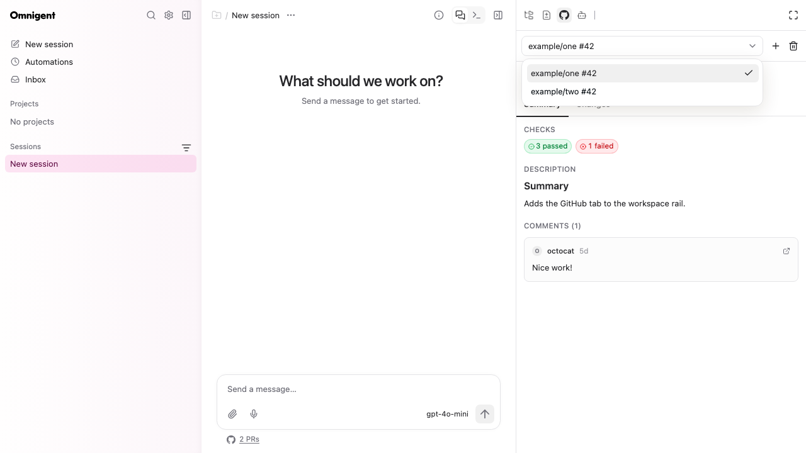
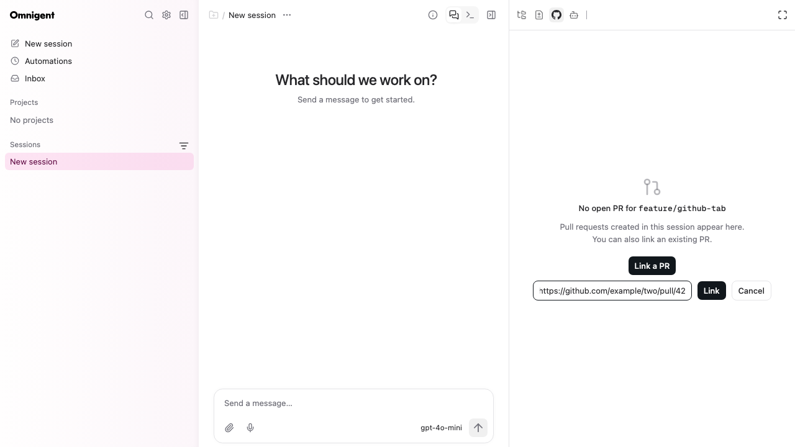

# Track pull requests by session

Pull request associations live on the session's host. No database migration is required.

## Behavior

An Omnigent session owns a set of pull requests identified by hostname,
repository, and number. Creating or actively working on a PR through supported
tools records it. The GitHub panel offers a selector and link/unlink
controls. Changing branches or working in another repository does not replace
the recorded associations.

The default PR is the most recently observed one. Once the panel selects a PR,
background polling keeps that selection. The response retains the singular
`pr` field for existing clients. Branch/commit inference remains the fallback
when a session has no recorded PRs; inferred associations are labeled in the
selector and retained after the branch changes. Read-only searches and PR views
alone do not add associations.

The registry persists across runner/host restarts on the same host. The server
uses the existing host tunnel when the runner is offline. It does not transfer
associations to another host.

## Hook coverage

Claude Code and Codex `PostToolUse` cover shell calls running `gh` and GitHub
MCP calls, including directly configured MCP servers. Both generated hook
configurations invoke the same observational handler. Codex's transcript
forwarder omits MCP results; that does not limit post-tool hook capture.

`PostToolUse` is a vendor lifecycle hook. Other harnesses need a completion
adapter to feed the same recorder. This implementation also observes common
SDK completion events, Omnigent-dispatched shell results, and managed MCP
results. Other native harnesses and hosted tools remain follow-ups.

Sources checked on 2026-09-10:

- [Codex hooks](https://learn.chatgpt.com/docs/hooks): `tool_input`,
  `tool_response`, `tool_use_id`; nonzero shell exits also invoke PostToolUse.
  A later `write_stdin` poll delivers the original command's hook on completion.
- [Claude Code hooks](https://code.claude.com/docs/en/hooks): the same core
  payload fields and MCP matching; failed tools have a separate failure event.
- [Codex configuration](https://developers.openai.com/codex/config-file/config-reference).

## Storage and observation

One versioned JSON file is stored at:

```text
<Omnigent data directory>/github/session-prs/<sha256(session_id)>.json
```

Globally allocated Omnigent session IDs provide the namespace. The hashed
filename confines paths without storing raw session IDs. Each entry contains
`host`, `repository`, `number`, normalized `url`, `relationship`, `source`, and
first/last observation times. The envelope also stores removal exclusions and
the latest 512 observation hashes. Raw commands, outputs, and credentials are
never persisted in the registry.

A process-safe per-session file lock protects read/modify/write. Writes use a
unique owner-only temporary file, fsync, and atomic replacement. Corrupt files
are preserved and reported. Duplicate call IDs do not update timestamps within
the deduplication window. A `created` relationship is retained on later updates.
An explicit removal survives replay and branch inference; explicit attachment
clears the exclusion.

Native hooks POST bounded payloads to the existing authenticated local relay.
The relay binds the Omnigent session; vendor payload session IDs are ignored.
The hook makes no GitHub network requests and has a short timeout. Errors never
change the completed tool's result. The existing Codex owned-hook trust path
covers the added entry; user hooks are preserved.

SDK observations retain the original tool name, arguments, and result before
UI truncation. `TurnContext.session_id` comes from the validated harness API
path, so capture does not depend on telemetry being enabled. Managed MCP
observations run before result formatting and preserve error markers.

## Extraction

Supported evidence includes:

- Successful `gh pr create`, edit, review, comment, checkout, merge, ready,
  reopen, and close operations; common shell/env wrappers and explicit repo
  selectors; standalone output PR URLs and explicit targets.
- `gh api` REST writes returning PR URLs, including PR create/update calls
  using `--jq '.html_url'` or `--jq '.url'`. Endpoint paths accept a leading
  slash, and shell line continuations are joined before tokenization.
- Known GitHub MCP PR create/update/merge/review tools, including custom/plugin
  server names and recognized `github_write_api_call` PR endpoints. Structured
  output URLs/numbers and explicit repository/PR inputs take precedence. As a
  fallback, any canonical PR URL in output text can identify the PR, independent
  of wording. Candidates must match known repository/PR inputs, and text results
  with more than one distinct matching URL are left unresolved. JSON inside MCP
  text blocks is decoded before extracting identities.

The extractor ignores PR body/description fields, lists, read-only calls,
failed exits, and running shell results. Conditional read/create combinations
and `||` command chains are left unresolved. Mixed create/edit output is
classified conservatively as worked-on. A failed compound shell call is skipped
as a whole even if an earlier command may have succeeded.

When a script, alias, redirection, or unrecognized tool hides the PR identity,
users can attach it explicitly. No background resolver reruns operations or
infers the earlier target from the current branch. Arbitrary GraphQL programs
are outside this first version.

## Resource API and panel

The existing GitHub info response adds `prs`, `selected_pr_url`, and
`tracking_available`. All detail endpoints accept `pr_url`. Without an explicit
selector, session-aware readers consistently choose the default tracked PR.
An explicit selector must belong to that session's registry.

`POST /v1/sessions/{session_id}/resources/github/prs` accepts:

```json
{"url":"https://github.com/example/repository/pull/42","action":"attach"}
```

`action: "remove"` unlinks it. Attachment verifies access through `gh`; both
mutations require session edit permission. The host uses the frame-bound
session ID. No remote PR is edited by these controls.

Metadata, changed files, and patches use explicit repository/host selectors.
Expanded context reads the PR head and merge-base commits from GitHub,
including fork heads and renamed paths. Stale revision requests require a
refresh. Binary/non-text content cannot be expanded. Cache keys include PR
identity and commit revisions. Unlink replaces the default cache and removes
the old selection cache.

GitHub account preferences are per host/repository for tracked PRs. Enterprise
hosts must be configured in `gh` before requests are sent there. Authentication
failures retain the selector and PR link so another PR can still be selected.

The selector stays mounted while the selected PR's summary and diff load.
The composer shows the PR number for one association or "N PRs" for several.
The toolbar uses plus and trash actions; an empty session instead offers a
"Link a PR" button below its description. The link form supports Cancel and
Escape. If details are unavailable, an "Open the PR on GitHub" link appears in
the empty state, below the account selector when one is available.





## Verification and remaining limits

Tests cover URL identity, extraction and failure cases, concurrency, duplicate
replay, removals, corrupt files, explicit repository reads, pagination,
fork/rename context, SDK session binding with telemetry disabled, managed MCP,
runner shell dispatch, and server-to-host forwarding.

The native recording end-to-end test invokes both real hook entrypoint
subprocesses, sends documented CLI/MCP payloads, a write-proxy creation summary,
and a multiline REST create with `--jq '.html_url'` through the authenticated
relay, closes the relay, and reads the four repositories through a fresh host
reader.
GitHub is a CLI fixture; this test does not create external PRs or establish
compatibility with every installed vendor version. A Playwright flow checks
selection, files, unlinking the final PR, and attachment. Colocated frontend
tests cover query isolation and cache replacement.

Remaining work beyond this version: live vendor-version coverage for async
shells/subagents, other native/hosted tools, automatic resolution of ambiguous
calls, parent/child aggregation, cross-host transfer, and orphan-file cleanup.
The API still expects an existing session workspace directory. Registry files
survive workspace deletion, but the host cannot serve them through that path
until a workspace is available. Session deletion does not currently delete the
small local association file.

## Manual verification

From the repository checkout:

```bash
uv sync --frozen --extra all --group dev
omnidev
```

Open the URL printed by `omnidev` and start a new Claude or Codex session.
In disposable repositories:

1. Create PR A through `gh pr create`, then PR B from another branch/repository
   in the same session. If configured, create a third through GitHub MCP.
2. Open GitHub in the workspace rail. Select each PR and compare its title,
   repository, files, patch, and expanded context with GitHub.
3. Change branches, park/restart the runner, and reopen the session. The PRs
   should remain available through the same host.
4. Unlink a PR, including the final one, and link it again by URL. Verify a
   failed create or a read-only PR search does not add an association.

For deterministic local checks, run the new runner tests, native recording
flow, and UI flow. Test commands and final results are reported with the change.
