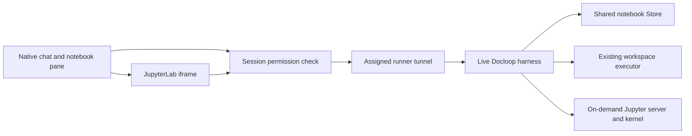

# Docloop notebook pane

The optional notebook pane edits the document used by an existing Docloop session.
Chat keeps its normal composer, model selection, turn stream and tool dispatcher.
On narrow screens, Chat and Notebook are separate views; on wider screens they
appear together. Switching views preserves the composer and unsaved notebook drafts.

## Configuration

This is an opt-in source integration. The central server and runner need the
`docloop_notebook` entry in `OMNIGENT_FEATURES`. Other enabled entries remain in
that comma-separated list. The Docloop harness needs a release containing the
shared notebook binding, with `DOCLOOP_NATIVE_NOTEBOOK=1` in its launch environment.
It also uses its existing `DOCLOOP_DOCUMENT` and workspace configuration.

All flags default off. A pane request cannot initialize a new agent process or
select a runner. Start the session normally and send an initial instruction to
initialize its notebook. Existing runner and harness authentication are reused;
no additional browser token or notebook path is accepted.

## Save and execution behavior

Both reads and edits require the session's Edit permission. GET and PATCH on
`/v1/sessions/{id}/docloop/document` follow existing session affinity and the live
harness client. The central server has no second document Store. Limits apply
while reading requests and responses; relay redirects and automatic write retries
are disabled.

Edits carry the document binding, revision and a UUID change identifier. Stale
revisions retain the user's draft for comparison. A response lost after dispatch
leaves the save outcome unknown. The user can retry the identical save to obtain
its receipt; this is not an exactly-once delivery guarantee. Docloop retains a
bounded history of edit receipts. A committed edit whose refreshed snapshot is
unavailable is reported as applied, without suggesting a new change identifier.

Use Chat for arbitrary instructions to modify the document, execute cells, or
work with files. With Docloop 0.2.6.dev2 and its Jupyter extra installed, ipynb
opens in the real JupyterLab editor. Org retains its addressed source editor.
Run, interrupt, restart, file access and saves travel over the same assigned
runner. The only WebSocket addition is the session's kernel-channel path.
Jupyter's server token stays inside the harness; browser credentials are not
forwarded across transport hops. Compressed responses and split Unicode chunks
are carried losslessly by the tunnel.

Jupyter uses the configured local workspace, with a separate Python kernel from
agent cell evaluation. Saved notebook state and files are shared. OCI environments
retain Source/Chat execution; this native Lab kernel is currently local only.
Native iframes require the normal browser cookie or authenticated proxy session.
Embeds using only JavaScript host headers retain Source and Chat, and explain how
to open the session directly for Jupyter. No new login token or grant is issued.

The pane stays mounted across Chat/Notebook switches. Narrow panes use Jupyter's
simple layout with collapsed sidebars, and show kernel status above the editor.

## Verification

The relay and permission tests use real host route factories and SQLite session
permissions. Cross-project Docloop acceptance uses the real SDK, Engine, Store,
local evaluator and both host relay adapters. Its provider and live process
registry entry are fixtures, and its HTTP hops use ASGI transports.

After adopting both reviewed components, open an initialized Docloop session,
select Notebook, change and save a note, then ask in Chat to use that note and
execute a saved cell. Confirm the output and created file, reload the page, and
verify that both survive. Check phone-width switching and a desktop split view.
Local source tests and UI previews do not establish a live deployment receipt.

The companion Docloop `tests/test_runner_jupyter.py` runs actual Jupyter and SDK
HTTP/WebSockets through a private Unix socket, both relays and the actual tunnel
frame handlers. Its carrier and session metadata are fixtures. It verifies real
code execution, workspace files, versioned saves, two-editor conflicts, restart
and process cleanup. Browser previews exercise the built UI's Run and Save
buttons and retain the kernel while switching to Chat. Physical Android and live
fleet adoption remain separate acceptance steps.
