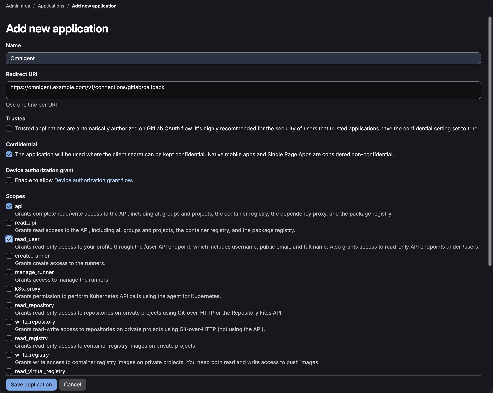
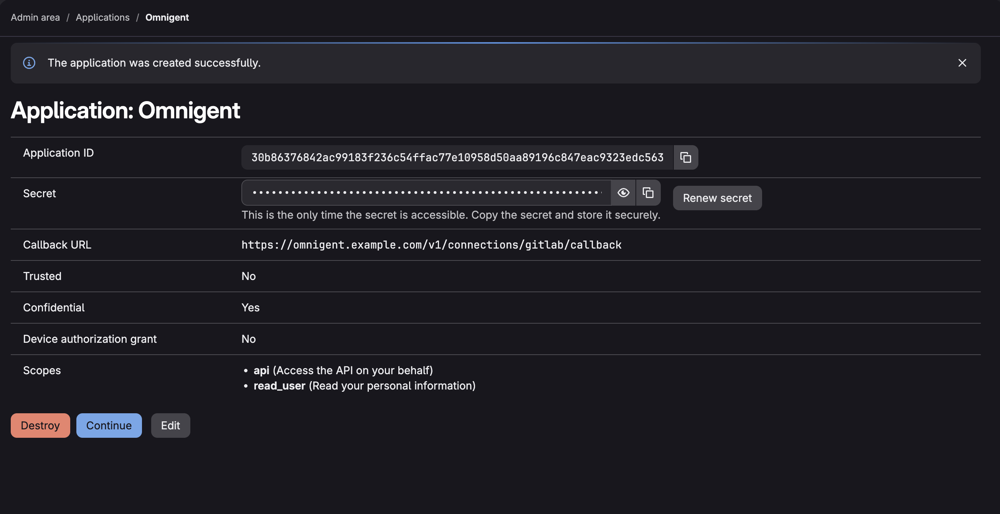

# GitLab OAuth setup

Omnigent supports GitLab.com, GitLab Dedicated, and self-managed GitLab through one deployment-configured OAuth application. The instance origin is controlled by the operator; users cannot supply an arbitrary OAuth or API host.

## 1. Create an OAuth application

In the configured GitLab instance, create a **confidential** OAuth application with this redirect URI:

```
https://<omnigent-domain>/v1/connections/gitlab/callback
```

Use the exact value configured in `OMNIGENT_GITLAB_REDIRECT_URI` when that variable is set. For a server running locally on the default port 6767, register:

```
http://localhost:6767/v1/connections/gitlab/callback
```

`localhost` is suitable when the browser and Omnigent server run on the same machine. The redirect URI must match exactly, including scheme, hostname, port, path, and trailing slash behavior.



Use these application settings:

- **Confidential:** enabled, because Omnigent keeps the OAuth client secret on the server.
- **Trusted:** disabled, unless a GitLab administrator has explicitly approved bypassing user consent.
- **Device authorization grant:** disabled; Omnigent uses the browser authorization-code flow.
- **Scopes for the full integration:** `read_user` and `api`. The `api` scope is required for write-capable merge-request/API workflows.
- **Scopes for read-only local verification:** `read_user`, `read_api`, and `read_repository`. Configure the exact requested scopes with `OMNIGENT_GITLAB_SCOPES='read_user read_api read_repository'`.



The OAuth application must allow every scope that Omnigent requests. Some GitLab instances restrict the available application scopes and do not offer `api`; in that case, use the read-only configuration above. It supports identity lookup, project and branch discovery, read-only merge-request API access, and HTTPS clone/fetch, but it cannot create or modify merge requests or push over HTTPS.

Do not enable unrelated privileged scopes such as `sudo`, runner management, Kubernetes proxy, registry write, or observability write. Never commit the client secret or pass a user personal access token into a managed workspace.

## 2. Configure Omnigent

Set the following server environment variables:

```bash
OMNIGENT_GITLAB_CLIENT_ID=<oauth-application-id>
OMNIGENT_GITLAB_CLIENT_SECRET=<oauth-application-secret>
OMNIGENT_GITLAB_HOST=https://gitlab.example.com  # optional; defaults to https://gitlab.com
OMNIGENT_GITLAB_REDIRECT_URI=https://omnigent.example.com/v1/connections/gitlab/callback
# Optional; defaults to "read_user api". Set this to scopes enabled in the GitLab OAuth application.
# OMNIGENT_GITLAB_SCOPES='read_user read_api read_repository'

# Choose exactly one encrypted credential backend.
OMNIGENT_CREDENTIAL_KMS_KEY_ID=<AWS-KMS-key-id>
# Or Vault Transit (install the optional dependency with: uv sync --extra vault):
# OMNIGENT_CREDENTIAL_CIPHER=vault
# OMNIGENT_CREDENTIAL_VAULT_KEY=<derived-transit-key-name>
# VAULT_ADDR=https://vault.example.com
# VAULT_TOKEN=<Vault-token>
```

`OMNIGENT_GITLAB_REDIRECT_URI` may be omitted when `OMNIGENT_DOMAIN` is set; Omnigent derives `https://$OMNIGENT_DOMAIN/v1/connections/gitlab/callback`.

`OMNIGENT_GITLAB_HOST` must be an HTTPS origin only: no path, query, fragment, or embedded credentials are accepted. This deliberately makes GitLab Dedicated and self-managed hosts explicit deployment configuration.

## 3. Verify

1. Restart the server and check `GET /v1/info`; `enabled_connections` should include `gitlab`.
2. Check `GET /v1/connections/gitlab/status`; it should report `enabled: true` and `connected: false` before a user authorizes GitLab.
3. Connect GitLab from **Settings → Sandbox Integrations** and complete OAuth. Do not open the callback URL directly: GitLab supplies its one-time `code` and signed `state` parameters.
4. Check `GET /v1/connections/gitlab/repos`; it should list the connected user's visible projects, including nested GitLab namespaces.
5. In a managed sandbox for a GitLab workspace, run:

   ```bash
   git fetch
   glab auth status --hostname <configured-gitlab-hostname>
   glab mr list
   ```

Git retrieves the user credential on demand from Omnigent. `glab` receives a host-scoped entry in `~/.config/glab-cli/hosts.yml`; Omnigent refreshes that entry periodically for long-lived sessions. Do not print that file because it contains credentials.

For a local Vault-based setup, confirm the optional dependency is installed before starting the server:

```bash
uv sync --extra vault
uv run python -c 'import hvac; print("hvac is available")'
```

A successful local OAuth connection can be disconnected from **Settings → Sandbox Integrations → GitLab**. The same operation is available through `POST /v1/connections/gitlab/disconnect` for API clients.

After disconnecting, `GET /v1/connections/gitlab/status` should report `connected: false`.
