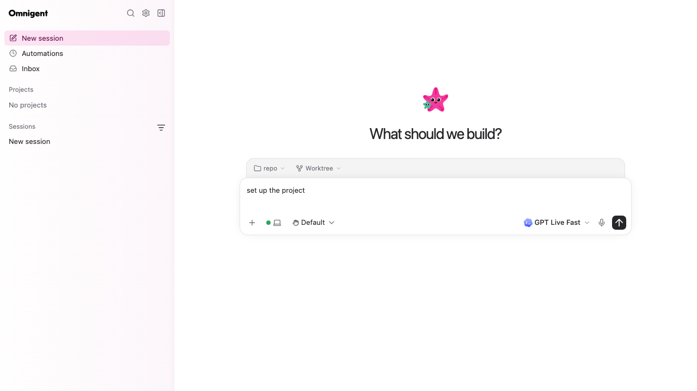

# Codex model selection

When you choose a native Codex model in the web picker, Omnigent saves both
the picker choice and its exact provider model ID. Startup uses that ID
directly: it does not fetch another model list or acquire credentials just
to discover models. Actual authentication still uses the selected provider
and, for Databricks profiles, the profile-pinned token command.

There is no new discovered-model cache. Omnigent does not guess whether an
ID is exact from its spelling or prefix.



The browser regression above uses synthetic model names.

## CLI and agent specs

If you already know the exact ID served by your provider:

```bash
omnigent codex --model-id provider/model-id
```

Replace `provider/model-id` with your provider's ID. `--model-id` and
`--model` are mutually exclusive. The existing `--model` option still
resolves aliases, including older saved names.

For a native Codex agent spec, opt in explicitly:

```yaml
executor:
  harness: codex-native
  model: provider/model-id
  model_resolution: exact
```

Without `model_resolution: exact`, existing specs keep their model
resolution behavior. A Default selection still needs to determine which
model to use. Old saved strings are not automatically treated as exact,
even when they happen to look like provider IDs.

## Session API

JSON session create, update, and fork requests accept `model_override_id`
alongside a non-default `model_override`:

```json
{
  "model_override": "picker-choice",
  "model_override_id": "provider/model-id"
}
```

The web picker obtains the provider ID from the model option's `model`
field, not its display choice `id`. Options without that field keep alias
resolution. An exact ID is used verbatim; an unavailable ID can therefore
produce a provider error instead of silently selecting another model.

Changing `model_override` without a companion ID clears the old ID.
Resetting to Default clears both. Forks inherit both when model settings
are inherited; an explicit fork selection replaces them. Background titles
keep their economy-model preference; when they fall back to the session's
model, its exact ID is preserved.
