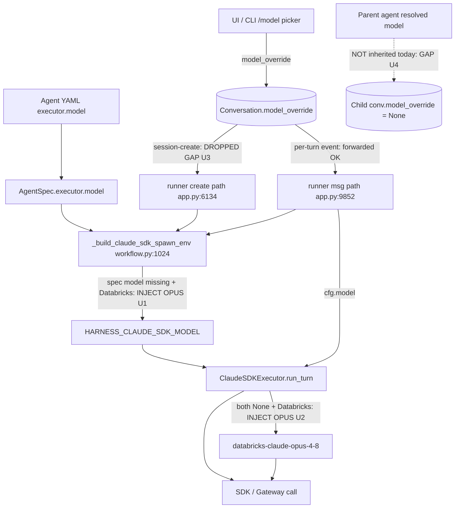

# fix: Honor selected model on Claude SDK harness (stop silent Opus fallback)

## Summary

The Claude SDK harness silently routes to `databricks-claude-opus-4-8` even when
the user selected `claude-sonnet-4-6`. Issue [#1128](https://github.com/omnigent-ai/omnigent/issues/1128)
observed this with the `Polly (Claude SDK)` orchestrator while sub-agents were
running: the UI footer showed Sonnet, but the Databricks AI Gateway recorded
Opus traffic.

Root cause is a missing-model value that resolves to the hardcoded Databricks
Opus default through **two** injection points, combined with **two** propagation
gaps that let a real selection get lost:

1. **Workflow spawn-env layer** — `omnigent/runtime/workflow.py:337-338`
   (`_inject_databricks_default_model` inside `configure_agent_harness_with_ucode`)
   bakes `DATABRICKS_CLAUDE_DEFAULT_MODEL` into `HARNESS_CLAUDE_SDK_MODEL` when the
   spec declares no model on a Databricks/ucode profile.
2. **Inner executor fallback** — `omnigent/inner/claude_sdk_executor.py:1923-1925`
   injects the same Opus constant when `cfg.model` and `self._model_override` are
   both `None` and the gateway is a Databricks profile.
3. **Agent-start propagation gap** — the server's session-create handshake to the
   runner (`omnigent/server/routes/sessions.py:6259`) sends only
   `{session_id, agent_id, sub_agent_name}`; it omits the persisted
   `model_override`. The runner's create handler
   (`omnigent/runner/app.py:6134`) therefore calls `_build_spawn_env_from_spec`
   without `model_override`. (The per-turn message path forwards it correctly —
   `sessions.py:7700`/`7982` → `app.py:9852`.)
4. **Sub-agent inheritance gap** — a sub-agent spawned via `sys_session_send`
   gets a fresh child conversation whose `model_override` is `None` unless the
   spawn call carried an explicit `model`. The parent's resolved model is not
   inherited, so a spec-less sub-agent on a Databricks profile resolves to `None`
   → Opus. This is the most likely source of the observed Opus traffic.

This plan honors the selected/inherited model end-to-end, makes resolution
observable, and fails closed when a recorded selection cannot be honored — while
**preserving the existing Opus default only when the agent is genuinely
unconfigured** (no spec model, no session override, no inherited parent model),
so fresh Databricks installs that never picked a model keep working.

**Scope:** Claude SDK harness only. Independent verification (codex review of the
codebase) confirmed the silent Opus fallback is real and that **sub-agents are
the most likely source** of the observed traffic. It also narrowed the bug class:
the same Opus fallback exists only on the other **Claude-family Databricks paths**
(`pi_executor.py:1791`, `claude_native.py:1451`), not on codex/cursor/copilot
(which default to GPT or their own auto behavior). Those Claude-family paths are
tracked as follow-up (see Scope Boundaries).

---

## Problem Frame

A user (or an orchestrator) selects a model. That intent must reach the actual
provider call. Today three things conspire against it on the Claude SDK +
Databricks gateway path: a missing model becomes Opus (twice), the selection is
dropped at session-create, and sub-agents never receive the parent's model. The
result is a silent divergence between the displayed model, the configured model,
and the model that actually bills — exactly the cost/governance/trust failure the
issue calls out.

The fix is not "remove the Opus default" — that would break first-run Databricks
users who never picked a model and rely on a working default. The fix is:
propagate real selections so they are never lost, and only fall back to the
default when there was genuinely nothing to honor.

---

## Requirements

Traceability is to the issue's Acceptance Criteria (AC) and Recommended Fix (RF).

- **R1** (AC1) — Selecting `claude-sonnet-4-6` results in Sonnet endpoint calls,
  not Opus, for the top-level agent.
- **R2** (AC5) — The same holds for orchestrator-created sub-agents.
- **R3** (RF, AC2) — When the resolved runtime model differs from the requested
  model, or the default is used, both the logs and the UI say so explicitly.
- **R4** (RF) — Log requested model and resolved provider endpoint at session
  start and per turn.
- **R5** (AC4) — `--model`, YAML `executor.model`, setup defaults, and in-session
  `/model` changes have a documented, tested precedence.
- **R6** (RF) — Fail closed when a *recorded* selection cannot be resolved,
  rather than silently falling back to Opus. Preserve the Opus default only when
  the agent is genuinely unconfigured.
- **R7** (AC3) — The model shown in the UI matches the model the provider uses.

---

## Key Technical Decisions

### KTD1 — Propagate the concrete resolved model, not a boolean signal

A boolean "selection was recorded" flag is **insufficient** (codex plan review,
P1-3): it cannot name the lost model in an error, cannot drive harness/provider
compatibility checks, and cannot detect a selection already dropped before the
flag is set.

Decision: at each path that has the context, resolve to a **concrete model id**
(spec model → persisted `model_override` → inherited parent model) and propagate
that concrete value into the spawn env / per-turn config, alongside its **source**
(spec / session-override / inherited / default). Only when *all* concrete sources
are absent do we fall back to the explicit Databricks default, tagged
`source=unconfigured-default`. Fail closed when a concrete recorded value exists
but cannot be normalized/applied for the harness — the error names the requested
model and the reason.

This also fixes the respawn problem in KTD2: a concrete env model is what the
process manager keys on.

**Concrete env contract (codex re-review P1-C).** The harness today reads only
`HARNESS_CLAUDE_SDK_MODEL` (`claude_sdk_harness.py:277`), so when resolution yields
`None` the executor cannot tell "unconfigured" from "selection lost" nor name the
lost model. Add two sibling env fields written by the spawn-env builder:
- `HARNESS_CLAUDE_SDK_MODEL_SOURCE` — one of `spec` | `session-override` |
  `inherited` | `unconfigured-default`.
- `HARNESS_CLAUDE_SDK_REQUESTED_MODEL` — the concrete requested model name when a
  selection existed (so a fail-closed error can name it), even on paths where the
  model could not be applied.
The executor reads both alongside `_model_override`. Fail closed when
`source != unconfigured-default` but no usable model resolved; keep the Opus
default only when `source == unconfigured-default`.

### KTD2 — A concrete env model is required to dislodge a cached process

The harness process manager (`omnigent/runtime/harnesses/process_manager.py:557`)
records the spawn-env model and respawns **only when a later env carries a
concrete, different model**. So "leave the env model empty and let downstream
win" (an earlier draft idea) does **not** work — `requested_model is None` means
no respawn, and a stale Opus subprocess survives (codex P1-2). Therefore U1/U3/U4
must always write the concrete resolved model into the env when any intent exists,
never leave it empty as a deferral.

### KTD3 — Fix propagation first, fail-closed as the safety net

The primary fix is U3 (forward override at agent-start, including recovery and
rebind paths) and U4 (sub-agent inheritance): make the selection actually arrive.
The fail-closed net (U2) only fires if, despite a concrete recorded value,
resolution still comes up empty or unusable — that indicates a remaining bug and
should be loud, not silent.

### KTD4 — Log and surface the model where it is actually resolved

The runner routing log at `omnigent/runner/app.py:14283` logs **env values before**
the harness resolves the profile-backed Databricks transport, so it cannot report
the real provider endpoint for ucode/profile routing (codex P2). Anchor the
`requested → resolved (reason/source)` log inside the inner executor **after**
`_resolve_gateway_env`, where the actual endpoint and final model are known, and
publish the resolved model to the session snapshot so the UI footer shows truth.

### KTD5 — Scope limited to Claude SDK

Other env-keyed harnesses share the same plumbing gaps but are unverified against
real traffic. Fixing claude-sdk only keeps the PR small and provably correct; the
shared-plumbing generalization is a tracked follow-up.

---

## High-Level Technical Design

Model intent and where it can be lost or defaulted today:

Target precedence after the fix (highest wins), per R5. Note the sub-agent
inheritance ordering correction from codex (P1-4): an inherited parent model must
**not** override an explicit child spec model.

Top-level agent:
1. Per-turn `cfg.model` (in-session `/model`, forwarded on the event).
2. Persisted session `model_override` (forwarded at create, per-turn, recovery,
   and rebind).
3. Spec `executor.model` (YAML / `--model` baked into the spec).
4. Databricks default Opus — **only** when 1-3 are all absent (`source=unconfigured-default`).

Sub-agent (U4):
1. Explicit spawn `model` argument on `sys_session_send` (validated + localized).
2. Child spec `executor.model`.
3. Inherited parent/session resolved model (only when 1 and 2 are absent, and the
   model is compatible with the child harness/family).
4. Databricks default Opus — only when 1-3 are all absent.

Fail closed (not Opus) whenever a concrete recorded value from any tier exists but
cannot be normalized/applied for the target harness.

---

## Implementation Units

### U1. Gate the workflow/ucode Opus injection on genuine no-config

**Goal:** Stop `configure_agent_harness_with_ucode` from baking
`databricks-claude-opus-4-8` into `HARNESS_CLAUDE_SDK_MODEL` whenever a model
intent exists elsewhere; only inject when genuinely unconfigured.

**Requirements:** R1, R6.

**Dependencies:** none.

**Files:**
- `omnigent/runtime/workflow.py` (`_inject_databricks_default_model` ~335-338,
  `_build_claude_sdk_spawn_env` ~1000-1026, `configure_agent_harness_with_ucode`)
- `tests/runtime/test_model_override.py` and/or a workflow spawn-env test module
  under `tests/runtime/` (use the existing home — do **not** create a top-level
  `tests/test_*` file; codex P2-3)

**Approach (corrected per codex re-review P1):** The post-build overlay at
`app.py:14278` (`if model_override: env[model_key] = model_override`) runs **after**
`_build_claude_sdk_spawn_env()` has already invoked
`configure_agent_harness_with_ucode` → injected the Opus default at
`workflow.py:337`. Overlaying afterward fixes the env value but does not change the
fact the default already fired, and is fragile. The fix must thread the resolved
model **into** the builder:
- Give `_build_claude_sdk_spawn_env(spec, *, workdir, resolved_model=None,
  model_source=None)` a `resolved_model` parameter; when provided, set
  `HARNESS_CLAUDE_SDK_MODEL` from it **before** the ucode default check at line 337,
  so the default is suppressed whenever a concrete model exists.
- The runner computes the concrete resolved model (override → spec → inherited;
  see precedence) and passes it (plus source) into the builder via
  `_build_spawn_env_from_spec`, instead of relying on the 14278 overlay.
- The ucode default at 337 fires only when `resolved_model is None`, tagged
  `source=unconfigured-default`. Keep the comment explaining why the default exists
  (CLI rejects the host-config Anthropic id on the gateway).

**Patterns to follow:** existing `_HarnessUcodeConfig` / `databricks_default_model`
wiring in the same file; `_resolve_spec_model` precedence; the runner override
application at `app.py:14278`.

**Test scenarios:**
- Spec declares `executor.model = claude-sonnet-4-6` → env carries Sonnet, default
  not injected. (Happy path; Covers AE: Sonnet selected → Sonnet used.)
- Spec declares no model, no override anywhere, Databricks profile → Opus default
  injected, tagged `source=unconfigured-default`. Covers R6 unconfigured branch.
- Spec declares no model but a session `model_override = sonnet` is passed → env
  carries Sonnet (concrete), default NOT injected. Covers KTD1/KTD2.
- Non-Databricks/generic gateway, no model → no `databricks-*` value injected
  (existing invariant preserved).

### U2. Replace the inner executor's silent Opus fallback with intent-aware resolution

**Goal:** In `ClaudeSDKExecutor.run_turn`, stop silently substituting Opus when a
selection was recorded; fail closed instead, and log requested→resolved.

**Requirements:** R3, R4, R6.

**Dependencies:** U1 (shares the concrete-model + source contract).

**Files:**
- `omnigent/inner/claude_sdk_harness.py` (~277) — read the two new env fields
  (`HARNESS_CLAUDE_SDK_MODEL_SOURCE`, `HARNESS_CLAUDE_SDK_REQUESTED_MODEL`) next to
  `HARNESS_CLAUDE_SDK_MODEL` and thread them into the executor constructor.
- `omnigent/inner/claude_sdk_executor.py` (init ~1200/1272 store source +
  requested; ~1923-1925 resolution block; log after `_resolve_gateway_env`).
- `tests/inner/test_claude_sdk_executor.py` (extend) and
  `tests/inner/test_claude_sdk_harness.py` (env read) — existing homes (codex P2-3).

**Approach:** Resolve `model = cfg.model or self._model_override`. With the concrete
env contract (KTD1), the source + requested model arrive here. If `model is None`
and `self._gateway_uses_databricks_profile`:
- if `source != unconfigured-default` (intent existed) → raise a clear,
  user-surfaced error naming `requested_model` and the reason (do not use Opus);
- else (`source == unconfigured-default`) → keep `_DATABRICKS_CLAUDE_DEFAULT_MODEL`.
Also fail closed if a concrete recorded value cannot be normalized for the gateway.
Emit the `requested → resolved (source) gateway=<endpoint>` log **after**
`_resolve_gateway_env` so it names the real endpoint (KTD4); note executor
resolution is **lazy on the first turn**, not at create-time, so the create-time
"session start" log (R4) reflects the spawn-env intent while the post-resolution
log reflects the actual endpoint. Keep `set_model` on cached clients working — it
is faithful but not protective (a lost override still flips the cached client to
Opus), which is why U3/U4 must keep the concrete value present.

**Execution note:** Add a failing test for the fail-closed branch first — it
characterizes the exact condition (`source != unconfigured-default` + None
resolution + Databricks) that must raise rather than default.

**Patterns to follow:** existing `self._gateway_uses_databricks_profile` gate;
existing logger usage in the executor.

**Test scenarios:**
- `cfg.model = sonnet` → resolves Sonnet, no fallback, log shows `requested=sonnet
  resolved=sonnet`. Covers AE1.
- `cfg.model = None`, `self._model_override = sonnet` → Sonnet.
- Both None, Databricks profile, `source != unconfigured-default` with
  `requested_model = sonnet` → raises naming the lost Sonnet selection (no Opus).
  Covers R6.
- Both None, Databricks profile, unconfigured → Opus default, log states default
  reason. Covers R6 unconfigured branch.
- Both None, non-Databricks gateway → `None` passed to SDK (SDK default), no
  `databricks-*` injection.

### U3. Forward the persisted model override at the session-create handshake

**Goal:** Carry `conv.model_override` to the runner at agent start so the harness
subprocess spawns with the selected model, not a stale/default one.

**Requirements:** R1, R5.

**Dependencies:** none (independent of U1/U2 but completes the propagation).

**ALL runner-init `POST /v1/sessions` call sites must forward `model_override`**
(codex re-review P1 — the earlier draft named only 2 of 6). The clean fix is a
single shared body-builder that always includes `effective = conv.model_override`
(and `sub_agent_name`), then route every site through it:

| Site | File:line | Today's body | Fix |
|------|-----------|--------------|-----|
| Init handshake | `sessions.py:6259` | `{session_id, agent_id, sub_agent_name}` | + `model_override` |
| Normal create notify | `sessions.py:12644` | `{session_id, agent_id, sub_agent_name}` | + `model_override` |
| Bundled create notify | `sessions.py:11540` | `{session_id, agent_id, sub_agent_name:None}` | + `model_override` |
| PATCH runner-rebind | `sessions.py:13755` | `{session_id, agent_id, sub_agent_name}` | + `model_override` |
| Runner reconnect | `server/app.py:1724` | `{session_id, agent_id}` | + `model_override` **and** `sub_agent_name` (also missing today) |
| Runner crash-recovery | `app.py:6675` | recovery `msg_body` `{agent_id, model}` | thread `model_override` into recovery spawn |

**Files:**
- `omnigent/server/routes/sessions.py` (sites 6259, 12644, 11540, 13755; extract a
  shared `_runner_session_init_body(conv)` helper)
- `omnigent/server/app.py` (reconnect ~1724)
- `omnigent/runner/app.py` (create handler ~6047-6139: read `body.get("model_override")`,
  pass to `_build_spawn_env_from_spec` at ~6134; crash-recovery ~6675)
- `tests/runner/test_app_sessions_native.py` (create + recovery) and
  `tests/server/integration/test_sessions_model_override.py` (all init sites + rebind +
  reconnect). Existing homes (codex P2-3).

**Approach:** Server: in the create handshake (`_session_init_handshake` around
6256), compute `effective = conv.model_override` and add it to the JSON body when
present, exactly like the per-turn paths. Runner: read `body.get("model_override")`
in the create handler and pass `model_override=...` into
`_build_spawn_env_from_spec` (which already applies it via `_HARNESS_MODEL_ENV_KEY`
at app.py:14278). Apply the same forwarding to the recovery (`app.py:6675`) and
PATCH-rebind (`sessions.py:13755`) paths so no spawn path reintroduces Opus. This
puts the concrete model in the env (KTD1/KTD2) so the process manager respawns
correctly.

**Verification nuance (from codex review):** for the *main* agent this gap is
largely self-correcting today — the start path mainly spawns/caches the harness
process (`app.py:6192`), and the process manager respawns when a later turn's env
requests a different model (`omnigent/runtime/harnesses/process_manager.py:557`),
so a persisted Sonnet override replaces the start-spawned process before the first
turn. U3's value is therefore (a) eliminating the brief Opus spawn + respawn churn
and (b) setting the recorded-selection signal at start so U1/U2 don't default. The
real leak is U4. Keep U3 but do not over-claim it as the primary fix.

**Patterns to follow:** `sessions.py:7697-7700` and `7979-7982`
(`effective_runner_override` + `runner_body["model_override"]`); the per-turn
runner read at `app.py:9852`.

**Test scenarios:**
- conv has `model_override = sonnet`, no per-event override → create handshake body
  includes `model_override = sonnet`; runner bakes `HARNESS_CLAUDE_SDK_MODEL =
  sonnet`. Covers AE1 at start time.
- conv has no override → body omits the key (no invented default), behavior
  unchanged.
- Process-manager respawn: confirm a start with override X then a per-turn override
  Y triggers respawn/`set_model` to Y (precedence #1 over #2).
- Crash-recovery (`app.py:6675`): conv has `model_override = sonnet`, recovery turn
  fires → recovery `msg_body`/spawn carries Sonnet, process does not respawn to Opus.
  Covers R1 under recovery.
- PATCH rebind (`sessions.py:13755`): rebind handshake includes `model_override`
  when conv has one; runner re-spawn keeps Sonnet. Covers R1 under reconnect.

### U4. Inherit the parent's resolved model for orchestrator sub-agents

**Goal:** A sub-agent spawned via `sys_session_send` without an explicit `model`
inherits the parent session's resolved model instead of defaulting.

**Requirements:** R2.

**Dependencies:** U3 (uses the same create-handshake override forwarding).

**Files:**
- `omnigent/runner/tool_dispatch.py` — **two** orchestrator child-spawn sites:
  (a) `sys_session_send` handler builds the child `create_body` and only sets
  `model_override` when the call includes explicit `model` (~1190-1198); child
  message event sends no model (~1297). (b) `sys_session_create` via
  `_build_session_create_body(agent_id, conversation_id, title, message)` (~1489)
  also builds a child body with no model inheritance (codex re-review P2). Apply
  inheritance at both. Also check the config-bundle path `_upload_config_bundle`,
  which posts `/v1/sessions` metadata without inherited `model_override` (codex
  third-pass P2) — apply the same inheritance or scope it out explicitly.
- `omnigent/server/routes/sessions.py` (child-conversation `model_override`
  persistence ~11043/13670; event forwarding falls back to the **child**
  conv's own `model_override` at ~7978)
- `tests/runner/test_runner_dispatch.py` (extend — existing home for tool_dispatch
  tests; codex P2-3)

**Approach:** In the `sys_session_send` handler (`tool_dispatch.py:~1190`), when no
explicit `model` was supplied **and the child has no own spec `executor.model`**,
default the child `create_body["model_override"]` to the parent session's
effective resolved model. Corrected precedence (codex P1-4): explicit spawn
`model` > **child spec `executor.model`** > inherited parent/session override >
default. The inherited model must NOT override an explicit child spec model.

The inherited value must pass through the **same guard machinery the explicit
`model` arg already uses** (`tool_dispatch.py:1198-1223`): `harness_supports_model_override`,
`model_family_mismatch`, and `_normalize_subagent_model` (codex P1-5). Otherwise a
parent Claude/Databricks id can be pushed into a Codex/Gemini/native child and
either rejected late or routed wrong. If the inherited model is incompatible with
the child harness/family, drop it (fall to child spec / default) rather than
forcing it — inheritance is best-effort, an explicit selection is not.

**Execution note:** The handler has the parent `session_id` in scope; confirm at
execution time the cheapest way to read the parent's resolved model (parent conv
row vs. cached spec) and the exact guard-helper signatures to reuse.

**Test scenarios:**
- Parent resolved Sonnet, sub-agent spec has no model, spawn omits `model` → child
  `model_override = sonnet`; sub-agent turn hits Sonnet. Covers AE / R2.
- Spawn call includes explicit `model = opus` → child uses Opus (explicit wins).
- Sub-agent spec declares its own `executor.model` → **child spec model wins** over
  the inherited parent model (corrected precedence; codex P1-4).
- Parent resolved a Claude/Databricks id, child harness is Codex/Gemini → inherited
  model fails `model_family_mismatch`/`harness_supports_model_override` and is
  dropped; child falls to its spec/default, not the Claude id (codex P1-5).
- Inherited model is provider-localized via `_normalize_subagent_model` the same way
  an explicit `model` arg is.
- Parent genuinely unconfigured (no override, no spec model) → child stays
  unconfigured → Opus default (no regression for unconfigured Databricks).

### U5. Surface the resolved runtime model in logs and UI

**Goal:** Make the resolved model observable: the UI footer and logs show what
actually runs, satisfying R3/R7.

**Requirements:** R3, R4, R7.

**Dependencies:** U2 (resolution + log point), U3 (start-time forwarding).

**Durable resolved-model path (codex re-review P1-D).** There is no resolved-model
field today: the snapshot passes spec `llm_model` + persisted `model_override`
(`sessions.py:2315`), the schema has no resolved field (`schemas.py:1619`), and the
footer renders `selectedModel ?? llmModel` (`ChatPage.tsx:3013`). `usage.model` is
cost attribution, not a current-model contract. U5 must add a real field end to end.

**Files:**
- `omnigent/inner/claude_sdk_executor.py` — emit the `requested → resolved (source)
  gateway=<endpoint>` log **after** `_resolve_gateway_env` (codex P2-2; the runner
  log at `app.py:14283` is pre-resolution). Report the resolved model on the turn
  result/event so the server can persist/forward it.
- `omnigent/server/schemas.py` (~1619) — add `resolved_model: str | None = None`
  to the session snapshot schema.
- `omnigent/server/routes/sessions.py` (~2315) — populate `resolved_model` from the
  executor-reported value (persist on the conv or carry via SSE); define the SSE
  event that pushes it when resolution lands on the first turn.
- `ap-web` client+store+footer — `resolved_model` must win **once present**:
  footer reads `resolvedModel ?? selectedModel ?? llmModel` (codex re-review P1 —
  `selectedModel` first would mask it because the store keeps `selectedModel`
  populated from sticky/requested state). Wire it through the layers, not just the
  component: the session API client type, the chat store field, and the SSE/snapshot
  handler that sets it (`ChatPage.tsx` ~3013 is only the render site).
- `tests/inner/test_claude_sdk_executor.py` (log + reported model),
  `tests/server/integration/test_sessions_model_override.py` (schema + snapshot +
  SSE).

**Approach:** Resolve/log at the inner-executor point (KTD4). Thread the resolved
model to the server, persist or stream it, expose it as `resolved_model`, and bind
the footer to it. Because resolution is lazy (first turn), the footer shows the
requested label at create-time and switches to the resolved model after the first
turn — acknowledge this in the field's docs.

**Test scenarios:**
- Resolution log line contains requested model, resolved model, source, and the
  real gateway endpoint (post `_resolve_gateway_env`). Covers R4.
- Snapshot/SSE exposes `resolved_model` distinct from spec `llm_model` and persisted
  `model_override`; when requested≠resolved the field carries resolved. Covers R3, R7.
- Footer renders `resolved_model` once present, `selectedModel`/`llmModel` before.
  Covers R7.

---

## Scope Boundaries

**In scope:** Claude SDK harness model resolution, agent-start override
forwarding, sub-agent model inheritance, fail-closed-except-unconfigured behavior,
resolution logging and UI truth for claude-sdk.

**Outside this product's identity / non-goals:**
- Redesigning the model-picker UI or the `/model` command UX.
- Changing provider auth or the Databricks gateway transport.
- Changing the Databricks default model value itself.

### Deferred to Follow-Up Work
- **U5 UI-truth (R3/R7): surface the resolved runtime model in the footer.**
  R4 (requested→resolved+source+endpoint logging) shipped in U2. The footer
  still shows requested (`selectedModel ?? llmModel`), not the resolved model.
  Surfacing it cleanly needs a design decision — which model is "the" resolved
  one when a session bills several (orchestrator + sub-agents via
  `usage_by_model`) — and a choice between deriving it frontend-side from the
  per-model usage already sent, or persisting a `resolved_model` (DB migration
  → snapshot → SSE → store → footer). Scoped out of the routing-fix PR; the bug
  is fixed without it.
- Apply the same fail-closed + inheritance fixes to the other **Claude-family
  Databricks paths** that share the identical Opus fallback: Pi in-process
  (`omnigent/inner/pi_executor.py:1791`) and claude-native
  (`omnigent/claude_native.py:1451`). Codex review confirmed codex/cursor/copilot
  do **not** share this fallback (they default to GPT or their own auto behavior),
  so the issue's "all harnesses" hypothesis is narrower than stated.
- The agent-start forwarding (U3) and sub-agent inheritance (U4) plumbing is shared
  via `_build_spawn_env_from_spec` / `_HARNESS_MODEL_ENV_KEY`; generalizing the
  inheritance to all env-keyed harnesses can ride the same follow-up.
- End-to-end Databricks-gateway integration test against live Sonnet/Opus
  endpoints (the issue's suggested reproduction) — requires gateway credentials.

---

## Risks & Dependencies

- **Behavioral change risk (R6 fail-closed):** Fresh Databricks users who never
  picked a model must still work. Mitigated by the `source=unconfigured-default`
  branch (U1/U2) — fail-closed fires only when a concrete recorded value exists.
- **Stale cached Opus process (codex P1-2):** the process manager respawns only on
  a *concrete, different* env model (`process_manager.py:557`); an empty env model
  will not dislodge a cached Opus subprocess. KTD2 mandates always writing the
  concrete model — do not regress to "leave env empty".
- **Recovery / rebind spawn paths (codex P1-1, P2-1):** the crash-recovery turn
  (`app.py:6675`) and PATCH rebind (`sessions.py:13755`) are separate spawn paths
  that today drop the override. All three (create, recovery, rebind) must forward
  it or Opus reappears after a crash/reconnect. Covered by U3 tests.
- **Cross-family inheritance (codex P1-5):** inheriting a parent model into a
  child of a different harness/family must pass the existing guard helpers or it
  routes wrong. U4 reuses `harness_supports_model_override` / `model_family_mismatch`
  / `_normalize_subagent_model`.
- **`set_model` is faithful, not protective (codex):** if a turn loses the override,
  resolution can flip the cached client to Opus. The propagation fixes are what
  keep the concrete value present; `set_model` will not save a lost selection.
- **Coverage gate:** new fail-closed and inheritance branches must carry tests in
  the existing mirrored test homes (see [[omnigent-contribution-notes]]) or the
  live-e2e coverage gate bites.

---

## Verification

- Top-level: select Sonnet (UI/`--model`/YAML), run a multi-call task, confirm
  gateway traffic hits Sonnet and the footer shows Sonnet.
- Sub-agent: run a Polly task that spawns sub-agents with no explicit model;
  confirm sub-agents hit the parent's model, not Opus.
- Fail-closed: force a recorded-selection + unresolved condition; confirm a clear
  error, not silent Opus.
- Unconfigured: a Databricks agent with no model anywhere still runs on the Opus
  default with a log line stating the default reason.
- Logs show `requested → resolved (reason)` at start and per turn.
