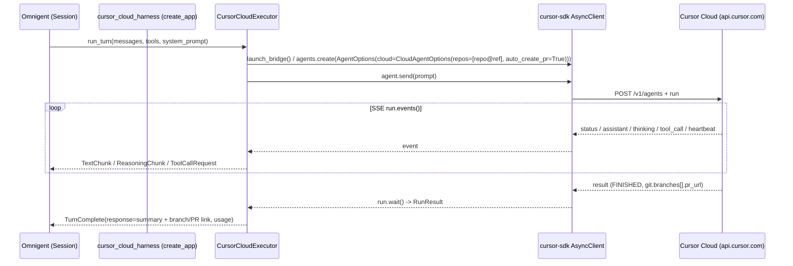
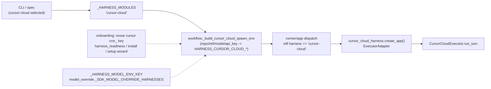

# feat: Add `cursor-cloud` Harness — Cursor Cloud / Background Agents

## Summary

Omnigent integrates Cursor in two local-only flavors today: `cursor` (the SDK/headless harness driving a local `cursor-agent` over a bridge) and `cursor-native` (the resident TUI mirror). Issue #1148 asks for **Cursor Cloud / Background Agents** — agents that run in Cursor's cloud VMs against a GitHub repo and push a branch / open a PR, rather than editing the local filesystem.

This plan adds a new `cursor-cloud` harness. The `cursor-sdk` Python package already vendored for the `cursor` harness exposes cloud through the **same** `AsyncClient.launch_bridge` client via `AgentOptions(cloud=CloudAgentOptions(repos=[...]))`. The harness launches a cloud run from a user prompt, streams the run's SSE events back as live Omnigent conversation events, and resolves the turn with the agent's result summary plus the branch/PR link.

v1 is deliberately minimal: **launch → live stream → result/PR**, one cloud run per turn. No follow-up/cancel/list/archive/artifacts/multi-repo in the first PR.

---

## Problem Frame

- **Who:** Omnigent users who want to dispatch long-running, parallel, isolated coding agents that produce merge-ready PRs — without tying up their local machine (the value Cursor Cloud adds over the local `cursor` harness).
- **Today:** Both existing Cursor harnesses run on the local machine, operate on the local cwd, and require the machine to stay running. There is no path to Cursor's cloud runtime.
- **Gap:** Cloud agents have a fundamentally different execution model — remote VM, GitHub-repo-scoped, branch/PR output, fire-and-forget — that none of the local harness machinery (tool-bridge, `preToolUse` policy hook, local-cwd file edits) maps onto.
- **Goal:** A `cursor-cloud` harness that launches a cloud run, streams progress, and surfaces the resulting branch/PR, reusing the existing Cursor API-key auth and the vendored `cursor-sdk`.

---

## Requirements

- **R1.** A new harness selectable as `cursor-cloud` (registry, CLI choices, spec allowlist, routing).
- **R2.** A turn launches a Cursor cloud run via `cursor-sdk` `CloudAgentOptions` against a GitHub repo + starting ref.
- **R3.** Repo + ref default to the conversation cwd's git `origin` remote and current branch, with explicit `--repo` / `--ref` override.
- **R4.** The run's SSE events stream live into Omnigent as conversation events (assistant text, reasoning/thinking, tool-call info); the turn resolves with the result summary and branch/PR link.
- **R5.** Auth reuses the existing Cursor `crsr_` API key / `cursor` secret — no new credential surface.
- **R6.** Model selection flows through Omnigent's existing per-harness model-env + `/model` override path, with a cloud-appropriate default.
- **R7.** A never-onboarded repo (no Cursor dashboard env setup) produces a clear, actionable error rather than an opaque hang/failure.
- **R8.** Out of v1 scope: follow-up prompts, cancel/interrupt of a live run, list/archive, artifact download, multi-repo, env-var injection, custom subagents, webhooks.

---

## Key Technical Decisions

- **KTD1 — Use `cursor-sdk`'s `CloudAgentOptions`, not raw REST.** The official Python `cursor-sdk` exposes cloud through the same package and client as the local path (`from cursor_sdk import CloudAgentOptions, CloudRepository, AgentOptions`; `AgentOptions(cloud=...)`). It is already a vendored optional extra (`omnigent[cursor]`). A raw `httpx` REST client against `api.cursor.com/v1/agents` would duplicate auth, SSE parsing, and model handling the SDK already provides. *(External research load-bearing — confirmed SDK cloud support; see Sources.)*
- **KTD2 — New `cursor-cloud` harness key, not a mode-flag on `cursor`.** Although `launch_bridge` is shared, the cloud runtime breaks the local `cursor` executor's core assumptions: no Omnigent custom-tool bridge, no `preToolUse` policy hook, no local-cwd edits, output is a remote branch/PR. Folding a `cloud=True` branch into `CursorExecutor` would entangle two execution models. A separate executor keeps each clean.
- **KTD3 — Reuse the existing Cursor API key / `cursor` secret.** The same `crsr_` key authenticates both local and cloud. The harness consumes it via the established spawn-env precedence (spec `ApiKeyAuth` → `resolve_cursor_api_key()` → ambient `CURSOR_API_KEY`). No new `cursor_cloud_auth.py`.
- **KTD4 — `handles_tools_internally=True`, `supports_streaming=True`, no tool-bridge.** Tools execute in Cursor's cloud VM; Omnigent does not execute them. `tool_call` SSE events surface as informational `ToolCallRequest`/`ToolCallComplete`. The `tools` arg to `run_turn` is ignored.
- **KTD5 — Resolve repo/ref at the spawn-env layer.** `workflow._build_cursor_cloud_spawn_env` reads the cwd `origin` remote + current branch (overridable by `--repo`/`--ref`) and passes them as `HARNESS_CURSOR_CLOUD_REPO`/`_REF`. Keeps git access on the runner side and the executor pure w.r.t. config.
- **KTD6 — `auto_create_pr=True` by default; turn blocks until terminal with heartbeat tolerance.** The PR link is the core deliverable, so request it by default. The turn awaits `run.wait()` (terminal `FINISHED|ERROR|CANCELLED|EXPIRED`); SSE `heartbeat` events keep a long run alive. Interrupt/cancel is out of v1 scope, so `interrupt_session` returns `False`.
- **KTD7 — Minimal v1 surface (R8).** One run per turn. Multi-turn follow-up would map a second turn to `agent.send()` on the same agent, but that is deferred to keep the first PR reviewable.

---

## High-Level Technical Design

### Turn lifecycle (launch → stream → result)



### Where it plugs into the harness wiring



*Both diagrams render the intended design; prose in the units below is authoritative on disagreement.*

---

## Output Structure

New files (existing files are modified in place, listed per unit):

```
omnigent/inner/
  cursor_cloud_executor.py     # CursorCloudExecutor (SDK cloud launch + SSE mapping)
  cursor_cloud_harness.py      # thin create_app() wrap + HARNESS_CURSOR_CLOUD_* contract
omnigent/
  cursor_cloud_repo.py         # cwd-remote + override repo/ref resolution helper
tests/inner/
  test_cursor_cloud_executor.py
  test_cursor_cloud_harness.py
tests/
  test_cursor_cloud_repo.py
tests/runtime/
  test_cursor_cloud_spawn_env.py
tests/e2e/omnigent/
  test_per_harness_cursor_cloud.py
```

---

## Implementation Units

### U1. CursorCloudExecutor + harness wrap

**Goal:** The core executor: launch a cloud run via `cursor-sdk`, map SSE events to `ExecutorEvent`s, resolve the turn with summary + branch/PR link. Plus the thin `create_app()` wrap and its env-var contract.

**Requirements:** R2, R4, R6 (consumes model), R7.

**Dependencies:** U2 (repo/ref reach the executor via env, but the executor only reads them — author U1 against the env contract; U2 produces the values).

**Files:**
- `omnigent/inner/cursor_cloud_executor.py` (new)
- `omnigent/inner/cursor_cloud_harness.py` (new)
- `pyproject.toml` (bump `cursor = ["cursor-sdk>=…"]` only if cloud absent at the pinned floor)
- `tests/inner/test_cursor_cloud_executor.py` (new)
- `tests/inner/test_cursor_cloud_harness.py` (new)

**Approach:**
- Mirror `CursorExecutor` / `cursor_harness.py` structure: `Executor` subclass + `ExecutorAdapter(executor_factory=…, harness_label="Cursor Cloud")`.
- `run_turn`: lazily import `cursor_sdk` (optional extra → request-time `ImportError`), build `AgentOptions(model=…, cloud=CloudAgentOptions(repos=[CloudRepository(url, starting_ref)], auto_create_pr=True))`, `agent.send(prompt)`, async-iterate `run.events()` mapping: `assistant`→`TextChunk`, `thinking`→`ReasoningChunk`, `tool_call`→`ToolCallRequest`, `heartbeat`→no-op keep-alive, `error`→`ExecutorError`. Await `run.wait()`; emit `TurnComplete(response=summary + formatted branch/PR link, usage=…)`.
- The prompt is the latest user message text; ignore `tools` (cloud runs its own).
- Capability flags: `supports_streaming=True`, `supports_tool_calling=True`, `handles_tools_internally=True`, `supports_live_message_queue=False`. `interrupt_session` → `False` (cancel deferred).
- Env contract in the wrap: `HARNESS_CURSOR_CLOUD_MODEL`, `_API_KEY`, `_REPO`, `_REF`, `_CWD`, `_OS_ENV` (mirror `cursor_harness.py` defaults).
- R7: if the launch/first run fails with a "repo not set up"-class error, raise/emit an `ExecutorError` whose message names the dashboard onboarding URL (`https://cursor.com/onboard?repository=<url>`).

**Verified SDK surface (`cursor-sdk==0.1.7`, introspected 2026-06-25 — no pin bump needed):**
- Cloud client: `cursor_sdk.AsyncClient(base_url="https://api.cursor.com", auth_token=<crsr_ key>)` (or `AsyncClient.connect(base_url, auth_token)`). No default base_url constant — pass it explicitly. `allow_api_key_env_fallback` reads `CURSOR_API_KEY`.
- Launch: `agent = await client.create_agent(cloud=CloudAgentOptions(repos=[CloudRepository(url=…, starting_ref=…)], auto_create_pr=True), model=…, api_key=…)` → returns `AsyncAgent`. Then `run = await agent.send(prompt)` → returns `AsyncRun`.
- Stream: `async for ev in run.events()` yields `RunStreamEvent(kind: str, offset, sdk_message, result, done, interaction_update, step, result_is_full)`. `sdk_message` carries the same `SDKMessage` family the local harness already maps (`SDKAssistantMessage`, `SDKThinkingMessage`, `SDKToolUseMessage`, `SDKStatusMessage`). Terminal `ev.result` carries the `RunResult`; `ev.done` flags completion.
- Terminal: `result = await run.wait()` → `RunResult(id, agent_id, status, result, model, duration_ms, git, created_at)`. `result.git` is `RunGitInfo(branches=[RunGitBranchInfo(repo_url, branch, pr_url)])` or `None`.
- **Reuse the local executor's helpers** — `_sdk_message_to_events`, `_resolve_model`, `_normalize_cursor_usage`, `_latest_user_text` in `omnigent/inner/cursor_executor.py` already map `SDKMessage`→`ExecutorEvent` and normalize usage. Extract/share them rather than reimplementing; the cloud executor differs only in client/agent construction and `RunResult.git`→PR-link formatting.

**Execution note:** `cursor-sdk==0.1.7` import already verified — cloud symbols present. Start from a failing test asserting a launched run's `RunStreamEvent` sequence maps to the expected `ExecutorEvent` stream (SDK client mocked).

**Patterns to follow:** `omnigent/inner/cursor_executor.py` (SDK client lifecycle, `_close_*` helpers, usage extraction), `omnigent/inner/cursor_harness.py` (env-var resolution + `ExecutorAdapter`), `iterate_blocking_stream` if the SDK stream is sync.

**Test scenarios:**
- Happy path: mocked client yields `status, assistant("Hello"), tool_call(edit), result(FINISHED, branch=cursor/x, pr_url=…)` → executor yields `TextChunk("Hello")`, a `ToolCallRequest`, then `TurnComplete` whose response contains the PR URL.
- Reasoning: `thinking` deltas → `ReasoningChunk(event_type="reasoning_text")`.
- Heartbeat-only gaps between events do not terminate the turn or emit spurious events.
- Terminal `ERROR` event → `ExecutorError(retryable=False)` with the provider message.
- "Repo not set up" launch failure → `ExecutorError` whose message includes the onboarding URL (R7).
- `result.git` is `None` / `pr_url` is `None` (autoCreatePR produced no PR) → `TurnComplete` still resolves, response notes the branch only.
- Missing `cursor_sdk` import → request-time `ImportError` surfaced as a clean executor error, not an app-boot crash.
- Wrap: env vars absent → documented defaults; `HARNESS_CURSOR_CLOUD_MODEL` set → forwarded to `AgentOptions.model`.

**Verification:** Unit tests pass with a mocked `cursor-sdk`; `create_app()` builds a FastAPI app without a live SDK; a launched run with `auto_create_pr` surfaces a PR link in the final response.

---

### U2. Repo/ref resolution helper

**Goal:** Resolve the GitHub repo URL + starting ref a cloud run targets: default to the cwd `origin` remote + current branch, overridable explicitly.

**Requirements:** R3.

**Dependencies:** none.

**Files:**
- `omnigent/cursor_cloud_repo.py` (new)
- `tests/test_cursor_cloud_repo.py` (new)

**Approach:**
- Pure function(s): given a cwd and optional `repo`/`ref` overrides, return a normalized `(repo_url, ref)`. Read `git remote get-url origin` and `git rev-parse --abbrev-ref HEAD` from the cwd when overrides are absent.
- Normalize SSH (`git@github.com:org/repo.git`) and HTTPS (`https://github.com/org/repo.git`) remotes to the `https://github.com/org/repo` form the Cursor API expects; strip `.git`.
- Override precedence: explicit `repo`/`ref` win over cwd-derived values.
- Raise a clear error when no override is given and cwd is not a git repo / has no `origin`.

**Patterns to follow:** existing cwd/git handling in `omnigent/cursor_native.py` (`resolve_*`), runner cwd plumbing.

**Test scenarios:**
- HTTPS origin → normalized `https://github.com/org/repo`, `.git` stripped.
- SSH origin (`git@github.com:org/repo.git`) → same normalized HTTPS form.
- Current branch detected via `rev-parse` → used as ref when no override.
- Explicit `repo`/`ref` override beats cwd values.
- cwd has no git repo and no override → clear, named error.
- Non-GitHub remote (e.g. GitLab) → passes through normalized (API supports it) but is recorded; no crash.

**Verification:** Helper returns correct `(url, ref)` for each remote shape; override precedence holds; missing-remote error is explicit.

---

### U3. Register `cursor-cloud` (registry, routing, aliases, spec allowlist)

**Goal:** Make `cursor-cloud` a first-class selectable harness so the runner resolves and serves it.

**Requirements:** R1.

**Dependencies:** U1 (registry value must point at a real module).

**Files:**
- `omnigent/runtime/harnesses/__init__.py` (add `"cursor-cloud": "omnigent.inner.cursor_cloud_harness"` to `_HARNESS_MODULES`)
- `omnigent/spec/_omnigent_compat.py` (`OMNIGENT_HARNESSES`, `OMNIGENT_HARNESS_ALIASES`)
- `omnigent/harness_aliases.py` (`HARNESS_ALIASES`; **not** `NATIVE_HARNESSES` — cloud has no TUI/terminal)
- tests: extend the relevant existing registry/spec tests.

**Approach:** Pure registration. Routing (`runner/routing.py`) and the process manager pick up `_HARNESS_MODULES` additions automatically — no edits there. Do not add to `NATIVE_HARNESSES` or native-coding-agent metadata; `cursor-cloud` is not a terminal takeover.

**Test scenarios:**
- `cursor-cloud` resolves through routing to its harness module.
- Spec allowlist accepts `cursor-cloud` as a valid `executor.harness`.
- It is absent from `NATIVE_HARNESSES`.

**Verification:** A spec / CLI selection of `cursor-cloud` resolves to `cursor_cloud_harness` without error.

---

### U4. Spawn-env builder + dispatch + model wiring

**Goal:** Translate the selected harness + config into the `HARNESS_CURSOR_CLOUD_*` env the wrap reads, including resolved repo/ref and model.

**Requirements:** R2, R3, R5, R6.

**Dependencies:** U1 (env contract), U2 (repo/ref resolution), U3 (harness registered).

**Files:**
- `omnigent/runtime/workflow.py` (new `_build_cursor_cloud_spawn_env`, mirroring `_build_cursor_spawn_env`)
- `omnigent/runner/app.py` (dispatch `elif harness == "cursor-cloud"`; `_HARNESS_MODEL_ENV_KEY` add `"cursor-cloud": "HARNESS_CURSOR_CLOUD_MODEL"`)
- `omnigent/model_override.py` (add `cursor-cloud` to `_SDK_MODEL_OVERRIDE_HARNESSES`)
- `tests/runtime/test_cursor_cloud_spawn_env.py` (new)

**Approach:**
- `_build_cursor_cloud_spawn_env`: API-key precedence identical to `_build_cursor_spawn_env` (spec `ApiKeyAuth` → `resolve_cursor_api_key()` → ambient). Call U2's resolver with the conversation cwd + any `--repo`/`--ref` to populate `HARNESS_CURSOR_CLOUD_REPO`/`_REF`. Forward model + os_env.
- Dispatch branch wires the builder into the runner spawn path.
- Model-env-key + `model_override` keep `/model` overrides landing in `HARNESS_CURSOR_CLOUD_MODEL`; pick a cloud-appropriate default model (e.g. `composer-2.5` / `auto`) when unset; drop a `databricks-*` id authored for another harness.

**Test scenarios:**
- Builder emits `HARNESS_CURSOR_CLOUD_{API_KEY,MODEL,REPO,REF,CWD}` from a spec + cwd.
- API-key precedence: spec key beats stored beats ambient.
- `--repo`/`--ref` override flows into the env; absent → cwd-derived (via U2).
- `/model` override for `cursor-cloud` lands in `HARNESS_CURSOR_CLOUD_MODEL`.
- A `databricks-*` model id is dropped, not forwarded.

**Verification:** Spawning `cursor-cloud` yields a child env with a resolved repo/ref, API key, and model; `/model` override round-trips.

---

### U5. Onboarding: reuse Cursor auth, readiness, install, CLI surface

**Goal:** Make `cursor-cloud` set-up-able and visible: it is "ready" when the Cursor API key is configured, installable via the `omnigent[cursor]` extra, and selectable in CLI choices / setup wizard.

**Requirements:** R1, R5.

**Dependencies:** U3.

**Files:**
- `omnigent/onboarding/harness_readiness.py` (a `cursor-cloud` branch → `cursor_api_key_configured()`; register the spelling in the readiness set)
- `omnigent/onboarding/harness_install.py` (`_HARNESS_INSTALL` / `_HARNESS_FAMILY` — reuse the Cursor `omnigent[cursor]` extra)
- `omnigent/cli.py` (`_HARNESS_CHOICES_HELP` / `_DEFAULT_HARNESS_PROMPTS`; setup-wizard manager — reuse Cursor's key management since the secret is shared)
- tests: extend `tests/onboarding/test_*` for the new readiness/install entries.

**Approach:** No new secret. Readiness reuses `cursor_api_key_configured()`. Install reuses the `cursor` family extra. CLI choices gain a `cursor-cloud` line describing "cloud / background agents (GitHub repo → PR)". The setup wizard routes `cursor-cloud` management to the existing Cursor key flow (or notes "shares the Cursor API key").

**Test scenarios:**
- Readiness reports `cursor-cloud` ready iff the Cursor API key is configured.
- Install spec maps `cursor-cloud` to the `omnigent[cursor]` extra.
- CLI harness choices include `cursor-cloud` with cloud-specific help text.

**Verification:** `cursor-cloud` appears in harness choices; readiness reflects Cursor key presence; install points at the right extra.

---

### U6. Behavioral e2e + docs

**Goal:** Prove the end-to-end harness contract with a per-harness behavioral test and document the new harness.

**Requirements:** R4, R7 (error surfacing), R8 (documented scope boundary).

**Dependencies:** U1–U5.

**Files:**
- `tests/e2e/omnigent/test_per_harness_cursor_cloud.py` (new, mirroring `test_per_harness_cursor.py`)
- docs: a short `cursor-cloud` section wherever harness docs live (e.g. the harness list / `designs/` or README harness table) noting the GitHub + dashboard-onboarding prerequisite.

**Approach:** Behavioral e2e with the SDK boundary mocked (no live cloud calls in CI): drive a turn through the harness app and assert the streamed events + final PR-bearing response. Document the env-setup prerequisite (R7) and the v1 scope boundary (R8).

**Execution note:** Live cloud calls are not run in CI — keep the e2e at the mocked-SDK boundary. Manual live verification is a release-time step, not a gate.

**Test scenarios:**
- e2e: a turn against the harness app with a mocked cloud run streams assistant text and resolves with a PR link.
- e2e: "repo not set up" path surfaces the onboarding-URL error (R7).

**Verification:** e2e passes against the mocked SDK; docs describe prerequisites and scope.

---

## System-Wide Impact

- **Runner / workflow:** one new spawn-env builder + one dispatch branch; routing and process-manager pick up the registry entry automatically.
- **Onboarding:** no new secret — reuses the Cursor key, so the credential surface is unchanged.
- **Users:** a new harness option; the only novel prerequisite is a GitHub-connected, dashboard-onboarded repo.
- **CI:** new unit/e2e tests at the mocked-SDK boundary; per the contribution notes, avoid coupling new coverage to the live-e2e gate.

---

## Risk Analysis & Mitigation

- **Env-setup gap (high).** A repo never set up in Cursor's dashboard cannot be launched programmatically — no API/SDK trigger exists (confirmed by Cursor). *Mitigation:* R7 — detect the failure and surface the `cursor.com/onboard?repository=…` URL; document the prerequisite (U6).
- **`cursor-sdk` cloud is public beta (medium).** API/SDK shapes may shift. *Mitigation:* isolate all SDK contact in `CursorCloudExecutor`; pin/track the version; the U1 import check catches a stale pin early.
- **Long-running turns (medium).** Cloud runs can be slow; the turn blocks until terminal. *Mitigation:* rely on SSE `heartbeat` to keep the stream alive; cancel/interrupt deferred (KTD6) — document that a launched run continues server-side even if the turn is abandoned.
- **API-key entitlement (low/medium).** The `crsr_` key may need cloud entitlement / a connected GitHub account distinct from local use. *Mitigation:* surface auth/permission errors verbatim; note the GitHub-connection requirement in docs.
- **Pin uncertainty (low).** Cloud likely present at `>=0.1.7` but unverified against PyPI. *Mitigation:* U1 execution-note import check; bump if needed.

---

## Scope Boundaries

**In scope (v1):** new `cursor-cloud` harness; launch one cloud run per turn via `cursor-sdk` `CloudAgentOptions`; live SSE streaming → Omnigent events; result summary + branch/PR link; cwd-remote repo/ref with `--repo`/`--ref` override; Cursor-key auth reuse; model resolution + `/model` override; env-setup-gap error surfacing.

### Deferred to Follow-Up Work
- Multi-turn follow-up prompts (`agent.send()` on a persisted agent across turns).
- Cancel/interrupt of a live cloud run (`interrupt_session` → cancel endpoint).
- List / archive / delete agents; artifact download; usage endpoint.
- Multi-repo runs (API allows ≤20), `customSubagents`, `envVars` injection, `mcpServers`, `mode: plan`.
- Webhooks (v0-only today) and any non-blocking/background completion model.
- Programmatic first-time repo env setup (blocked upstream — no API exists).

---

## Sources & Research

- Cursor Cloud Agents API — endpoints, SSE event types, run states, `git.branches[].pr_url`: https://cursor.com/docs/cloud-agent/api/endpoints
- Cursor Python SDK (`cursor-sdk`) — `AsyncClient.launch_bridge`, `AgentOptions`, `CloudAgentOptions`, `CloudRepository`, `run.events()` / `run.wait()`: https://cursor.com/docs/sdk/python
- Cursor APIs overview / auth (`crsr_`, Basic/Bearer, `api.cursor.com`): https://cursor.com/docs/api
- Env-setup-gap confirmation (manual dashboard onboarding required): Cursor forum, June 2026.
- Repo references: `omnigent/inner/cursor_executor.py`, `omnigent/inner/cursor_harness.py`, `omnigent/runtime/harnesses/__init__.py` (`_HARNESS_MODULES`), `omnigent/runtime/workflow.py` (`_build_cursor_spawn_env`), `omnigent/onboarding/cursor_auth.py`, `omnigent/onboarding/copilot_auth.py` (API-key auth template), `omnigent/inner/opencode_native_executor.py` (native-server reference, considered and rejected per KTD2).
- Issue: https://github.com/omnigent-ai/omnigent/issues/1148 (no existing PR as of 2026-06-25; `nethum529` expressed intent to take it).
