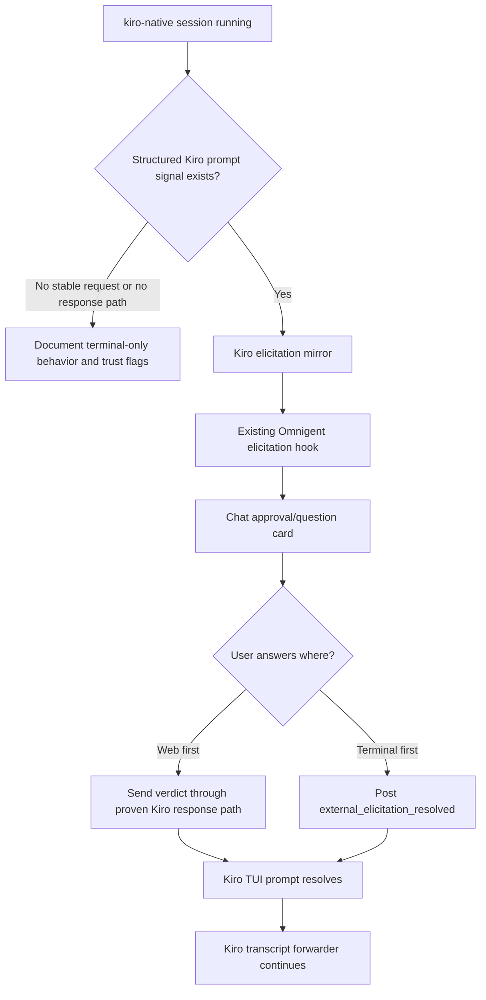

# feat: Add Kiro native elicitation support

## Overview

Plan issue omnigent-ai/omnigent#1209: determine whether `kiro-native` can safely surface Kiro interactive prompts as Omnigent web elicitations, then either implement the structured mirror or document the current terminal-only behavior as the supported expectation.

The current branch for this work is `issue-1209-kiro-elicitation`, created from an updated fork `main`. The implementation should stay narrowly scoped to Kiro native elicitation and follow existing native harness patterns rather than introducing a new harness architecture.

---

## Problem Frame

`kiro-native` currently runs the Kiro CLI TUI in a runner-owned terminal, mirrors Kiro's persisted transcript into Chat, and injects Chat input back into the TUI. If Kiro raises an interactive tool permission prompt or structured question, the prompt stays inside the Terminal view. Users can answer there, or avoid some prompts up front with Kiro trust flags, but Chat does not show an Omnigent elicitation card.

The issue asks whether structured elicitation is feasible for `kiro-native`. Feasibility depends on whether Kiro exposes a stable machine-readable pending prompt, a resolution signal, and a safe response path for `kiro-cli chat --tui`. Public Kiro docs describe structured ACP permission requests and a TUI ACP traffic recorder, but do not document a supported bidirectional control channel for the TUI path. The plan therefore starts with a hard evidence gate before adding user-facing web cards.

---

## Requirements Trace

### Feasibility and Behavior

- R1. Prove whether the actual `kiro-cli chat --tui` session used by `omnigent kiro` exposes a stable structured prompt signal.
- R2. Treat a prompt type as mirrorable only when the same TUI session exposes all required feasibility fields: stable id, prompt type, prompt payload/options, terminal-side resolution signal, and a safe response path.
- R3. If a Kiro prompt type is mirrorable, surface it through existing Omnigent elicitation machinery in Chat while preserving Terminal as an answer path.
- R4. If structured support is not feasible, document terminal-only approval behavior and trust flags instead of implementing fragile terminal scraping.

### Product Invariants

- R5. Keep Kiro's TUI prompt authoritative; web support is additive, and stale/dangling web cards must clear when Terminal wins.
- R6. Preserve `omnigent kiro` as the terminal-first native wrapper; do not replace it with an ACP-only or gateway-routed implementation.

### Contribution Requirements

- R7. Follow project contribution requirements: branch from `main`, keep changes focused, sign off commits, avoid secrets/internal URLs, and include tests/docs for observable behavior.

---

## Review Guardrails from PR #899

- G1. Satisfy security and e2e UI gates proactively when this work touches those surfaces.
- G2. Avoid lockfile registry drift; do not update lockfiles unless dependencies intentionally change.
- G3. Align with shared native harness registries and grouping modules only if the change touches those areas.
- G4. Add focused launcher/helper coverage for new Kiro behavior rather than relying only on live e2e.
- G5. Keep terminal-first Kiro out of incompatible live harness matrices; add explicit exclusions only when a matrix gate requires them.
- G6. Preserve the PR #899 bridge hardening lessons: do not skip partial JSONL lines, and never let tmux parse user content as flags.

---

## Scope Boundaries

- Do not scrape terminal output as the primary source of truth for Kiro permission prompts.
- Do not route Kiro through Databricks, OpenAI, Anthropic, or other provider gateway credentials.
- Do not bake Kiro credentials or API keys into tests, docs, fixtures, or CI.
- Do not add persistent trust behavior from a web approval unless Kiro exposes an explicit, safe, documented operation for that exact scope.
- Do not implement a broad ACP replacement for `omnigent kiro` in this PR; ACP investigation may inform feasibility, but the existing top-level terminal wrapper remains the product surface.
- Do not change unrelated harness behavior, shared lockfiles, package sources, or global test policy files to make this PR pass.

### Deferred to Follow-Up Work

- Full ACP-native Kiro transport: separate design if maintainers want a non-TUI Kiro path with first-class protocol control.
- Kiro cost/model/status surfacing: separate follow-up unless Kiro prompt records require touching the same metadata stream.
- Persistent web-managed Kiro trust policy: separate security design if Kiro exposes safe persistent trust APIs.

---

## Context & Research

### Relevant Code and Patterns

- `omnigent/kiro_native.py` launches the terminal-first Kiro wrapper and owns CLI argument behavior such as trust flags.
- `omnigent/runner/app.py` currently wires `_auto_create_kiro_terminal` to launch Kiro and register `supervise_kiro_session_forwarder` only.
- `omnigent/kiro_native_session_forwarder.py` discovers and tails Kiro persisted session records, parsing only `Prompt` and `AssistantMessage` into mirrored conversation items.
- `omnigent/kiro_native_bridge.py` injects normal user messages through tmux only after detecting Kiro's normal input prompt.
- `omnigent/qwen_native_permissions.py` is the preferred structured pattern: parse vendor control events, post to `/hooks/native-permission-request`, answer through the vendor's structured input channel, and clear cards when the terminal resolves first.
- `omnigent/cursor_native_permissions.py` shows how to surface persisted pending tool calls when the response still has to be delivered by keystrokes.
- `omnigent/goose_native_permissions.py` is a less preferred fallback pattern using pane detection, but still keeps the terminal prompt authoritative and releases web cards when the terminal wins.
- `omnigent/server/routes/sessions.py` already provides `/hooks/native-permission-request` for binary native approvals and `external_elicitation_resolved` for terminal-side resolution.
- `tests/test_qwen_native_permissions.py`, `tests/test_cursor_native_permissions.py`, and `tests/test_goose_native_permissions.py` provide the closest backend test shapes.
- `tests/e2e_ui/messages/test_native_kiro_render_parity.py` and `tests/e2e_ui/conftest.py` contain the skip-gated Kiro UI fixture added after PR #899.

### Institutional Learnings

- `docs/cursor-native-elicitation.md` documents the key lesson: do not infer impossibility from a shallow parse; Cursor's pending signal lived in persisted binary-ish frames, not plain JSON rows.
- `docs/cursor-native-tui-mirror-plan.md` is the superseded pane-scrape design and should be treated as a cautionary reference.
- `docs/QWEN_FOLLOWUPS.md` records the strongest pattern for native TUI elicitation: structured control request, web card, structured response, and loser-release when the terminal answers first.
- `docs/AGENT_YAML_SPEC.md` states that `kiro-native` uses Kiro's own login/auth and is not a generic `harness: kiro` gateway path.
- PR #899 maintainer follow-up commits fixed incomplete JSONL tailing, dash-prefixed tmux input, e2e UI coverage, live-matrix exclusion, launcher-helper coverage, security-scan false positives, and accidental lockfile registry drift. Those fixes should be treated as review expectations for this PR.

### External References

- Kiro ACP docs: https://kiro.dev/docs/cli/acp/
- Kiro Terminal UI docs: https://kiro.dev/docs/cli/terminal-ui/
- Kiro permissions/trust docs: https://kiro.dev/docs/cli/chat/permissions/
- Kiro headless docs: https://kiro.dev/docs/cli/headless/
- Kiro settings reference for ACP traffic recording: https://kiro.dev/docs/cli/reference/settings/
- ACP tool-call permission protocol: https://agentclientprotocol.com/protocol/v1/tool-calls.md
- GitHub Actions fork security guidance: https://docs.github.com/en/actions/security-for-github-actions/security-guides/security-hardening-for-github-actions

---

## Key Technical Decisions

- **Use one authoritative feasibility checklist:** A web elicitation card is only safe if the actual TUI session exposes stable id, prompt type, prompt payload/options, terminal-side resolution signal, and a safe response path. Missing any item routes that prompt type to terminal-only behavior.
- **Separate actual TUI evidence from ACP-only evidence:** ACP docs and recorder output can guide investigation, but the go/no-go decision must prove control over the same `chat --tui` session launched by `omnigent kiro`.
- **Select an explicit signal source:** U1 must decide whether prompt records come from Kiro session records, an explicitly wired recorder under the bridge dir, or another supported source. U2 consumes that selected source and must not assume it always matches transcript records.
- **Use existing server elicitation machinery:** Binary Kiro approvals should reuse `/hooks/native-permission-request` unless Kiro-specific structured questions require an additional adapter or hook.
- **Keep Kiro's TUI authoritative:** The native Kiro prompt remains visible and answerable in Terminal; the web mirror is additive and must fail open to Terminal-only behavior.
- **Require no-op-safe verdict delivery:** `inject_user_message` is designed for normal prompts and normal input markers. Permission verdict delivery needs a distinct structured channel or a separately tested prompt-state-specific keystroke path that either applies to the active intended prompt or fails without altering Terminal state.
- **Respect existing web-card semantics:** Omnigent approval cards currently become responded when the web verdict is submitted. Kiro-specific work should not introduce a two-phase UI state unless maintainers explicitly accept that broader UI/server change. The runner should still observe/log Kiro-side resolution for correctness and fallback decisions.
- **One-time approval by default:** Web `accept` should mean one prompt approval, not persistent trust. Persistent trust remains explicit through Kiro's own trust flags or TUI commands.
- **Register one lifecycle task for Kiro bridges:** If an elicitation mirror is added, gather it with the transcript forwarder under one registered runner task, mirroring Cursor/Qwen lifecycle handling.
- **Honor Kiro home/session location consistently:** Any Kiro session discovery used by the forwarder or mirror should respect the same Kiro home/environment that the runner passes to the `kiro-cli` child.
- **Treat Kiro prompt data as untrusted UI input:** Escape rendered text, length-limit previews, avoid raw-record logs, and redact paths/tokens/internal URLs from fixtures and diagnostics.
- **No secret-bearing CI for fork PRs:** Kiro authenticated e2e coverage must skip cleanly without local Kiro login, matching existing Kiro render-parity behavior.

---

## Open Questions

### Resolved During Planning

- Should implementation proceed directly to web-card support? No. It must first prove Kiro exposes stable structured request, resolution, and response semantics for the TUI path.
- Should terminal scraping be the default fallback? No. It is too brittle for Kiro's TUI and conflicts with the structured-source lesson from Cursor/Qwen.
- Should `omnigent kiro` become ACP-only? No. Preserve the terminal-first native wrapper; ACP can be investigated as a signal source, not used to replace the user-facing harness in this plan.

### Deferred to Implementation

- Exact Kiro record shapes: requires a live authenticated Kiro prompt capture and sanitized fixture review.
- Actual TUI response path: depends on whether Kiro exposes a writable control channel for the same TUI session, accepts ACP frame responses in the TUI path, or only supports visible terminal key selection.
- Prompt taxonomy: depends on whether Kiro emits binary permissions, option-based permissions, structured questions, or only terminal text.
- Resume/startup prompt reconstruction: depends on whether Kiro records unresolved state or only append-only prompt/resolution events.
- Auth readiness for live e2e: depends on whether `kiro-cli` exposes a safe non-secret readiness probe or the test must be opt-in via an explicit local environment flag.

---

## High-Level Technical Design

> *This illustrates the intended approach and is directional guidance for review, not implementation specification. The implementing agent should treat it as context, not code to reproduce.*

### Kiro Card State Expectations

| State | User-visible behavior |
|-------|-----------------------|
| Pending | Kiro-branded approval/question card appears in Chat; Terminal prompt remains visible and answerable. |
| Web verdict submitted | Card follows the existing Omnigent approval-card response behavior while the runner delivers the verdict through the proven Kiro response path. |
| Resolved in Terminal | Card is removed or marked resolved elsewhere via `external_elicitation_resolved`; no stale verdict is delivered. |
| Stale web click | Late click after Terminal resolution is ignored and leaves a clear resolved/terminal-won state. |
| Delivery failed or timed out | Terminal remains usable; the implementation must not imply Kiro accepted the verdict unless the matching Kiro resolution is observed. |
| Unsupported prompt | No web card is shown; docs and any runtime notice direct the user to Terminal. |

---

## Implementation Units

- [x] U1. **Prove Kiro prompt signal feasibility**

**Goal:** Capture and codify whether Kiro TUI prompts expose stable structured request, resolution, and response semantics.

**Requirements:** R1, R2, R4, R6, R7; Guardrails G1, G2, G4, G6

**Dependencies:** None

**Files:**
- Create or modify: `docs/kiro-native-elicitation.md`
- Create if sanitized fixtures are safe: `tests/fixtures/kiro_native/README.md`
- Test if parser fixtures are introduced: `tests/test_kiro_native_permissions.py`

**Approach:**
- Start from public docs and live authenticated Kiro CLI behavior, but preserve only sanitized, minimal evidence in the repo.
- Inspect Kiro's actual `chat --tui` session records and any explicitly wired recorder output for permission pending, permission accepted, permission declined, queued approvals, and question-like prompts.
- Treat ACP-only evidence as informative but insufficient unless it controls the same TUI session that `omnigent kiro` launches.
- Define one authoritative feasibility checklist for newly observed prompts: stable request id, prompt type, prompt payload/options, terminal-side resolution signal, and a safe response path.
- Separately document startup/resume visibility. If unresolved prompts cannot be reconstructed safely, support only prompts observed after the mirror starts and leave missed/resumed prompts terminal-only.
- Produce a prompt taxonomy and option-mapping table. Only prompt types that map exactly to Omnigent's one-time answer contract may be mirrored; all others remain terminal-only.
- Capture raw evidence in a throwaway workspace outside the repo with owner-only permissions. Redact before creating fixtures, and verify no tokens, internal URLs, prompts, local paths, or customer data remain.
- Decide whether Kiro session discovery must honor a custom Kiro home. If it does, capture that requirement here and carry it into U2/U4.
- If the evidence is insufficient, write the conclusion into `docs/kiro-native-elicitation.md` and route implementation to U6 only.
- If the evidence is sufficient, preserve sanitized record shapes as fixtures and continue to U2-U5.

**Execution note:** Treat this as characterization-first work. Do not add product behavior until the evidence document defines the supported Kiro record shapes.

**Patterns to follow:**
- `docs/cursor-native-elicitation.md` for documenting discovered private/persisted signals.
- `docs/QWEN_FOLLOWUPS.md` for recording request/response/loser-release semantics.
- `tests/test_kiro_native_session_forwarder.py` for sanitized Kiro JSONL fixture style.

**Test scenarios:**
- Happy path: sanitized permission-pending fixture with stable request id is classified as mirrorable.
- Happy path: sanitized permission-accepted or declined fixture is classified as resolved, not pending.
- Happy path: option-based permission fixture maps only `allow_once` and `reject_once`-equivalent options to web actions; persistent trust options are terminal-only unless explicitly accepted by maintainers.
- Edge case: ACP recorder fixture is ignored for go/no-go unless it is proven to control the same TUI session.
- Edge case: queued approval fixtures preserve request order and request ids without allowing out-of-order keystroke delivery.
- Edge case: malformed or unknown Kiro record is ignored and does not crash parsing.
- Edge case: partial trailing JSONL line is not consumed until complete, preserving PR #899's forwarder fix.
- Error path: missing any feasibility checklist item marks that prompt type unsupported rather than guessing from text.

**Verification:**
- The repo contains a clear feasibility decision and, if feasible, enough sanitized fixture data for another implementer to build against without using private logs.

---

- [x] U2. **Add Kiro prompt parser and mirror**

**Goal:** If U1 proves structured support, add a Kiro-specific permission/question mirror that consumes U1's selected structured signal source and parks web elicitations for active prompts.

**Requirements:** R2, R3, R5, R7; Guardrails G1, G4, G6

**Dependencies:** U1 feasible outcome

**Files:**
- Create: `omnigent/kiro_native_permissions.py`
- Modify: `omnigent/kiro_native_session_forwarder.py`
- Test: `tests/test_kiro_native_permissions.py`
- Test: `tests/test_kiro_native_session_forwarder.py`

**Approach:**
- Consume the authoritative signal source selected by U1. If that source is not the same session record file the transcript forwarder uses, make that separation explicit in code and docs.
- Reuse or factor Kiro session discovery so the mirror binds to the exact Kiro session selected by the transcript forwarder.
- Centralize Kiro session-directory resolution so the forwarder and mirror honor the same Kiro home/environment that the runner provides to the `kiro-cli` child.
- Start watching from a safe point: seed at current end for new sessions unless unresolved state can be reconstructed reliably from structured request/response records.
- Mint deterministic elicitation ids from Kiro request ids. If Kiro has no stable id, do not implement the mirror.
- Track pending requests by request id and skip same-batch request+response pairs that resolved before the web card could park.
- Post terminal-side resolutions through `external_elicitation_resolved` when Kiro resolves a prompt before the web verdict returns.
- Length-limit and sanitize every Kiro-derived preview before posting it to the server or writing test fixtures.

**Patterns to follow:**
- `omnigent/qwen_native_permissions.py` for structured request/response tailing.
- `omnigent/cursor_native_permissions.py` for terminal-fallback and resolution clearing.
- `tests/test_qwen_native_permissions.py` for parser and supervisor tests.

**Test scenarios:**
- Happy path: new permission request record posts one hook payload with deterministic `elicitation_id`, `agent="Kiro"`, policy name `kiro_native_permission`, operation type, and content preview.
- Happy path: default Kiro home and custom Kiro home fixtures resolve to the same session source the runner launched.
- Edge case: duplicate polls of the same pending request do not create duplicate tasks or duplicate web cards.
- Edge case: request and response in the same read batch do not park a stale card.
- Edge case: prompt previews longer than the cap are truncated before hook POST and before logging.
- Edge case: reused request ids in a different session do not collide because elicitation ids are namespaced by Omnigent session and Kiro request identity.
- Error path: malformed records, unknown prompt types, and hook HTTP errors are logged and fail open to Terminal-only behavior.
- Integration: terminal-side resolution while the hook request is pending posts `external_elicitation_resolved` and suppresses stale response delivery.

**Verification:**
- Kiro prompt parsing is deterministic, idempotent, and does not interfere with normal transcript forwarding when records are absent or unsupported.

---

- [x] U3. **Define Kiro verdict delivery and hook contract**

**Goal:** Connect Kiro prompt records to Omnigent's existing elicitation result contract without overgeneralizing the server API.

**Requirements:** R2, R3, R5, R6, R7; Guardrails G1, G4

**Dependencies:** U1 feasible outcome, U2

**Files:**
- Modify only if existing binary hook cannot represent a supported Kiro prompt type: `omnigent/server/routes/sessions.py`
- Modify if verdicts need a Kiro-specific helper: `omnigent/kiro_native_bridge.py`
- Test: `tests/server/routes/test_session_resources.py`
- Test: `tests/test_kiro_native_bridge.py`
- Test if a dedicated route is needed: `tests/server/test_kiro_native_elicitation.py`

**Approach:**
- Prefer the existing generic `/hooks/native-permission-request` route for binary tool approvals.
- Add or extend server behavior only if Kiro emits structured questions that need `ask_user_question` payload preservation.
- Keep the Kiro verdict payload limited to one-time allow/reject. Map web `accept` only to Kiro's `allow_once`-equivalent option and web `decline`/`cancel` only to Kiro's `reject_once`-equivalent option.
- Do not expose Kiro's persistent trust options in Chat unless maintainers approve a separate persistent-trust design.
- Prefer request-addressed delivery. If Kiro only accepts visible-prompt keystrokes, serialize delivery strictly to the currently active prompt and mark queued/out-of-order prompt types terminal-only.
- Add a distinct Kiro response delivery helper if verdicts are delivered by tmux; it must detect the permission prompt state and must not reuse normal chat-message injection blindly.
- Treat the internal Kiro request as successfully resolved only after a matching Kiro resolution signal is observed. If resolution is missing or delivery fails, do not send additional responses; keep Terminal usable and report fallback through existing UI/server affordances unless a separate UI-state change is explicitly scoped.
- If only an observational record exists and no safe response path exists, skip this unit and route to U6.

**Patterns to follow:**
- `omnigent/server/routes/sessions.py` `native_permission_request_hook` for binary approvals.
- `omnigent/server/routes/sessions.py` `cursor_permission_request_hook` for structured question payloads.
- `omnigent/kiro_native_bridge.py` for tmux safety guards, dash-prefixed literal handling, and input-readiness verification.

**Test scenarios:**
- Happy path: Kiro binary permission hook publishes an elicitation and returns a JSON verdict to the parked runner request.
- Happy path: Kiro structured question, if supported, preserves question labels/options and returns selected answer content.
- Happy path: web accept maps to the captured Kiro one-time allow option id and the runner observes the matching Kiro resolution before marking the internal request resolved.
- Happy path: web decline/cancel maps to the captured Kiro one-time reject option id and the runner observes the matching Kiro resolution before marking the internal request resolved.
- Edge case: non-dict or missing `elicitation_id` payload returns a clear invalid-input error.
- Edge case: web verdict arrives after terminal resolution and does not send a stale Kiro response.
- Edge case: two queued prompts cannot be answered out of order unless the response path is request-addressed.
- Error path: response helper refuses to type into a normal chat input when the expected permission prompt is not visible or not structurally active.
- Error path: partial delivery, timeout, or missing Kiro resolution leaves Terminal usable and does not mark the internal Kiro request as resolved.

**Verification:**
- The server contract is either unchanged and reused, or extended only for a Kiro-supported prompt shape with focused route tests.

---

- [x] U4. **Wire the Kiro mirror into runner lifecycle**

**Goal:** Start, supervise, and cancel the Kiro elicitation mirror with the existing Kiro transcript forwarder.

**Requirements:** R2, R3, R5, R7; Guardrails G1, G3, G4

**Dependencies:** U1 feasible outcome, U2, U3

**Files:**
- Modify: `omnigent/runner/app.py`
- Test: `tests/runner/test_app_sessions_native.py`

**Approach:**
- Replace the single Kiro forwarder task with a grouped Kiro bridge task that gathers the transcript forwarder and the elicitation mirror, matching Qwen and Cursor patterns.
- Keep one `_register_auto_forwarder_task` handle per session so terminal restart/teardown cancels both pieces together.
- Preserve existing `requires_forwarder_ready` behavior for resumed Kiro sessions.
- Ensure mirror setup uses the same `server_url`, refresh-capable runner auth, bridge dir, workspace, launch epoch, and expected Kiro session id as the transcript forwarder.
- If U1 selects a Kiro recorder file as the signal source, explicitly create that file under the Kiro bridge dir and pass only that path to the Kiro child environment. Do not rely on inherited arbitrary recorder env because the Kiro terminal launch uses an allowlisted environment.
- Start watching before Kiro can emit supported prompt records, or perform a bounded backward scan from launch epoch that reconstructs unresolved prompts without reopening resolved history.
- On terminal restart, clear or rotate any per-session recorder state so old prompts cannot be replayed into a new Kiro terminal.

**Patterns to follow:**
- `omnigent/runner/app.py` `_supervise_qwen_native_bridges` for grouping forwarder and approval mirror.
- `omnigent/runner/app.py` Cursor native bridge task for using runner auth and shared lifecycle registration.
- PR #899 maintainer merge commits that kept native harness registration blocks in sync with new Goose/Qwen/OpenCode harnesses.

**Test scenarios:**
- Happy path: auto-created Kiro terminal registers one grouped task that starts both transcript forwarder and elicitation mirror.
- Edge case: terminal restart cancels the prior grouped task before creating a new one.
- Edge case: resumed Kiro session still passes expected external session id to the transcript side and shares session binding with the mirror.
- Edge case: a prompt emitted before the mirror task reaches its first poll is either found by bounded catch-up or explicitly left in Terminal-only fallback with no stale web card.
- Edge case: recorder path, if used, is bridge-dir scoped and not inherited from arbitrary parent env.
- Error path: mirror startup failure is logged and does not prevent the transcript forwarder or terminal from remaining usable, if the failure mode is recoverable.

**Verification:**
- Kiro native sessions keep existing transcript behavior and gain mirror lifecycle management without duplicate forwarders or orphaned tasks.

---

- [x] U5. **Add user-facing Kiro elicitation coverage**

**Goal:** Prove the Chat card behavior when structured Kiro support is feasible, while keeping CI safe when Kiro credentials are unavailable.

**Requirements:** R3, R5, R7; Guardrails G1, G4

**Dependencies:** U1 feasible outcome, U2, U3, U4

**Files:**
- Create: `tests/e2e_ui/messages/test_native_kiro_elicitation.py`
- Modify only if fixture support is needed: `tests/e2e_ui/conftest.py`
- Test: `tests/test_kiro_native_permissions.py`

**Approach:**
- Mirror the skip-gated style in `tests/e2e_ui/messages/test_native_kiro_render_parity.py`: run where `kiro-cli`, `tmux`, and Kiro login exist; skip cleanly elsewhere.
- Add an explicit Kiro auth readiness probe or opt-in environment gate so missing login is a skip reason, not a failed assertion or false evidence of unsupported elicitation.
- Exercise one happy path permission prompt if a deterministic Kiro prompt can be triggered without secrets or destructive tools.
- If no safe live trigger exists, keep e2e UI coverage limited to fixture-backed rendering and document why a maintainer waiver or local proof is required.
- Specify the card UX contract before testing: Kiro-branded title, tool/question body hierarchy, escaped preview, one-time-scope copy, action labels, and no persistent-trust affordance unless separately designed.
- Specify race-state UI outcomes within the existing approval-card model: pending, responded after web verdict, resolved in Terminal, stale web click after terminal resolution, delivery timeout/fallback. Add a new UI state only if separately approved.
- Do not add secret-bearing Kiro jobs for fork PRs.

**Patterns to follow:**
- `tests/e2e_ui/messages/test_native_kiro_render_parity.py` for Kiro UI fixture and skip rules.
- `tests/e2e_ui/messages/test_native_goose_render_parity.py` and `tests/e2e_ui/messages/test_native_cursor_render_parity.py` for native UI parity expectations.
- `CONTRIBUTING.md` frontend section for Playwright requirements on user-facing UI behavior.

**Test scenarios:**
- Happy path: Kiro prompt appears as a Chat elicitation card while the Terminal prompt remains visible.
- Happy path: accepting from Chat resolves the Kiro prompt and the mirrored transcript continues.
- Happy path: answering in Terminal clears a still-pending Chat card.
- Happy path: fixture-backed render asserts Kiro title/body/action labels, one-time-scope copy, escaped preview text, and no persistent-trust action.
- Edge case: terminal-first resolution shows the chosen resolved-elsewhere state, whether that is card removal or explicit resolved copy.
- Edge case: stale web click after terminal resolution does not send a second Kiro response and leaves a clear UI state.
- Error path: delivery failure does not silently imply Kiro accepted the verdict; Terminal remains usable and the selected fallback affordance is visible or documented.
- Edge case: unavailable Kiro prerequisites skip the e2e UI test with an explicit reason.
- Error path: if structured support becomes unavailable for a previously supported prompt type, the UI shows the selected Terminal fallback or failed-card state rather than hanging.

**Verification:**
- The PR either satisfies the E2E UI Required gate with meaningful coverage or contains a clear rationale for why only terminal-only behavior is supported.

---

- [x] U6. **Document Kiro elicitation capability and fallback behavior**

**Goal:** Make the final user expectation explicit whether structured support lands or is deemed infeasible.

**Requirements:** R4, R6, R7; Guardrails G1, G2

**Dependencies:** U1; U2-U5 if feasible

**Files:**
- Modify: `README.md`
- Modify: `docs/AGENT_YAML_SPEC.md`
- Create or modify: `docs/kiro-native-elicitation.md`
- Test if CLI help changes: `tests/cli/test_cli.py`

**Approach:**
- If feasible support lands, document how Kiro web elicitations work, their one-time scope, terminal fallback, and Kiro prerequisites.
- If support is infeasible, document that prompts stay in Terminal view and list supported alternatives: answer in Terminal, use Kiro trust flags, or use Kiro's own TUI trust commands.
- Warn that Kiro trust flags bypass prompts, should only be used in trusted workspaces, are never set automatically by Omnigent, and remain explicit user choices.
- Explicitly state that `kiro-native` remains Kiro-authenticated and does not use Omnigent provider gateway credentials.
- Avoid adding unsupported promises about every Kiro prompt type; distinguish permissions from questions if only one is supported.
- If maintainers consider docs-only fallback insufficient to close issue #1209, split a follow-up runtime notice that tells Chat users Kiro is waiting for Terminal input. Do not add that notice preemptively unless the feasibility result or maintainer feedback justifies it.

**Patterns to follow:**
- `docs/AGENT_YAML_SPEC.md` Kiro native section.
- `README.md` Kiro install and usage sections.
- `docs/cursor-native-elicitation.md` for capability documentation style.

**Test scenarios:**
- Test expectation: none for docs-only fallback when no CLI output changes.
- Happy path if CLI help changes: `omnigent kiro --help` includes any new documented flag or caveat without changing existing trust flag behavior.
- Edge case if a runtime fallback notice is added: when a known unsupported Kiro prompt state is detected, Chat explains that the user must switch to Terminal without disabling unrelated normal session controls.

**Verification:**
- A user reading docs understands exactly whether to expect Chat cards, Terminal prompts, or both for Kiro interactive prompts.

---

## System-Wide Impact

- **Interaction graph:** Kiro TUI prompt records would flow through a runner mirror, server elicitation hook, web card, verdict response path, and terminal/JSONL resolution tracking.
- **Error propagation:** Parser, hook, or response failures should log and fail open to Terminal-only behavior. They should not kill the Kiro terminal or block normal transcript forwarding.
- **State lifecycle risks:** Duplicate prompt cards, stale cards on resume, cross-session id collisions, wrong-session binding, and queued prompt out-of-order answers are the main risks. Namespaced deterministic ids and shared forwarder discovery mitigate them.
- **API surface parity:** If structured questions are supported, the server hook must preserve question payloads like Cursor and Antigravity do; binary approvals can use the generic native permission hook.
- **Integration coverage:** Unit tests can prove parsing and hook behavior; only a skip-gated Kiro e2e UI journey can prove real TUI/web interaction when local Kiro auth exists.
- **Unchanged invariants:** `omnigent kiro` remains terminal-first, `kiro-native` remains the canonical harness id, Kiro credentials remain vendor-owned, and normal Chat input still enters through the existing Kiro bridge.
- **Untrusted rendering:** Kiro-derived prompt text, options, commands, schemas, and previews must be escaped, length-limited, and redacted before UI rendering, logs, or fixtures.

---

## Risks & Dependencies

| Risk | Mitigation |
|------|------------|
| Kiro exposes no stable TUI control records | Stop after U1 and document terminal-only behavior instead of scraping terminal output. |
| Kiro exposes observational records but no safe response path | Surface no web card; document that Terminal remains the only supported answer path. |
| Private Kiro record schema changes | Keep failure benign, parser tolerant, docs version-aware, and tests fixture-based. |
| Web approval accidentally grants persistent trust | Map web accept to one-time approval only unless Kiro explicitly supports safe scoped trust. |
| Terminal and web answer concurrently | Track pending ids and post `external_elicitation_resolved` when Terminal resolves first. |
| Queued approvals receive out-of-order web verdicts | Require request-addressed response delivery or serialize to the active visible prompt only. |
| Partial tmux verdict delivery changes Terminal state | Require no-op-safe delivery tests before enabling web cards; otherwise leave the prompt terminal-only. |
| Reused Kiro request ids collide across sessions | Namespace elicitation ids by Omnigent session and selected Kiro request identity. |
| Kiro prompt content leaks sensitive local data | Redact fixtures/logs and escape/length-limit all Kiro-derived UI content. |
| Authenticated Kiro tests cannot run in CI | Follow existing skip-gated Kiro e2e style and avoid secret-bearing fork jobs. |
| CI security scan flags fixture names or env vars | Use neutral fixture/env names, avoid secret-like tokens, and run the repo security scanner before PR. |
| Lockfiles drift to private registries | Do not run dependency update commands unless the change intentionally modifies dependencies. |

---

## Documentation / Operational Notes

- Include an issue/PR note that public Kiro docs do not currently document a stable bidirectional control channel for `chat --tui`; if implementation proceeds, cite the specific observed record shape and Kiro CLI version used.
- Keep all captured Kiro evidence sanitized. Do not commit prompts, paths, credentials, internal URLs, tokens, or user data. Raw captures should live outside the repo in a throwaway, owner-only temp directory and be deleted after fixture creation.
- If e2e UI support is feasible, expect a local proof path rather than default CI execution because Kiro login is not provisioned in fork PRs.
- Do not add `pull_request_target` Kiro jobs or fork-PR workflows that expose repository secrets to untrusted code. Authenticated Kiro runs belong in maintainer-triggered trusted workflows or local proof.
- Commit messages should use signoff per `CONTRIBUTING.md`.

---

## Sources & References

- GitHub issue: https://github.com/omnigent-ai/omnigent/issues/1209
- Related PR: https://github.com/omnigent-ai/omnigent/pull/899
- Contribution guide: `CONTRIBUTING.md`
- Kiro native docs: `docs/AGENT_YAML_SPEC.md`
- Cursor elicitation design: `docs/cursor-native-elicitation.md`
- Qwen native follow-ups: `docs/QWEN_FOLLOWUPS.md`
- Kiro native launcher: `omnigent/kiro_native.py`
- Kiro transcript forwarder: `omnigent/kiro_native_session_forwarder.py`
- Kiro tmux bridge: `omnigent/kiro_native_bridge.py`
- Native permission hook: `omnigent/server/routes/sessions.py`
- Qwen permission mirror: `omnigent/qwen_native_permissions.py`
- Cursor permission mirror: `omnigent/cursor_native_permissions.py`
- Goose permission mirror: `omnigent/goose_native_permissions.py`
- Kiro e2e UI fixture: `tests/e2e_ui/messages/test_native_kiro_render_parity.py`
- Kiro ACP docs: https://kiro.dev/docs/cli/acp/
- Kiro terminal UI docs: https://kiro.dev/docs/cli/terminal-ui/
- Kiro permissions docs: https://kiro.dev/docs/cli/chat/permissions/
- ACP tool-call permission protocol: https://agentclientprotocol.com/protocol/v1/tool-calls.md
