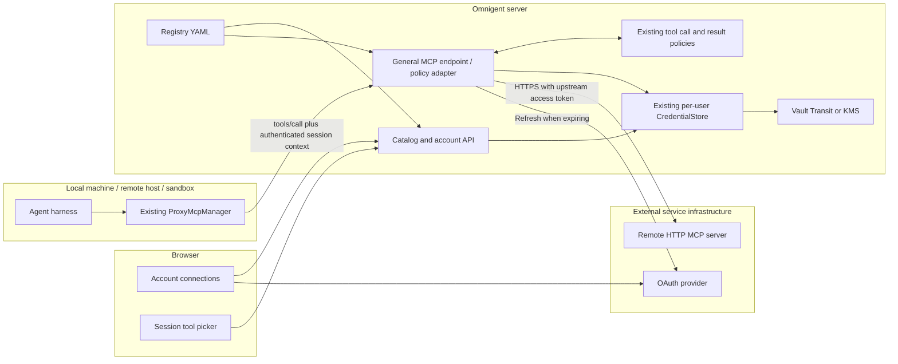
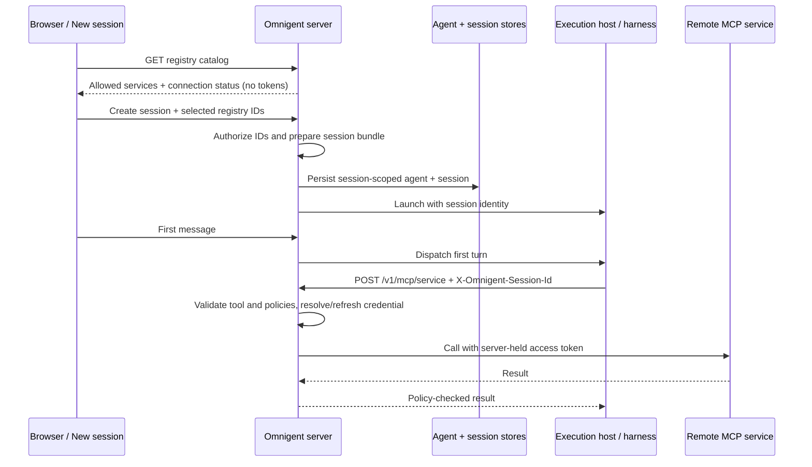
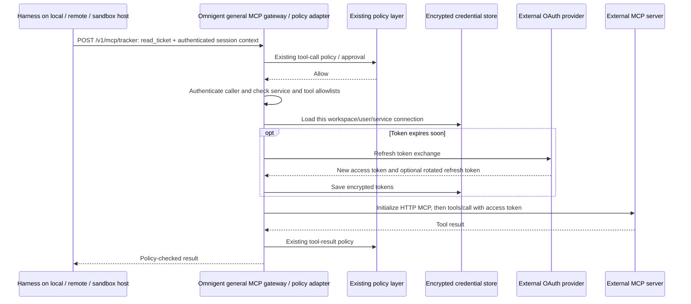

# Managed MCP registry and gateway prototype

Connect an external account once in **Settings → MCP**, then add its tools to
sessions on local machines, remote hosts or sandboxes. The server holds and
refreshes upstream credentials. Runners receive a catalog reference and tool schemas.

The **registry** is administrator-owned configuration: service IDs, destinations,
authentication and allowed tools/users. The **gateway** executes requests through
a per-service `/v1/mcp/{service}` endpoint. An Omnigent policy adapter validates
session context and applies request/response policies around the execution backend.

See the [architecture overview](../../designs/MCP_REGISTRY_GATEWAY.md) for component
ownership and the OAuth, launch, tool-call, refresh and credential-broker diagrams.
The [API reference](../../designs/MCP_REGISTRY_API.md) covers HTTP requests,
existing Python hooks and bringing your own registry or gateway.



The upstream MCP server lives at the administrator's URL. It is an outbound
request from the Omnigent server. A `transport: registry` entry does not start a
local MCP subprocess. Existing direct HTTP and stdio entries retain their behavior.

## Choose tools before launch

On **New session**, open **MCPs** in the composer footer and check the services
to add. The list comes from the administrator's registry. An unconnected OAuth
service opens a sign-in popup and is selected only after authorization succeeds;
launch is disabled while sign-in is pending. Connected accounts are reused.
Bearer-token services must first be connected in Settings. Unchecking a service
does not disconnect the account.

Choose a host or a new sandbox, an agent, and your first message, then launch.
The server saves the references before scheduling the runner, so the first turn
can use the tools without a second attach/restart step. Selection stays in the
current in-memory launch draft across navigation; a fresh draft defaults to none.
The picker is absent when the server does not advertise the `mcp` connection
capability.

Both JSON `POST /v1/sessions` and multipart creation metadata accept the optional
field `mcp_registry_services`, for example `["tracker"]`. These IDs **add to**
the agent's authored tools. A JSON create with selections gets a session-scoped
copy of the agent bundle; other sessions and the template are unchanged. Trusted
template environment fields are resolved at launch, including nested agents;
user uploads never expand against the server environment. Existing
registry tool restrictions are preserved, custom-name collisions are rejected,
and unknown or disallowed services fail before session persistence. Named
sub-agent creates use their authored MCP configuration rather than this picker.

The field is specific to the OSS registry. It does not reinterpret hosted
connection names or labels, and does not change the store interface. Deployments
without the registry continue through the existing creation path.

Native harnesses discover selected MCP tools through the per-service gateway and
advertise them alongside built-in tools in their existing relay. Calls still
use the gateway's authorization and tool policies; upstream credentials stay
on the server.



## Local Docker / Colima walkthrough

Use a disposable local development environment. The example provider has fictional
accounts, no login challenge, and 45-second access tokens; Vault uses a development
root token. Do not expose this setup publicly or use real credentials with it.
Docker Desktop, Docker Engine, or a running Colima instance with Docker Compose
works. Commands below run from the repository root, in separate terminals where
indicated. `uv`, Node/pnpm and Docker are prerequisites.

Install and build:

```bash
uv sync --frozen --extra vault --group dev
pnpm install --frozen-lockfile
pnpm --dir web build
docker compose -f examples/mcp-registry/compose.yaml up -d vault
curl --fail -X POST -H 'X-Vault-Token: local-mcp-demo-only' \
  -d '{"type":"transit"}' http://127.0.0.1:18781/v1/sys/mounts/transit
curl --fail -X POST -H 'X-Vault-Token: local-mcp-demo-only' \
  -d '{"type":"aes256-gcm96","derived":true}' \
  http://127.0.0.1:18781/v1/transit/keys/mcp-demo
```

The first Transit command is needed once per Vault container lifetime. If Vault
is still booting, retry it. Vault dev state is lost when its container restarts.

Terminal 1 — server, with isolated state:

```bash
export MCP_DEMO_STATE="$(mktemp -d)"
export OMNIGENT_DATA_DIR="$MCP_DEMO_STATE/data"
export OMNIGENT_CONFIG_HOME="$MCP_DEMO_STATE/config"
export OMNIGENT_LOCAL_SINGLE_USER=1
export OMNIGENT_MCP_REGISTRY="$PWD/examples/mcp-registry/registry.yaml"
export OMNIGENT_CREDENTIAL_CIPHER=vault
export OMNIGENT_CREDENTIAL_VAULT_KEY=mcp-demo
export VAULT_ADDR=http://127.0.0.1:18781
export VAULT_TOKEN=local-mcp-demo-only
export OMNIGENT_MCP_OAUTH_STATE_SECRET="$(uv run --no-sync python -c 'import secrets; print(secrets.token_urlsafe(40))')"
uv run --no-sync omnigent server --host 0.0.0.0 --port 18780 \
  --database-uri "sqlite:///$MCP_DEMO_STATE/demo.db" \
  --artifact-location "$MCP_DEMO_STATE/artifacts"
```

The server listens on all interfaces so a bridged Docker sandbox can reach it.
Use a trusted local machine/network. Keep `localhost` in browser URLs, matching
the OAuth callback in `registry.yaml`.

Terminal 2 — fictional OAuth provider and real HTTP MCP server:

```bash
uv run --no-sync python examples/mcp-registry/demo_service.py
```

Terminal 3 — deterministic model, so this demo requires no paid model account:

```bash
uv run --no-sync python tests/server/integration/mock_llm_server.py 18783
```

Terminal 4 — Docker execution host:

```bash
docker compose -f examples/mcp-registry/compose.yaml --profile sandbox up --build sandbox
```

1. Create a session on the Docker host at **http://localhost:18780**, using
   workspace `/tmp`, harness **OpenAI Agents**, and model `gpt-4o-mini`.
2. Open **Agent tools and policies** (the information button), then **+** beside
   **Tools**. Check **Demo work tracker**. Approve `alice@example.test` in the OAuth
   popup: it closes and the service becomes checked. Cancelling leaves it unchecked.
   The dialog shows the administrator’s catalog; URL/header/command configuration
   is under **Advanced: custom MCP servers**. You can also connect and test accounts
   separately in **Settings → MCP**.
3. Queue a deterministic model turn with the command below, then send
   `Show my tracker account and read TEST-123` in the chat. Expand **Called 2 tools**
   to see the actual upstream account and ticket results.

```bash
curl --fail -H 'Content-Type: application/json' \
  http://127.0.0.1:18783/mock/configure -d '{"responses":[
    {"tool_calls":[
      {"call_id":"account","name":"tracker__whoami","arguments":"{}"},
      {"call_id":"ticket","name":"tracker__read_ticket","arguments":"{\"ticket_id\":\"TEST-123\"}"}
    ]},
    {"text":"The tracker calls completed. Expand the tool results to inspect the account and ticket."}
  ]}'
```

The model's final sentence is scripted; the tool outputs are real MCP responses.
Repeat after 45 seconds: `whoami.refresh_count` increases. Recreate the sandbox
with `docker compose -f examples/mcp-registry/compose.yaml --profile sandbox up -d --force-recreate sandbox`,
create a session on the new host and add the same service. It works without
connecting the account again. Requeue the model response before each turn.

Uncheck a service to remove it from this session; its saved account stays connected.
Selection is per session, not a sandbox-wide default. A running session must restart
to load changes, as indicated in the dialog.

Disconnect in Settings: subsequent service tests and calls fail until reconnected.
`delete_ticket` exists upstream but is excluded by the registry and never appears
in the session's advertised tools. Requests to that tool are rejected server-side.

Stop the foreground processes and run
`docker compose -f examples/mcp-registry/compose.yaml --profile sandbox down`
when finished. Keep the isolated state directory only if you need its logs.

### Use a local machine instead of Docker

Keep terminals 1–3 running and replace terminal 4 with a local host process:

```bash
export OMNIGENT_DATA_DIR="$MCP_DEMO_STATE/local-host-data"
export OMNIGENT_CONFIG_HOME="$MCP_DEMO_STATE/local-host-config"
export OMNIGENT_LOCAL_SINGLE_USER=1
export OPENAI_BASE_URL=http://127.0.0.1:18783/v1
export OPENAI_API_KEY=mock-key
uv run --no-sync omnigent host --server http://localhost:18780 --no-open --non-interactive
```

Set `MCP_DEMO_STATE` to the directory created in terminal 1. In New session, choose
this local host and workspace `/tmp`, then select **Demo work tracker** under
**MCPs** before sending. Use the same OpenAI Agents harness, model and queued
responses above. The saved account is reused across both hosts. No sandbox provider
is needed for this path; the local host still needs a connection to the server.

## Administrator configuration

Set `OMNIGENT_MCP_REGISTRY` to a YAML file and restart the server after editing it.
Invalid configuration fails startup. This prototype uses a file rather than a new
admin database/UI. Settings shows users only the entries they can access.

| Field | Purpose |
| --- | --- |
| `public_url` | External Omnigent base URL used for OAuth callbacks; HTTPS except localhost. |
| `services[].id` | Stable service key, also used in agent bundles and `service__tool` names. |
| `url` | Administrator-approved Streamable HTTP MCP destination. |
| `tools` | Required, nonempty list of allowed upstream tool names. |
| `allowed_users` | Optional list of authenticated user IDs; omitted permits all users. |
| `auth` | `none`, personal `bearer`, configured `oauth`, or existing `github`/`databricks`. |
| `oauth` | Authorization/token URLs, client ID, scopes, optional `resource` and `client_secret_env`. |
| `timeout` | Overall MCP request timeout in seconds; default 60, maximum 300. |
| `allow_http` | Explicit local-development opt-in for upstream HTTP URLs. |

For generic OAuth, register the callback
`<public_url>/v1/connections/mcp-<service-id>/callback` with the provider.
PKCE S256 is used. Confidential clients send the secret named by
`client_secret_env` in the token request body. Configure a stable random
`OMNIGENT_MCP_OAUTH_STATE_SECRET` of at least 32 characters.

The local demo accepts only its registered callback URL, defaulting to
`http://localhost:18780/v1/connections/mcp-tracker/callback`. If the Omnigent
port or base path changes, start the provider with `--redirect-uri <callback>`.
Disconnected Databricks services ask for a workspace URL in the launch picker
before opening the existing Databricks OAuth flow.

Personal bearer/OAuth connections require the existing KMS or Vault cipher;
there is no plaintext fallback. Connections are scoped to workspace and user.

KMS-backed connections must fit within 4096 bytes after JSON serialization and
UTF-8 encoding, including both access and refresh tokens. Oversized credentials
are rejected before encryption with an operator-facing message; use the existing
Vault Transit backend for larger grants. OAuth connection failures return to the
UI as sign-in errors, with the storage-limit diagnosis in the server log.
The new `mcp:<id>` records do not register a credential-vending provider.
For an already-supported credential provider, reuse its configured connection:

```yaml
services:
  - id: github-tools
    title: GitHub tools
    url: https://your-approved-mcp.example/mcp
    auth: github
    tools: [get_issue]
```

Only use an existing provider token with an upstream explicitly trusted to receive
it, with the correct audience/scopes. Reusing a GitHub/Databricks resolver does not
perform a new audience exchange. Its existing sandbox token-brokering behavior is
unchanged; generic MCP credentials stay on the server.

Session bundles can select services without the UI:

```yaml
tools:
  tracker:
    type: mcp
    transport: registry
    tools: [read_ticket]  # optional further restriction; [] enables no tools
```

Native sidecars use `name: tracker` and `transport: registry` in
`tools/mcp/tracker.yaml`. Connection overrides (URLs, headers, commands, auth) are
rejected. The administrator's allowlist always applies.



## Embedding and downstream compatibility

The registry and gateway are enabled only when `OMNIGENT_MCP_REGISTRY` is configured.
The picker appears only when the server advertises the `mcp` connection capability.
Existing HTTP/stdio configurations keep their existing routing and behavior.
Registry calls now use `POST /v1/mcp/{service}` with the required
`X-Omnigent-Session-Id` header. The server validates access to that session; the
header alone grants no authority. Sessionless gateway calls are not supported.
The existing session proxy remains available for runtime tools and older runners.

An embedding application can retain its own catalog, OAuth UI, session-selection
metadata and remote gateway. This prototype does not replace embed host capabilities,
rewrite session labels or require a hosted provider to adopt the OSS credential store.
The `registry` transport is specific to services selected from this server's catalog;
existing hosted connections must not be reinterpreted as registry IDs.

### Bring your own gateway

For a standard Streamable HTTP gateway, use its URL as an approved registry entry
with the credential it expects. Omnigent applies policies before forwarding the
call and again before returning the result. The external gateway owns downstream
routing and credentials; it does not need to understand Omnigent sessions.

For a proprietary gateway, implement `McpGatewayBackend` and pass it to
`create_app(mcp_gateway_backend=...)`. The same `McpPolicyAdapter` protects both
backends. See the [API extension contract](../../designs/MCP_REGISTRY_API.md#execution-extension-point).
This does not replace catalog/account UI or implement enterprise token exchange.

To inspect the gateway directly, use an authenticated client to POST to
`/v1/mcp/tracker` with `X-Omnigent-Session-Id: <your-selected-session>`. Send
`{"jsonrpc":"2.0","id":1,"method":"tools/list"}` and then a `tools/call` for
`read_ticket` with `{"ticket_id":"TEST-123"}`. Wire tool names have no service
prefix; the runner adds `tracker__` when exposing them to the harness.

For policy checks, attach a request policy that denies `tracker__read_ticket` and
confirm no upstream call runs. Change it to ASK, approve in the existing approval
UI, and inspect the returned tool result. A result policy can replace or suppress
that output. Result-review ASK withholds it; interactive result review is not
implemented. The [result-review design](../../designs/MCP_REGISTRY_GATEWAY.md#adding-interactive-result-review)
explains the retained-result continuation needed to add it. A separate ambient MCP
configuration is outside this gateway path.

## Prototype boundaries and tests

- Streamable HTTP tools only; no OAuth discovery/dynamic registration, legacy SSE,
  resource/prompt proxying, or interactive upstream elicitation.
- One server worker. Refreshes coordinate per workspace/user/service in that
  process; idle locks are released. Distributed refresh locking is future work.
- A fresh upstream connection per request; no discovery cache. Disconnected or
  unavailable services are omitted from discovery; Settings provides a test/error.
- Text output follows existing result policies. Non-text blocks are serialized
  as text; native image/resource streaming needs a later extension.
- No automatic retries of tool calls. Disconnect deletes the local connection,
  not the provider's grant. An already-authorized request may complete; an OAuth
  callback already exchanging its code may save a connection after disconnect.
- Direct calls use the authenticated caller for policy and credential identity.
  Verified runner calls use the recorded turn actor for policies and the runner's
  authenticated account (normally the owner) for credentials. Shared editor turns
  can therefore use the owner's connection, subject to their tool policies.
  Queued multi-editor turn attribution retains the existing label limitation.
- Existing session authentication, access rules and approval behavior apply. This is a prototype for authenticated deployments or explicit
  local single-user mode, not a replacement for sandbox isolation.

```bash
uv run --no-sync pytest tests/server/test_mcp_registry.py \
  tests/server/integration/test_mcp_registry.py tests/spec/test_mcp_registry.py \
  tests/server/integration/test_mcp_gateway.py \
  tests/server/integration/test_mcp_gateway_auth.py \
  tests/server/integration/test_mcp_gateway_http.py \
  tests/runner/test_registry_mcp_gateway.py \
  tests/e2e/test_mcp_registry.py
uv run --no-sync pytest tests/e2e_ui/sessions/test_mcp_registry_connections.py
pnpm --dir web exec vitest run src/components/McpRegistry.test.tsx
```

The HTTP/OAuth test uses a real local MCP provider and a test cipher. The browser
regression test intercepts catalog/account APIs. The manual walkthrough additionally
exercises real Vault encryption, UI OAuth redirects, the Docker host, and a harness.
Browser launch tests cover local-host and sandbox selections on desktop and mobile;
the local-host integration also discovers and calls tools through `ProxyMcpManager`.
Gateway tests exercise both the default backend and an injected backend, including
request denial, approval, argument transforms, result filtering, authenticated caller
selection, session permissions and transport failures without replay.
