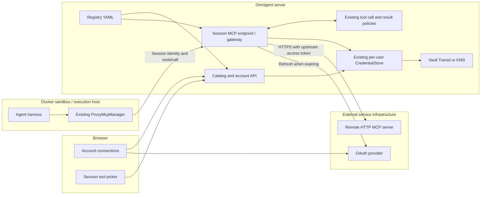

# Managed MCP registry and gateway prototype

Connect an external account once in **Settings → Sandbox Integrations**, then
add its tools to sessions on different sandboxes. The server holds and refreshes
the upstream credentials. Sandboxes receive a catalog reference and tool schemas.

The **registry** is administrator-owned configuration: service IDs, destinations,
authentication and allowed tools/users. The **gateway** executes requests through
the existing session MCP endpoint and its authentication and tool policies.



The upstream MCP server lives at the administrator's URL. It is an outbound
request from the Omnigent server. A `transport: registry` entry does not start a
local MCP subprocess. Existing direct HTTP and stdio entries retain their behavior.

## Local Docker / Colima walkthrough

Use a disposable local development environment. The example provider has fictional
accounts, no login challenge, and 45-second access tokens; Vault uses a development
root token. Do not expose this setup publicly or use real credentials with it.
Docker Desktop, Docker Engine, or a running Colima instance with Docker Compose
works. Commands below run from the repository root, in separate terminals where
indicated. `uv`, Node/pnpm and Docker are prerequisites.

Install and build:

```bash
uv sync --frozen --extra vault --group dev
pnpm install --frozen-lockfile
pnpm --dir web build
docker compose -f examples/mcp-registry/compose.yaml up -d vault
curl --fail -X POST -H 'X-Vault-Token: local-mcp-demo-only' \
  -d '{"type":"transit"}' http://127.0.0.1:18781/v1/sys/mounts/transit
curl --fail -X POST -H 'X-Vault-Token: local-mcp-demo-only' \
  -d '{"type":"aes256-gcm96","derived":true}' \
  http://127.0.0.1:18781/v1/transit/keys/mcp-demo
```

The first Transit command is needed once per Vault container lifetime. If Vault
is still booting, retry it. Vault dev state is lost when its container restarts.

Terminal 1 — server, with isolated state:

```bash
export MCP_DEMO_STATE="$(mktemp -d)"
export OMNIGENT_DATA_DIR="$MCP_DEMO_STATE/data"
export OMNIGENT_CONFIG_HOME="$MCP_DEMO_STATE/config"
export OMNIGENT_LOCAL_SINGLE_USER=1
export OMNIGENT_MCP_REGISTRY="$PWD/examples/mcp-registry/registry.yaml"
export OMNIGENT_CREDENTIAL_CIPHER=vault
export OMNIGENT_CREDENTIAL_VAULT_KEY=mcp-demo
export VAULT_ADDR=http://127.0.0.1:18781
export VAULT_TOKEN=local-mcp-demo-only
export OMNIGENT_MCP_OAUTH_STATE_SECRET="$(uv run --no-sync python -c 'import secrets; print(secrets.token_urlsafe(40))')"
uv run --no-sync omnigent server --host 0.0.0.0 --port 18780 \
  --database-uri "sqlite:///$MCP_DEMO_STATE/demo.db" \
  --artifact-location "$MCP_DEMO_STATE/artifacts"
```

The server listens on all interfaces so a bridged Docker sandbox can reach it.
Use a trusted local machine/network. Keep `localhost` in browser URLs, matching
the OAuth callback in `registry.yaml`.

Terminal 2 — fictional OAuth provider and real HTTP MCP server:

```bash
uv run --no-sync python examples/mcp-registry/demo_service.py
```

Terminal 3 — deterministic model, so this demo requires no paid model account:

```bash
uv run --no-sync python tests/server/integration/mock_llm_server.py 18783
```

Terminal 4 — Docker execution host:

```bash
docker compose -f examples/mcp-registry/compose.yaml --profile sandbox up --build sandbox
```

1. Open **http://localhost:18780/settings/integrations**. Connect **Demo work
   tracker**, approve `alice@example.test`, then click **Test connection**.
   Expect `whoami, read_ticket`.
2. Create a session on the Docker host, using workspace `/tmp`, harness
   **OpenAI Agents**, and model `gpt-4o-mini`. Open **Agent tools and policies**
   (the information button), click **+** beside **Tools**, then **Add Demo work tracker**.
3. Queue a deterministic model turn with the command below, then send
   `Show my tracker account and read TEST-123` in the chat. Expand **Called 2 tools**
   to see the actual upstream account and ticket results.

```bash
curl --fail -H 'Content-Type: application/json' \
  http://127.0.0.1:18783/mock/configure -d '{"responses":[
    {"tool_calls":[
      {"call_id":"account","name":"tracker__whoami","arguments":"{}"},
      {"call_id":"ticket","name":"tracker__read_ticket","arguments":"{\"ticket_id\":\"TEST-123\"}"}
    ]},
    {"text":"The tracker calls completed. Expand the tool results to inspect the account and ticket."}
  ]}'
```

The model's final sentence is scripted; the tool outputs are real MCP responses.
Repeat after 45 seconds: `whoami.refresh_count` increases. Recreate the sandbox
with `docker compose -f examples/mcp-registry/compose.yaml --profile sandbox up -d --force-recreate sandbox`,
create a session on the new host and add the same service. It works without
connecting the account again. Requeue the model response before each turn.

Disconnect in Settings: subsequent service tests and calls fail until reconnected.
`delete_ticket` exists upstream but is excluded by the registry and never appears
in the session's advertised tools. Requests to that tool are rejected server-side.

Stop the foreground processes and run
`docker compose -f examples/mcp-registry/compose.yaml --profile sandbox down`
when finished. Keep the isolated state directory only if you need its logs.

## Administrator configuration

Set `OMNIGENT_MCP_REGISTRY` to a YAML file and restart the server after editing it.
Invalid configuration fails startup. This prototype uses a file rather than a new
admin database/UI. Settings shows users only the entries they can access.

| Field | Purpose |
| --- | --- |
| `public_url` | External Omnigent base URL used for OAuth callbacks; HTTPS except localhost. |
| `services[].id` | Stable service key, also used in agent bundles and `service__tool` names. |
| `url` | Administrator-approved Streamable HTTP MCP destination. |
| `tools` | Required, nonempty list of allowed upstream tool names. |
| `allowed_users` | Optional list of authenticated user IDs; omitted permits all users. |
| `auth` | `none`, personal `bearer`, configured `oauth`, or existing `github`/`databricks`. |
| `oauth` | Authorization/token URLs, client ID, scopes, optional `resource` and `client_secret_env`. |
| `timeout` | Overall MCP request timeout in seconds; default 60, maximum 300. |
| `allow_http` | Explicit local-development opt-in for upstream HTTP URLs. |

For generic OAuth, register the callback
`<public_url>/v1/connections/mcp-<service-id>/callback` with the provider.
PKCE S256 is used. Confidential clients send the secret named by
`client_secret_env` in the token request body. Configure a stable random
`OMNIGENT_MCP_OAUTH_STATE_SECRET` of at least 32 characters.

Personal bearer/OAuth connections require the existing KMS or Vault cipher;
there is no plaintext fallback. Connections are scoped to workspace and user.
The new `mcp:<id>` records do not register a credential-vending provider.
For an already-supported identity provider, reuse its configured connection:

```yaml
services:
  - id: github-tools
    title: GitHub tools
    url: https://your-approved-mcp.example/mcp
    auth: github
    tools: [get_issue]
```

Only use an existing provider token with an upstream explicitly trusted to receive
it, with the correct audience/scopes. Reusing a GitHub/Databricks resolver does not
perform a new audience exchange. Its existing sandbox token-brokering behavior is
unchanged; generic MCP credentials stay on the server.

Session bundles can select services without the UI:

```yaml
tools:
  tracker:
    type: mcp
    transport: registry
    tools: [read_ticket]  # optional further restriction; [] enables no tools
```

Native sidecars use `name: tracker` and `transport: registry` in
`tools/mcp/tracker.yaml`. Connection overrides (URLs, headers, commands, auth) are
rejected. The administrator's allowlist always applies.

```mermaid
sequenceDiagram
  participant H as Harness in sandbox
  participant G as Omnigent session MCP gateway
  participant P as Existing policy layer
  participant C as Encrypted credential store
  participant O as External OAuth provider
  participant M as External MCP server
  H->>G: tools/call tracker__read_ticket + session authentication
  G->>P: Existing tool-call policy / approval
  P-->>G: Allow
  G->>G: Resolve trusted actor; check service and tool allowlists
  G->>C: Load this workspace/user/service connection
  opt Token expires soon
    G->>O: Refresh token exchange
    O-->>G: New access token and optional rotated refresh token
    G->>C: Save encrypted tokens
  end
  G->>M: Initialize HTTP MCP, then tools/call with access token
  M-->>G: Tool result
  G->>P: Existing tool-result policy
  G-->>H: Policy-checked result
```

## Prototype boundaries and tests

- Streamable HTTP tools only; no OAuth discovery/dynamic registration, legacy SSE,
  resource/prompt proxying, or interactive upstream elicitation.
- One server worker. Refreshes coordinate per workspace/user/service in that
  process; distributed refresh locking is future work.
- A fresh upstream connection per request; no discovery cache. Disconnected or
  unavailable services are omitted from discovery; Settings provides a test/error.
- Text output follows existing result policies. Non-text blocks are serialized
  as text; native image/resource streaming needs a later extension.
- No automatic retries of tool calls. Disconnect prevents future credential
  resolution; an already-authorized in-flight request may complete. Disconnect
  deletes the local connection, not the provider's grant.
- Existing session authentication, actor selection, access rules and approval
  behavior apply. This is a prototype for authenticated deployments or explicit
  local single-user mode, not a replacement for sandbox isolation.

```bash
uv run --no-sync pytest tests/server/test_mcp_registry.py \
  tests/server/integration/test_mcp_registry.py tests/spec/test_mcp_registry.py \
  tests/e2e/test_mcp_registry.py
uv run --no-sync pytest tests/e2e_ui/sessions/test_mcp_registry_connections.py
pnpm --dir web exec vitest run src/components/McpRegistry.test.tsx
```

The HTTP/OAuth test uses a real local MCP provider and a test cipher. The browser
regression test intercepts catalog/account APIs. The manual walkthrough additionally
exercises real Vault encryption, UI OAuth redirects, the Docker host, and a harness.
